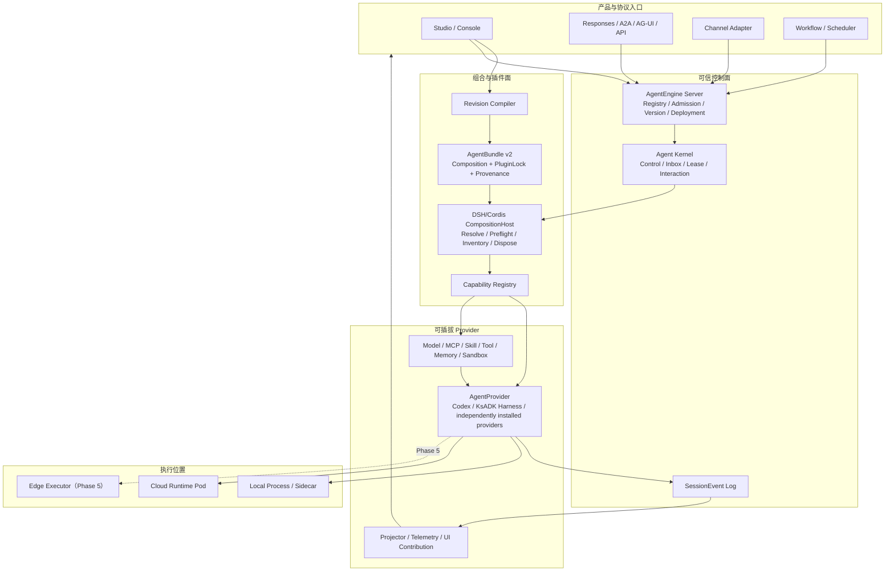
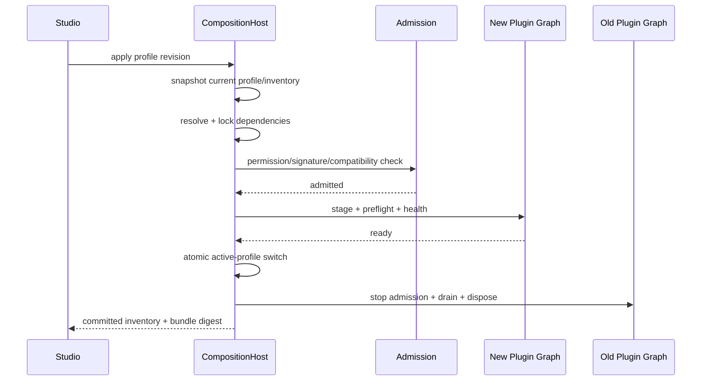

# Agent Runtime V2：插件化、Provider 与端云协同架构设计

> 首次起草：2026-08-17
>
> 本次重写：2026-08-28
>
> 状态：Phase 2 实施设计基线，待架构评审
>
> 实现主线：仅 `origin/master`；其他本地/远端分支仅作候选代码与历史证据
>
> 适用范围：KsADK Runtime、Agent Kernel、AgentKit Studio、AgentEngine 控制面、ksadk-web、Hosted UI 与后续端侧执行器
>
> 替代关系：本文整体替代 2026-08-17 版本；已完成的 Phase 0/1 只保留事实基线，不再作为待实施计划

## 1. 执行摘要

Agent Runtime V2 的第一阶段已经建立了稳定地基：AgentControl、durable Inbox、AgentInstance、Activation lease/fencing、SessionEvent、RuntimeEvent v2、Interaction/v1、多 Store 和真实预发闭环。下一阶段不应再造一套控制协议，也不应把 ADK、LangGraph、Codex 的原生 loop 重写成一个“大一统 loop”。

Phase 2 的核心是建立一个可信、可回滚、可验证的插件组合层：

1. **Kernel 不插件化**：身份、授权、Inbox、SessionEvent、Interaction、lease/fencing、Secret 和审计继续属于可信内核。
2. **执行器 Provider 化**：KsADK 只冻结粗粒度 `AgentProvider` SPI。Codex 与 KsADK Harness 是首批官方实现；ADK、LangGraph、DeepAgents、A2A 等由开发者以独立 DSH Provider Bundle 接入并保留原生 loop 和状态所有权，不堆进核心发行包。
3. **能力 Definition/Provider/Consumer 化**：模型、MCP、Skill、Tool、Memory、Sandbox、Projector、Channel 和 UI Contribution 通过稳定 Capability seam 组合。
4. **默认插件就是 DSH 插件**：不再发明 `ksadk-plugin.yaml` 或“KsADK 官方插件”第三种格式。官方 Provider、Tool、Renderer、Studio 路由、侧栏入口和工作区 Tab 都发布为 DSH Bundle/Profile，由 Cordis 组合；小游戏、业务页或新的 Runtime 类型只是 DSH 插件的不同贡献。
5. **Profile 修改必须事务化**：任何安装、升级、启停或解绑都执行 snapshot → resolve → admission → preflight → stage → atomic switch → drain；失败恢复旧版本。
6. **Bundle 是唯一运行输入**：Studio Draft 不直接驱动 Runtime；AgentRevision 编译成不可变、无 Secret、带 lock/provenance/compatibility 的 AgentBundle。
7. **先做 Codex 纵切**：用 Codex App Server 验证原生 Thread/Turn/Item、goal、plan、工具、MCP、Skill、审批、取消和恢复，而不是先铺满插件种类。
8. **Subagent 也是 Provider**：借鉴 DSH 的 named SubagentProvider，让 DSH、Codex 和后续执行器可以互为子任务执行端，但不把任何一种子 Agent 硬编码进 Kernel。
9. **Scheduler 统一进入控制面**：Phase 2 交付 Scheduler Lite；Codex 和通用 KsADK Agent 共用 `ScheduledTask/Occurrence -> AgentControl`，不各自维护第二套定时任务真相。
10. **只额外兼容 Codex 插件**：`.codex-plugin/plugin.json` 由 Codex App Server 原生管理；DSH/Cordis 与 Codex 是 Phase 2 唯二插件格式。CLI/Studio 可以统一展示，但不伪造共同可执行 ABI。
11. **Cordis 用于组合，不成为云端协议**：Studio/Runtime ExtensionHost 采用固定版本 Cordis 管理依赖、服务、Slot 与可逆 effect；InstallReceipt、AgentControl 和 SessionEvent 仍是 KsADK 平台合同，Cordis 不进入 Agent Kernel 或云端 wire protocol。
12. **阶段边界必须诚实**：Phase 2 在本地 Studio 形成可稳定发布的 DSH/Cordis CompositionHost、Codex 兼容层与 Scheduler Lite；Bundle v2 云端准入、云 Scheduler 和端云同构运行放在 Phase 3。现有 0.8.2 CreateAgent/UpdateAgent 云生命周期继续兼容，不被新架构阻断。

一句话目标：

> Phase 2 让 Studio 能把一个 AgentRevision 编译成确定性的 AgentBundle，由固定版本 DSH/Cordis Host 在本地装配唯一的粗粒度 AgentProvider 和所需能力；开发者按 DSH Bundle 规范发布 Provider/能力/UI 插件，Codex 插件由 App Server 兼容层管理；同时把 Scheduler Lite 作为稳定产品能力发布。Phase 3 再让同一 Bundle 与 Schedule 进入云端主流程。

## 2. 本次重写依据

### 2.1 KsADK 当前事实基线

以下状态来自 2026-08-27 的源码与证据核对：

| 基线 | 当前事实 | 本文处理方式 |
| --- | --- | --- |
| 唯一实现主线 | `origin/master@4b6e79bc`，包含 0.8.2 发布回合的合并提交 | 所有 Phase 2 分支、合同、迁移和验收都从该主线派生 |
| 公开版本 | 存在 `v0.8.2@c8c9be62` tag | 0.8.2 不再列为未来工作 |
| Phase 1 | `docs/superpowers/evidence/phase1/preprod-report.json` 为 11/11 PASS；Agent Kernel、Interaction/Web 和托管 PostgreSQL 矩阵有闭环证据 | 视为已完成基础，不重新发明协议 |
| 当前 Studio | 已有 `AgentDraft -> ResolvedAgentSpec -> BundleManifest`、多 RuntimeRef、MCP/Skill/Tool binding、本地构建与云生命周期路径 | 复用并演进，不新建第二套 Draft/Bundle 真相 |
| Harness 原型分支 | `origin/feat-ksadk-harness@1cd7c113`，相对主线 16 个提交，新增约 1.17 万行 | 视为候选资产，不等同于 Phase 2 已完成 |

本文后续出现的 `feat-*`、`wip/*`、历史 tag 或 worktree 都不构成并列主线。评审候选代码时先对照当前 `origin/master`；确需吸收的提交拆分、重放到从最新 master 新建的 Phase 2 分支，禁止用原型分支反向覆盖 master 上的新功能和修复。

Phase 1 的四个公开 v1 合同继续遵守 additive-only 原则：已经发布的字段不删除、不改名、不复用旧含义，不把 optional 改为 required。插件化不得倒逼修改 AgentControl、SessionEventEnvelope、ActivationLease 或 RuntimeCapabilityMatrix 的既有语义。

### 2.2 最新参考源码基线

| 项目 | 固定参考提交 | 本文吸收的内容 |
| --- | --- | --- |
| DeepSeek Harness | `master@cd5ef814`，`dsh-v0.1.2-alpha.1` | Cordis 插件树、Profile/Bundle layer、`dsh plugin` 包管理闭环、Definition/Provider/Consumer、可逆 effect、动态服务与 Slot、SessionEvent 事实流 |
| Wework / Wegent | `origin/main@d24f515e`，`wework-v0.3.1-beta.1` | Desktop Core 已重组为 DSH/Cordis 插件；统一 Slot 注册表动态贡献 route/sidebar/workspace tab/settings/action；Smart App 以独立 Workbench Profile 运行并通过受限 context/model capability 与当前任务联动；Plugin mutation/preflight/rollback |
| VeADK Python | `main@bae782f8` | BaseRuntime seam、Codex App Server 适配、进程内插件与 Sidecar 唯一所有权、环境/Workspace/版本/兼容性 gate |
| Google ADK | `main@0dbc37d6`，`v2.8.0` | Runner/BaseAgent/SessionService 状态边界、BasePlugin、Sequential/Parallel/Loop Agent 与 Workflow node |
| LangGraph | `main@bdb8a9c7` | StateGraph/CompiledStateGraph、checkpointer、interrupt/Command、subgraph 和可恢复执行语义 |
| DeepAgents | `main@92e15dc0` | `create_deep_agent`、middleware stack、backend、profile、subagent、checkpointer、CompiledStateGraph 与 ACP session 恢复 |
| Hermes Agent | `main@a588685f` | SOUL/MEMORY/USER 三类上下文、冻结 session snapshot、Skill ledger/curator、学习轨迹可视化、Codex Item 到统一 UI callback 的投影与 stream single-writer fence |

这些项目只作为源码证据，不作为 wire contract：

- DSH 仍明确处于 developer preview，Session 格式与 SDK 协议没有长期兼容承诺；
- Wework 当前 DSH Executor 已有事件投影，但 Codex Agent Provider、完整审批与恢复仍在计划中；其 Core UI/Smart App 已插件化，而本地 Harness 选择器仍把 OpenCode、Claude Code、Kimi Code 写成固定联合类型，不能据此宣称任意 Runtime 包已可自动注册；
- VeADK 的 Harness Extension 与 DeepSeek Harness 不是同一套协议，其公开 CodexRuntime 也不等于完整持久 Codex Provider。
- ADK 的 Runner/Session/Plugin 和多 Agent 语义由 ADK 原生拥有，不能被 KsADK loop 重写；
- DeepAgents 构建在 LangGraph/LangChain middleware 之上，但完整 Harness 与任意用户 CompiledStateGraph 不是同一产品边界；
- LangGraph 是图执行和状态恢复机制，不自动拥有 AgentVersion、部署、权限、SessionEvent 或 Studio 生命周期。

因此本文直接采用 DSH 对外发布的 npm Bundle/Profile 格式和固定版本 Cordis API 作为插件开发面；但不复制 DSH 的预发布 Session/RPC 格式或任一项目的私有运行协议，也不把 Cordis API 提升为 KsADK 云端公共合同。

### 2.3 参考项目值得吸收与必须克制的部分

| 参考 | 值得吸收 | 不直接照搬 |
| --- | --- | --- |
| DeepSeek Harness | 官方插件源码与核心同处 monorepo、发布为独立 `@deepseek-ai/dsh-*` 包；Profile/Bundle 分层组合；`dsh plugin` 复用包管理器并按安装结果对账；Cordis service/inject/slot/effect；Definition/Provider/Consumer；一个 Inbox 和追加式 Session log；named SubagentProvider、后台 Job、follow-up/interrupt/lineage；Codex 与 Claude Code 外部 subagent；session-local reminder 的时区和 misfire 约束 | developer-preview Session/RPC wire format；未经 KsADK admission 直接执行包安装脚本；“进程活着才触发”的 reminder 不能充当云调度器；当前 Codex/Claude Code 外部 subagent 都是独立上下文的 one-shot 执行，不能直接视为有持久连续会话、完整审批桥接和完整事件流的生产实现 |
| Wework | `@wegent/dsh-app-wework` 声明 `wework.route`、`wework.sidebar.navigation`、`wework.workspace.tab`、`wework.workspace.sidebar.tab`、settings/action/shell 等 Slot；普通 DSH 包通过 `ctx.slots.inject(...)` 与 `ctx.wework.ui.register(...)` 一次贡献多个产品表面；Smart App 是 `deepseek-harness-plugin-bundle`，运行在独立 Workbench DSH Profile/WebContentsView，通过受限 user/model context 插件与当前任务联动；Core Profile 与 Workbench Profile 隔离；install/update/toggle/uninstall 经过串行 mutation、snapshot、preflight、rollback 和 readiness | 产品发布说明不等于已完成源码能力；同源 DSH 页面插件不是安全沙箱；用户插件安装脚本以当前用户权限执行；当前 `LocalHarnessId`/`LOCAL_HARNESS_IDS` 仍硬编码三种 CLI，不能照抄成 KsADK 的 Provider 注册表；持久自动化在 Backend/Executor，不应塞进 UI 或模型 loop |
| VeADK Studio | BaseRuntime seam；进程内/Sidecar 唯一所有权；Environment/Workspace/ProjectVersion/digest；兼容性 gate；调度 scanner/publisher/worker 分离、持久 ScheduleRepository、无状态云调度进程 | 不复制其业务模型、云厂商绑定和私有 API；一分钟固定扫描只是实现选项，不是 KsADK 公共合同 |
| Google ADK | Runner/SessionService/Plugin 原生边界；Sequential/Parallel/Loop Agent 和 Workflow；工具、MCP、Live 与 telemetry 生命周期 | 不把 ADK Event 按文本扁平化，不用 KsADK 重排 ADK Agent tree，也不把 ADK Plugin 冒充平台 Plugin |
| DeepAgents | middleware 组合、文件/状态 backend、subagent、profile、checkpointer 与 ACP 恢复；CompiledStateGraph 可作为稳定执行对象 | 不把其 middleware 私有状态写入公共合同，不默认接管其工具权限和 filesystem backend，也不假设所有 DeepAgents 都能安全进程内运行 |
| LangGraph | 编译图、checkpoint、interrupt/Command、subgraph 与精确状态恢复；适合作为 Harness 内部 loop 或用户图执行 Provider | 不反编译或魔改用户 CompiledStateGraph；不让平台 Store 与 graph checkpointer 同时成为同一状态的 writer |
| Hermes Agent | SOUL/记忆/用户偏好分层；session-start frozen snapshot；短期常驻记忆与按需 session search 分开；Skill provenance/usage/archiving；把 Codex 原始 Item 投影为已有的文本、工具和进度 callback，并用 single-writer fence 避免过期流继续写 UI | 单用户 Home 文件与基于数组下标的 memory node id；默认允许 Agent 直接写记忆；“learning journey”图的词法关联；将本地 Profile 文件、Web UI callback 或私有 tool schema 升为 KsADK 云端协议 |

这些参考共同证明的不是“所有东西都要插件化”，而是：**稳定内核定义缝隙，Provider 拥有执行，Profile 组合能力，Host 管理副作用，Backend 持久化产品状态**。KsADK 采用这一分工，并用自己的 v1/v2 合同、Agent Kernel 和 Server 生命周期约束实现。

## 3. 为什么旧文档已经过时

旧文档同时混合了长期架构、0.8.2 发版任务、Phase 1 实施清单和预发补洞，导致三个问题：

1. 已经完成的 RuntimeEvent v2、Agent Kernel、Interaction、Studio 云部署仍被写成未来目标；
2. `PluginManifest/Host/Profile/Bundle` 只有概念，没有定义 Profile 事务、Provider 唯一所有权、插件格式收敛和兼容性 gate；
3. 后续 Harness 原型把 `ManagedLangGraphEngine` 提升为默认总架构，容易重新走向“统一重写 loop”，与多 RuntimeAdapter 和 DSH 的 Provider seam 冲突。

本文重新划分“已经落地”“原型可复用”“尚未实现”，并从 Phase 2 开始给出新的实施顺序。

## 4. 目标与非目标

### 4.1 目标

- Studio 的自然语言、模板、YAML 和项目导入最终都生成同一种 AgentRevision。
- AgentRevision 可确定性编译为 AgentBundle；相同输入、锁文件和构建器版本得到相同内容摘要。
- 一个 Activation 恰好有一个 active AgentProvider；同一 capability slot 的所有权明确且可检查。
- DSH Bundle 可以共同组成 Agent，并在同一 Cordis graph 内贡献 Runtime、能力与 Studio UI；Codex 插件保持 App Server 原生语义。
- DSH/Cordis CompositionHost 能发现、解析、准入、启动、健康检查、切换、drain 和 dispose 插件。
- Phase 2 在本地冻结 Bundle 内容与兼容声明；Phase 3 让预发、云端和后续端侧消费同一 Bundle，环境只注入绑定和 Secret 引用。
- Codex、ADK、LangGraph、A2A 保留原生执行语义，并通过统一 AgentControl、Interaction 和事件投影对外。
- Studio/Hosted UI/ksadk-web 只消费公开 projection，live、replay 和刷新恢复结果一致。
- 旧 0.8.2 Agent、旧 Bundle 和未上报运行时三元组的 Agent 可以继续启动、调用和管理。

### 4.2 非目标

- 不把 Agent Kernel、授权、Secret、Session/Event Store 或 lease/fencing 开放给任意插件替换。
- 不要求所有 Runtime 支持相同的 goal、plan、steer、checkpoint、approval 或 durable resume。
- 不用 LangGraph 重写 Codex/ADK/A2A 原生 loop，也不用 Codex 替换所有通用 Agent。
- 不在 Phase 2 实现完整 Workflow/DAG、事件驱动自动化、看板、远程设备接管或插件市场；只交付可独立验收的 Scheduler Lite。
- 不在 Phase 2 改造 Server/Gateway/Runtime Service/Operator 以承载 Bundle v2 CompositionHost 或云 Scheduler；这些属于 Phase 3。
- 不允许 Profile 热更新正在运行的 Activation；新配置必须生成新 Revision/Bundle。
- 不把用户 Home、明文 Secret、Kubeconfig、云凭据或本机绝对路径放进 Bundle。
- 不以 UI 中出现按钮、测试 Fake Provider 或本地 Mock 代替真实本地 Provider、Scheduler 和发布制品证据；Phase 3 才要求新增架构的预发行为证据。

## 5. 总体架构



主链只有一条：

```text
入口 -> Server admission -> AgentControl -> durable Inbox
     -> fenced Activation -> CompositionHost -> AgentProvider/RuntimeAdapter
     -> SessionEvent/RuntimeEvent -> projector -> Web/Studio/外部协议
```

插件不得绕过 Server admission 直接写 Runtime，也不得绕过 SessionEvent 自建第二条 UI 事件流。

## 6. 权威边界与不变量

### 6.1 每个领域只有一个权威

| 领域 | 权威 | 说明 |
| --- | --- | --- |
| Agent/Version/Deployment | AgentEngine Server | Studio 和 Runtime 都只是调用者/执行者 |
| 控制命令、Inbox、lease、Interaction | Agent Kernel | 所有入口复用 AgentControl |
| 平台可见会话事实 | SessionEvent Log | live/replay/cursor/audit 的唯一平台事实流 |
| Runtime 私有执行状态 | 当前 AgentProvider | 例如 Codex thread、LangGraph checkpoint、ADK session；平台不伪造私有状态 |
| 插件运行状态 | CompositionHost Inventory | 日志中出现 loaded 不代表 ready |
| 可部署内容 | AgentBundle digest | Runtime 不读取可变 Draft 或 registry latest |
| UI 状态 | 公开 projector | UI 不维护第二状态机，不反写 canonical event |

### 6.2 不可插件化的可信内核

以下能力可以有存储 Adapter，但其语义不可被普通插件替换：

- tenant/user/agent/session/run/plugin instance 身份；
- Server RBAC、admission、短期 permit 和审计；
- Inbox persist-before-ack、FIFO、幂等和背压；
- SessionEvent seq、event id、write guard 和敏感字段过滤；
- Interaction revision、first-wins、过期和一次性授权；
- Activation lease、fencing、takeover 和 split-brain 防护；
- Bundle digest、签名、provenance、Secret 引用和部署准入。

### 6.3 Provider 唯一所有权

一个 Activation 中：

- `agent.execution` 恰好一个 Provider；
- `session.store`、`checkpoint.store`、`sandbox` 等 unique slot 最多一个 active Provider；
- Tool、MCP、Skill 等 multi slot 可以多绑定，但每个资源 id/version 只能有一个 owner；
- Context transformer 等 layered slot 必须声明确定顺序和单调约束；
- process-internal 与 sidecar 不能同时拥有同一能力；
- local 与 cloud 不能同时持有同一 AgentInstance 的写 lease。

发现重复 owner 时必须在 preflight 阶段失败，不允许运行后“谁最后注册谁生效”。

## 7. 领域模型

```text
AgentDraft            可编辑的创建草稿
  -> AgentRevision    已提交、不可变的业务与能力定义
      -> CompositionProfile  Revision 内规范化的插件组合意图
      -> AgentBundle  编译、锁定、签名后的不可变运行制品
          -> AgentVersion     Server 上的发布版本
              -> Deployment   目标环境与 rollout 策略
                  -> AgentInstance  稳定逻辑实例
                      -> Activation 当前短期执行所有权
                      -> Session -> InboxMessage -> Run -> SessionEvent
ScheduledTask         独立于 Runtime 的持久调度意图
  -> ScheduleOccurrence  每次到期的幂等执行记录
      -> AgentControlCommand -> Session/Run
```

关键约束：

- `CompositionProfile` 不是 Studio 新建的第二份可变 Agent 数据；它由 AgentRevision 的 `spec + bindings + policy` 规范化生成。
- `AgentBundle` 不只是 ZIP。YAML-only Agent 可以是只有声明和锁文件的 Bundle；Code Agent 可以附带代码制品；Managed Runtime 可以引用已批准的运行时镜像。三者使用同一 manifest/provenance 语义。
- AgentVersion 指向 Bundle digest，不复制和重新解释 Profile。
- 云上可派生容器镜像或 Runtime CR，但必须同时保留 source bundle digest、派生 artifact digest 和 runtime identity 三元组。
- ScheduledTask 只引用稳定 Agent/Version/Session 目标和无 Secret 的命令模板；它不复制 AgentRevision，也不直接调用模型 Provider。

## 8. 一个默认插件生态与一个兼容面

### 8.1 DSH/Cordis 是默认插件生态

KsADK 不再定义独立插件包格式。所有官方插件和开发者默认插件都使用 DSH 已有格式：

```text
package.json                     name/version/dependencies/dsh.bundle.patch
cordis.patch.yml                 Profile 组合 patch
server/client module             Cordis service、provider、consumer 与 UI contribution
README / LICENSE                 使用方式和治理信息
```

一个 DSH 包可以同时贡献多个能力，无需按业务种类拆 Bridge。例如一个小游戏或业务应用插件可以同时注册：

- `studio.sidebar.navigation`：侧边栏入口；
- `studio.route` / `studio.workspace.tab`：完整页面或工作区 Tab；
- `conversation.composer.action` / `session.item.renderer`：与当前会话联动的输入动作和输出渲染；
- `tool.provider` / `memory.provider`：Agent 可调用能力和状态；
- `agent.provider`：如果它拥有完整 loop，则作为一个新的 Runtime 类型出现在选择器中。

插件是否是“游戏”“看板”“Provider”只由它声明的 contribution 决定，Host 不增加 `GameBridge`、`DashboardBridge` 或框架专用注册表。一个 Runtime 是否出现在 Studio 选择器中也必须来自 active `agent.provider` inventory，不能维护硬编码联合类型。

### 8.2 Codex 是唯一额外兼容的插件格式

Codex 插件继续使用 `.codex-plugin/plugin.json`，并由 Codex App Server 的原生插件 API 完成 discovery/install/enable/disable/update/uninstall。承载 Codex Agent loop 的 `CodexAgentProvider` 本身仍是一个 DSH 插件；只有它内部加载的 Codex plugin 使用第二种格式。

Skill、MCP、Tool 或 AgentCard 本身是资源/协议对象，不因存在一个文件就自动升级为第三种插件格式。若要随 Profile 安装和参与生命周期，必须由一个 DSH Bundle 声明；若要由 Codex 原生加载，则必须属于一个合法 Codex plugin。

CLI 与 Studio 只识别两种 ecosystem：

| ecosystem | 识别与原生 Host | 适用范围 |
| --- | --- | --- |
| `dsh` | `package.json:dsh.bundle.patch`；固定版本 DSH/Cordis Host | 所有官方 Provider、能力、Studio UI、应用与第三方默认插件 |
| `codex` | `.codex-plugin/plugin.json`；Codex App Server | Codex 原生插件、Skill/MCP 配置及 Codex 专属扩展 |

目录同时命中两种格式时必须让用户显式选择；不得再返回 `ksadk-native`、`python-plugin`、`claude-plugin` 等第三种安装类型。Claude Code、ADK、LangGraph、DSH Agent 或其他执行器若要成为 KsADK Runtime，应发布为 DSH `agent.provider` 插件；它们自己的易变内部扩展格式不成为 Studio 插件格式。

### 8.3 Cordis service、Slot 与可逆 effect

固定版本 Cordis 负责插件树、依赖注入、service、Slot、effect 和逆序 dispose。KsADK 冻结的能力名包括：

- 执行与资源：`agent.provider`、`model.provider`、`tool.provider`、`mcp.connector`、`skill.source`、`subagent.provider`；
- 状态与安全：`memory.provider`、`context.contributor`、`session.store`、`checkpoint.store`、`sandbox.provider`；
- 投影与集成：`event.projector`、`conversation.projector`、`telemetry.exporter`、`channel.adapter`、`integration.provider`；
- 产品表面：`studio.app`、`studio.route`、`studio.sidebar.navigation`、`studio.settings.page`、`studio.workspace.tab`、`studio.workspace.sidebar.tab`、`studio.action`、`conversation.composer.action`、`session.item.renderer`。

DSH 包通过 Cordis 注册这些稳定 service/Slot；一个包可同时注册多个 contribution。Python、Go 或其他语言的 Provider 默认由 DSH 插件启动受监管 sidecar，并通过固定 AgentProvider RPC/conformance 与 Host 通信；这份进程间合同是执行 SPI，不是第三种插件分发格式。

插件能力在 Phase 2 才首次开发，尚无已发布的 `ksadk-plugin.yaml`、Python entry point 或本地 PluginPackage 用户需要迁移。因此这些实验实现直接从产品代码、CLI、Studio API/UI、合同和测试中删除，不保留隐藏兼容命令或 legacy 探测。这里的删除不影响 0.8.2 历史 Agent：它们使用既有 AgentRevision/Bundle/Runtime 路径，本来就不依赖该实验插件格式。

同进程 UI 插件只允许内建或经过签名审核的可信包。普通第三方应用默认运行在隔离 iframe/WebView/worker 中，只获得经过权限裁剪的当前 Agent/Session/Task 只读上下文和受控 action service；不能直接拿 DOM、Cookie、AK/SK、Kernel Store 或本地文件系统。这样吸收 Wework Smart App 的独立 Workbench Profile 和 context capability 思路，同时补上其同源 UI 插件并非安全沙箱的缺口。

### 8.4 Definition / Provider / Consumer

每个可替换能力必须包含：

1. **Definition**：稳定方法、输入输出、错误、slot multiplicity、生命周期和 conformance；
2. **Provider**：本地、sidecar、云服务或 Runtime 原生实现；
3. **Consumer**：AgentProvider、Kernel、Studio、Workflow 或 Channel。

Consumer 只依赖 Definition，不 import 具体 Provider。Cordis 是本地装配实现；AgentControl、SessionEvent、Interaction 和各 Capability Definition 才是跨进程/端云稳定边界。只有一个实现且没有替换/测试需求的内部 helper 不升级为插件。

## 9. 合同设计

### 9.1 版本策略

现有 `AgentBundleManifest/v1` 保持不变并长期可读。插件化 Bundle 使用新的 `AgentBundleManifest/v2`，不向 v1 强塞 required 字段。Phase 2 不冻结第三种插件 manifest，而是冻结 DSH/Codex 两种来源的管理投影与平台合同：

- `EcosystemPluginDescriptor/v1`
- `EcosystemInstallReceipt/v1`
- `CodexPluginBridge/v1`
- `CapabilityDefinition/v1`
- `CompositionProfile/v1`
- `PluginLock/v1`
- `PluginInventory/v1`
- `AgentProvider/v1`
- `SubagentProvider/v1`
- `ContextContributor/v1`
- `ConversationSurface/v1`
- `ConversationInput/v1`
- `ConversationItem/v1`
- `ScheduledTask/v1`
- `ScheduleOccurrence/v1`
- `AgentBundleManifest/v2`

每个合同必须有 JSON Schema、Python 源类型、跨语言消费投影、golden fixture、canonical digest 和 breaking-change gate。

### 9.2 EcosystemPluginDescriptor/v1

`EcosystemPluginDescriptor` 是 Host 对已探测制品生成的只读投影，不是开发者要再维护的一份 KsADK manifest：

```yaml
ecosystem: dsh                 # dsh | codex
id: "@kingsoftcloud/dsh-provider-codex"
version: 1.0.0
sourceManifest: package.json
artifactDigest: sha256:...
host:
  kind: dsh
  version: 0.1.2-alpha.1
contributions:
  - slot: agent.provider
    id: codex
  - slot: studio.settings.page
    id: codex-provider-settings
permissions:
  declared: false
  effective: [process:spawn, network:model-endpoint]
compatibility:
  state: compatible
  reasons: []
provenance:
  source: npm
  signatureRef: signature://...
```

DSH descriptor 来自精确版本 `package.json:dsh.bundle.patch`、Profile 解析结果、Cordis inventory 和 Host admission；Codex descriptor 来自 `.codex-plugin/plugin.json` 与 App Server inventory。来源格式没有权限声明时必须显示 `declared: false` 并按高风险待批准处理，不能解释为“无权限”。Descriptor、权限决策和 Bundle admission 可以收紧权限，任何一层都不能自行扩大权限。

### 9.3 CompositionProfile/v1

Profile 只表达组合意图：

```yaml
apiVersion: composition.ksadk.io/v1
dsh:
  runtime: dsh@0.1.2-alpha.1
  bundles:
    - ref: npm://@kingsoftcloud/dsh-provider-codex@1.0.0
      required: true
    - ref: npm://@kingsoftcloud/dsh-store-sqlite@1.0.0
      required: true
    - ref: npm://@example/dsh-workspace-capabilities@1.2.0
      required: true
      config:
        mcpRef: mcp://workspace/git@3
        skillRef: skill://workspace/release-review@7
agentProvider:
  id: codex
codexPlugins:
  - ref: codex-plugin://example/plugin@2
policies:
  tool: policy://strict@4
  network: policy://restricted@2
```

Profile 不包含解析后的传递依赖、安装路径、明文 Secret 或 registry latest；这些进入 PluginLock 或环境绑定。Studio 页面/侧栏/Renderer 等 UI contribution 不在 AgentRevision 中重复列举，而是从 active DSH Profile 的 Cordis Slot inventory 派生；只有与该 Agent 绑定的 capability id 和策略进入 Bundle。

Agent 的 `execution.strategy` 属于 AgentRevision；它由所选 AgentProvider 自行解释和执行。Compiler 只依据 Provider 的兼容声明做准入，不把策略解析成第二个可执行插件，也不存在通用 `LoopProvider` 嵌套 slot。需要不同 loop、graph 或 middleware 的开发者应提供另一个 AgentProvider DSH Bundle；这样它能完整拥有自己的状态、恢复和事件投影。

### 9.4 PluginLock/v1 与 Bundle v2

构建器将 Profile 解析为锁文件，至少固定：

- 插件 id/version/digest/signature/license/source；
- Definition 版本和 Provider owner；
- 依赖拓扑与启动/销毁顺序；
- Runtime/SDK 来源、版本、commit、wheel/image/artifact digest；
- 模型协议能力 `native | translated | degraded | unavailable`；
- MCP/Skill/Tool 的版本、内容摘要和权限；
- compatibility 结果与验证报告摘要；
- SBOM 和构建器版本。

Bundle v2 至少包含：

```text
bundle.json
composition.json
plugin-lock.json
capability-snapshot.json
provenance.json
sbom.json
artifacts/              可选，代码或静态资源
schemas/                可选，插件配置/输出 schema
```

Secret 只保留 `secretRef`，部署环境在 admission 后注入实际值。

### 9.5 DSH Bundle、安装来源与开发者闭环

可独立安装的默认插件只有 DSH Profile Bundle。开发者遵循 DSH 公开规范：普通 Cordis 插件作为 `cordis.yml` row 挂载；需要被用户安装/启停的组合包声明 `package.json:dsh.bundle.patch`，由 patch 选择并配置一个或多个 Cordis 插件。KsADK 不再提供 `ksadk-plugin.yaml`、Python entry point 或另一套 pack/init 工具。

```text
my-dsh-bundle/
  package.json              精确 name/version 与 dsh.bundle.patch
  cordis.patch.yml          插入/覆盖的 Cordis rows
  lib/                      host/client 插件代码或 sidecar adapter
  schemas/                  可选配置/输出 schema
  README.md / LICENSE
```

DSH 的原生命令是唯一 Profile 包管理路径：

```text
dsh plugin --profile <name> add <package|tarball|git-spec|directory>
dsh plugin --profile <name> remove <package>
```

`ksadk plugin` 可以作为 Studio/CLI 的产品入口继续存在，但只做 DSH Bundle 脚手架、受管理 DSH 工具链、ecosystem 探测、权限预览和原生 Host 委托：默认委托上述 DSH Profile；显式 `codex` 子命令时委托 Codex App Server。`create/validate/test/pack` 生成或验证的始终是标准 DSH/npm 制品，不能创建、打包或执行 Python/KsADK 专有插件，也不能复制一份会与上游漂移的 DSH 编译实现。Python wheel 不捆绑 Node；本地开发前置是 DSH 支持的 Node 与精确 pnpm，KsADK 只负责从 npm 原子安装、锁定并校验公开 DSH CLI。

裸 Git 分支、`latest`、未锁定 URL 和任意仓库不能直接成为 active Profile。平台流水线固定为：source detect → fetch/build sandbox → DSH bundle/Codex manifest 静态检查 → dependency/compatibility resolve → permission preview → digest/provenance/receipt → immutable install → disabled-by-default → explicit enable → Profile transaction。`dsh plugin` 负责依赖和 bundle 顺序；KsADK 外层生成 `EcosystemInstallReceipt/v1`，记录 source、resolved version、artifact/manifest/profile digest、lock、permission decision、原生 Host receipt、启停状态和时间。失败安装不得进入 active Profile，失败升级必须保留旧 Profile、旧 receipt、旧包和旧 Activation。

Studio Phase 2 交付“已安装 DSH/Codex 插件”：来源/权限/兼容预览、详情、启停、卸载、精确版本升级、使用中的 Agent/Bundle 影响提示和失败回滚。在线发现、评分、审核、组织分发和商业 Marketplace 留在 Phase 6。

这里不再使用 `native/bridged/linked` 三套对外分类，只显示实际 ecosystem 与 readiness：

| ecosystem | installed | enabled | ready 的含义 |
| --- | --- | --- | --- |
| `dsh` | 依赖和 Bundle 已进入不可变 Profile | Bundle 位于 active stack | Cordis contribution 已注册且 health/conformance 通过 |
| `codex` | App Server 已确认插件制品 | Codex 原生配置允许加载 | App Server inventory/health 与所绑定 CodexAgentProvider 均 ready |

“已安装”不能推导“Provider 可执行”。Runtime 类型只有在 DSH Host 返回 active `agent.provider` contribution、KsADK sidecar/RPC 握手成功且能力 conformance 通过后才进入 Studio 选择器。现有 Phase 2 `DshProfilePluginBridge` 只能管理 Profile，必须升级为真正的 DSH CompositionHost + AgentProvider bridge 后，才可以把 DSH Provider 标记为可用。

因此未来新增游戏、看板或业务应用无需修改 Kernel：它就是一个普通 DSH Bundle，可同时贡献侧栏、Workspace Tab、会话 action/renderer、Tool/Store，必要时再贡献完整 `agent.provider`。Claude Code、ADK、LangGraph、另一种 Harness 或企业工作台若要成为 Runtime，同样发布 DSH Provider Bundle；不再为每个生态增加第三种插件格式或专属 Bridge。

#### 9.5.1 CodexPluginBridge/v1

DSH 是默认 Host，不属于 Bridge；Codex 是唯一额外插件兼容面。`CodexPluginBridge` 冻结管理事务 SPI，不尝试把 Codex 插件改写为 DSH 包：

```text
describe()   -> BridgeDescriptor
probe()      -> ProbeResult[*]
inspect()    -> EcosystemPluginDescriptor
plan()       -> TransitionPlan
stage()      -> StagedTransition
commit()     -> EcosystemInstallReceipt
reconcile()  -> EcosystemInventory
rollback() / dispose()
```

- `probe/inspect` 必须只读，不 import 插件代码、不执行 JS/YAML、不运行安装脚本；同一目录同时命中 `package.json:dsh.bundle.patch` 与 `.codex-plugin/plugin.json` 时必须返回两个候选，由调用者显式选择。
- `plan` 分开列出安装/构建权限、运行时权限、认证 scope、重启影响、绑定影响和回滚点；外部格式没有权限声明时按高风险待批准处理，不能解释为“无权限”。
- `stage` 只能准备固定版本、固定 digest 的制品或让原生 Host 创建 staged state；`commit` 才能切 desired state；任何失败必须 `rollback/dispose`。
- `reconcile` 从原生 Host 读取真实 inventory/health。安装回执、enabled 和 observed ready 是三种事实，任何一个都不能推导另外两个。
- Bridge 记录自身版本/digest、Codex App Server 版本/协议范围、原生 receipt/ref 和 artifact digest；只保存 `secretRef`，无权写 Kernel Store、Inbox、Lease 或 SessionEvent。
- Bridge 只管插件识别和生命周期。Agent loop、Thread/Session 状态、事件投影和 Interaction 仍分别属于 AgentProvider、ConversationProjector 与 Kernel。

Phase 2 的识别 golden 只固定两种：DSH 使用 `package.json:dsh.bundle.patch`；Codex 使用 `.codex-plugin/plugin.json`。Marketplace 清单、单独的 patch、`SKILL.md`、`.mcp.json`、`.claude-plugin/plugin.json` 或 Python entry point 都不能被自动提升为第三种 Studio 插件。归档/目录探测同时限制路径穿越、符号链接、文件数量、深度和总字节数。

### 9.6 ContextContributor/v1

`ContextContributor` 是**只读**上下文注入 seam，不是模型可以借机写入任意文件的后门。它接收已认证的 Agent/Session/Turn scope、Context Policy、剩余 token budget 和允许的数据分类；返回带来源的 context fragment：

```text
ContextRequest(scope, policyRef, remainingBudget, allowedClassifications)
  -> [ContextFragment(content, sourceRefs, classification, expiresAt, tokenEstimate)]
```

Host 按预算、来源可见性和 scope 过滤/排序；Provider 不得返回 Secret，不得修改 `MemoryEntry`、Soul、Prompt、Skill 或 SessionEvent。Phase 2 只冻结这个读路径与错误语义，并提供由人工批准 source 驱动的实现。`MemoryEntry`、`LearningCandidate` 和 Skill 自动生成的写路径留到 Phase 3/4，在具备 Server scope、审计、评测和审批模型后再冻结，避免过早把不成熟的自学习格式暴露成公共 v1 合同。

### 9.7 ConversationSurface/v1 与 ConversationItem/v1

对话框是所有 Runtime 的共同产品入口，不能依赖“把任何输出拼成 Markdown”来兼容。Phase 2 新增两个 additive 的 presentation 合同；它们是从既有 `SessionEvent`/`RuntimeEvent` 派生的稳定投影，**不替代**持久事件事实源：

```text
Runtime native event / RuntimeEvent / Interaction
  -> ConversationProjector
  -> ConversationItem (append | replace | completed)
  -> ksadk-web reducer + renderer registry
  -> Studio / Hosted UI / SDK consumer
```

`ConversationSurface` 在 Agent/Activation bootstrap 中声明输入和输出能力，例如 `text`、`attachment.file`、`attachment.image`、`model.select`、`reasoning.effort`、`streaming`、`reasoning`、`tool.inspect`、`approval`、`artifact`、`a2ui`、`goal`、`plan`、`cancel`、`checkpoint.resume` 和 `native.dashboard`。只有 `text` 是所有可交互 Runtime 的基础能力；其余能力必须显示 `native | translated | degraded | unavailable` 和明确原因。UI 只能发送当前 Surface 声明过的字段；扩展输入进入 namespaced `extensions`，未经声明的字段在 client preflight 就被拒绝，不能再把“Extra inputs are not permitted”留给远端 Runtime。

`ConversationItem` 至少有 `item_id`、`parent_item_id`、`source_event_ids`、`session_id`、`run_id`、`kind`、`operation`、`lifecycle`、`visibility`、`payload_schema_ref`、`payload`、`capability_ref` 和 `native_ref`。内建 kind 包含 `user_message`、`assistant_text`、`reasoning`、`tool_call`、`approval`、`progress`、`plan`、`goal`、`artifact`、`a2ui`、`error` 和 `unknown`。同一文本但不同 native item 必须保留；replay/reconnect 只按 `item_id + operation` 归并，绝不按作者或正文去重。

### 9.8 ConversationProjector、Renderer 与降级规则

Provider 保持其原生事件语义：Codex 的 Thread/Turn/Item、Hermes 的原生 callback、ADK/LangGraph event、A2A task event 都先经 `ConversationProjector` 映射为 `ConversationItem`，再进入共同 reducer。Projector 必须一条流只有一个 active writer；过期 reconnect/重试流只能被 item/fencing 证明为旧 writer 后丢弃，不能把不确定的流静默关闭。

`ksadk-web` 继续拥有 core reducer 与内建 text/reasoning/tool/approval/artifact/A2UI renderer。插件可以声明 `session.item.renderer`，但只能处理签名 manifest 声明的 kind/schema，并通过 Host action bridge 发起 `Interaction`/`AgentControl`；不能下载并执行远程 JSX/JavaScript，不能直接持有凭证或绕过审批。未知、schema 不兼容或 Provider 未提供 live stream 的 item 统一降级为安全的通用卡片、终态 snapshot 或原生 Dashboard 链接，绝不伪造 token 流、思考过程或审批按钮。

Phase 2 只交付 core renderer、未知 item fallback 和 Codex/KsADK Harness 两条真实纵切；不把“支持 renderer registry”误写成任意第三方富卡片均已可用。现有 Hermes 可先通过其 native Dashboard 与已证明的标准事件/终态投影进入 Surface；ADK、LangGraph、A2A、DeepAgents 和 Hermes 的完整 native capture/conversation conformance 属于 Phase 3。任何尚未映射的能力都必须显示为 `degraded` 或 `unavailable`。

### 9.9 输入、A2UI 与自定义前端接入

`ConversationItem` 解决“如何显示已发生的事”；`ConversationSurface` 还必须解决“用户此刻可以安全、优雅地做什么”。因此共同对话入口由三个**不同责任**的协议组成，不能把它们混成一个任意 JSON POST：

```text
Bootstrap
  -> ConversationSurface + renderer catalog + model/attachment policy
  -> Composer（只显示当前 Activation 已声明的输入）
  -> RunAgent / AgentControlCommand
  -> SessionEvent / RuntimeEvent
  -> ConversationItem reducer
  -> core renderer | A2UI renderer | safe fallback

卡片 action / 表单 action
  -> InteractionRequested(interaction_id, revision)
  -> user response
  -> SubmitInteraction
  -> InteractionResolved -> ConversationItem
```

| 合同 | 解决的问题 | 绝不承担的职责 |
| --- | --- | --- |
| `ConversationSurface/v1` | 当前 Agent/Activation 能接收哪些输入、能产生哪些输出、能力等级、版本和降级理由 | 不保存会话、不携带模型密钥、不把 Provider 私有参数原样暴露给浏览器 |
| `ConversationInput/v1` | 一次普通 Turn 的 `input_id`、Session、幂等键、文本 part、已上传的 AttachmentRef、可选模型/推理设置和受控 extensions | 不用它提交审批、工具副作用、部署或任意前端 action |
| `ConversationItem/v1` | 对已发生 Runtime/Interaction 事实的可回放展示投影 | 不成为第二份事件日志，也不让 renderer 修改事实 |
| `Interaction/v1` | approval、结构化输入、A2UI form、重试/取消等有副作用的用户选择 | 不执行浏览器传来的任意函数、JavaScript 或未声明 command |

#### 9.8.1 Composer：最小而能力驱动

Composer 不应复制某个 Provider 的复杂控制台。它始终以一个可多行输入的文本框为中心；附件为一个 `+` 入口；模型为紧凑圆角选择器；停止、重试与进行中状态只在有真实 Run/receipt 时出现。其它控件由 Surface 增量出现：

| Surface 输入能力 | Composer 行为 |
| --- | --- |
| `text` | 基础能力；Enter 发送、Shift+Enter 换行；提交成功立即清空当前草稿并保留 client input id，避免重试时重复发消息 |
| `attachment.file` / `attachment.image` | 显示 `+`；先上传得到 `AttachmentRef`，再随 Input 引用发送。MIME、大小、数量和图像/文件转换策略由 Surface 声明，绝不把本机绝对路径或无限 base64 塞进聊天请求 |
| `model.select` | 显示当前 Agent 已绑定、且 Server/Runtime 允许的模型列表；没有该能力时不出现选择器，不用模型名称猜测 |
| `reasoning.effort` | 仅 Provider 声明可控时显示少量明确档位；不把“速度/loop”做成没有跨模型语义的常驻开关 |
| `goal` / `plan` | 仅 native 或已通过 translated conformance 时以轻量命令/面板出现；它们是本轮目标或计划视图，不是一个名为 “loop” 的用户开关 |
| `native.dashboard` | 无法提供统一会话（例如老 Runtime、Hermes/OpenClaw 未声明 SessionEvent 能力）时显示为次级链接，而不是发出必然失败的统一聊天请求 |

`ConversationInput` 的稳定字段只包含 `inputId`、`sessionId`、`idempotencyKey`、`parts`、`modelRef`、`reasoning` 和 namespaced `extensions`。前端先按 Surface 做本地 preflight，服务端/AgentControl 再做一次同样的 allowlist 校验；未声明字段返回 typed `conversation_input_unsupported`，而不是下游 Pydantic 的 “Extra inputs are not permitted”。Provider 专有配置必须由 Server/Runtime 将稳定意图映射到 native request，不能从浏览器透传。

#### 9.8.2 输出与 A2UI：声明式 UI，受控 action

A2UI 是 `ConversationItem.kind=a2ui` 的一种**声明式显示载荷**，适合表单、进度、结果表、工作流小卡和可操作的业务界面；它不是替代聊天 Composer、SessionEvent 或 AgentControl 的第二套应用框架。

1. A2UI operation 通过有界 schema、`surface_id`、`item_id` 和 `source_event_ids` 进入统一 reducer；同一 item 的 append/replace/completed 仍按身份处理。
2. A2UI renderer 只能渲染内建 allowlist 组件和已签名、预装的 renderer；禁止远程 JSX/JavaScript/HTML 注入、动态 import、浏览器侧 eval 和 Provider 把任意 URL 当 UI 代码下载。
3. A2UI 的按钮、表单、审批和重试 action 必须引用一个已存在的 `interaction_id` 或受控 `AgentControl` action descriptor。renderer 回传 `interaction_id + expected_revision + action + response`，由 `SubmitInteraction` 校验后落为 `InteractionResolved`；不能让卡片直接调用 MCP、文件系统、部署 API 或任意公网地址。
4. 不能识别 component、schema 版本或 action 的客户端将其显示为安全的通用卡片/只读 JSON 摘要，并提供原生 Dashboard 链接（如存在）；不能伪造可点击按钮。
5. reasoning、工具详情、approval 和 artifact 各有 core renderer。A2UI 不能覆盖这些平台安全语义，也不能劫持登录、凭据、审计、回滚或部署页面。

这样，聊天回答、工具轨迹、审批、A2UI 表单和用户自定义卡片共享一条可回放的 item 流，却不会把复杂 UI 的副作用留给浏览器猜测。

#### 9.8.3 用户自定义前端：协议接入，不绑定 Studio

Studio 和 Hosted UI 使用 `ksadk-web` 作为 reference implementation，但用户的 React/Vue/原生 Web 前端不需要嵌入 Studio，也不需要复制内部 reducer。对外提供一个小而稳定的 `ConversationClient`（TypeScript）和 HTTP/SSE reference：

```text
1. GetAgentUiBootstrap -> 读取 ConversationSurface；缺失则进入 legacy fallback。
2. Create/List Session -> 获得 Session id；以 after_seq 订阅同一 SessionEvent source。
3. 读取带 ConversationItem 的投影；按 item_id + source_event_ids 应用 reducer。
4. submitTurn(ConversationInput) -> RunAgent / AgentControl receipt。
5. submitInteraction(...) -> SubmitInteraction；所有有副作用的卡片 action 走这一条。
```

SDK 提供 core reducer、Markdown/文本/工具/审批/artifact/A2UI renderer 和 `unknown` fallback；用户可以选择只消费 typed item 自己渲染，或注册一个**本地打包、版本锁定**的 renderer。自定义 renderer 的输入是 `payload_schema_ref` 已匹配的只读 Item，输出只能是 UI；它获得的 action client 只暴露当前 Surface/Interaction 允许的操作，不能得到 AK/SK、Dashboard ticket、MCP Secret、Kubeconfig 或未经授权的网络能力。

版本协商采用 additive 规则：客户端声明理解的 `ConversationSurface`/renderer schema 版本；服务端返回 surface digest 和最小兼容版本。旧 Runtime 没有 Surface、旧 `SessionEvent` 没有 `ConversationItem` 时，客户端必须继续使用 0.8.2 的 Session-message/Hosted UI 兼容投影；新客户端不能因缺少新字段而拒绝打开一个已部署 Agent。反过来，新 Runtime 也不得要求旧 Web 解析 `ConversationItem` 才能完成原有文字会话。

#### 9.8.4 对话交互验收

Phase 2 的浏览器与 SDK conformance 至少证明：

- 同文本不同 item、同一 item append/replace/completed、live/reconnect/replay 均不丢失、不重复、不按文本去重；
- 文本、附件、模型、reasoning、goal/plan 等输入只在 Surface 声明后发送；未知输入在本地和服务端得到相同 typed rejection；
- 一个 A2UI 表单和一个 approval 分别经 `SubmitInteraction` 完成，刷新/双窗口/重放不重复产生副作用；
- 未知 renderer/A2UI schema、没有 token stream、没有统一会话能力时分别降级为安全卡片、终态 snapshot、原生 Dashboard，不出现无限转圈或伪造“正在思考”；
- Codex 与 KsADK Harness 完成真实流式多轮、工具、审批和重连；历史 0.8.2 Agent 仍能通过 legacy fallback 对话和管理。

## 10. DSH/Cordis CompositionHost

### 10.1 职责

CompositionHost 是固定版本 DSH Profile + Cordis graph + KsADK admission/supervisor 的组合执行器，不是第二个 Agent Kernel。它负责：

- DSH Bundle/Codex plugin discovery 与来源 manifest 读取；
- dependency/capability resolution；
- compatibility、权限、签名、Secret 和 license admission；
- stage、start、health、ready、drain、dispose；
- effect/disposer 归属；
- supervisor、重连、熔断和健康快照；
- Plugin Inventory 和审计事件；
- Profile 事务与版本切换。

它不负责 tenant RBAC、AgentControl permit、Inbox、SessionEvent seq、Deployment 真相或云资源编排。

### 10.2 插件形态

| DSH contribution 形态 | 使用范围 | 约束 |
| --- | --- | --- |
| 进程内可信 Cordis host/client plugin | 官方 service、Projector、Studio Slot 等紧耦合能力 | allowlist、固定依赖、异常隔离、完整 effect/disposer |
| 隔离 App surface | 游戏、看板、业务应用与复杂自定义 UI | iframe/WebView/worker、受限 context/action service、无宿主凭证和 DOM 越权 |
| Sidecar Provider | Python/Go Runtime、私有能力、独立依赖树 | DSH adapter 注册 descriptor；受控 RPC、单一 owner、短期 token、独立 health |
| Remote Provider | 云模型、Sandbox、A2A、企业服务 | 超时、重试、熔断、数据边界和 endpoint policy |
| Codex plugin | Codex 专属 Skill/MCP/Hook/扩展 | 仅 CodexAgentProvider 内由 App Server 加载与验证，不在 Cordis 中执行其代码 |

### 10.3 生命周期与可逆 effect

```text
discovered -> resolved -> admitted -> staged -> starting -> ready
                                  \-> rejected
ready -> draining -> stopped -> disposed
  \-> degraded -> recovering -> ready
  \-> failed -> draining -> disposed
```

插件注册的 Tool、listener、timer、task、route、UI slot、MCP connection 和 Secret lease 都是带 owner 的 effect。dispose 必须按逆依赖顺序撤销；无法撤销的插件不能宣称支持热升级。

### 10.4 Profile 事务



任一步失败时保持旧 graph active，清理 staged effects，并记录稳定错误。不得先卸载旧 Provider 再尝试安装新 Provider。

## 11. AgentProvider 与 RuntimeAdapter

### 11.1 两层接口

`RuntimeAdapter` 继续表达“命令已经送达后，怎样执行一次 Run”；`AgentProvider` 表达“怎样根据 Bundle 装配、拥有和恢复一个 Agent Activation”。两者不是互相替代：

```text
CompositionHost
  -> AgentProvider.prepare(bundle, services)
      -> ActivationRuntime
          -> RuntimeAdapter.start/stream/cancel/pause/submit/resume/attach/checkpoint/close
```

AgentProvider 至少提供：

```text
describe()                 ecosystem descriptor、compatibility、native capability
preflight(bundle, host)    不产生 Run 的装配验证
activate(bundle, lease)    创建一个 fenced ActivationRuntime
inventory(activation)      原生插件、MCP、Skill、Tool 与健康快照
drain(activation)          停止新准入，保留安全恢复点
dispose(activation)        撤销所有 effect
```

### 11.2 Provider 类型

| Provider | 执行所有者 | 状态权威 | Phase 2 定位 |
| --- | --- | --- | --- |
| CodexAgentProvider | Codex App Server | Thread/Turn/Item + App Server state | 首条完整纵切 |
| KsADKHarnessProvider | KsADK Harness 内部 direct loop | SessionEvent/Transcript | 通用 YAML Agent 的官方最小实现；内部执行引擎不暴露为公共插件 |
| 第三方 DSH AgentProvider Bundle | Bundle/sidecar 内的 ADK Runner、用户 graph、DeepAgents、A2A client 或其他执行器 | 由 ecosystem descriptor、Provider handshake 和 conformance 明确声明 | 开发者按 DSH Bundle 规范安装；不进入 KsADK 核心发行包，不由 KsADK 模拟其原生语义 |

### 11.3 ADK、DeepAgents、LangGraph 与其他框架的 Provider 映射

它们都能进入统一 Plugin Catalog，但不能因此失去各自的状态和扩展语义：

| 框架形态 | DSH 插件形态 | 内部原生扩展 | 状态权威与约束 |
| --- | --- | --- | --- |
| Google ADK 应用 | 开发者提供 ADK Provider DSH Bundle，必要时启动 Python sidecar | ADK BasePlugin、Agent tree、Toolset、Runner callback | ADK Runner/SessionService；Provider 只投影事件和控制，不重排 Sequential/Parallel/Loop Agent |
| 完整 DeepAgents Harness | DeepAgents Provider DSH Bundle + sidecar | middleware、backend、profile、subagent、HITL | DeepAgents/LangGraph checkpointer 与 backend；Provider 固定 thread/session 映射并负责恢复 |
| 用户提交的 CompiledStateGraph | LangGraph Provider DSH Bundle + sidecar | 用户 nodes/subgraphs/tools/checkpointer | 图与用户 checkpointer 是权威；平台不得重编译、插节点或双写 graph state |
| A2A 或其他远端 Agent | Remote Provider DSH Bundle | 远端协议的 Task/Artifact/Session | 不伪装本地执行，不虚构 token streaming 或恢复能力 |

一个 Activation 的 `agent.execution` 仍只能有一个 active AgentProvider。因此不同框架 Provider 是互斥的主执行插件；它们可以同时安装在 Catalog 中，也可以另外实现 `SubagentProvider` 被主 Agent 调用，但不能同时争夺当前 Agent 的执行所有权。

框架要成为生产插件，至少提供 DSH bundle/profile digest、preflight、Provider handshake、capability matrix、state authority、RuntimeEvent projector、Interaction 映射、cancel/resume/close、inventory、dispose 和 conformance。只做到 Python import 或 `invoke()` 不算可用 Provider。

### 11.4 对 `feat-ksadk-harness` 原型的处理

该分支不是废弃，但不能整分支直接定义最终架构：

| 原型资产 | 处理决定 |
| --- | --- |
| `HarnessSpec` / compiler | 保留思想，改为 KsADKHarnessProvider 的 provider config；由现有 AgentRevision/Bundle 编译，不建立第二套 Revision 真相 |
| 原型中的框架专用执行引擎 | 不吸收到 KsADK 核心；有明确用户需求时作为独立第三方 AgentProvider DSH Bundle 演进 |
| ContextEngine / MemoryRuntime | 拆为 Capability Provider，依据 Runtime 的 context ownership 决定是否 active |
| CapabilityRuntime / ToolReceipt | 复用 policy、approval、幂等语义；缺失正式 policy 时 fail closed，只有显式 dev profile 可宽松 |
| CapabilityRegistry | 扩展为 Definition/Provider/Consumer、slot multiplicity、owner、health、inventory 和 disposer 模型 |
| LocalLifecycleManager | 仅作本地 Provider/测试实现；云端生命周期仍由 Server/Runtime Service/Operator 权威负责 |
| ExecutionStrategy | 不是 CompositionHost Definition；作为 AgentRevision 配置交给 Provider 自行解释。router、planner-worker、并行子 Agent 和 Workflow 延后到独立 Provider 或 Phase 4 Workflow |

原型分支合入前必须先基于最新 master 重放，并按上述边界拆分可独立评审的提交。

### 11.5 KsADK Harness 的粗粒度可插拔边界

未来的 KsADK Harness 本身实现为 `KsADKHarnessProvider` DSH Bundle。CompositionHost 只把它当成一个粗粒度执行所有者；它的思考、工具调用、停止和恢复算法是 Provider 私有实现，不冻结成全 Runtime 通用 SPI：

```text
KsADKHarnessProvider
  -> private execution engine  思考、工具、停止、checkpoint
  -> SubagentProvider[*]       Codex、Claude、DSH、KsADK、远端 Agent
  -> CapabilityProvider[*]     Model、Tool、MCP、Skill、Memory、Sandbox
```

Phase 2 的迁移纵切采用 **随 wheel 发布的标准 DSH Bundle + 受 DSH registration 约束的 legacy execution bridge**：Bundle 只有 npm `package.json`、`dsh.bundle.patch` 与 Cordis contribution；当前 DSH Profile 激活该包后，固定 host 才能产生带 Profile/descriptor digest fence 的 descriptor、preflight、inventory 和 disposer。Selector、Bundle v2 lock 与 provenance 只接受这份 ready registration，不再从核心 builtin catalog 伪造 Harness manifest。现有 `HarnessRuntimeAdapter` 暂时在 KsADK 进程内执行，以继续复用 credential、SessionService 及只读 MCP/Skill/Context binding；它不能绕过 DSH registration，也不扩大 PluginHost 已准入的权限。旧 Agent 在明确识别为历史制品且没有 DSH lock 时才允许走显式 legacy manifest；新的 Bundle v2 缺 DSH registration 必须 fail closed，禁止静默 fallback。sidecar 在没有冻结 secret/service RPC 前不得宣称拥有模型凭证或替代这条 bridge。

Phase 2 不冻结 `LoopProvider` 或 `ExecutionStrategy` 公共合同。开发者若要提供 LangGraph、ADK 或另一套自研 loop，就发布新的 AgentProvider DSH Bundle；若只想给 Harness 增加 MCP、Skill、Memory、Context、Renderer 或 Subagent，则发布相应 DSH capability Bundle。这样既保留“一切可扩展能力皆插件”，也避免核心出现框架专用执行类和交叉状态所有权。

更换 AgentProvider 或其私有 strategy 必须生成新 AgentRevision/Bundle，经 Profile 事务切换新 Activation，禁止在运行中的 Session 内热换执行所有者。Kernel、Inbox、lease/fencing、Interaction 和 SessionEvent 仍不可替换。

### 11.6 DSH 是 CompositionHost，不是第二个 Bridge

一个顶层 Activation 由 DSH Profile 中唯一 active `agent.provider` 完整拥有。这个 Provider 可以是 KsADK Harness、Codex、ADK、LangGraph 或其他 Bundle；DSH 负责 Cordis 组合和生命周期，KsADK 负责 Bundle admission、sidecar/RPC、控制命令、事件投影和 inventory，不把 DSH package 逐项翻译成 Python 内部对象。

同一个 Profile 还可以注册多个 named `subagent.provider`，让主 Provider 把有边界的子任务交给 DSH/Codex/Claude 等执行端；父 Agent 不获得 child 内部 Store 写权限，只消费统一 child handle、事件和结果。

Bundle 需要固定 DSH 版本、Profile/Bundle digest、Provider transport 版本和 capability snapshot。若采用的 DSH 版本或某 Provider transport 仍为 pre-release，则兼容声明必须是 `experimental`，生产 admission 默认拒绝，不能静默降级成普通聊天调用。

### 11.7 从 DSH 派 Codex/Claude Code subagent 学什么

DSH 已证明 named SubagentProvider 是正确的扩展方向：调用者只面对 `ctx.subagents`，Provider 可以在进程内、子进程或远端执行。当前 DSH 已提供 Codex 和 Claude Code Provider：前者通过 App Server 隔离 Codex 进程/Thread/权限，后者通过 Claude Agent SDK 隔离 CLI query/进程/权限；两者可以在同一 Profile 中以不同名称共存，并支持前台结果或后台 Job。KsADK 吸收的是这条 seam，而不是照搬其当前一次性实现。

`SubagentProvider/v1` 至少定义：

```text
describe/available
spawn(parent_run, task, provider_ref, policy) -> ChildHandle
followup(child, input)
status(child)
interrupt/cancel(child)
subscribe(child, after_seq)
result(child)
dispose(child)
```

`ChildHandle` 必须包含 provider、parent/child session 与 run identity、depth、capability、created_at 和可恢复 descriptor；权限、最大深度、预算、工具范围、后台执行和取消传播由父 Bundle policy 收紧。子 Agent 的事件保留自己的 item/event identity，再通过 lineage 投影到父 Session，不能把两条流按文本拼接。

Phase 2 冻结 Definition、错误和 conformance fixture，并允许 CodexAgentProvider 作为一个实验性 one-shot child 通过隔离测试；Claude Code 先作为第二个 reference fixture，不进入 Phase 2 默认制品。连续外部 child、持久后台 Job、审批桥接和 Studio 多 Agent 产品入口留到 Phase 4。这样以后既能让 DSH Agent 派 Codex/Claude，也能让 KsADK Harness 派 DSH/Codex/Claude，而无需再次修改 Kernel 协议。

## 12. Codex 首条纵切

Codex 适合做 Phase 2 第一条纵切，因为它能同时验证：持久 Thread、流式 Item、工具、MCP、Skill、审批、取消、steer、goal 和 plan，以及“DSH Provider Bundle”与“Codex 原生插件兼容层”的边界。

### 12.1 必须保留的原生语义

- Thread、Turn、Item 身份原样进入 `native_ref`，不能用 author/text 猜测；
- `item/started -> delta -> completed` 以 item id 关联；delta 缺 id 时使用同一 turn 内已建立的映射，不按文本去重；
- Codex transcript 是原生执行状态权威，SessionEvent 是平台控制、审计和 UI 投影权威；
- `goal` 和 `plan` 只有 Provider 真正支持时才在 capability matrix 声明；
- `loop` 专指带预算、验收器、停滞检测和停止条件的外部改进循环，不在会话框展示普通“Loop”开关；
- approval 通过 Interaction/v1，绑定 revision、actor、run、interaction、nonce 和动作摘要；
- Codex plugin 由 Codex domain 管理；KsADK MCP/Skill 只有经过 Provider 装配并从真实 inventory 发现后才能显示 ready。

### 12.2 完整控制面

CodexAgentProvider 必须覆盖：

```text
thread create/resume/fork/archive
turn start/follow-up/steer/interrupt
item streaming and terminal
approval request/submit/reject/expire
MCP and Skill inventory
goal/plan capability
cancel/pause/resume/checkpoint honesty
process crash and reconnect
drain/dispose
```

不能只完成文本 projection 就宣称 Provider 可用。Wework 当前正缺完整 Agent Provider，这也是 KsADK 不能照抄其“已完成”表述的原因。

## 13. 状态、事件与恢复

### 13.1 两种状态所有权

| `state_authority` | 模型上下文权威 | 恢复方式 | 示例 |
| --- | --- | --- | --- |
| `ksadk_transcript` | SessionEvent/Transcript | replay + checkpoint | KsADKHarnessProvider |
| `runtime_native` | Runtime 原生 thread/session | attach/resume 原生状态；SessionEvent 重建平台视图 | Codex、ADK |
| `remote_external` | 远端 task/session | 远端查询/订阅/terminal reconcile | A2A |

Provider 必须显式声明，不得把“数据库里有 RunHandle”解释为底层进程一定可恢复。

### 13.2 SessionEvent 规则

- Control、Runtime、Interaction 继续写同一 SessionEvent seq；
- 每个事实只有一个 writer，typed ledger 必须在同一 Store 事务内追加 envelope；
- RuntimeEvent v2 保持 `scope_id + item_id + event_id`、append/replace/complete、persist-before-publish 和 final output refs；
- live/replay/refresh 使用同一 reducer；
- Provider 私有事件先规范化再持久化，公开 projector 不读取私有 metadata；
- slow consumer 不阻塞持久化，终态和 Interaction 不可丢弃。

### 13.3 恢复决策

恢复者先取得新 lease/fencing token，再按 capability 执行：

1. `attach`：原生进程/会话仍可连接；
2. `resume`：有 durable checkpoint/continuation；
3. `replay`：KsADK transcript 可确定性重建；
4. `interrupted`：无可证明恢复能力时关闭 open item/run；
5. 旧 owner 的所有后续写入被 fencing 拒绝。

## 14. 模型协议与视觉能力

### 14.1 协议兼容必须诚实

模型 Provider 对每项能力声明：

```text
native       目标端原生支持，语义不转换
translated   由适配器转换，并通过对应 conformance
degraded     可调用但丢失部分语义，必须说明缺失项
unavailable  不允许选择或部署
```

Responses、Chat Completions、Anthropic Messages 不能笼统显示“无需转换”。Tool、reasoning、历史 tool pair、structured output、stream usage 和 image input 分别声明。Runtime 不得根据模型名称猜测 `web_search`、Responses 或多模态能力。

### 14.2 视觉代理

非多模态模型理解图片应作为显式 `ModelInputTransform` / `VisionDescriptionProvider`：

- Profile 明确绑定视觉 Provider；
- 原图只发送给视觉 Provider，文本模型只收到受限描述；
- 有大小、并发、缓存、预算、URL/网络和内容策略；
- Provider 失败时 fail closed 或按 Profile 声明降级；
- capability matrix 区分原生多模态与代理转换。

Phase 2 只冻结 seam 和声明，不要求同时实现所有视觉 Provider。

## 15. Studio 与端云协同

### 15.1 Studio 信息架构

Phase 2 的 Studio 重点不是继续堆页面，而是让页面只呈现真实对象：

| 工作台 | 权威数据 |
| --- | --- |
| Agent 创建/编辑 | AgentDraft、AgentRevision、CompositionProfile |
| Plugin Catalog | manifest、来源、兼容范围、权限、安装位置 |
| Build | Bundle v2、lock、digest、SBOM、compatibility report |
| Runtime | AgentProvider、capability matrix、inventory、health |
| Session | AgentControl receipt、SessionEvent timeline、Interaction |
| Scheduled Tasks | ScheduledTask、next run、enable/disable、run now、Occurrence history 与失败诊断 |
| Deployment | Server AgentVersion/Deployment/Instance、真实 operation 和 rollback |
| Observe | 云端 Trace deep link、RuntimeEvent/usage、plugin health、audit |

高级用户可以查看 Provider 和原生 capability；普通创建流程以模板推荐组合为默认，但不得隐藏实际 Runtime 类型或伪造能力。

### 15.2 UI Contribution 与 Host Capability

前端插件只能注册声明过的 slot，例如：

```text
agent.editor.section
session.item.renderer
deployment.detail.panel
observability.trace.panel
resource.catalog.card
```

文件、终端、浏览器、通知、凭据和部署操作必须通过白名单 Host service。普通插件不能直接访问 Electron IPC、本机文件系统、Kubeconfig、AK/SK 或浏览器会话。

ksadk-web 继续是会话组件和 reducer 的 source of truth；Studio 与 Hosted UI 复用同一公开事件 fixture，不复制 renderer 状态机。

#### 15.2.1 对话体验是能力驱动的共同入口

Studio 本地会话和 Hosted UI 必须使用同一个 `ConversationSurface`、同一 `ConversationItem` fixture 与同一 `ksadk-web` reducer。界面先稳定提供文本、附件、模型选择和明确的停止/重试状态；推理强度、goal、plan、审批、工具详情、文件工作区、A2UI 和原生 Dashboard 都由当前 Activation 的 capability 决定，而不是根据 Runtime 名称猜测或把 Codex 的控件硬塞给 Hermes/ADK/LangGraph。

| Provider/能力状态 | 输入与输出规则 | 体验规则 |
| --- | --- | --- |
| `native` | 原生字段/Item 无语义损失地映射 | 显示完整卡片与交互，例如 Codex goal/plan 或原生审批 |
| `translated` | Adapter 按 fixture 映射并保留 `native_ref` | 使用标准卡片，并可从详情回溯原生来源 |
| `degraded` | 明确缺失流式、推理、tool detail 或交互中的哪一项 | 只展示确实可证明的状态/终态；不显示不可用控件 |
| `unavailable` | 不发送不支持的字段，不创建假 Run | 控件不出现或显示原因；需要原生能力时提供受控 Dashboard 链接 |

Renderer 只负责表现，不决定业务状态。任何卡片上的批准、表单提交、重试、取消、打开 artifact 或学习候选审阅都必须带 `item_id`/`interaction_id`/`revision`，经现有 `Interaction` 或 `AgentControl` 回到权威服务端；刷新、重连和第二个浏览器不能产生重复副作用。每个 Provider 必须有“native capture → canonical fixture → live/replay renderer”三段 conformance，至少覆盖多轮文本、并发/重连、tool start/result、reasoning、approval、附件、终态失败与未知 Item。

Phase 2 的实时门槛是 Codex 与 KsADK Harness；Hermes 只能声称其真实映射到的能力。Phase 3 才把 Hermes、ADK、LangGraph、A2A、DeepAgents 纳入完整 capture/replay/云端同构矩阵，任何一项未通过都不会在 Studio 中被标为“完整会话”。

### 15.3 Profile、环境与 Workspace

借鉴 VeADK 和 Wework，但保持边界：

- Workspace 表示项目与资源引用，不等于用户 Home；
- Environment 固定 OS/Python/系统依赖/基础镜像/资源和网络要求；
- Profile 表示 Agent 组合；
- Bundle 固定可运行内容；
- Deployment Binding 注入环境 Secret、网络、Store 和弹性配置；
- Profile 分享只分享无 Secret 的不可变 Bundle/lock/provenance。

### 15.4 Phase 3 云部署继续复用现有接口

Phase 2 不改造云控制面，现有 Studio 上传、`CreateAgent`、`UpdateAgent`、版本查询、部署状态和回滚能力继续按 0.8.2 兼容路径工作。Phase 3 将 Bundle v2/CompositionHost 接入云端时也不另造部署 API，而是在现有生命周期内增加 admission、projection 和 readiness：

```text
Build Bundle v2
  -> local preflight
  -> upload existing artifact path when needed
  -> CreateAgent or UpdateAgent
  -> Server Bundle admission
  -> Runtime Service / Operator projection
  -> Runtime DSH/Cordis CompositionHost preflight and readiness
  -> Gateway real invocation smoke
  -> Studio SessionEvent/Trace display
```

YAML-only Agent 无需伪造代码包；Phase 3 平台可以把声明 Bundle 投射为 ConfigMap/SecretRef 或受控运行时配置。Code Agent 继续上传代码制品。两者都必须有 Bundle digest 和 provenance。

### 15.5 Studio 的长期定位：组合、治理与运营，而不是第二个 Agent loop

Studio 以后不是一个“替运行时再实现一次聊天、记忆和工具调用”的前端，也不是一个任由模型改文件的提示词编辑器。它是 Agent 的**组合、治理和运营工作台**：把人可读的意图与可执行的、可审计的 Runtime 配置连接起来。

| Studio 职责 | 权威对象 | 不做什么 |
| --- | --- | --- |
| 组合 | AgentDraft、AgentRevision、Soul、Prompt、Model、Skill、MCP、Memory Policy、CompositionProfile | 不拥有 Provider 的 loop、Thread、checkpoint 或工具执行状态 |
| 验证 | build、preflight、compatibility、Sandbox test、eval、Bundle digest | 不把页面成功、模型文本或 mock 当作验收证据 |
| 运营 | Session、Trace、反馈、Schedule、Deployment、Version、rollback | 不复制 `ksadk-web` 的事件 reducer 或另造聊天状态机 |
| 学习治理 | LearningCandidate、review、promotion、forget、audit | 不让一次对话、网页、MCP 返回或模型反思直接改写线上 Agent |

`ksadk-web` 仍只负责会话事件、思考/工具/审批卡片、附件和 Markdown 的一致渲染；Studio 消费同一 `SessionEvent`/`RuntimeEvent` 投影并提供配置、审阅、版本与运营入口。Runtime 仍是执行者，Server 仍是云端控制面和权限/生命周期权威。

### 15.6 Soul、Memory、Skill 不是同一种“记忆”

`soul.md`、`memory.md` 都可以是人方便阅读和编辑的文件形式，但不能都被当作一个无版本 Markdown 文件。它们在平台内的权威模型、写入权限和生效时间不同：

| 载体 | 作用 | 平台权威与版本 | 谁可以提出 / 谁可以生效 |
| --- | --- | --- | --- |
| `SoulDocument`（可由 `soul.md` 导入导出） | 身份、角色、不可违背的原则、语气和边界 | immutable digest，绑定 AgentRevision；运行中的 Turn 使用启动时快照 | 模型只可提交 `SoulPatchCandidate`；Owner/Reviewer 批准新 Revision 后生效，不能自动提升 |
| `PromptRevision` / `PromptBinding` | 可迭代的任务指令、模板和路由提示 | 每次变更有 revision、来源、评测和 rollback；Binding 可按策略在下一 Turn/新 Session 切换 | 模型可提出；通过评测与策略后由 Owner 或受限自动化 promotion，不在一轮执行中热改 |
| `MemoryEntry`（可投影为 `memory.md`） | 经验证的事实、偏好、工作约定、可检索摘要 | `MemoryProvider` 的 typed record；含 scope、owner、来源、置信度、TTL、敏感级别、删除状态和内容 digest | Runtime 只能写 candidate；policy/Owner 决定 promote、过期、删除或遗忘 |
| `SkillRevision` | 可复用的可执行步骤、输入输出、依赖、权限、测试和评测 | 签名 package/digest，写入 PluginLock 并经 Bundle admission | 模型可生成候选；必须隔离测试、secret scan、安全/回归 eval 和人工批准后才能启用 |

因此：

1. `Soul` 是“宪法”，不是从聊天里顺手总结出的事实；不得被长期记忆覆盖。
2. `Memory` 是带来源和生命周期的知识；`memory.md` 只是可审阅的 projection/import-export，不是并发写入的唯一数据库。
3. `Skill` 是要执行的程序/工作流接口，不是几段看起来有用的 prompt；必须有权限、依赖和可重复测试。
4. 动态修复系统提示词是允许的，但通过 `PromptRevision -> PromptBinding` 的受控切换实现：旧会话/正在运行的 Turn 保持快照，新 Turn 才读取已生效版本。这既支持快速修复，也能回滚和审计。

DSH 已把 `AGENTS.md`/`CLAUDE.md` 工作区上下文和 Skill registry 做成配置化输入；Wework 已会投影/归档 `MEMORY.md` 并按部署计划解析 Skill；DeepAgents 的 `MemoryMiddleware` 与 `SkillsMiddleware` 也分别接收文件路径和 Skill source。它们证明“上下文和技能应可组合”，但没有提供可直接照搬的、多租户自动写入和自动发布治理。因此 KsADK 采用 typed authority + 人可读 projection，而不把任一工作区文件当成跨端云的真相。

### 15.7 让 Agent 变聪明的受控学习闭环

所谓“越学越聪明”必须拆成四层，不能把模型一次反思和线上能力升级混为一谈：

1. **本轮/本会话上下文**：compaction、短期摘要、检索结果在下一 Turn 帮助回答；只影响当前 Session 的 context budget。
2. **长期记忆**：从成功任务、用户明确反馈或已批准资料提取 `MemoryCandidate`，经去重、冲突检测、敏感信息处理和 scope/TTL 策略后成为 `MemoryEntry`，帮助未来 Session。
3. **可复用能力**：从多次成功且结构相同的轨迹提出 `SkillCandidate`；它先在隔离 sandbox 里以 fixture/replay 运行，通过 schema、依赖、权限、secret scan、行为/安全/成本回归后才可发布成 `SkillRevision`。
4. **Agent 行为优化**：从评测、失败归因和人工反馈提出 Prompt/Soul/路由策略候选；只有基线评测不退化且遵守策略时，才创建可回滚的新 Revision 或 Binding。

```text
SessionEvent / RuntimeEvent / explicit feedback / EvalResult
  -> ExperienceExtractor（脱敏、来源与 outcome 标注）
  -> LearningCandidate Store（不可直接执行）
  -> evaluator：replay + fixture + safety + regression + cost
  -> Studio review / narrow policy promotion
  -> MemoryEntry | PromptRevision | SkillRevision | routing candidate
  -> new AgentRevision / Bundle 或下一 Turn 的 PromptBinding
```

`LearningCandidate` 至少保存 candidate id、输入事件/trace 引用、提取器版本、原始信任级别、目标 scope、建议变更、评测结果和审批链。它不能把原始网页、用户输入、MCP 返回值或 tool 输出直接作为系统指令执行；这些内容一律视为不可信数据。学习 pipeline 必须先做 prompt-injection 检查、PII/secret redaction、tenant/user/agent/workspace 隔离、RBAC、TTL 和“遗忘”删除，再决定是否进入候选池。

默认策略是**人工审阅**。后续只允许窄范围自动 promotion：例如来自可信用户显式偏好的低风险 Memory，且不涉及跨用户共享、工具权限、网络、MCP、模型提供商、Soul 或 Skill。任何 Soul、权限、MCP/网络策略和可执行 Skill 的变更都必须人工批准；不得在活跃 Activation、活跃 Session 或正在执行的 Turn 中原地改写。

### 15.8 分阶段落地，避免把“自学习”做成不可控大杂烩

| 阶段 | 交付 | 明确不做 |
| --- | --- | --- |
| Phase 2 | 在 Composition/Profile 中保留 `memory.provider`、`context.contributor` 和 `skill.source` seam；支持人工维护的 Soul source 编译到现有 `instructions.system`、Memory 的只读引用/人可读导入导出；Studio 显示来源和生效 digest | 不上云端学习服务；不自动写 Memory；不自动生成或安装 Skill；不让 LLM 热改运行中 Agent |
| Phase 3 | 云端 `MemoryProvider`、scope/RBAC/TTL/forget、Trace/Eval/feedback 的统一引用与 Studio 检视；Bundle/Revision 保留 Soul/Prompt/Skill/Memory policy digest | 不把原始 Trace 当作可执行 prompt；不把云端数据同步到本地工作区文件 |
| Phase 4 | `LearningCandidate`、ExperienceExtractor、replay/eval gate、Prompt candidate、Skill candidate 和审批/rollback 流；Workflow/Subagent 成为可供候选验证的执行对象 | 不默认开启自动 promotion；不允许 Candidate 绕过 Bundle/Plugin admission |
| Phase 5-6 | 端云隐私边界、可携带的个人/组织 Memory policy、签名 Skill 市场、组织级审计与受限的低风险自动 promotion | 不跨租户学习；不分享用户私有记忆、Secret 或未审查 Skill |

这条路线使 Studio 从“配置页面集合”成长为可信的 Agent 工作台，而 KsADK Runtime 保持可插拔的执行内核：未来的 KsADK Harness、DSH、Codex、Claude、ADK、LangGraph/DeepAgents 都能作为 Provider 或 Subagent 接入同一组合与治理模型，但没有任何一个框架的私有记忆格式、loop 或文件约定被提升成平台协议。

## 16. Scheduler Lite：Codex 与通用 Agent 的统一适配

### 16.1 为什么不能直接复用 Codex Automation

Codex/ChatGPT 的 Scheduled Tasks 已经提供“回到同一会话”与“每次从保存提示新建任务”两类产品语义；桌面本地任务依赖应用保持运行，Web 任务由云端管理。它证明调度属于产品 Host/Backend，而不是 App Server 一次 Turn 的内部能力。

KsADK 不能给 Codex 单独建一套 Scheduler、再给 ADK/LangGraph 建另一套。否则任务启停、重试、时区、执行历史和部署迁移会出现多个权威。统一链路应为：

```text
Studio / API
  -> ScheduledTask Store
  -> ScheduleTrigger claims due occurrence
  -> ScheduleOccurrence (durable + idempotent)
  -> AgentControlCommand(source=scheduler)
  -> AgentProvider maps continuity to native session/thread
  -> SessionEvent / Run terminal updates occurrence
```

Codex 原生 automation 将来可以作为一个 `ScheduleProvider` 导入或托管，但只能在声明唯一 owner、通过同一 conformance、且不会与 Server Scheduler 重复触发时启用。默认实现仍以 KsADK `ScheduledTask/v1` 为权威。

### 16.2 ScheduledTask/v1

```yaml
apiVersion: schedule.ksadk.io/v1
kind: ScheduledTask
metadata:
  id: sched_...
spec:
  target:
    agentId: ar-...
    versionId: av-...          # 可选；省略时遵守部署当前版本策略
  trigger:
    type: cron                 # once | interval | cron
    expression: "0 9 * * 1-5"
    timezone: Asia/Shanghai
  command:
    type: followup
    prompt: "生成昨日运行摘要"
  continuity: new_session     # new_session | continue_session
  concurrency: forbid         # forbid | replace | allow
  misfire: latest             # skip | latest | catchup_one
  enabled: true
  startAt: null
  endAt: null
  maxRuns: null
  policyRef: policy://scheduled-default@1
```

约束：

- `timezone` 使用 IANA 名称，不能依赖浏览器或 Pod 默认时区；DST 行为进入 golden fixture；
- `continue_session` 必须固定 session target，并通过该 Session 的 durable Inbox 串行化；普通报表、维护和巡检默认 `new_session`；
- prompt/command template 不含 Secret，运行时按目标 AgentVersion 和 Deployment Binding 解析资源；
- UpdateAgent 不复制 Schedule；Schedule 对稳定 Agent 目标生效，若固定 version 则版本不存在时 typed fail；
- `run now` 创建一个原因标记为 `manual` 的 Occurrence，不绕过权限、幂等和审计。

### 16.3 ScheduleOccurrence/v1

每次计划时间对应一个不可变的 `occurrence_id = hash(schedule_id, due_at, generation)`，状态机为：

```text
scheduled -> claimed -> accepted -> running -> succeeded | failed | skipped | canceled
```

Occurrence 保存 due_at、不可变 target/version 快照、claim owner/lease、attempt、command_id、`accepted_seq`、session_id、run_id、最后已消费 SessionEvent cursor、terminal reason 和时间戳。`accepted` 只表示 AgentControl 已接受，不表示模型执行成功；Reconciler 必须先用 `control.run_transition.causation_id == command_id` 绑定 run，再只接受该 `run_id` 的 Runtime terminal 作为结论。扫描器重启、网络重试、SSE 重放或双副本竞争不得产生第二个 command，也不得把无关的同 Session 终态写进该 Occurrence。

### 16.4 本地与云端实现

| 环境 | Store/Trigger | 语义 |
| --- | --- | --- |
| Phase 2 Studio 本地 | SQLite ScheduleStore + Studio backend trigger + 单进程 lease | Studio 运行时按时触发；重启后按 misfire 策略补一个或跳过，不承诺关机期间 24x7 执行 |
| Phase 3 云端 | Server 托管 Store + 独立无状态 scheduler worker + DB claim/lease | 不部署在 Agent Runtime Pod；不随 Agent 扩缩容重复；可水平扩展并通过 claim 保证唯一派发 |
| Phase 5 端侧 | Host ScheduleProvider + 在线证明 | 必须声明设备在线要求、owner 和回传策略；未取得 lease 时不得与云端同时触发 |

这里分别吸收 Wework“UI 入口与 Backend durable automation 分离”和 VeADK“持久仓库 + 无状态扫描/派发”的做法。DSH session-local reminder 可以作为 live Session 内的轻量 Provider，但不能替代云端 ScheduleStore，因为进程退出后它不会独立唤醒 Agent。

### 16.5 AgentProvider 适配

Scheduler 只产生通用 AgentControl，不调用 Provider 私有 API：

| Provider | `new_session` | `continue_session` |
| --- | --- | --- |
| Codex | 新建 Thread 后启动 Turn | 对已绑定 Thread 发送 follow-up；若 Thread 不可恢复则按 policy fail，不偷换新 Thread |
| KsADK Harness | 新 Session/Run | 同一 Session Inbox 入队并从所选 loop checkpoint/状态继续 |
| 第三方 ADK Provider | 新 ADK Session | 仅 Provider capability 声明 durable session 时允许，否则 unavailable |
| 第三方 A2A Provider | 新 remote task | 仅 Provider 根据远端 Card/extension 声明 continuation 时允许 |
| 第三方 DSH Bridge（未来） | 新 DSH Session/Agent run | 由 Bridge 声明是否支持 live follow-up 或 durable continuation |

Provider capability 增加 `scheduled_start`、`scheduled_followup` 和 `durable_continuation`，分别标记 `native | translated | degraded | unavailable`。Studio 在创建 Schedule 前校验，Server admission 再校验一次。

### 16.6 Phase 2 范围

Phase 2 交付：Studio 本地 once/interval/cron、IANA timezone、启停、编辑、删除、run now、next run、最近历史、并发/misfire/幂等，以及 Codex 与 KsADK Harness direct strategy 的真实 E2E；同时交付公开合同、迁移说明、用户文档和稳定发布门禁。

Phase 3 再实现 Server ScheduleStore、无状态 scheduler worker、云端双 owner claim、CreateAgent/UpdateAgent 目标解析和预发 E2E。Phase 2 的 UI 不得把尚未实现的云调度显示为可用能力。

事件触发、DAG、依赖编排、批量 fan-out、复杂日历、跨设备调度和企业级配额留到 Phase 4。这个边界保证 Studio 先得到可用定时任务，又不把尚未验证的 Workflow 语义塞进 v1 Schedule 合同。

### 16.7 Studio 产品入口、历史与停止门槛

Scheduler Lite 不是一个藏在设置页里的 JSON API。Studio 采用“全局总览 + Agent 就近入口”的信息架构：

```text
左侧主导航：自动化 / 定时任务
  ├─ 全部任务：跨 Agent 的列表、筛选和新建
  ├─ 执行记录：跨任务的 ScheduleOccurrence 历史与诊断
  └─ 任务详情：配置、下次运行、最近记录、操作审计

Agent 详情页：定时任务 Tab
  └─ 只看该 Agent；“新建定时任务”预填 target / 当前版本 / 可用 continuity
```

全局列表只显示高频决策信息：任务名称、启停、目标 Agent/版本、触发规则与时区、`new_session`/`continue_session`、下次运行、最近一次终态。`Run now`、启停、编辑、删除在行操作或详情页内完成；删除和改变 target/version 必须二次确认。任务详情承担低频信息：prompt/参数（不显示 Secret）、misfire/concurrency policy、capability/preflight 结果、固定 Bundle/Profile digest、最近执行记录和失败原因，不把这些堆到列表页造成横向滚动。

执行记录是 `ScheduleOccurrence` 的视图，不是前端临时 toast。每一行至少显示 occurrence id、计划时间/实际 claim 时间、原因（schedule/misfire/manual）、attempt、command id、session/run id、状态时间线和 terminal reason；`accepted` 单独显示“已由 AgentControl 接收”，绝不着色为“执行成功”。点入记录可跳至对应 Session/Run 的只读 timeline；无权限或目标已删除时显示 typed 状态，不伪造链接。

本地 Scheduler 还必须在页面显式显示运行边界：`Studio 正在运行时可触发`、当前 store/lease owner、下一次扫描时间和上次扫描结果；Studio 未运行、Kernel/Provider unavailable 或任务不具备 `scheduled_followup` 时不能显示为已激活。云端 24x7 调度与跨副本执行历史属于 Phase 3，页面只能标为“尚未提供”，不能显示一个看似可点的云端开关。

**Scheduler 产品停止门槛**（少一项即不能把 P2-07/P2-08 标为完成）：

1. Scheduler 将 `accepted` 与 `running/succeeded/failed/skipped/canceled` 真正对账；没有 terminal 回执的 occurrence 不能自动成功。
2. 浏览器可以从全局和 Agent 详情两处创建、编辑、启停、立即运行和删除任务；刷新后任务、next run 与最近历史仍正确。
3. 两条真实本地纵切（Codex、KsADK Harness）各完成一次 `new_session` 和一次被 capability 允许的 `continue_session`；失败、超时、重启、misfire 和并发拒绝均可在历史中解释。
4. 端到端测试必须通过真实 Studio HTTP/SSE 与浏览器操作生成证据；只测 SQLite repository、手工调用 dispatcher 或截图都不算闭环。

## 17. 安全、兼容与迁移

### 17.1 安全要求

- Plugin manifest 声明权限，Bundle admission 和 Activation admission 分别校验；
- 进程外插件使用短期 capability token，不继承用户全量凭据；
- Secret 只以引用进入 Revision/Bundle/Event，日志和 inventory 不回显值；
- 插件签名、digest、来源、许可证和 SBOM 可追溯；
- Tool/FS/Shell/Desktop/Browser/Network 分别授权；
- 后置 policy 只能收紧，不能重新放行前置拒绝；
- UI 插件不能替换登录、审批、Secret、审计和版本回滚页面；
- Sidecar/remote 通信验证 TLS/mTLS，不允许 `verify=false`。

### 17.2 0.8.2 与历史 Agent 兼容

| 历史形态 | 兼容行为 |
| --- | --- |
| AgentBundle v1 | 由 `LegacyBundleAdapter` 规范化为内建 Provider 组合；不要求重建即可运行 |
| 无 DSH Profile/Bundle metadata | 视为 `builtin.legacy`，inventory 标记 `legacy`，不伪造插件版本 |
| 无 SDK 版本/来源/commit 三元组 | Agent 继续启动；状态显示 `unknown`，不显示错误值；只有新 Bundle v2 的 strict admission 才要求完整 provenance |
| 未启用 Agent Kernel 的旧 Runtime | 保留既有兼容路由；新 control 能力显示 unavailable，迁移后再切 canonical path |
| 无 PostgreSQL | 本地可用 Memory，单机持久可用 SQLite；只有多副本/HA 部署策略要求外部托管 PostgreSQL 或等价一致性 Store |
| 不支持 DSH/Cordis CompositionHost 的 Runtime | 只能运行 Bundle v1/legacy；Bundle v2 admission 明确拒绝 `composition_host_unavailable` |

兼容逻辑必须集中在 Adapter/normalizer 中，不在 Studio、Gateway、Server 和 Runtime 分别堆 if/else。

### 17.3 Phase 2 开工前的 M0 合同校验

当前源码已经确认 `runtime-capability.schema.json` 声明了 `interaction_mode`，但 Python `RuntimeCapabilityMatrix` 和 Provider producer 尚未生成该字段。Phase 2 开工前必须先做：

1. 决定其为 additive optional 字段还是移入 Provider capability v1；
2. Python/JSON Schema/golden/Go/TypeScript projection 同步；
3. Codex、LangGraph、ADK、A2A 分别产出 `live_submit | durable_resume | unavailable`；
4. breaking gate 和真实 interaction conformance 通过。

这属于既有 v1 合同一致性修复，不借插件化顺便改写 Interaction 语义。

## 18. Phase 2 详细实施计划

### 18.1 Phase 2 目标

完成一个可重复、可回滚、可部署的插件化纵切：

```text
Studio AgentRevision
  -> DSH Profile: CodexAgentProvider + 1 MCP + 1 Skill + SQLite Store
  -> deterministic AgentBundle v2
  -> local DSH/Cordis CompositionHost transaction/preflight
  -> Codex native multi-turn + goal/plan + tool + approval + cancel/recovery
  -> Inventory/SessionEvent/Trace
  -> Studio ScheduledTask triggers one new-session run and one durable follow-up
  -> disable MCP and prove typed unavailable
  -> restart/profile rollback and prove same digest
  -> public docs/changelog/package/preflight and stable release
```

### 18.2 工作包

| ID | Owner / 仓库 | 交付 | 验收 | 依赖 |
| --- | --- | --- | --- | --- |
| P2-00 | 架构 Owner / 跨仓 | 冻结十六个 Phase 2 合同（Composition/Provider 11、Conversation 3、Scheduler 2）、错误码、slot multiplicity、兼容策略；修复 `interaction_mode` 漂移；明确 DSH/Codex 唯二 ecosystem | schema/source/golden/digest/跨语言 projection 一致；不存在 `ksadk-plugin.yaml`/Python plugin 第三种公开格式；冻结快照上的 additive-only gate 拒绝必填、枚举和既有字段约束漂移 | 无 |
| P2-01 | `ksadk-python` | 将 `feat-ksadk-harness` 基于最新 master 拆分吸收：只保留 Context/Memory/ToolReceipt 等可独立 capability 资产，新增 Soul source 到 `instructions.system` 的 deterministic compile；框架专用执行引擎不进入核心，移除第二 Revision/Bundle 真相和全局默认 Engine 假设 | 每个保留模块有边界测试；Soul source/digest 可追溯；核心不存在框架专用 Provider/engine；不改变现有 AgentDraft/RuntimeAdapter 公共行为 | P2-00 |
| P2-02 | `ksadk-python` | Composition compiler、PluginLock、Bundle v2 builder、deterministic digest、SBOM/provenance/compatibility report、v1 normalizer | 两次构建逐字节一致；v1 仍可读；Secret scan 0 violation | P2-00 |
| P2-03 | `ksadk-python` + Studio DSH Host | 固定版本 DSH/Cordis CompositionHost、Capability/Slot Registry、Profile transaction、Inventory、effect/disposer、process supervisor；删除未发布的 Python PluginHost 分发/安装路径，只保留语言无关 AgentProvider 执行 SPI、锁定与准入语义 | 重复 owner/循环依赖/缺权限在 preflight 失败；stage 失败后旧 Cordis graph 继续服务；动态 UI Slot 可注册/撤销；无资源泄漏；CLI/API/UI/合同中不存在第三种插件格式 | P2-00、P2-02 |
| P2-04 | DSH Bundle + `ksadk-python` | 粗粒度 AgentProvider/sidecar RPC、SubagentProvider、read-only `ContextContributor` 与 `ConversationProjector` Definition；KsADKHarnessProvider 作为 DSH Bundle；现有 RuntimeAdapter legacy bridge；发布 DSH Provider template/conformance，ADK/LangGraph/DeepAgents/A2A 只作为仓外 DSH fixture 验证 | 仓外 DSH Provider Bundle 经 Cordis 注册后在 Studio 动态出现并真实执行；Provider 自有 strategy/state；不支持能力 typed unavailable；不能直接写 Kernel Store；Context 只能按 budget 读取 approved source；仓外 fixture 不进入核心 wheel | P2-01、P2-03 |
| P2-05 | DSH CLI + `ksadk-python` 管理投影 | `EcosystemPluginDescriptor/EcosystemInstallReceipt/CodexPluginBridge`；受管理的精确 DSH 工具链；`dsh plugin --profile ... add/remove` 原生生命周期；`ksadk plugin` 提供标准 DSH Bundle create/validate/test/pack 与 DSH/Codex 探测、权限预览、统一 inventory 和 Host 委托；不可变安装、升级/卸载回滚；删除 `ksadk-plugin.yaml`、Python entry point 与第三 ecosystem | 开发者无需 clone DSH 源码即可创建并验证标准 Bundle；一个仓外 DSH reference Provider 从本地目录完成安装→启用→真实多轮→禁用→升级失败回滚→卸载；未锁 Git/路径逃逸/摘要变化/权限增加 fail closed；installed/enabled/ready/bound 四态可区分；同时命中 DSH/Codex 要求显式选择；真实 DSH Profile 恢复快照且不泄露原始配置 | P2-02、P2-03、P2-04 |
| P2-06 | DSH Codex Provider Bundle + Codex runtime image | 完整 CodexAgentProvider：Thread/Turn/Item、Codex plugins、MCP/Skill inventory、Interaction、goal/plan、恢复与 dispose；App Server plugin list/read/install/uninstall compatibility；Codex Item → ConversationItem projector；实验性 one-shot Codex child conformance | DSH Bundle 启用后启动本地真实 App Server；Codex 插件安装/失败恢复/inventory 对账；重复 delta 不重复、思考/工具/审批可回放；MCP 真实多轮可调用；输入 capability 不泄漏 unsupported field；child 隔离且可取消 | P2-03、P2-04、P2-05 |
| P2-07 | `ksadk-python` Studio backend | Scheduler Lite 合同、SQLite Store、单进程 lease、occurrence 状态机、once/interval/cron、run-now 与 AgentControl dispatcher | 时区/DST/misfire/concurrency/重启 golden；Codex 与 KsADK Harness 本地真实触发；Studio 关闭时不伪装 24x7 | P2-00、P2-04 |
| P2-08 | `ksadk-python` Studio + DSH client plugins + `ksadk-web` | DSH 插件/Profile/Build/Runtime/Inventory/Scheduled Tasks UI 和 Codex compatibility 管理面；Studio route/sidebar/workspace/settings/action/conversation renderer 全部由 Cordis Slot 可逆注册；Soul source、Memory source/policy 可见；`ConversationSurface` 驱动极简 Composer、A2UI action bridge、统一 identity reducer；对外 `ConversationClient`/SSE 接入样例 | 安装一个示例 DSH 应用后侧栏和 Tab 动态出现并可与当前会话联动，禁用后无残留；安装 DSH Provider 后 Runtime 选择项动态出现；Studio 能查看来源/权限/兼容、启停/升级/卸载/失败回滚；浏览器和独立前端完成多轮流式/重连、工具、approval、A2UI form、unknown item 降级；旧 Runtime 继续可用；定时任务管理与历史完整 | P2-02、P2-05、P2-06、P2-07 |
| P2-09 | `ksadk-python` + `ksadk-web` + Release Owner | 本地真实 E2E、Provider/插件/Scheduler 故障注入、兼容回归、公开文档/changelog、wheel/sdist/Studio 静态制品、public audit 和发布门禁 | 本地端到端矩阵全绿并绑定 commit/bundle/plugin/package digest；0.8.2 兼容回归；无内部信息/Secret；发布包可从干净环境安装插件并完成定时任务 | P2-06、P2-08 |

### 18.3 实施顺序

```text
Wave A  P2-00 contracts
          ├─ P2-01 prototype reconciliation
          └─ P2-02 composition/bundle

Wave B  P2-03 DSH/Cordis CompositionHost
          └─ P2-04 provider SPI/conformance
                └─ P2-05 DSH lifecycle/Codex compatibility/migration removal

Wave C  P2-06 Codex Provider
          ├─ P2-07 Scheduler Lite
          └─ P2-08 Studio/Web

Wave D  P2-09 local product closure + stable release
```

P2-01 不能把原型的“Phase 0-5”提交名当成产品阶段已完成；它们只是分支内部开发里程碑。

### 18.4 Phase 2 验收矩阵

| 场景 | 必须证明 |
| --- | --- |
| 合同 | 新 v1/v2 合同 additive/breaking gate；旧 v1 fixture 可读 |
| 确定构建 | 相同 Revision、lock、builder 产生相同 Bundle digest |
| Profile 事务 | 新 Provider 启动失败时旧 Agent 不停服，staged effect 全清理 |
| 所有权 | in-process/sidecar 或两个 Provider 抢同一 unique slot 时 admission 拒绝 |
| Provider 所有权 | KsADK Harness direct 与 Codex 原生执行真实运行；更换 Provider 或私有 strategy 生成新 Bundle 且不热改旧 Activation；不支持 strategy typed reject |
| 开发者 Provider | 仓外 reference Provider 经 init/validate/pack/install/enable/conformance 执行；ADK/LangGraph/DeepAgents/DSH 等遵循同一 SPI，但不作为核心内置实现 |
| 插件生命周期 | installed/active/bound 三态、权限差异、来源/digest、启停、指定版本升级、卸载依赖检查和失败回滚均有 CLI/API 行为证据 |
| 生态 Bridge | Codex 通过原生 App Server 完成 list/read/install/uninstall、失败恢复和 inventory 对账；DSH 通过原生 CLI/Profile 完成 discovery/install/enable/disable/update/uninstall、`--dump-config` preflight、失败回滚和无 Secret digest 投影；Claude 双清单只被探测并要求显式选择；宿主未安装时 typed unavailable；管理成功不冒充 Provider 执行、认证、审批或连续会话成功 |
| Codex 多轮 | Thread/Turn/Item 身份稳定，流式内容不重不丢，第二轮继续同一 Thread |
| 对话通用性 | 同一 native capture 在 Studio/Hosted UI/live/replay 渲染一致；文本/附件/模型等未声明字段不会发往 Runtime；reasoning/tool/approval/unknown item 以 capability 和 schema 诚实呈现；第二连接和重连不重复副作用 |
| MCP/Skill | Bundle 绑定、Runtime inventory、模型真实发现和调用四处一致 |
| Soul/Memory source | Soul source 编译出的 `instructions.system` 与 Bundle digest 可追溯；ContextContributor 只读取已批准的 source 并遵守 budget；Phase 2 没有自动学习或隐式写入 |
| Approval | requested → submit/reject/expire → terminal；重放不重复执行 Tool |
| goal/plan | 仅 Codex Provider 原生支持时可用；历史 Runtime 显示 unavailable |
| Subagent seam | DSH/Codex provider 通过同一 child handle/lineage fixture；Phase 2 实验性 Codex child 与父 Run 隔离、可取消且不越权 |
| Cancel/Recovery | 中断有真实终态；进程重启按 attach/resume/interrupted 决策，不伪造恢复 |
| Inventory | ready/degraded/failed 与实际进程和连接一致；刷新后不丢失 |
| Scheduler 本地 | once/interval/cron、timezone、misfire、并发和重启恢复符合合同；同一 occurrence 只产生一个 command |
| 兼容 | 0.8.2 旧 Agent、旧 Bundle、无三元组 Runtime 和无 PG 本地模式继续通过既有路径；Phase 2 不要求 Server/Operator 升级 |
| 本地回滚 | Profile/Provider 升级失败后恢复旧 Bundle、Schedule 和 Activation，不原地污染旧会话 |
| 稳定发布 | 文档/changelog 完整；wheel/sdist 包含 Studio/共享 Web 静态制品但不提交其源产物；干净安装 E2E 通过 |
| 安全 | 无 Secret/内网信息进入公开文档、Bundle、事件、日志或测试 fixture |

Phase 2 只有在以上行为证据绑定当前源码、Bundle 和发布包 digest 后才算完成。单测数量、Fake Provider 或页面截图不能替代本地真实 E2E。云端 CompositionHost/Scheduler 未完成不是 Phase 2 红灯，但必须在 capability 和文档中明确标记为 Phase 3，而不是显示为可用。

### 18.5 Phase 2 发布/Phase 3 开工的硬停止门槛

P2-A 到 P2-E 是交付分层，不是“完成第五个编号即可进入下一阶段”的进度条。只有以下门槛全部通过，才允许冻结 Phase 2 release candidate、发布稳定版本并**新建** Phase 3 分支：

| 门槛 | 必须有的证据 | 明确不能替代它的东西 |
| --- | --- | --- |
| 受控可插拔 | DSH Profile -> resolved lock -> Cordis graph transaction 的唯一 owner、permission、upgrade rollback 和 inventory 测试；一个不随 KsADK wheel 内置的 reference AgentProvider DSH Bundle 经 CLI 安装并与 MCP、Skill、Store、Context、renderer、Studio Slot 组合真实运行 | 只有 manifest/schema、硬编码 factory，或把任意 Python 包 import 成“插件” |
| 对话产品闭环 | Studio 与 Hosted UI 以同一 `ConversationSurface/Input/Item` 工作；文本、附件、模型、工具、reasoning、approval、A2UI、unknown fallback、断线重连均有浏览器 E2E | 只存在后端 projector，或浏览器靠字符串拼接/无限 loading |
| Scheduler 产品闭环 | `自动化/定时任务` 全局页、Agent 详情 Tab、任务详情和 Occurrence 历史均可操作；accepted 与 terminal 对账；真实 Codex/KsADK Harness 的 new/follow-up 两条纵切通过 | 只有 Schedule CRUD、SQLite 表或“已 accepted” toast |
| 历史兼容 | 0.8.2 v1 Bundle、无 DSH Profile metadata、无 provenance 三元组、未启用 Kernel、无 PG 的本地模式均保持旧路径；至少选择已存在的 Code、Managed Runtime、native Dashboard Agent 做非破坏性打开/会话/状态验证 | 仅解析一份 JSON fixture，或要求历史 Agent 重建/升级 Runtime |
| 发布质量 | 干净环境安装 wheel/sdist 后 Studio 和共享 Web 静态制品可用；公开文档、迁移说明、changelog、许可证/SBOM/public audit 完成且无 Secret/内部地址；所有证据绑定 commit/package/Bundle digest | 本地 worktree 绿、截图或未绑定源码的 canary 记录 |

任何一项失败都停留在 Phase 2，先修复并重跑受影响的 E2E；不得以“Phase 3 会顺便解决”为理由把 Scheduler 页面、对话 reducer、旧 Agent fallback 或发布门禁遗留到下一阶段。Phase 3 的目标是端云投射和云端 worker，不是替 Phase 2 补一个本地产品的基础操作页。

## 19. Phase 3-6 路线

### Phase 3：端云协同与 Managed Runtime 产品化

范围：

- KsADKHarnessProvider 端云产品化，继续保持内部执行引擎私有；
- ADK、DeepAgents、LangGraph、A2A 等独立 Provider DSH Bundle 按需完成认证和云端 conformance，不进入核心发行包；
- Server 增加 Bundle v2 admission，Runtime Service/Operator 投射 CompositionHost requirement/identity/inventory/readiness，Gateway 只路由 ready Activation；
- 同一 Bundle 经现有 CreateAgent/UpdateAgent 主流程从 Studio 本地提升到预发和云端，不创建第二套部署 API；
- Server ScheduleStore、无状态 scheduler worker、DB claim/lease、云端 occurrence history 和双 worker 去重；
- 本地 Session/Trace/Inventory 与云端 SessionEvent/Trace/Inventory 使用同一 projection，在 Studio 中统一查看；
- 云端 Activation 发布 `ConversationSurface`，Gateway/Server/Runtime 以同一 canonical item 进行 live/replay；Hermes、Codex、ADK、LangGraph、A2A 的 native capture 均经过 conformance，不再由 Studio 临时按文本兼容；
- 云端 `MemoryProvider`、scope/RBAC/TTL/forget 与 Trace/Eval/feedback 引用；Bundle/Revision 保存 Soul、Prompt、Skill 和 Memory policy 的 digest，而不是把原始记忆写进部署声明；
- 可复用 Environment、Workspace、Profile 模板和项目版本；
- Console 托管 Studio、团队 RBAC、多环境 promotion、灰度和多实例诊断；
- 视觉 Provider、模型协议 capability 和 compatibility gate 产品化。

验收：同一 Bundle 不重建即可从本地提升到预发/生产绑定；CreateAgent/UpdateAgent 完成 Gateway→Server→Runtime→Event→Studio 的真实模型调用；云 Scheduler 双 worker 对同一 occurrence 只派发一次；本地和云端使用一致事件/Inventory projection；所有已注册 Provider 的支持与降级在 Studio 中诚实可见。

### Phase 4：Subagent、Job、Workflow 与自动化扩展

范围：

- DSH Profile 内 named SubagentProvider 产品化，以及 Codex/Claude/KsADK Harness 间受策略约束的互派；
- SubagentProvider 的 continuable child、durable lineage、审批桥接和跨进程事件流；
- Job owner/progress/cancel/result；
- 声明式 WorkflowDefinition、NodeRun 和恢复；
- 在 Scheduler Lite 上增加 event trigger、复杂日历、fan-out、依赖和企业级重试/配额；
- ExperienceExtractor、`LearningCandidate`、replay/eval gate、Prompt/Skill candidate 与审批/rollback；Skill 只有以签名 revision 通过 Bundle admission 后才可启用；
- Studio canvas、运行时间线和自动化历史。

验收：Workflow/Schedule 只通过 AgentControl 产生工作；重启后从 durable state 继续；多 Agent 是可选 Strategy，不污染单 Agent 默认路径。

### Phase 5：ExecutionChannel 与端云接管

范围：

- register/attest/lease/heartbeat/ack/reconnect/cursor/backpressure；
- Local/Edge/Cloud Activation 接管；
- 设备 Host capability、用户在线确认和短期 permit；
- WPS 等 Channel Adapter 的统一控制与事件投影。

验收：断线续传、token+1 takeover、旧 owner 拒写；端侧离线不会静默改变执行位置；移除 Channel 不影响 Kernel 和 Runtime 主链。

### Phase 6：生态、分享与企业治理

范围：

- 签名插件市场、审核、许可证和漏洞治理；
- Profile/Workbench/模板的导入、导出、定向分享和组织分发；
- Provider 兼容认证、版本废弃和自动迁移预览；
- 多租户配额、成本、策略中心和跨环境审计；
- 第三方 Host/UI/Channel 生态。

验收：分享物不含 Secret 或用户 Home；安装前可预览权限和兼容性；升级失败可恢复；组织管理员能追溯 Bundle、Provider、来源和部署影响面。

## 20. 明确延期与禁止事项

Phase 2 明确延期：

- Bundle v2 的 Server admission、Runtime Service/Operator 投射、Gateway readiness 路由和预发 CompositionHost E2E；
- 云端 ScheduleStore、scheduler worker、双 owner claim、云端历史和端云任务迁移；
- 完整看板、DAG、事件触发、复杂日历、fan-out 和自动化编排；
- DSH/Cordis CompositionHost 的云端产品化、continuable subagent、持久后台 Job 与 Studio 多 Agent 编排入口；
- Edge 双向接管和远程桌面；
- 通用插件市场、计费和组织分发；
- 所有 Runtime 的功能完全对齐；
- 任意第三方 Python 代码进程内热加载。

明确禁止：

- 复制 DSH/Cordis 的 pre-release wire format 作为 KsADK 公共协议；
- 把任何框架专用执行引擎硬编码进 KsADK Harness 或通用 Bundle builder；
- 在 Runtime 或 Studio 内创建第二套 AgentVersion/Deployment 真相；
- 以 `latest`、模型名称或 UI 开关推断能力；
- Profile 修改原地影响 live Activation；
- 插件直接拿浏览器身份、长期 AK/SK、Kubeconfig 或全量文件权限；
- 用聚合 evidence 自证通过，或用独立请求拼成一条不存在的端到端链路。

## 21. 开工顺序与评审结论

本文评审通过后，下一步不是继续向 `feat-ksadk-harness` 追加功能，而是：

1. 在最新 master 上建立 Phase 2 集成分支；
2. 完成 P2-00 合同和 `interaction_mode` 对齐；
3. 将 Harness 原型按“Provider/Capability/本地测试实现”拆分重放；
4. 先把现有 Profile transaction 迁入固定版本 DSH/Cordis CompositionHost，完成无模型、可逆 Slot/effect 闭环；
5. 交付 DSH Bundle/EcosystemInstallReceipt、受管理 DSH 开发工具链、Provider sidecar RPC/conformance 与仓外 DSH reference Provider 的全生命周期；`ksadk plugin` 收敛为 DSH/Codex 两种原生 Host 的统一开发/管理入口，并删除自有插件格式；
6. 再接 CodexAgentProvider 真实纵切和 SubagentProvider 合同验证；
7. 接 Scheduler Lite，通过同一 AgentControl 同时验证 Codex 与 KsADK Harness；
8. 最后完成 Studio/Web、本地真实 E2E、文档/changelog、打包和稳定发布；Phase 3 再新建临时预发验证环境并在验收后清理。

Phase 2 的架构完成定义是：

> 一个已签名、无 Secret、可重复构建的 Bundle v2，能在固定版本 DSH/Cordis CompositionHost 中事务化装配唯一的粗粒度 AgentProvider、一个 MCP、一个 Skill 和一个 Store；开发者只需按 DSH Bundle 规范即可同时贡献 Runtime、能力和 Studio UI，安装示例应用会动态出现侧栏/Tab，安装示例 Provider 会动态出现 Runtime 选项，禁用或升级失败均可完全回滚；Codex 插件通过 App Server 兼容层管理，系统中不存在第三种 KsADK 插件格式；Studio 通过同一 AgentControl/SessionEvent 与 `ConversationSurface`/`ConversationItem` 合同完成真实多轮、流式/重连、附件、工具、审批、取消、恢复、inventory、trace、定时新会话/续会话和回滚；Scheduler Lite 通过稳定发布门禁可对外使用，同时不破坏任何 0.8.2 历史 Agent，并为 Phase 3 端云投射、Hermes conversation conformance 及 DSH/Codex/Claude provider/subagent 保留已验证的 seam。

## 22. 参考

- `docs/superpowers/plans/2026-08-17-agent-runtime-v2-phase1-agent-kernel.md`
- `docs/superpowers/evidence/phase1/REVIEW-HANDOFF.md`
- `docs/superpowers/evidence/phase1/preprod-report.json`
- `docs/superpowers/specs/2026-08-11-runtime-event-v2-v1-compatibility-design.md`
- `docs/agentkit-local-studio-phase1-delivery-design.md`
- DeepSeek Harness `docs/architecture.md` 与 `packages/core/*`
- DeepSeek Harness `docs/user/develop/basic/publish.md`、`docs/cordis-tutorial/02-lifecycle-and-effects.md`、`03-services.md`、`06-composition-and-hmr.md` 与 `packages/boot/app-boot/src/profile.ts`
- DeepSeek Harness `packages/subagent/subagent/*`、`packages/subagent/subagent-codex/*`、`packages/subagent/subagent-claude-code/*` 与 `packages/schedule/schedule/*`
- Wework `wework/dsh/app-wework/client.js`、`wework/dsh/app-wework/README.md`、`wework/dsh/ui-applications/client.js` 与 `wework/src/features/dsh-runtime/dshUiSlots.ts`
- Wework `wework/electron/src/runtime/core-dsh-plugin-manager.ts`、`core-dsh-runtime.ts`、`workbench-dsh-runtime.ts` 与 `wework/electron/src/host/smart-app-manager.ts`
- Wework `wework/dsh/ui-automations/*` 与 Backend project automation service
- VeADK `veadk/runtime/*`、`veadk/extensions/harness/*` 与 Studio runtime/environment/project version 实现
- VeADK Studio `frontend/service/studio_scheduler/*` 与 `frontend/server/cronjobs/*`
- Google ADK `src/google/adk/runners.py`、`agents/*`、`plugins/*`、`sessions/*` 与 `workflow/*`
- LangGraph `libs/langgraph/langgraph/graph/*`、`pregel/*` 与 `types.py`
- DeepAgents `libs/deepagents/deepagents/*`、`libs/acp/deepagents_acp/*` 与根 README 的 Harness/CompiledStateGraph 分层说明
- Hermes Agent `main@a588685f` 的 `agent/learning_graph.py`、`agent/learning_mutations.py`、`agent/codex_runtime.py`、`agent/stream_single_writer.py`、`website/docs/user-guide/features/memory.md` 与 `website/docs/guides/use-soul-with-hermes.md`
- OpenAI, [Scheduled tasks](https://developers.openai.com/codex/app/automations)
