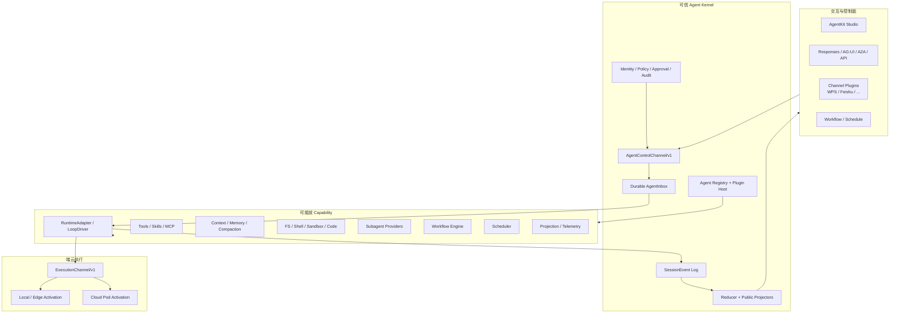
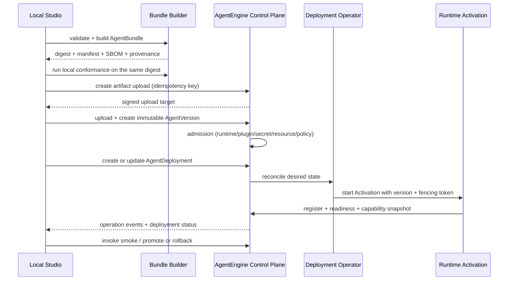

# Agent Runtime V2 插件化与端云协同架构设计

> 日期：2026-08-17
>
> 状态：待用户评审
>
> 适用范围：KsADK Runtime、AgentEngine 控制面、AgentKit Studio、ksadk-web 与外部 Channel 插件
>
> 参考基线：DeepSeek Harness `master@47f943859b`、KsADK RuntimeEvent v2 候选实现与 0.8.1 主线

## 1. 决策摘要

Agent Runtime V2 的主线不是 Channel，也不是重写所有框架的 Agent loop，而是建立四条稳定主干：

1. **Agent 控制主干**：稳定 `AgentInstance`、单一 durable Inbox 和 `AgentControlChannel/v1`，统一用户、Studio、父 Agent、Scheduler 与 Channel 的输入。
2. **插件组合主干**：以 `PluginManifest/v1`、Capability Registry、AgentProfile 和不可变 AgentBundle 组合 Runtime、模型、工具、Skill、Memory、Sandbox、Workflow、Scheduler、Subagent、Channel 与 UI 投影。
3. **会话事实主干**：以 SessionEvent Log 为统一有序事实流；`RuntimeEvent(schema_version=2)` 是其中的运行事件族，所有 live、replay、Web、Studio、A2A、AG-UI/A2UI 与 Channel 输出都从同一 reducer/projector 派生。
4. **端云执行主干**：`RuntimeAdapter` 负责“怎样执行”，`ExecutionChannel/v1` 负责“在哪里执行和怎样接管”，使本地、边缘设备和云上 Pod 共用 Agent、Session、Run 与事件语义。

WPS 协作 Channel 是 Channel Capability 的第一个 Adapter 和移动端验收切片，只负责把 WPS 消息映射为 AgentControl 命令，并把 Channel 投影发送回 WPS。它不进入 Agent loop，不拥有 Session 或 RuntimeEvent，也不成为本次架构的中心。

本设计参考 DSH 的插件树、`Agent`/`agent-loop` 分离、单一 inbox、append-only session log、Service Definition/Provider/Consumer、生命周期 disposer、Subagent provider、Job、Workflow 和 Schedule 语义，但不照搬 Cordis、TypeScript 单体、任意动态插件执行或“没有可信内核”的安全立场。

## 2. 背景与问题定义

KsADK 的差异化能力是多框架 Adapter、Python 原生、本地与托管部署、A2A 和 AgentEngine 数据面。当前问题不是缺少另一套通用 loop，而是这些能力缺少统一、可组合和可接管的运行时主干：

- RuntimeAdapter 统一了启动、流式、取消、恢复和 checkpoint，但上层仍缺稳定的 Agent 实例与 durable Inbox；
- RuntimeEvent v2 已形成身份化事件、单 reducer 和投影方向，但输入、调度、工作流和 Agent 控制尚未进入同一有序会话事实；
- Studio 主要是 Agent 创建与本地运行工作台，还不是插件组合、编排、调度、端云实例和 Channel 的统一控制台；
- 本地与云上使用不同启动和状态路径，无法自然实现边缘主动连接、云上 7×24 托管和双向接管；
- Tool、MCP、Subagent、Workflow、Scheduler、Channel 和 UI 扩展缺少同一套能力注册、生命周期、健康状态和卸载约定；
- 如果继续按入口堆叠 if/else，Studio、Web、Responses、A2A 与 Channel 会各自维护执行和事件逻辑。

V2 要解决的是运行时组合和控制模型，不是只解决一类消息接入。

## 3. 目标与非目标

### 3.1 目标

- 一个 AgentDefinition 可以编译为不可变 AgentVersion/AgentBundle，在本地调试并原样部署到云上或边缘。
- 用户、Channel、Scheduler、父 Agent 和 API 通过同一个 AgentControl 接口提交工作。
- 一个 Agent Session 只有一个 durable Inbox；同一 Session 的输入顺序可重放、可取消、可归因。
- Session 支持可选的业务 key-value Tags，API 可以创建、更新和精确筛选，Agent 只能读取调用快照。
- ADK、LangGraph、Codex、A2A 与未来 KsADK 原生 loop 都通过 RuntimeAdapter/Driver seam 接入，不要求共享内部 step 语义。
- Session、Run、Subagent、Job、Workflow 与 Schedule 均有稳定身份、明确所有者和恢复语义。
- RuntimeEvent v2 是运行事实，不由前端、Channel 或协议 Adapter 反向构造。
- 插件提供统一 manifest、能力依赖、配置 schema、Secret 声明、生命周期和 inventory。
- Studio 可以完成插件组合、Agent 编排、工作流、调度、端云部署、实例管理、会话控制和诊断。
- 本地和云上共享协议、Bundle、事件投影和 conformance suite，而不是维护两套产品逻辑。
- WPS 协作可作为首个外部 Channel 插件完成移动端指令、进度和对话，但不扩大可信内核。

### 3.2 非目标

- 不用自研 loop 替换 ADK、LangGraph、Codex 或 A2A 的原生 loop。
- 不强行统一不同框架的 graph step、ADK invocation、Codex turn 或 A2A task 内部语义。
- 不把所有模块都做成可由任意第三方替换的动态插件。
- 不在模型进程内执行未经审核的任意插件代码。
- 不把 Studio 变成完整 Cloud IDE，也不在浏览器里复制 Runtime 状态机。
- 不用 Channel 承担 Agent 路由、授权、Session 存储、审批或调度。
- 不以 0.8.2 版本号为理由跳过 RuntimeEvent 持久化、resume、生产 Adapter 或公开投影门禁。

## 4. 从 DSH 借鉴什么

### 4.1 采用的语义

| DSH 机制 | KsADK V2 采用方式 |
| --- | --- |
| `Agent` 接口与 `agent-loop` 实现分离 | 定义稳定 AgentInstance/AgentControl；RuntimeAdapter 和可选 KsADK LoopDriver 都是执行提供方 |
| 一个 Agent 只有一个 inbox | 所有输入统一进入 durable AgentInbox，来源只做 attribution，不授予权限 |
| Session append-only log 是上下文事实 | 建立 SessionEvent Log；模型可见输入和 Runtime 输出必须可从日志重建 |
| Service Definition / Provider / Consumer | Capability 采用三角色；扩展依赖接口，不依赖具体提供方 |
| Profile / Bundle 组合插件 | Studio 编辑 AgentProfile，构建时解析为不可变 AgentBundle；部署只消费 Bundle |
| 注册副作用随插件生命周期回收 | PluginContext 统一注册 disposer，卸载必须 drain 并撤销连接、工具、订阅和后台任务 |
| Subagent provider seam | SubagentRuntime 支持 in-process、远端 Agent、Codex、A2A 等 Provider |
| Job、Workflow、Schedule 分开建模 | 长任务、编排和触发器保持三个独立 Capability，不塞进 Agent loop |
| live/replay 从同一日志投影 | RuntimeEvent reducer 和各公开 projector 只有一套实现和 golden fixture |
| 插件 inventory 是权威 | Studio 从 PluginHost 读取真实状态，不以日志中的“loaded”作为成功 |

### 4.2 不采用的实现形态

- 不引入 Cordis 或复制 DSH 的 TypeScript package tree；KsADK 使用 Python 类型、Pydantic schema 和现有 RuntimeAdapter。
- 不接受“没有特权核心”。身份、授权、Secret、审批、Session/Event Store、lease/fencing 和审计属于可信内核。
- 不开放 DSH 式模型自写动态插件作为生产默认能力；实验性动态插件必须独立沙箱、显式授权和可撤销。
- 不把 DSH 的单进程 Agent 对象当作跨 Pod 身份；V2 显式区分稳定 AgentInstance 与短期 Activation。
- 不照搬“cold Session 恢复后才执行 Schedule”；云上 Scheduler 必须能唤醒冷 Agent。
- 不把 DSH 的自有 loop 事件直接套到四个异构框架；只在真实 source 能提供时保留 scope kind 和 native identity。

## 5. 领域模型

```text
AgentDefinition     可编辑的 Agent 配置和插件组合
  -> AgentVersion   一次发布版本
      -> AgentBundle 解析、锁定依赖和摘要后的不可变制品
          -> AgentDeployment 目标环境与策略
              -> AgentInstance 稳定逻辑实例
                  -> Activation 某个进程/Pod/设备上的短期执行所有权
                  -> Session 用户或系统的持久会话
                      -> InboxMessage 待处理输入
                      -> Run 一次执行
                      -> RuntimeEvent 运行事实
                      -> ChildSession / Job / WorkflowRun / Schedule
```

### 5.1 身份与生命周期

| 对象 | 身份稳定期 | 说明 |
| --- | --- | --- |
| AgentDefinition | 编辑生命周期 | 可变草稿，不直接运行 |
| AgentVersion | 发布生命周期 | 不可变，引用 Bundle digest |
| AgentInstance | 部署生命周期 | 不因 Pod 重启或端云迁移改变 |
| Activation | 一次进程驻留/租约 | 同一 AgentInstance 同时最多一个有写权的 activation |
| Session | 会话生命周期 | 独立上下文与 Inbox，可跨 activation 恢复 |
| InboxMessage | 从接收到 claim/discard | 统一输入身份和顺序 |
| Run | 一次 start/resume 执行 | 可跨进程恢复，必须有明确终态 |
| Scope/Item/Event | Run 内部 | 继续使用 RuntimeEvent v2 三层身份 |

环境变量、Pod 名、WebSocket 连接、进程内对象和 source metadata 都不是 Agent 或 Session 身份。

## 6. 总体架构



## 7. 可信 Agent Kernel

### 7.1 Kernel 负责的不可替换不变量

- Agent、Session、Run、Interaction 和 PluginInstance 的身份与租户隔离；
- AgentInbox 的持久顺序、claim、discard、幂等和背压；
- SessionEvent 的原子 seq、persist-before-publish 和 event id 唯一性；
- Plugin allowlist、签名、能力授权、Secret 注入与审计；
- 一次性 approval/interaction token 与主体、Session、Run、Interaction 的绑定；
- Activation lease、fencing、接管和 split-brain 防护；
- Bundle provenance、digest、版本不可变和部署准入；
- 对外 projector 的 schema 和敏感字段过滤。

这些能力可以有本地与云上存储 Adapter，但调用语义不能由业务插件改写。

### 7.2 AgentInstance 接口

上层只依赖 AgentControl，不依赖具体 loop：

```text
enqueue(message)       下一轮普通输入
steer(message)         下一 step 输入；不支持时明确返回 unsupported
inject(context)        不唤醒的下一 step 上下文；不支持时明确返回 unsupported
interrupt(run_id?)     中断当前或指定 Run
pause(run_id?)         非破坏暂停；不支持时明确返回 unsupported
resume(target, input)  从真实 continuation 恢复
submit(interaction)    向 live interaction 回包
status()               Agent、Session、Run、Inbox 与 capability 快照
subscribe(after_seq)   同一 SessionEvent cursor 的实时/重放订阅
```

这些是控制语义，不新增第二个执行器。Kernel 根据 Runtime capability 将命令映射到
`RuntimeAdapter.start/stream/cancel/pause/resume/submit/checkpoint/close`。

### 7.3 Durable AgentInbox

所有来源都写同一个 Inbox：

- Studio/Hosted UI 用户消息；
- Responses、AG-UI、A2A 或业务 API；
- 父 Agent/Subagent coordinator；
- Scheduler 触发；
- Workflow 节点；
- WPS 等 Channel；
- 系统恢复或运维命令。

InboxMessage 至少包含：

```text
message_id
session_id
source_kind
source_ref
mode = next_turn | next_step | context_only
content
accepted_at
idempotency_key
authorization_ref
```

规则：

- source 是归因，不是权限；权限由 admission 时的 authorization_ref 决定；
- 同一 Session 一个活动 Run，普通输入 FIFO；不同 Session 可并发；
- claim、discard 和取消进入 SessionEvent Log；
- 被 claim 的输入是否完成由 Run 终态关联，不从内存状态猜测；
- Runtime 不支持 steer/inject 时 fail loud，不静默降级成下一轮；
- 队列达到上限返回 typed `queue_full`，不无限增长或丢弃。

## 8. 插件与 Capability 模型

### 8.1 Capability 三角色

每个真正的 seam 必须说明：

1. **Service Definition**：最小稳定接口、能力描述、错误和生命周期；
2. **Service Provider**：本地、云上或第三方实现；
3. **Consumer**：Runtime、工具、Studio、Workflow 或 Channel 对该能力的使用。

只有一个实现且不存在测试替身或替换需求时，不为“插件化”额外制造 Provider seam。

示例：

| Capability | Definition | Provider | Consumer |
| --- | --- | --- | --- |
| Runtime | RuntimeAdapter | ADK/LangGraph/Codex/A2A/KsADK Loop | Agent Kernel |
| Session Store | SessionStore | SQLite/Postgres | Kernel、projector |
| Sandbox | SandboxRuntime | Local/E2B/平台 Sandbox | Tools、Skills、Workflow |
| Subagent | SubagentProvider | in-process/Codex/A2A/cloud Agent | Agent tool、Workflow |
| Workflow | WorkflowEngine | declarative/local worker/sandbox | Studio、Agent tool |
| Scheduler | ScheduleEngine | local timer/cloud scheduler | Studio、Agent tool |
| Channel | ChannelAdapter | WPS/Feishu/... | Channel Host |

### 8.2 PluginManifest/v1

插件 manifest 至少声明：

```text
id
version
api_version
kind
entrypoint
runtime = python | node | process
provides[]
requires[]
optional[]
config_schema
secret_fields[]
permissions[]
isolation
health_contract
provenance { source, digest, signature }
```

manifest 只声明需要什么，不能自行授予权限。PluginHost 解析依赖图、校验版本和权限、注入允许的
接口，并在启动完成前拒绝缺失能力或循环依赖。

### 8.3 两种插件形态

- **进程内可信 Python 插件**：通过 Python entry point 注册；适用于 Runtime、Store、Tool、Skill、Memory、projector 等与 KsADK 类型紧密结合的能力。
- **进程外 Connector 插件**：通过受控 RPC/AgentControl 连接；适用于 Node WPS SDK、企业 IM、设备、独立 Sandbox 或第三方进程。

两者共享 manifest、inventory、配置、Secret、健康和生命周期语义，但不强行共享代码加载机制。

### 8.4 生命周期

```text
discovered -> resolving -> starting -> ready -> draining -> stopped
                              └-------> failed
```

插件注册的工具、事件监听、定时器、连接、后台任务和 UI slot 都归属 PluginInstance。drain 先关闭
新准入，再等待已接受工作到安全边界，最后按逆序 dispose。PluginHost inventory 是运行状态权威。

### 8.5 AgentProfile 与 AgentBundle

Studio 编辑 `AgentProfile`：选择 Runtime、模型、Prompt、Tool、Skill、Memory、Sandbox、Subagent、
Workflow、Schedule、Channel 和 UI contribution，并配置各插件。

构建阶段将 Profile 解析为不可变 Bundle：

- 锁定插件 id/version/digest；
- 解析依赖图和 capability；
- 校验配置与 Secret 引用；
- 编译 Prompt、Tool schema、Workflow 和策略；
- 生成 SBOM、provenance、平台要求和 capability matrix；
- 输出可在本地与云上重复验证的 artifact。

运行时不读取 Studio Draft，也不跟随 registry `latest`。本地 override 只能改变声明为 deploy-time 的
配置，不能改变 Bundle 代码或权限摘要。

## 9. Loop 与 RuntimeAdapter

### 9.1 双轨但单接口

```text
AgentControl + Inbox
        -> Runtime Driver seam
             -> ADK RuntimeAdapter       原生 ADK loop
             -> LangGraph RuntimeAdapter 原生 graph loop
             -> Codex RuntimeAdapter     原生 app-server loop
             -> A2A RuntimeAdapter       远端 task loop
             -> KsADK LoopDriver         可选原生插件 loop
        -> RuntimeEvent v2
```

KsADK 原生 LoopDriver 的用途是承载真正需要 KsADK 自有 turn/step、插件 waterfall、动态 Tool 和
细粒度 steering 的 Agent；它不是其他框架的强制中间层。框架 RuntimeAdapter 保留原生能力，
通过 capability matrix 诚实说明 cancel、pause、resume、checkpoint、steer、inject 和 durable restore。

### 9.2 可拦截 seam

不把通用拦截器塞进每个 Adapter。Kernel 提供少数有不变量的 waterfall：

```text
input.admit       认证、配额、策略，只能拒绝或规范化
context.prepare   组装模型可见上下文
tool.pre_execute  参数、授权、approval、sandbox，只能收紧权限
tool.post_execute 脱敏、预算、presentation hint、telemetry
run.finalize      终态校验和输出选择
```

guard 必须单调：后置插件可以拒绝或进一步限制，不能重新放行已经拒绝的操作。所有进入模型的材料
必须有 durable SessionEvent 来源，所有工具副作用必须有审计事件。

## 10. SessionEvent Log 与 RuntimeEvent v2

### 10.1 一个有序事实流

SessionEvent Log 是 Session 级 append-only 序列，包含多个 typed event family：

```text
ControlEvent/v1     Inbox accepted/claimed/discarded、interrupt、resume、approval decision
RuntimeEvent/v2     run/scope/item/interaction/continuation/usage
WorkflowEvent/v1    workflow/node 生命周期
ScheduleEvent/v1    schedule create/update/delete/fire
JobEvent/v1         job start/progress/terminal
RelationshipEvent   child/fork/parent lineage
```

这些不是多份双写日志。每个事实只追加一次，`RuntimeEventStore`、ScheduleRepository 和 Workflow
Repository 是同一 SessionEvent Store 上的 typed view。Session seq 是 live、replay、断线续传和
Studio timeline 的共同 cursor。

### 10.2 RuntimeEvent v2 保留的核心

- `scope_id + item_id + event_id` 三层身份；
- `append / replace / complete` mutation 语义；
- persist-before-publish；
- 一个 StreamReducer；
- `run.completed.output_refs` 是最终输出唯一依据；
- v1 只读单向投影；
- envelope-first 未知事件读取；
- source-native identity 的确定性映射；
- live fold 与 replay fold 完全一致。

RuntimeEvent 不预设所有框架都有相同 turn/step。需要展示层级时增加有真实来源的 `scope_kind`，
不能用空字段伪装统一语义。

### 10.3 公开投影

canonical store 不直接成为公网 wire。每个出口有独立、生成并校验的最小 schema：

- Responses projection；
- AG-UI/A2UI projection；
- A2A Task/artifact projection；
- Session message/history projection；
- Studio/ksadk-web projection；
- ChannelEvent projection；
- OTLP telemetry projection；
- RuntimeEvent v1 compatibility projection。

投影不能反向写回 canonical，不能各自实现 reducer，也不能暴露 source metadata、内部游标或 Secret。

### 10.4 冷恢复

恢复者必须先获得 AgentInstance/Run lease 和 fencing token：

1. 重放 SessionEvent 到确定状态；
2. 探测 RuntimeAdapter 的 durable attach/resume capability；
3. 可恢复时接管 activation，追加 continuation/resume 事实；
4. 不可恢复时确定性合成 interrupted/failed 终态并关闭 open item；
5. 任何旧 owner 的后续写入因 fencing token 失效而拒绝。

不能把发现的所有 open Run 一律关闭，也不能仅凭数据库中存在 RunHandle 就宣称底层进程可恢复。

### 10.5 Session Tags v1

Phase 0 增加轻量的 Session key-value Tags，用于业务分类和精确筛选。Tag 的 key/value 没有平台预设业务
语义；`{"scene": "coding"}`、`{"priority": "high"}` 只是示例，`{"a": "b"}` 同样合法。

```text
tags: map<string, string>
```

V1 合同：

- `CreateSession.Tags` 可选；不传时创建空 Tags Session；
- 新增 `UpdateSession`，以 `SetTags` 合并/覆盖指定 key，以 `RemoveTags` 删除指定 key；两者在一个事务中执行；
- `GetSession` 和 `ListSessions` 返回当前 `Tags`；
- `ListSessions.TagFilters` 接受 key-value map，`TagMatch = all | any`，只做精确匹配；
- `Tags`、`SetTags`、`RemoveTags` 均可缺省，Tag 不成为 Session 创建、更新或运行的必填项；
- `SetTags` 与 `RemoveTags` 不能包含同一个 key；删除不存在的 key 是 no-op；更新锁定 Session 行，互不相同
  的 key 可以合并，同一 key 并发更新采用最后提交者生效；
- 每个 Session 最多 32 个 Tag；key 长度 1-64，只允许 `[A-Za-z0-9_.-]`；value 为最长 256 字符的
  任意字符串；`agentengine.` 前缀保留给平台；
- API 始终按 `account_id + agent_id + user_id + session_id` 校验归属，Tag 不是授权声明；
- V1 不提供模糊搜索、表达式、Tag 目录、颜色、批量管理或 Studio 标签编辑 UI。

AgentEngine Server 是 Tag 权威：在 Session 行使用非空 JSONB map，并为 key-value containment 建 GIN 索引；
不能把 SessionEvent Log 当作筛选数据库。每次更新同时追加 `SessionTagsUpdated` 审计事实，记录操作者、变更
key 和结果摘要，查询仍走 Session read model。

Server 在每次 start/resume 时读取一次 Tags，并通过保留的内部 SessionContext envelope 注入 Runtime；
KsADK 将其解析为只读 `PlatformInvocationContext.session.tags`。用户 Agent、Tool 和框架 Adapter 可以读取，
不能直接修改；当前 Run 使用不可变快照，更新只影响后续 start/resume。内部 envelope 必须覆盖并拒绝调用者
伪造的 `metadata.agentengine.session_context`，且 Tags 不授予 Workspace、Tool、Secret 或任何其他权限。

Tags 与可选 `workspace_id` 是正交字段：前者用于业务分类和精确筛选，后者仅表示资源归属；两者都可缺省，
也不能互相推导。

## 11. 端云协同

### 11.1 两条通道

| 协议 | 解决的问题 | 不负责 |
| --- | --- | --- |
| `AgentControlChannel/v1` | 给哪个 Agent/Session 提交什么命令、订阅什么事件 | Pod/设备在哪里、谁持有 lease |
| `ExecutionChannel/v1` | Runtime 注册、heartbeat、lease、command delivery、ack、reconnect、cursor、backpressure | 用户会话语义和 Agent loop |

### 11.2 稳定实例与短期 Activation

AgentInstance 是控制面对象；Activation 是某个本地进程、边缘设备或云 Pod 当前持有的执行权。
ExecutionChannel 由执行端主动发起出站连接：

```text
register -> attest -> lease -> heartbeat
         -> receive work -> ack -> emit events
         -> reconnect(after_cursor) -> resume/reconcile
```

同一 AgentInstance 只有一个写 owner。云上和边缘切换必须先撤销旧 lease，再发放新 fencing token。

### 11.3 双向接管边界

- 端侧可以通过 AgentControl 调用云上 7×24 Agent；
- 云上可以向在线端侧 Activation 下发已授权任务并查看进度；
- 云上不能任意接管端侧环境。设备策略、用户在线确认、高风险 approval 和短期 permit 是硬门禁；
- 本地文件、Shell、桌面和凭据能力分别声明，不能因设备“在线”获得全权限；
- 端侧断线后，云上根据任务策略选择等待、转移到兼容云 Runtime 或终止，不能静默改变执行环境。

### 11.4 本地 Bundle 发布到云上的事务

本地调试和云上部署必须消费同一个不可变 Bundle，但“本地运行成功”不等于“云上部署成功”。Studio
只调用 AgentEngine 控制面，不直接操作 K8s、Pod、镜像仓库或 Runtime 内部接口：



发布步骤必须独立记录 `BuildOperation`、`UploadOperation`、`VersionOperation`、`DeploymentOperation`
和 `PromotionOperation`，并支持用同一个 idempotency key 重试。只有 Bundle admission、Runtime readiness 和
真实调用冒烟都成功，Studio 才显示“已部署”；失败时保留上一个健康版本和完整错误，不得用本地记录或 Mock
代替云端结果。

云上只注入目标环境绑定，例如 Secret 引用、资源、网络、弹性和 Store Provider；不得重新解释 AgentProfile、
漂移插件版本或修改 Bundle 内权限摘要。回滚切换到既有 AgentVersion/Bundle digest，不在回滚时重新构建。

### 11.5 端云职责边界

| 组件 | 负责 | 不负责 |
| --- | --- | --- |
| KsADK / Bundle Builder | 本地校验、Bundle、RuntimeAdapter、Session/RuntimeEvent、运行时 conformance | 云资源编排、租户级部署真相 |
| AgentKit Studio | Profile 编辑、本地调试、发起部署、展示云端状态和控制命令 | 直接管理 Pod、伪造部署成功、保存云端资源真相 |
| AgentEngine 控制面 | Agent/Version/Deployment/Instance、admission、Operation、rollout/rollback、RBAC/审计 | 执行模型 loop、在浏览器维护运行状态机 |
| Deployment Operator | 将 Deployment 期望状态收敛为 Pod/Activation、健康和回滚 | Agent 会话语义、用户审批 |
| Runtime Activation | 执行 Bundle、注册 capability、heartbeat、消费工作、产生事件 | 暴露租户管理 UI、修改 AgentVersion |
| Gateway | 公网协议、可信身份、路由和限流 | 用一个长期 API Key 代替 workload/forward identity |

## 12. Agent 编排能力

### 12.1 Subagent

`SubagentProvider` 支持：

- 新建独立 child Session；
- 从父 Session 完成边界 fork；
- in-process KsADK child；
- 远端 AgentEngine Agent；
- Codex、A2A 或其他外部 Provider。

子 Agent 有稳定 child Session 和最多一个 live Activation。父子关系是 durable lineage；进程内对象只
用于当前 activation。所有 follow-up 进入 child 的同一 Inbox，interrupt 不删除未 claim 的后续消息。

Provider 必须声明 output schema、tool filter、persona、depth、continuable、durable resume 等能力；
不支持时 start 前 fail loud。Studio 从同一接口展示 Agent 树、状态、进度、日志、发送消息和中断。

### 12.2 Job

Job 表示长时间运行的工具或基础设施任务，具有 owner、状态、进度、取消、结果和过期策略。它不是
Agent Session，也不是 Workflow 节点。Job Provider 可以是本地进程、Sandbox、构建、部署或数据任务。

### 12.3 Workflow

`WorkflowDefinition/v1` 是 Studio 可视化编排的声明式 DAG/状态机：

- 节点类型由插件注册，如 Agent、Tool、Subagent、Condition、Parallel、Wait、Human、Job；
- 节点端口和配置由 JSON Schema 声明；
- Workflow 编译时完成类型、依赖、循环、权限和资源上限校验；
- WorkflowRun、NodeRun 和 transition 进入 SessionEvent Log；
- 恢复从 durable state 继续，不靠浏览器内存；
- 节点调用 Agent 时写 AgentInbox，不绕过 AgentControl；
- 模型生成的动态脚本是独立受限 Provider，不是 Studio 工作流默认实现。

### 12.4 Scheduler

Scheduler 只负责“何时产生一条控制命令”：

- 支持 once、interval、cron 和 event trigger；
- 明确 IANA time zone、misfire、重试、并发和去重策略；
- 触发后向 AgentControl 提交带 `schedule_id + occurrence_id` 幂等键的 InboxMessage；
- 本地 Adapter 使用 SQLite + timer，云上 Adapter 使用共享存储 + lease/next-fire index；
- 云上 Scheduler 可以唤醒 cold Agent 或创建短期 Activation；
- Scheduler 不等待模型完成来决定 dispatch 是否成功，运行结果由关联 Run 体现；
- Workflow 可以由 Scheduler 触发，但 Scheduler 不内嵌 Workflow 引擎。

## 13. Channel Capability

Channel 只是外部消息 Adapter 家族：

```text
External IM/Event
  -> ChannelAdapter normalize/auth/dedupe
  -> AgentControlChannel
  -> AgentInbox / Runtime
  -> RuntimeEvent v2
  -> ChannelEvent projector
  -> ChannelAdapter render/send
```

Channel 不拥有 Agent 路由、Session、Run、审批或调度。`BotBinding` 由控制面保存，绑定
`plugin_id + external_account + agent_id + agent_version_id + policy + credential_ref`。

### 13.1 WPS 协作首条切片

- 一个 WPS 应用机器人绑定一个 AgentVersion；
- 一条 `open-event-sdk` WebSocket 服务该机器人；
- 每个私聊映射独立 Agent Session；
- 首期只做文本、即时回执、阶段进度、`/status` 和 `/stop`；
- 参考 `@wps365/openclaw-wpsxiezuo` 的重连、事件规范化、event id 幂等、Session key 和每 Session FIFO；
- WPS Adapter 作为 Node 进程外插件，本地由 Studio 启动，云上作为 sidecar；
- 不复制 OpenClaw runtime、工具、OAuth 或多账号体系；
- 首期不做群聊、附件、审批卡和 WPS 业务工具；审批只提示转到 Studio，绝不自动批准；
- TLS 校验始终开启，私网使用显式 CA bundle，禁止按网络类型关闭验证；
- 生产幂等、Outbox 和 cursor 使用 durable store，不能沿用纯内存实现。

后续飞书、微信、邮件等 Adapter 复用同一 Channel manifest、AgentControl 和 ChannelEvent projector。

## 14. Studio V2

Studio 是 Agent Runtime 的本地控制面与云上控制台，不拥有执行或事件真相。

### 14.1 必须补齐的工作台

| 工作台 | 首要能力 |
| --- | --- |
| Agent Profile | 插件组合图、能力依赖、配置、Prompt、Tool、Skill、Memory、Sandbox |
| Plugin Catalog | 已安装版本、provenance、capability、依赖、健康、启停和升级预览 |
| Runtime | Runtime/Loop 选择、capability matrix、模型和执行目标 |
| Workflow | DAG 编辑、schema 校验、试跑、节点状态、恢复和版本化 |
| Schedule | once/interval/cron/event、时区、下次触发、暂停、补偿和执行历史 |
| Channels | BotBinding、Secret、策略、连接、最近错误和测试消息 |
| Deployments | Local/Edge/Cloud 目标、Bundle digest、实例、Activation、lease 和回滚 |
| Sessions | Inbox、Run、Subagent 树、Job、WorkflowRun、interaction 和 Timeline |
| Observe | RuntimeEvent/OTLP Trace、live/replay、错误、资源和安全审计 |

### 14.2 前端插件与渲染

参考 DSH keyed renderer，但保留 ksadk-web 为 UI source of truth：

- 消息、thinking、tool、approval、A2UI、Workflow node、Job、Schedule 和 Channel activity 使用注册式 renderer；
- renderer 只消费公开 projection schema，不读取 canonical metadata；
- local Studio、embedded Agent UI 与 Hosted UI 共用 ksadk-web 组件和 reducer fixture；
- live、replay 和刷新恢复调用同一 projection update 函数；
- Studio 插件只能注册声明过的 UI slot，不能替换鉴权、Secret、审批或审计页面。

### 14.3 本地与云上统一定义

```text
同一 AgentProfile
 -> 同一 AgentBundle digest
 -> 同一 Plugin capability graph
 -> 同一 AgentControl / SessionEvent / RuntimeEvent 合同
 -> Local Activation | Edge Activation | Cloud Activation
```

差异只能位于 Provider：SQLite/Postgres、本地 Sandbox/云 Sandbox、子进程/Pod、UDS/mTLS。Studio
不得通过 Mock 成功掩盖云上未部署能力；目标不可用时显示真实 `unavailable` 和缺失 capability。

### 14.4 云上管理入口

云上需要管理界面，但它属于 **AgentKit Studio / AgentEngine 控制面**，不应在每个 Runtime Pod 中打开
一套 `/admin` 或完整 Studio。Runtime Pod 只暴露业务数据面、health/metrics，以及经过 workload
identity 或 mTLS 保护的内部 AgentControl/ExecutionChannel。

管理入口分两种形态，共用同一套 API schema、ksadk-web 组件和 RBAC：

1. **本地 Studio 连接云账号/项目**：适合作为首期入口。本地页面通过 AgentEngine 控制面 API 管理云上
   Agent，不需要把本地 Workspace 上传成远程文件系统；
2. **AgentEngine Console 内托管 Studio**：适合 7×24 运维和团队协作。它是同一 React 管理应用的云上
   壳，不另造第二套 Session、Event 或审批逻辑。

云上管理面至少覆盖 AgentDefinition/Version、Deployment、AgentInstance/Activation、Session/Run、
Inbox、Plugin/Capability、Workflow/Schedule、ChannelBinding、Secret 引用、Trace/Audit 和 rollback。
Hosted UI/Chat 仍是终端用户对话入口，不等于管理面。

浏览器身份使用租户/项目/Space 范围的登录会话、RBAC 和 CSRF；CLI/本地 Studio 使用短期用户凭据或设备
授权。管理面向 Runtime 下发命令时必须转成 AgentControl 命令并留下审计，不能把浏览器身份直接透传到 Pod。

### 14.5 当前 Studio 基线与缺口

截至本设计基线，Studio 已有 AgentBundle 构建、digest/provenance 校验、Deployment/rollback API、
`HttpCloudDeploymentGateway` 合同和异步 Operation；CLI 也已有真实云部署 Provider。这些应复用，不能另造
一套 `studio deploy` 协议。

但默认 `ksadk studio` 尚未装配真实 Cloud Gateway，未配置时会返回
`CLOUD_BUNDLE_ADMISSION_UNAVAILABLE`；测试主要使用 `InMemoryCloudGateway`，React “部署”页仍是空态入口。
因此当前状态应表述为“合同和构建骨架已存在，产品链路未闭环”，不能宣称 Studio 已支持生产云部署或云上
Agent 管理。

## 15. 安全、授权与审计

- 外部 API Key、WPS 凭据、workload identity、forward identity 和第三方凭据分别管理，不共享信任根；
- Secret 只以引用进入 AgentProfile/Bundle，运行时由 Secret Provider 注入，不能进入事件和日志；
- Plugin manifest 声明权限，Bundle 构建和 Activation admission 都检查，运行时 capability token 最小化；
- Tool/FS/Shell/Desktop/Network 权限分别授权，`full_access` 不是跨能力万能开关；
- approval decision 绑定主体、Session、Run、Interaction、动作摘要和一次性 nonce；
- Channel 文本、模型输出和 source attribution 都不能直接成为授权证据；
- 插件签名、digest、SBOM、许可证和来源进入 Bundle provenance；
- 端侧只接受出站连接、短期 permit 和本机策略允许的命令；
- 所有副作用、命令 admission、审批、调度触发、接管和插件变更写审计事件；
- 公网、私网和 sidecar 通信默认验证 TLS/mTLS，禁止 `verify=false`。

## 16. 可靠性与恢复

### 16.1 持久化屏障

以下动作必须 persist 后才对外确认：

- Inbox accepted/claimed/discarded；
- RuntimeEvent publish；
- Workflow transition；
- Schedule create/update/delete/fire；
- approval decision；
- Activation lease/fencing change；
- Channel Inbox/Outbox cursor。

无法确认持久化时返回 typed `persistence_uncertain`，不能把进程内成功当作已持久化。

### 16.2 Supervisor

MCP、Channel、ExecutionChannel、外部 Subagent 和远端 Store 都需要统一 supervisor 语义：

- connect/start、heartbeat、指数退避、re-sync、fetch-then-swap；
- readiness 与 liveness 分离；
- 正常 drain 不触发重连；
- dispose 反注册工具、能力和监听；
- 状态进入 Plugin Inventory 和 Studio；
- 重连后从 cursor 恢复，不通过重复执行补事件。

### 16.3 背压

- 每 Session Inbox、每 Workflow、每 Agent 子树、每插件 Outbox 和每租户并发都有显式上限；
- slow consumer 不阻塞 canonical persist；
- 可合并的进度允许 coalesce，终态和 interaction 不允许丢弃；
- 生产者得到 typed backpressure，不无限缓存。

## 17. 测试与架构门禁

### 17.1 Kernel 与事件

- SessionEvent event id/seq/幂等/property test；
- live fold 与 replay fold 逐字节一致；
- 同 Session Inbox FIFO、跨 Session 并发；
- claim 后崩溃、Activation 切换和旧 fencing writer 拒绝；
- RuntimeEvent open item 冷恢复和真实 resume；
- unknown event envelope 保存、各 projector 独立降级；
- 模型可见输入都能追溯到 SessionEvent；
- 公开 projection JSON Schema 和跨语言 golden fixture。

### 17.2 Runtime Adapter

- ADK、LangGraph、Codex、A2A per-adapter native fixture；
- start/stream/cancel/pause/resume/submit/checkpoint/attach capability conformance；
- 生产 `RuntimeExecutor -> canonical pipeline -> store -> replay` 真实链路，禁止只测 Adapter 生成器；
- 审批、checkpoint、进程重启 resume 和 final output E2E；
- 不支持能力 fail loud，不静默降级。

### 17.3 Plugin

- manifest/依赖/版本/权限/Secret schema；
- start/ready/drain/dispose 和资源泄漏；
- Provider 卸载时 Consumer 进入明确 unavailable；
- inventory 与实际运行状态一致；
- 插件 crash 不破坏 Kernel；
- allowlist、签名、digest 和许可证门禁。

### 17.4 编排与端云

- Subagent stable child、单 activation、cold resume、follow-up FIFO 和 child-first teardown；
- Job owner isolation、cancel、timeout 和 terminal first-wins；
- Workflow 并发、分支、等待、失败、恢复和 node idempotency；
- Scheduler 时区、misfire、并发、重复 fire、cold Agent 唤醒和 lease failover；
- edge/cloud reconnect、cursor replay、split-brain、permit 过期和断线策略；
- Local/Edge/Cloud 对同一 Bundle 的 conformance 结果一致。

### 17.5 Studio 与 Channel

- ksadk-web 注册式 renderer 的 live/replay/refresh golden；
- Studio Plugin/Workflow/Schedule/Channel/Deployment 浏览器 E2E；
- WPS 真机“消息 -> accepted -> progress -> final”，重复事件只执行一次；
- `/status` 不创建 Run，`/stop` 返回真实 cancel 状态；
- Secret 不回显、错误脱敏、审批 fail closed。

## 18. 当前基线与分阶段交付

本设计是一张架构地图，实施必须拆为独立 tracer bullet，不能一次大爆炸合并。0.8.2 不仅要收稳
RuntimeEvent v2，还必须跑通一个可对外验证的“本地 Studio -> AgentEngine -> 云 Runtime”最小纵切；
但不把完整 Plugin、Workflow、Scheduler、Channel 和端侧接管同时塞进该版本。

### 18.1 当前 KsADK Runtime 基线

| 能力 | 已有基础 | 发版前/后续缺口 |
| --- | --- | --- |
| Runtime 抽象 | `RuntimeAdapter` 已有 start/stream/cancel/pause/submit/resume/attach/checkpoint/close 与 Registry | capability 需 typed/versioned；不同框架必须用生产链路做诚实 conformance |
| RuntimeEvent v2 | canonical schema、identity、store、reducer、pipeline、v1 projector 和四类 source adapter 候选已存在 | approval/checkpoint resume 经过真实持久化 pipeline 仍有 event id 冲突；live/replay/重启必须补齐 |
| 框架接入 | ADK、LangGraph、Codex、A2A 均有 Runner/Adapter 资产 | ADK 与 A2A canonical adapter 尚未完整接入生产调用链；不能只以 adapter 单测判定完成 |
| 本地运行 | CLI/Studio 已支持创建、构建和本地运行，Responses/Hosted UI 有既有数据面 | 本地 Studio 的运行事件仍需收敛到同一 SessionEvent/projector；审批、取消、恢复需要真实浏览器 E2E |
| 云部署 | CLI 有真实 Provider；Studio 有 Bundle/CloudGateway/Operation 合同 | Studio 默认未接真实控制面，部署页为空态；缺 admission、状态订阅、readiness、冒烟和 rollback 闭环 |
| 质量与安全 | 已有全量测试、release gate、public preflight 骨架 | 当前候选仍需清零 Ruff、移除 `verify=False`、修正 0.8.2 changelog/version，并把 v2/resume E2E 纳入公开门禁 |

### 18.2 阶段路线

| 阶段 | 范围 | 关键交付 | 阶段验收 |
| --- | --- | --- | --- |
| Phase 0：0.8.2 端云纵切 | RuntimeEvent v2 稳定化 + 最小云部署与管理闭环 | 修复 canonical pipeline 和四类 Adapter；同一 Bundle 从 Studio 部署到真实预发 Runtime；提供进度、就绪、对话、会话回看、Session Tags API 和回滚；同步 Web/Hosted UI 和发布门禁 | ADK、LangGraph、Codex 各完成本地构建、真实云部署、流式对话和回滚；A2A 完成云调用与终态对账；Tags 创建/更新/筛选/只读注入通过；公开 preflight 全绿 |
| Phase 1：Agent Kernel | 统一控制和会话事实 | SessionEvent envelope、durable Inbox、AgentControl、稳定 AgentInstance、Activation lease/fencing、typed capability | 同 Session FIFO、断点恢复、冷 attach、旧 owner 拒写、控制命令可审计 |
| Phase 2：Plugin 与本地 Studio | 建立可组合本地产品 | PluginManifest/Host/Inventory、Profile->Bundle、MCP supervisor；Studio Plugin/Runtime/Session 工作台 | ADK/LangGraph/Codex 本地真实创建、对话、工具、审批、取消、恢复；Bundle digest 可重复 |
| Phase 3：云管理增强 | 在 Phase 0 纵切上补齐团队和多环境治理 | hosted Studio/Console、环境提升、灰度、扩缩容、Secret/网络策略、团队 RBAC、审计和多实例诊断 | pre->online promotion 不重建 Bundle；多人协作、策略变更、灰度和回退可审计 |
| Phase 4：编排与调度 | 在稳定 Kernel 上增加组织能力 | Subagent、Job、声明式 Workflow、Studio canvas、local/cloud Scheduler | DAG 校验、等待/失败/恢复、冷 Agent 唤醒、幂等 schedule fire、跨重启继续 |
| Phase 5：边缘接管与 Channel | 扩展执行位置和外部入口 | ExecutionChannel 的 edge lease/reconnect/permit；WPS 私聊插件与云 sidecar；移动端进度/停止 | 无 split-brain，断线 cursor 恢复；WPS 消息只进入 AgentControl，移除 Channel 不影响主路径 |

Phase 0 使用现有 RuntimeAdapter、Studio Bundle 和 AgentEngine 部署能力完成纵切；Phase 1/2 再深化
Kernel 与插件模型，不能要求尚未实现的 Plugin Host 成为 Phase 0 前置。Phase 3 依赖 Phase 0，Phase 4/5
依赖 Phase 1 的 AgentControl 与 durable Session 语义。WPS 可以提前做本地 PoC，但不改变 Kernel 优先级。

### 18.2.1 Interaction/v1 冻结补充（2026-08-19）

Interaction 不是新的执行通道，而是同一 `SessionEvent` 流上的持久化等待/决议事实。公开
`SubmitInteractionRequest` 仅包含 interaction ID、预期 revision、动作、响应与幂等键；Gateway
认证后的 Server 准入负责附加 actor 与短期授权引用，Runtime 不接受浏览器携带 permit、checkpoint、
secret 或框架 handle。`approval`、`structured_input`、`plan_review`、`custom` 是唯一 v1 kind；终态
通过 `interaction.resolved`（含 rejected outcome）、`interaction.cancelled`、`interaction.expired`
表达。A2UI 若存在，线协议固定 `0.9.1` 且必须携带 catalog digest 与 messages，无法校验时退回
schema 表单，绝不将渲染失败解释成批准。

Phase 0 使用“最小 AgentBundle v1”：只冻结 framework、runtime、entrypoint、artifact、digest、provenance
和 capability snapshot。Phase 2 再以 additive 方式加入完整 PluginManifest、依赖图和 Inventory，不能反过来阻塞
Phase 0 的部署纵切。

### 18.3 Phase 0 工作包

每个工作包都应成为独立 Issue/任务，指定一个直接 Owner；“协同”不能代替 Owner。任务完成必须同时提交
实现、合同测试和验收证据，不能只提交接口或 Mock。

| ID | 仓库 / Owner 角色 | 开发点 | 可验收输出 | 依赖 |
| --- | --- | --- | --- | --- |
| P0-00 | 跨仓库架构 Owner | 冻结 `AgentBundleManifest/v1`、`CloudDeploymentGateway/v1`、`DeploymentOperation/v1`、资源 ID 映射、错误码和幂等语义；提供跨语言 golden fixture | KsADK、Server、Studio 使用同一 fixture；未知字段兼容；合同变更有版本号 | 无 |
| P0-01 | `ksadk-python` RuntimeEvent | 修复 resume 时重复 `run.started` 的 event id/timestamp 冲突；统一 start/resume/attach 的幂等规则；补冷恢复和旧 owner 写入拒绝 | 真实 `RuntimeExecutor -> canonical pipeline -> store -> replay` 首轮中断后可跨进程 resume，live/replay 一致 | P0-00 |
| P0-02 | `ksadk-python` ADK Adapter | 将 ADK 生产 Runner 接入 canonical stream；删除 author/text 前缀推断；锁定并验证支持的 ADK 版本与 multi-agent/multi-LLM native identity | ADK 本地和云上事件 golden、cancel、final output E2E；interaction/resume 按 native capability 验收，不支持时返回 typed unsupported | P0-01 |
| P0-03 | `ksadk-python` LangGraph Adapter | 接通 graph stream、checkpoint、interrupt/approval 和 durable resume；明确 thread/checkpoint 与 Session/Run 映射 | LangGraph checkpoint 在重启后恢复；审批只执行一次；最终输出引用正确 | P0-01 |
| P0-04 | `ksadk-python` Codex Adapter | 接通 app-server live interaction、submit/cancel 和 canonical projector；将 Codex Studio build 适配到公共 deployable artifact 接口 | Codex 本地与 ManagedRuntime 云部署均能流式对话、授权后继续并产生唯一终态 | P0-01、P0-00 |
| P0-05 | `ksadk-python` A2A Adapter | 让新 A2A canonical adapter 进入 `space_client` 生产路径；保留 native task/message/artifact identity；流结束后 GetTask 终态 reconcile | A2A stream、断线重连、终态对账和 v1 projection E2E；A2A 不伪装成本地 Bundle | P0-01 |
| P0-06 | `ksadk-python` Bundle/Deploy | 让 ADK/LangGraph Code Bundle 与 Codex ManagedRuntime manifest 携带 digest、provenance、framework/runtime version、entrypoint 和最低 capability；云端不得重建源 Bundle | 两次构建 digest 可重复；上传前后校验；AgentVersion 能追溯 source bundle 和派生运行制品 | P0-00 |
| P0-07 | `ksadk-python` Studio Backend | 把默认 `UnavailableCloudGateway` 替换为显式配置的真实 Adapter；复用 `AgentEngineClient`、预签名上传、Create/Update Agent、Create/Rollback Version；凭据只作为本地引用，不进入 Bundle/事件 | 未登录时 typed unavailable；登录后真实 Build/Upload/Version/Deployment Operation 可重试且不重复创建 | P0-00、P0-06、P0-09 |
| P0-08 | `ksadk-python` Studio Frontend | 完成 Cloud Target、部署向导、Operation 时间线、Deployment 列表/详情、版本/digest、实例就绪、打开对话、失败原因和回滚确认；复用 ksadk-web 对话区 | 浏览器 E2E 覆盖成功、admission 拒绝、超时、刷新恢复、回滚；不显示 Mock 成功 | P0-07、P0-10、P0-17 |
| P0-09 | `agentengine-server` 制品/版本 | 在既有预签名上传、Create/Update Agent、AgentVersion 上实现 Gateway 合同 Adapter；校验 digest/provenance/framework/runtime/资源/Secret 引用；保存 Bundle->Version->Runtime 映射 | 重复请求返回同一资源；digest 不符拒绝；版本可查且不可变；不强制新增猜测式 REST 路径 | P0-00、P0-06 |
| P0-10 | `agentengine-server` 部署 Operation | 建立持久 DeploymentOperation 状态机：queued/uploaded/admitted/deploying/ready/smoke_passed/failed/rolled_back；消费 Runtime 状态事件；提供查询/订阅/取消、Server 侧真实调用 smoke 和回滚 | Server 重启后 Operation 可恢复；失败保留旧健康版本；终态 first-wins；Studio 可按 cursor 续看；`smoke_passed` 有 InvocationId/Trace 证据 | P0-09、P0-14 |
| P0-11 | `agentengine-server` 云 Agent 管理 | 提供租户范围的 Agent/Version/Deployment/Instance/Session/Run 查询和最小控制面；生成 Studio 到云 Agent/对话/Trace 的安全 deep link | 本地 Studio 能管理自己项目的云 Agent；越权、跨租户、失效链接均被拒绝并审计 | P0-09、P0-10 |
| P0-12 | `agentengine-server` Session Tags | 给 Session 增加非空 JSONB Tags 和 GIN 索引；扩展 Create/Get/List；新增 UpdateSession 的 SetTags/RemoveTags；实现 all/any 精确过滤、限额、租户隔离和审计事实；CreateSession 同步旧 Runtime 时剥离控制面 Tags | `{"a":"b"}` 可创建、覆盖、删除并筛选；list/count 一致；无 Tag 兼容旧调用；旧 Runtime 不因未知字段失败；越权失败；查询计划命中索引 | P0-00 |
| P0-13 | `ksadk-python` SessionContext | 解析 Server 保留 envelope，把 Tags 作为不可变快照贯穿 foreground/background/stream/resume，并暴露 `PlatformInvocationContext.session.tags`；持久化公开事件前移除内部 envelope | 普通 Agent/Tool、LangGraph、ADK、Codex 均可只读获取；并发请求不串 Tag；Agent 不能经请求 metadata 伪造或修改 | P0-12、P0-01 |
| P0-14 | `agent-runtime-service` | 承接 Server 的 AgentRuntime 创建/更新，传递 Bundle digest、AgentVersion 和 Runtime 版本；把 accepted/deploying/ready/failed、ready replica 和失败原因可靠回传 Server | Runtime 状态可幂等重放；Server 重启或事件重复不会倒退状态；运行版本可从 API 查询 | P0-00、P0-09 |
| P0-15 | `agent-platform-operator` | 将 AgentRuntime 期望状态收敛为 Deployment/Pod；写入版本/digest annotation/env；完善 readiness、rollout、failed condition 和回滚收敛 | Pod 实际 digest 可核验；新版本未 Ready 不切流；回滚恢复旧 ReplicaSet 且状态回传 | P0-14 |
| P0-16 | `agentengine-gateway` | 验证新部署 Agent 的路由注册、API Key/可信转发身份、SSE/WebSocket 长连接、会话亲和和滚动期间 drain；公网/VPC 地址均 fail closed | 部署 ready 后才能路由；未授权 401/403；长流不中途切 Pod；回滚后路由指向健康版本 | P0-10、P0-14、P0-15 |
| P0-17 | `ksadk-web` | 消费 RuntimeEvent v2 的公开 projection，统一 live/replay/refresh；修复 approval 默认折叠、授权后运行态和 terminal output 展示 | 工具输入输出、审批、A2UI、thinking、final 在本地/云 Hosted UI 使用同一 golden fixture | P0-00、P0-01 至 P0-05 |
| P0-18 | `agentengine-hosted-ui` | 升级并锁定通过验证的 ksadk-web 包；构建 hosted 镜像；验证 chat/tui/workspace 路径和 runtime 能力版本协商 | 预发 Hosted UI 对三种已部署框架完成 streaming、approval、刷新和历史回放 | P0-17、P0-16 |
| P0-19 | 跨仓库 QA / 预发 Owner | 建立真实预发矩阵与自动清理：ADK Code、LangGraph Code、Codex ManagedRuntime；A2A 作为远端 Adapter 单独验收；覆盖 Session Tags API 与 Agent 只读快照 | 每个 deployable framework 完成 build->deploy->ready->chat->history->rollback；Tag 创建/更新/过滤/注入通过；失败留下 trace、operation 和资源快照 | P0-02 至 P0-18 |
| P0-20 | `ksadk-python` Release Owner | 清零 Ruff、`verify=False`、版本/Changelog、锁文件和公开审计；将 v2、真实 resume、Bundle/Studio/Tags E2E 纳入 CI/public-preflight；记录各云组件镜像版本 | 0.8.2 wheel、公开 main、Server/Runtime/Operator/Gateway/Hosted UI 版本形成可追溯 release manifest | P0-19 |

### 18.4 Phase 0 并行顺序

```text
Wave A  P0-00 合同 ─┬─ P0-01 canonical ─┬─ P0-02/03/04/05 adapters
                    │                    └─ P0-17 web projection
                    ├─ P0-06 bundle ─────── P0-07 Studio backend
                    ├─ P0-09 server admission ─ P0-10 operation
                    └─ P0-12 Session Tags ─── P0-13 runtime snapshot

Wave B  P0-14 runtime service ─ P0-15 operator ─ P0-16 gateway
        P0-07 + P0-10 + P0-17 ─ P0-08 Studio frontend
        P0-11 cloud management 可与 P0-08 并行

Wave C  P0-18 hosted UI ─ P0-19 pre E2E ─ P0-20 release
```

Wave A 可拆成 Runtime、Studio、Server 和 Web 四组并行；P0-00 的 schema/golden fixture 是唯一共同前置。
P0-19 之前必须冻结预发账号、地域、资源前缀、测试 Agent 名和清理脚本，避免 E2E 共享状态互相覆盖。

### 18.5 Phase 0 验收矩阵

| 目标 | 部署形态 | 必测路径 |
| --- | --- | --- |
| LangGraph | Code Bundle，经 Studio | 本地运行、checkpoint/approval、云部署、流式对话、历史回放、重启 resume、回滚 |
| ADK | Code Bundle，经 Studio | 本地运行、multi-agent/multi-LLM identity、云部署、流式对话、历史回放、回滚 |
| Codex | ManagedRuntime manifest，经 Studio | 本地 app-server、live approval/submit、云部署、流式对话、取消、历史回放、回滚 |
| A2A | 远端 Runtime Adapter，不作为本地制品部署 | Card/metadata、stream、断线 cursor、GetTask terminal reconcile、A2A projection |
| Session Tags | Server read model + Runtime SessionContext | Create/Update/Get/List、all/any 精确过滤、租户隔离、start/resume 只读快照、无 UI 依赖 |

云部署通过的最低定义是：Studio 收到 Server 持久 Operation 的 `smoke_passed`，且 smoke 使用正式 Gateway
地址、正式鉴权和 `RunAgent/SubscribeRunEvents`（或对应公开 Responses 接口）完成一轮真实模型调用。仅 Pod Ready、
仅 HTTP 200、仅本地 Mock 或只由 CLI 打印“部署成功”均不算通过。

### 18.6 0.8.2 的明确边界

0.8.2 交付 RuntimeEvent v2、四框架生产接线、Session Tags v1 API 与只读 Runtime 快照，以及 Studio
对云 Agent 的最小部署和管理闭环。云管理范围限定为目标选择、部署、Operation 进度、版本/digest、实例
就绪、对话、会话回看和回滚；不承诺完整 Plugin Host、灰度/扩缩容编辑、Workflow/Scheduler、Channel 或
端云接管。若 Phase 0 门禁不能清零，应继续作为候选分支，不能为了版本节奏跳过真实 resume、云上调用冒烟、
公开 projector 或安全门禁。

Session Tags v1 只承诺 API 创建、更新、返回、精确过滤和 Agent 只读获取；不把 Tag 编辑器、批量管理、
模糊搜索或运营 Tag 目录列入 0.8.2 UI 范围。

Phase 0 的产品管理入口是本地 Studio；现有内部 Dashboard 可用于运维核对，但不是终端用户管理面的替代。
云上托管 Studio/Console 放到 Phase 3，Runtime Pod 在任何阶段都不承载完整管理界面。

## 19. V2 完成定义

只有同时满足以下条件，才能对外声明“Agent Runtime V2”：

1. AgentProfile 可构建不可变 Bundle，并在 Local 与 Cloud 运行同一 digest；
2. ADK、LangGraph、Codex、A2A 的生产路径都进入同一 SessionEvent/RuntimeEvent pipeline；
3. AgentControl 的 Inbox、取消、恢复、approval 和订阅在重启后保持一致；
4. Session Tags 可以通过 API 创建、更新、返回和精确筛选，并以不可伪造的只读快照进入所有运行路径；
5. live、replay、Studio、ksadk-web、Responses、AG-UI/A2UI 和 A2A 通过同一 golden 事实；
6. Plugin 生命周期、inventory、Secret、provenance 和权限门禁可验证；
7. Workflow、Schedule、Subagent、Job 至少各有一个真实 Provider 通过恢复 E2E；
8. 本地与云上通过同一 conformance suite，端云接管没有双写 owner；
9. WPS Channel 作为外部 Adapter 跑通，但移除它不影响 Kernel、Runtime 或 Studio 主路径；
10. 架构门禁、lint、全量测试、公开审计和 release preflight 全绿。

## 20. 参考

- DeepSeek Harness：`docs/architecture.md`
- DeepSeek Harness：`packages/core/agent`、`packages/core/agent-loop`、`packages/session`、`packages/subagent`、`packages/jobs`、`packages/workflow`、`packages/schedule`、`packages/extensions`
- `docs/superpowers/specs/2026-08-11-runtime-event-v2-v1-compatibility-design.md`
- `docs/superpowers/specs/2026-08-04-agentkit-studio-unified-runtime-design.md`
- `@wps365/openclaw-wpsxiezuo@1.12.2`
