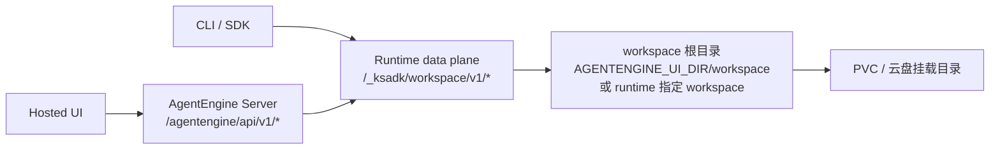

# Agent 通用 Workspace 文件能力 v1 实施说明

## 1. 文档目的

这份文档只描述当前 `workspace-files-v1` worktree 中已经实现并验证过的结果，方便继续 review、联调和后续补 KOP 注册。

结论先行：

- `ksadk-python` 与 `agentengine-server` 已完成 workspace files v1 主链路实现。
- 今天不依赖 KOP 也可以验证两条链路：
  - CLI / SDK 直连 runtime `/_ksadk/workspace/v1/*`
  - Hosted UI / 浏览器同源访问 `agentengine-server` 的 `/agentengine/api/v1/*`
- `OpenClaw` 当前仍保持 `WorkspaceFiles` capability 关闭，不对外宣称可用。
- 上游 `/v1/models` 返回 richer metadata 后，server 侧已经补齐 canonical metadata 归一化，`auto_compact_threshold_percentage` 也已对齐到 ksadk local 口径。

## 2. 当前实现边界

### 2.1 已实现

- 统一 runtime data plane：
  - `GET /_ksadk/workspace/v1/entries`
  - `GET /_ksadk/workspace/v1/files/{path}`
  - `POST /_ksadk/workspace/v1/files/{path}`
  - `DELETE /_ksadk/workspace/v1/files/{path}`
  - `HEAD /_ksadk/workspace/v1/files/{path}`
  - `GET /_ksadk/workspace/v1/healthz`
- Hosted actions：
  - `POST /agentengine/api/v1/ListWorkspaceFiles`
  - `POST /agentengine/api/v1/AddWorkspaceFile`
  - `POST /agentengine/api/v1/DeleteWorkspaceFile`
- `GET /agentengine/api/v1/GetWorkspaceFileContent`
- CLI：
  - `agentengine files list`
  - `agentengine files upload`
  - `agentengine files download`
  - `agentengine files delete`
- CLI 现在支持 workspace 专用默认解析：
  - 支持位置参数 `agent_ref`
  - 自动解析顺序：`.agentengine.state -> agentengine.yaml/ksadk.yaml`
  - 当 `.agentengine.state` 与目标一致时，优先复用其中的 `endpoint` / `api_key` / `region`
- CLI 新增 direct runtime 模式：
  - `--endpoint`
  - `--api-key`
- SDK convenience methods：
  - `list_workspace_files`
  - `upload_workspace_file`
  - `download_workspace_file`
  - `delete_workspace_file`
- Hermes runtime wrapper 已接入统一 contract。
- server 侧 bootstrap 已下发 `WorkspaceFiles` capability。
- `GetAgentUiBootstrap` 已下发以下字段：
  - `Capabilities.WorkspaceFiles`
  - `WorkspaceFiles.Enabled`
  - `WorkspaceFiles.MaxUploadBytes`
  - `WorkspaceFiles.SupportsDelete`
  - `WorkspaceFiles.RootLabel`
  - `WorkspaceFiles.EntryAction`
  - `WorkspaceFiles.UploadAction`
  - `WorkspaceFiles.ContentPath`

### 2.2 当前明确未开放

- `OpenClaw` 对外 capability 仍关闭。
  - 原因不是协议不确定，而是 gateway patch 的预发链路今天还没有完成升级验证。
  - 这样做是为了避免 Hosted UI/CLI 在用户侧提前暴露半成品能力。
- `OpenClaw` 当前预发 state 记录的镜像仍是 `hub-vpc-cn-beijing-6.kce.ksyun.com/agentengine-public/openclaw:2026.4.15`，不是这次 worktree 对应的新镜像。
- Share link 不暴露 workspace 面板，也不开放 workspace files action。
- 今天没有做 KOP 注册，因此不验证任何必须经过 `aicp*` 域名鉴权的外部入口。

## 3. 数据面设计收敛



关键约束：

- 对外暴露的是 workspace 根目录，不是整个 home，也不是整个 state root。
- 文件能力与聊天附件链路分离：
  - 旧附件：`UploadFile` / `AttachmentContent`
- 新 workspace files：`AddWorkspaceFile` / `GetWorkspaceFileContent`
- 浏览器下载统一走二进制 streaming，不走 JSON envelope。

## 4. 两个仓库里的落点

### 4.1 ksadk-python

- runtime 路由实现：
  - [`ksadk/server/workspace_files.py`](/Users/xiayu/kingsoft/code/agent-sdk/ksadk-python/.worktrees/workspace-files-v1/ksadk/server/workspace_files.py)
- 本地 server / Hosted action 对齐：
  - [`ksadk/server/app.py`](/Users/xiayu/kingsoft/code/agent-sdk/ksadk-python/.worktrees/workspace-files-v1/ksadk/server/app.py)
- CLI：
  - [`ksadk/cli/cmd_files.py`](/Users/xiayu/kingsoft/code/agent-sdk/ksadk-python/.worktrees/workspace-files-v1/ksadk/cli/cmd_files.py)
- SDK：
  - [`ksadk/api/client.py`](/Users/xiayu/kingsoft/code/agent-sdk/ksadk-python/.worktrees/workspace-files-v1/ksadk/api/client.py)
- Hermes runtime wrapper：
  - [`deploy/hermes/runtime/app.py`](/Users/xiayu/kingsoft/code/agent-sdk/ksadk-python/.worktrees/workspace-files-v1/deploy/hermes/runtime/app.py)
- 本地模型 metadata 归一化：
  - [`ksadk/conversations/model_context.py`](/Users/xiayu/kingsoft/code/agent-sdk/ksadk-python/.worktrees/workspace-files-v1/ksadk/conversations/model_context.py)

### 4.2 agentengine-server

- bootstrap / capability：
  - [`app/api/v1/actions/chat_actions.py`](/Users/xiayu/kingsoft/code/agent-sdk/agentengine-server/.worktrees/workspace-files-v1/app/api/v1/actions/chat_actions.py)
- Hosted actions：
  - [`app/api/v1/actions/upload_actions.py`](/Users/xiayu/kingsoft/code/agent-sdk/agentengine-server/.worktrees/workspace-files-v1/app/api/v1/actions/upload_actions.py)
- router allowlist / content proxy：
  - [`app/gateway/router_service.py`](/Users/xiayu/kingsoft/code/agent-sdk/agentengine-server/.worktrees/workspace-files-v1/app/gateway/router_service.py)
- server 侧模型 metadata 归一化：
  - [`app/services/model_context.py`](/Users/xiayu/kingsoft/code/agent-sdk/agentengine-server/.worktrees/workspace-files-v1/app/services/model_context.py)

## 5. 这次顺手补齐的模型 metadata 兼容

背景：

- 上游 `/v1/models` 现在不再只返回模型名，还带 `context_length`、`max_completion_tokens`、`architecture`、`pricing` 等字段。
- 如果 server 侧仍然只回最小模型对象，Hosted UI 的上下文指示器就会退化成默认值，无法反映真实上下文预算。

本次已补齐：

- 支持解析 `"200k"`、`"128k"` 这类后缀值。
- 支持将 KSPMAS 风格 `"128"`、`"32"` 兜底视为 kilo-token。
- `normalize_model_metadata()` 现在会稳定产出：
  - `context_window_tokens`
  - `max_output_tokens`
  - `limits.*`
  - `pricing`
  - `auto_compact_threshold_tokens`
  - `auto_compact_threshold_percentage`
- `ListAgentModels` fallback 不再只回 `{id, display_name, source}`，而是返回 canonical metadata。

对上下文管理的直接影响：

- Hosted UI 输入框右下角的上下文百分比不再只依赖默认 200k。
- 自动压缩阈值的显示口径已与本地 ksadk 对齐。
- 当上游模型目录暂时不可用时，fallback 仍然保留合理的上下文预算信息。

## 6. 本地 e2e 验证结果

验证时间：

- 2026-04-19

验证环境：

- runtime: 本地 `uvicorn ksadk.server.app:app`
- workspace 根目录：`/tmp/ksadk-workspace-files-e2e.3VqzyN/.agentengine/ui/workspace`
- CLI：当前 worktree 下的 `python -m ksadk.cli`

### 6.1 runtime 直连健康检查

命令：

```bash
curl -s http://127.0.0.1:18081/_ksadk/workspace/v1/healthz
```

结果：

```json
{"ok":true,"root":"workspace","workspace_path":"/private/tmp/ksadk-workspace-files-e2e.3VqzyN/.agentengine/ui/workspace"}
```

### 6.2 CLI 直连 runtime

列目录：

```bash
PYTHONPATH=/Users/xiayu/kingsoft/code/agent-sdk/ksadk-python/.worktrees/workspace-files-v1 \
python -m ksadk.cli --output json files list \
  --endpoint http://127.0.0.1:18081 \
  --path .
```

结果：

```json
{"root": "workspace", "path": ".", "entries": [{"name": "existing", "path": "existing", "type": "directory", "size_bytes": null, "mime_type": null, "modified_at": "2026-04-19T06:02:30.643936Z"}]}
```

上传：

```bash
PYTHONPATH=/Users/xiayu/kingsoft/code/agent-sdk/ksadk-python/.worktrees/workspace-files-v1 \
python -m ksadk.cli --output json files upload \
  --endpoint http://127.0.0.1:18081 \
  --local-path /tmp/ksadk-workspace-files-e2e.3VqzyN/upload-source.txt \
  --remote-path reports/report.txt
```

结果：

```json
{"entry": {"name": "report.txt", "path": "reports/report.txt", "type": "file", "size_bytes": 22, "mime_type": "text/plain", "modified_at": "2026-04-19T06:04:50.086823Z"}}
```

下载：

```bash
PYTHONPATH=/Users/xiayu/kingsoft/code/agent-sdk/ksadk-python/.worktrees/workspace-files-v1 \
python -m ksadk.cli --output json files download \
  --endpoint http://127.0.0.1:18081 \
  --remote-path reports/report.txt \
  --output-path /tmp/ksadk-workspace-files-e2e.3VqzyN/downloaded-report.txt
```

结果：

```json
{"remote_path": "reports/report.txt", "output_path": "/tmp/ksadk-workspace-files-e2e.3VqzyN/downloaded-report.txt", "size_bytes": 22}
```

删除：

```bash
PYTHONPATH=/Users/xiayu/kingsoft/code/agent-sdk/ksadk-python/.worktrees/workspace-files-v1 \
python -m ksadk.cli --output json files delete \
  --endpoint http://127.0.0.1:18081 \
  --remote-path reports/report.txt \
  --yes
```

结果：

```json
{"deleted": true}
```

### 6.3 Hosted action 同源验证

列目录：

```bash
curl -s -X POST http://127.0.0.1:18081/agentengine/api/v1/ListWorkspaceFiles \
  -H 'Content-Type: application/json' \
  -d '{"AgentId":"demo-agent","Path":"reports","Recursive":false}'
```

结果：

```json
{"Code":0,"Message":"Success","RequestId":"req-343f1e4cd4b6","Data":{"Root":"workspace","Path":"reports","Entries":[{"Name":"report.txt","Path":"reports/report.txt","Type":"file","SizeBytes":22,"MimeType":"text/plain","ModifiedAt":"2026-04-19T06:04:50.086823Z"}]},"Action":"ListWorkspaceFiles"}
```

下载内容：

```bash
curl -s 'http://127.0.0.1:18081/agentengine/api/v1/GetWorkspaceFileContent?AgentId=demo-agent&FilePath=reports/report.txt'
```

结果：

```text
direct upload payload
```

上传：

```bash
curl -s -X POST http://127.0.0.1:18081/agentengine/api/v1/AddWorkspaceFile \
  -F AgentId=demo-agent \
  -F Path=persist/pvc.txt \
  -F file=@/tmp/ksadk-workspace-files-e2e.3VqzyN/persist-source.txt
```

结果：

```json
{"Code":0,"Message":"Success","RequestId":"req-17ff9736d129","Data":{"Entry":{"Name":"pvc.txt","Path":"persist/pvc.txt","Type":"file","SizeBytes":23,"MimeType":"text/plain","ModifiedAt":"2026-04-19T06:05:43.886169Z"}},"Action":"AddWorkspaceFile"}
```

删除：

```bash
curl -s -X POST http://127.0.0.1:18081/agentengine/api/v1/DeleteWorkspaceFile \
  -H 'Content-Type: application/json' \
  -d '{"AgentId":"demo-agent","Path":"existing/hello.txt"}'
```

结果：

```json
{"Code":0,"Message":"Success","RequestId":"req-431b448f1a24","Data":{"Deleted":true},"Action":"DeleteWorkspaceFile"}
```

### 6.4 进程重启后文件仍在

这是对“稳定 workspace 目录不变”场景的本地近似验证，不等价于所有框架在预发都已经支持跨 pod 重建留存。

步骤：

1. 用 Hosted action 上传 `persist/pvc.txt`
2. 停掉本地 `uvicorn`
3. 用相同 `AGENTENGINE_UI_DIR` 重启 server
4. 再次调用 `ListWorkspaceFiles`

重启后结果：

```json
{"Code":0,"Message":"Success","RequestId":"req-3883f716460f","Data":{"Root":"workspace","Path":"persist","Entries":[{"Name":"pvc.txt","Path":"persist/pvc.txt","Type":"file","SizeBytes":23,"MimeType":"text/plain","ModifiedAt":"2026-04-19T06:05:43.886169Z"}]},"Action":"ListWorkspaceFiles"}
```

结论：

- 文件确实落在稳定目录。
- server 进程重启不会丢文件。
- 这只能说明 workspace files contract 本身兼容持久目录。
- 当前产品口径下，“跨 pod 重建后文件仍在”只以 `OpenClaw` 为准；`Hermes` 暂不把这项作为本次验收前提。

## 7. Hermes 预发验证结果

验证时间：

- 2026-04-20

预发对象：

- Agent ID: `ar-20260416185959-8414dac9`
- 新镜像：`hub.kce.ksyun.com/agentengine-public/hermes-agent:2026.4.20-workspace-files-v1.1`
- Digest: `sha256:a559e4da96dd246a816a5796246348e9b0a31c372f275a21cde3c4276ab03c42`

### 7.1 首次预发失败与修复

第一次把 `workspace-files-v1` 镜像推到预发后，Hermes runtime pod 启动失败。

算力集群日志根因：

```text
ModuleNotFoundError: No module named 'ksadk'
```

原因：

- [`deploy/hermes/runtime/app.py`](/Users/xiayu/kingsoft/code/agent-sdk/ksadk-python/.worktrees/workspace-files-v1/deploy/hermes/runtime/app.py) 当时直接 import `ksadk.server.workspace_files`
- 但 Hermes 镜像构建上下文是 `deploy/hermes/`，容器内并没有完整 `ksadk` 包

修复：

- 在 [`deploy/hermes/runtime/workspace_files.py`](/Users/xiayu/kingsoft/code/agent-sdk/ksadk-python/.worktrees/workspace-files-v1/deploy/hermes/runtime/workspace_files.py) 内置 runtime-local workspace files 模块
- Hermes runtime 改为从本地 runtime 目录 import
- 新增隔离导入回归测试，防止“本地 repo 可 import、容器内不可 import”再次发生

### 7.2 2026-04-20 复测结果

公网域名复测：

- 直接使用 `.agentengine.state` 中的公网 endpoint：
  - `http://ar-20260416185959-8414dac9.agent-pre.kspmas.ksyun.com`
- 执行：

```bash
PYTHONPATH=/Users/xiayu/kingsoft/code/agent-sdk/ksadk-python/.worktrees/workspace-files-v1 \
python -m ksadk.cli --output json files list --path .
```

- 当前返回：

```json
{"ok":false,"error":{"code":"remote_error","message":"服务端暂时不可用 (Code: 502)。","details":{"server_code":502}},"hints":["请稍后重试；若持续失败请联系平台侧排查。","运行 `agentengine --help` 查看参数说明。"]}
```

结论：

- 当前 Hermes 预发公网入口不适合作为稳定 e2e 通道。
- 这个现象不等于 runtime data plane 不可用。

改用算力集群 service 直连复测：

```bash
kubectl --kubeconfig /Users/xiayu/.kube/config-2fc1210d-eb1f-4688-94a9-4cb38163f3f8 \
  -n ar-20260416185959-8414dac9 \
  port-forward service/ar-20260416185959-8414dac9-service 18081:80
```

健康检查：

```bash
curl -s http://127.0.0.1:18081/_ksadk/workspace/v1/healthz
```

结果：

```json
{"ok":true,"root":"workspace","workspace_path":"/home/node/.hermes/workspace"}
```

CLI 直连 runtime：

- `files list --endpoint http://127.0.0.1:18081 --api-key <state_api_key> --path .` 返回空目录
- `files upload --remote-path reports/hermes-workspace-e2e.txt` 成功
- `files list --path reports` 返回 `reports/hermes-workspace-e2e.txt`
- `files download --remote-path reports/hermes-workspace-e2e.txt` 成功，下载内容为 `workspace-files-v1 hermes e2e`
- `files delete --remote-path reports/hermes-workspace-e2e.txt --yes` 成功
- 删除后再次 `files list --path reports` 返回空目录

结论：

- 代码与本地真实链路已经可用。
- Hermes 预发 runtime data plane 通过集群 service 直连验证可用。
- 这次 Hermes 验证只覆盖文件接口主链路，不把跨 pod 重建留存作为阻塞项。

## 8. OpenClaw 预发现状

验证时间：

- 2026-04-20

预发对象：

- Agent ID: `ar-20260407235034-e1017eee`
- 当前 state 中的镜像：`hub-vpc-cn-beijing-6.kce.ksyun.com/agentengine-public/openclaw:2026.4.15`
- PVC 挂载目录：`/home/node/.openclaw`

已确认事实：

- `OpenClaw` 的 PVC 持久化已经实测成立。
  - 在旧 pod 内写入 `/home/node/.openclaw/workspace/ae-persist-check.txt`
  - 删除 pod 后，新 pod 可读回同一文件
- 直接使用 `.agentengine.state` 中的公网 endpoint 执行 `agentengine files list --path .`，当前返回的是鉴权失败。
- 改用算力集群 service 直连：

```bash
kubectl --kubeconfig /Users/xiayu/.kube/config-2fc1210d-eb1f-4688-94a9-4cb38163f3f8 \
  -n ar-20260407235034-e1017eee \
  port-forward service/ar-20260407235034-e1017eee-service 18082:80
```

- 然后访问：

```bash
curl -i -s http://127.0.0.1:18082/_ksadk/workspace/v1/healthz
```

- 当前返回的是 OpenClaw Control HTML，而不是 workspace JSON。
- 同样地，执行：

```bash
PYTHONPATH=/Users/xiayu/kingsoft/code/agent-sdk/ksadk-python/.worktrees/workspace-files-v1 \
python -m ksadk.cli --output json files list --endpoint http://127.0.0.1:18082 --path .
```

- 当前返回：

```json
{"ok":false,"error":{"code":"validation_error","message":"Expecting value: line 1 column 1 (char 0)","details":{}},"hints":[]}
```

结论：

- 现在能确认的是 PVC 没问题。
- 现在还不能确认的是 OpenClaw workspace helper / gateway patch 已经在预发 runtime 中生效。
- 因此 `Capabilities.WorkspaceFiles` 对 OpenClaw 继续保持关闭是正确行为。
- 下一步不是改 contract，而是把当前 worktree 对应的 OpenClaw 镜像构建、推送、升级到预发，再重新验证 `/_ksadk/workspace/v1/healthz` 是否返回 JSON。

## 9. 待注册 KOP 接口

明天补 KOP 时，需要注册的 Hosted action 接口是：

- `POST /agentengine/api/v1/ListWorkspaceFiles`
- `POST /agentengine/api/v1/AddWorkspaceFile`
- `POST /agentengine/api/v1/DeleteWorkspaceFile`
- `GET /agentengine/api/v1/GetWorkspaceFileContent`

命名说明：

- 下载接口最终统一为 `GetWorkspaceFileContent`
- 不再使用 `WorkspaceFileContent`
- 这样能与现有 `Get*` 风格 action 命名保持一致

## 10. 当前剩余事项

- `OpenClaw` capability 仍保持关闭，尚未做预发升级验收。
- Hosted UI 的 share link 不显示 workspace 面板，代码与测试已覆盖，但今天没有额外做浏览器侧人工回归。
- KOP 注册还没做，因此今天没有验证任何必须经过 `aicp*` 域名鉴权的外部入口。

## 11. 明天补 KOP 后优先做什么

建议顺序：

1. 注册新的 Hosted action 接口。
2. 补做 Hosted UI / share link 的浏览器侧人工回归。
3. 部署并验证 `OpenClaw` gateway patch 是否稳定承接 `/_ksadk/workspace/v1/*`。
4. 完成 `OpenClaw` 预发验收后，再打开 `WorkspaceFiles` capability。

## 12. review 时最值得盯的点

- `OpenClaw` capability 现在是有意关闭，不是漏实现。
- `agentengine files --endpoint` 与 `.agentengine.state` 自动解析，是今天不依赖 KOP 做 e2e 的关键入口。
- `ListAgentModels` fallback 现在已经带 canonical metadata，Hosted UI 的上下文指示器不再只靠默认值。
- Hermes 预发当前是“公网入口不稳定，但集群 service 直连可用”，不要把这两层混为一谈。
- OpenClaw 预发当前卡的是 runtime helper / gateway patch 生效，不是 PVC 持久化。
- 这次补到的 Hermes 导入回归测试很关键：它覆盖的是“容器构建上下文”和“本地 repo import 能力”不一致这一类问题。
