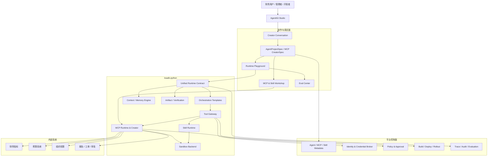
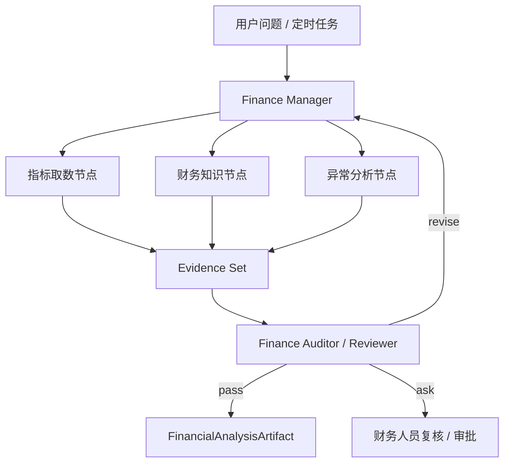

# 内部财务管理 Agent、Studio 与 MCP 创造模式技术方案

> 文档状态：一期实施方案草案  
> 适用范围：`ksadk-python`、`ksadk-web`、AgentEngine 控制面、MCP/Skill 管理面  
> 一期岗位应用：内部财务管理 Agent  
> 一期默认运行方式：KsADK Managed Runtime + LangGraph 编排 + MCP/Skill  
> 核心约束：默认只读、数据可追溯、计算可复算、结论可复核、高风险动作必须审批

## 1. 执行摘要

一期不先做一个大而全的通用 Agent 画布，而是通过 Studio 统一入口交付一个可真实使用的内部财务管理 Agent，再从该闭环抽象通用平台能力。

用户最终感知的产品是：

> 在 Studio 中用自然语言询问经营数据、分析预算和实际偏差、发现异常、生成可追溯财务报告；当内部系统尚未提供 MCP 时，Studio 可以通过对话引导用户导入 OpenAPI、SDK、代码库或接口文档，生成、测试和审查 MCP 发布候选。

总体技术决策如下：

1. Studio 对普通用户只呈现一种官方托管 Runtime，不让财务用户选择 Codex、ADK 或 LangGraph。
2. KsADK 自研统一 Runtime Contract、Context/Memory、Tool Gateway、Artifact、Approval 和 Adapter 体系；一期使用 LangGraph 作为官方编排引擎，不从零自研图执行器。
3. Codex 主要用于 MCP/Skill Creator 中的代码生成、修复和测试，不是财务 Agent 在线服务的默认 Runner。
4. ADK、用户自有 LangGraph、DeepAgents 等继续通过 `RuntimeAdapter` 兼容导入，但不承诺与官方 Managed Runtime 完全等价。
5. MCP 同时支持直接绑定已有服务、自然语言引导创建、导入开发者已有项目三种路径。
6. 一期代码不全部放在 `ksadk-python`：运行时、SDK、Creator 核心和本地 Studio API 放在 `ksadk-python`；前端源码放在 `ksadk-web`；注册、凭证、审批、发布和 Pod 生命周期放在控制面。

## 2. 背景与设计依据

### 2.1 业务背景

内部财务管理同时具备以下特征：

- 数据分散在财务指标平台、预算系统、数仓、ERP、报销、采购、合同、组织权限和协作系统中。
- 同一个指标可能存在多种口径、会计期间、币种、预算版本和组织范围。
- 用户身份、组织范围、行列权限和数据敏感级别不能由模型自行判断。
- 分析结论必须绑定指标口径、数据时间和证据，关键计算必须可被确定性程序复算。
- 报告、导出、审批和任何生产写操作都需要可审计。

因此，一期产品不定位为“自然语言转 SQL”，而定位为“可信财务分析与管理入口”。

### 2.2 开源 Runtime 参考的吸收原则

本方案参考但不直接拼接以下机制：

| 参考方向 | 吸收的机制 | 在 KsADK 中的落位 |
|---|---|---|
| OpenClaw | 稳定 Prompt 与动态 Context 分离、Skill 渐进披露、压缩前整理 | `ksadk.context_engine`、`ksadk.skills` |
| Hermes | Working Context、Session、Memory、Skill 分层，可替换 Context Engine | `ContextEngine` 合同与 Adapter 投影 |
| Letta/MemGPT | 有名称、大小限制和写权限的 Core Memory Block | `MemoryBlockSpec` 与常驻预算 |
| OpenHands | Skill 描述先暴露、正文按需加载 | Skill manifest 与 on-demand loader |
| LangGraph | Thread scoped state、namespace scoped Store、interrupt/checkpoint | 官方 Managed Runtime 编排引擎 |
| Mem0 | Memory extract/deduplicate/conflict/add/update/delete | `ksadk.memory` 写入治理管线 |
| Claude Code/claw-code | Prompt Builder、缓存边界、Working Notes、Parity Test | Prompt compiler、cache 观测、Runner conformance |
| 托管 Agent 平台 | Managed Agent、Hosted Project、BYO Runtime 分级接管 | Studio 三档产品入口 |

开源实现用来验证机制、补充测试用例和复用协议库；KsADK 仍需保持自己的 Runtime、Context、Memory、Artifact、Approval 和安全合同。

### 2.3 多 Agent 参考的落地结论

长任务应采用“Manager - Executor - Auditor”循环：

- Manager 维护原始目标、任务状态、预算和下一个有界子任务，但默认不直接修改环境。
- Executor 只获得当前 `SubtaskContract`、必要的已验证事实、角色工具和本轮预算。
- Auditor 使用独立上下文和只读工具检查真实环境，不直接信任 Executor 的完成声明。
- 只有 Audit 支持的事实才进入持久 `TaskState`。
- Human Approver 是 Runtime 外部控制节点，不伪装成另一个 Agent。

## 3. 建设目标与非目标

### 3.1 一期目标

1. Studio 成为内部财务问答、分析、报告和复核的统一入口。
2. 打通“用户问题 - 权限校验 - 计划 - 取数 - 分析 - 独立复核 - Artifact - 人工闭环”。
3. 支持财务指标、预算、组织权限和报告/审批四类 MCP 能力。
4. 支持直接绑定、对话引导创建、导入已有 MCP 项目三种路径。
5. 交付一套官方 `ManageExecuteAudit` 编排模板和财务领域角色模板。
6. 所有财务分析输出均为可验证的结构化 Artifact，不只是聊天文本。
7. 建立历史 Case 回放、确定性计算复算、权限越界检查和版本对比。

### 3.2 一期非目标

- 不允许 Agent 自主记账、付款、调整预算、关闭会计期间或修改生产财务数据。
- 不建设任意拖拽拓扑和任意用户代码执行平台。
- 不同时产品化 LangGraph、ADK、Codex 三套等价财务模板。
- 不把 Skill Registry、MCP Registry、生产凭证、管理员审批和 Pod 生命周期搬入 SDK。
- 不承诺仅凭口头业务描述即可无人参与地生成复杂内部系统生产 MCP。
- 不以全量数据库 Schema 或任意 SQL 作为普通财务用户的默认工具面。

## 4. 产品形态

### 4.1 Studio 三种入口

#### Managed Agent

面向财务用户和普通开发者：

- 使用官方财务 Agent 模板。
- 平台接管 Prompt、Context、Memory、Agent Loop、Tool、Skill、Checkpoint 和 Eval。
- 默认 LangGraph 编排，用户无需感知。

#### Hosted Project

面向已有 ADK、LangGraph、LangChain 或 DeepAgents 项目：

- 用户提供源码、依赖或容器构建输入。
- KsADK 保留外层 Session、Identity、Tool Gateway、Artifact、Trace 和部署合同。
- Context ownership 和 Checkpoint 能力按 Adapter 诚实声明。

#### BYO Runtime

面向自研 Harness 或特殊安全环境：

- 用户提供完整容器和协议端点。
- 平台只接管身份、路由、资源、观测和与平台服务的绑定。
- 不伪装具备 Managed Agent 的全部调试和 Context 可见性。

### 4.2 财务 Agent 用户体验

Studio 一期提供以下主工作区：

1. **财务 Agent 首页**：对话入口、常用分析模板、最近报告、待复核项、数据新鲜度和用户权限范围。
2. **分析工作区**：对话、当前分析计划、Agent 执行状态、指标/图表、证据、结论和 Reviewer 状态。
3. **数据与能力**：数据源、MCP Server、Tool Schema、指标目录、用户身份模式和连接健康状态。
4. **MCP/Skill Workshop**：已有 MCP 绑定、对话引导创建、项目导入、Tool 合同编辑、Sandbox 测试和发布候选。
5. **Runtime Playground**：同时展示用户回答、多 Agent 编排状态、工具调用、审批、Artifact、Trace 和 Checkpoint。
6. **Eval Center**：历史 Case、标准事实、指标复算、权限越界、版本对比和发布门禁。
7. **Release/Operations**：版本 Diff、权限变化、新增域名、测试报告、审批、灰度、回滚和运行指标。

### 4.3 Creator 对话与结构化草稿联动

Creator 不应只返回文本，而是在对话时持续更新右侧结构化草稿：

```text
左侧：Creator 对话       右侧：可审查草稿
                           AgentProjectSpec
                           RoleSpec[]
                           MCP/Skill Binding
                           OrchestrationSpec
                           SecurityPolicy
                           Eval Cases
                           变更 Diff
```

每个字段保留 provenance：

- `user_provided`：用户明确提供。
- `imported`：从 OpenAPI、SDK、代码或文档导入。
- `inferred`：模型推断，必须复核。
- `verified`：被确定性检查或人工确认。
- `stale`：源发生变化后待重新验证。

## 5. 总体技术架构



### 5.1 稳定平台合同

Studio 不保存 LangGraph 内部 node JSON，KsADK 也不依赖 Studio UI 对象。双方共享版本化语义合同：

```text
AgentProjectSpec
├── AgentSpec
├── RoleSpec[]
├── ToolBinding[]
├── SkillBinding[]
├── OrchestrationSpec
├── ContextSpec
├── MemorySpec
├── SecurityPolicy
├── ArtifactSpec[]
├── EvalSuiteRef
└── ReleaseSpec
```

ProjectSpec 必须可导出至 Git，支持 diff、review、CI 和无 Studio 执行。

## 6. Runtime 与 Runner 策略

### 6.1 三层模型

| 层 | 责任 | 一期选择 |
|---|---|---|
| KsADK Runtime Contract | Session、Run、Stream、Cancel、Resume、Checkpoint、Approval、Artifact、Trace | 自研并继续收敛 |
| Orchestration Engine | 状态图、多 Agent、中断、恢复、重试 | LangGraph |
| Agent Harness/Backend | 模型与工具循环、代码执行、用户框架 | Managed Agent、Codex Creator、ADK/已有项目 Adapter |

### 6.2 分级支持

| 级别 | Runtime | 承诺 |
|---|---|---|
| Tier 1 | `ManagedLangGraphRuntimeAdapter` | 官方财务模板、完整 checkpoint/resume、approval、artifact、multi-agent、trace、eval |
| Tier 2 | ADK、普通 LangGraph、LangChain、DeepAgents | 导入与运行，按 capability matrix 声明差异 |
| Tier 3 | Codex、Hermes、OpenClaw | Creator、代码工程、特殊长任务或岗位应用 |
| Tier 4 | Custom Runtime | 通过 `RuntimeAdapter` 和 capability negotiation 接入 |

#### 一期实施边界

多 Runner 分级接管在架构上有必要，但一期只实施“一主多兼容”：

- **唯一官方生产路径**：Managed LangGraph Runtime，负责财务 Agent 模板和完整验收。
- **已有 Adapter 保持可用**：ADK、用户自有 LangGraph、Codex 等只做导入、基础运行和回归，不补齐财务模板、Context 可见性和 checkpoint 语义。
- **只冻结分级合同**：Runtime capability、ownership 和 Studio 产品入口必须定义清楚，但不做跨 Runner 自动迁移或无损切换。
- **Codex 只服务 Creator**：一期用于 MCP 代码生成和修复，不作为第二套财务在线 Runtime。

这样保留长期开放性，同时避免一期同时承担多套事件、中断、恢复、Memory 和调试语义的产品化成本。

Studio 普通流程不展示框架选择，只显示：

```text
● AgentEngine 托管 Runtime（推荐）
○ 导入已有 Agent 项目
○ 自定义 Runtime
```

### 6.3 Runtime Capability

每个 Adapter 必须返回真实 capability：

```yaml
capabilities:
  streaming: true
  checkpoint:
    supported: true
    granularity: snapshot
    durable: true
    sharedAcrossPods: true
  resume: true
  approval: true
  multiAgent: true
  artifacts: true
  contextVisibility: exact
  sandbox: true
```

不支持的能力由 Studio 禁用相关交互，不静默降级。

## 7. 财务多 Agent 设计

### 7.0 一期实施范围

多 Agent 编排应与财务 Agent 一起实施，因为“执行者不自证完成”是财务可信性的核心要求；但一期不做通用多 Agent 平台。

一期只交付一个固定的最小拓扑：

```text
Finance Manager
      -> Finance Analysis Executor
      -> Finance Reviewer
      -> pass / revise / ask / blocked
```

- Manager 负责目标、计划、状态和最终说明。
- Analysis Executor 在单独上下文中调用指标、预算、知识和确定性计算工具。
- Reviewer 在独立只读上下文中复算和验证。
- 指标取数、知识检索、异常计算可以作为 Executor 内的确定性节点或并行工具任务，不必在一期全部实体化为独立 LLM Agent。

一期不实施：

- 自由拖拽多 Agent 画布。
- 运行时动态创建任意角色。
- Agent-to-Agent 自由协商和无中心收敛。
- 多 Manager、投票委员会和树搜索。
- 跨 Runner 的同一编排模板无损编译。

待最小模板在财务 Case 上证明 Reviewer 能显著降低计算、口径或证据错误后，再把数据取数、知识和异常分析拆成可选的专业 Executor。

### 7.1 一期角色拓扑



#### Finance Manager

- 识别问题、组织范围、期间、币种和对比基准。
- 维护 `TaskState`、证据缺口、预算和下一个 `SubtaskContract`。
- 组织只读 Executor 并行取证，统一形成最终结论。
- 默认无任意 SQL、文件修改和生产写工具。

#### 指标取数节点（一期并入 Analysis Executor）

- 只调用受控财务 Metric Query 和预算工具。
- 返回指标值、口径、时间、币种、预算版本、数据新鲜度和来源。
- 不给出最终经营归因。

#### 财务知识节点（一期并入 Analysis Executor）

- 解释指标定义、会计期间、组织关系、成本中心、预算规则和公司财务制度。
- 知识必须带来源、版本和有效期。
- 不伪造实时经营数据。

#### 异常分析节点（一期并入 Analysis Executor）

- 调用确定性计算工具完成同比、环比、预算偏差、贡献度和趋势拆解。
- 输出候选原因、证据强度和需要继续查询的缺口。
- 不用 LLM 自行心算关键财务结果。

#### Finance Reviewer

- 使用独立 Context 和只读工具。
- 检查组织权限、期间、币种、单位、口径、明细与合计、计算、来源和证据。
- 对分析结果返回 `pass/revise/blocked/ask`。
- 默认不直接修改 Executor 产物。

### 7.2 任务状态合同

```yaml
taskId: finance-analysis-001
goal: 分析某部门本月费用超预算原因
status: running

requirements:
  - id: R1
    description: 确认用户有权查看目标部门
    status: verified
    evidenceRefs: [audit-001]
  - id: R2
    description: 比较实际与当前有效预算版本
    status: pending

facts:
  - id: F1
    name: accounting_period
    value: "2026-07"
    trust: verified
    evidenceRefs: [user-input-001]

artifacts: []
unresolved: []
```

状态枚举：`pending/in_progress/claimed/verified/rejected/blocked/untrusted`。`claimed` 表示 Executor 声称完成但未复核。

### 7.3 子任务合同

```yaml
contractId: contract-007
objective: 查询目标部门当期预算与实际费用
acceptanceCriteria:
  - 使用当前有效预算版本
  - 预算与实际使用同一币种和金额单位
  - 返回数据截止时间和来源
constraints:
  organizationScope: current_user
  sideEffect: read
  forbiddenActions:
    - raw_sql
    - export_detail
tools:
  - finance.query_metrics
  - budget.query_budget
budget:
  maxTurns: 8
  timeoutSeconds: 120
requiredEvidence:
  - metric_result
  - budget_version
  - data_freshness
```

## 8. Context 与 Memory 设计

### 8.1 Context 分层

```text
Stable Prompt
  平台安全规则、角色责任、输出合同

Session State
  当前会话、用户问题、已确认参数

Working Context
  当前 TaskState、SubtaskContract、证据缺口、Artifact 引用

Core Memory Blocks
  少量用户偏好、组织上下文引用；有名称、预算和写权限

Retrieved Memory / Knowledge
  按需召回的历史已验证 Case、财务制度、指标口径

Skill Disclosure
  常驻描述，按需加载 SKILL.md、references 和 scripts
```

### 8.2 压缩前整理

触发 compaction 前必须先执行：

1. 持久已验证事实及 evidence refs。
2. 持久 pending/blocked 需求和下一步。
3. 持久 Artifact URI、hash 和验证状态。
4. 将候选 Memory 进入去重、冲突和权限检查，不直接写入。
5. 生成压缩后必须重注入的 `WorkingStateSnapshot`。

### 8.3 财务 Memory 治理

| Memory 类型 | 写入策略 |
|---|---|
| 用户报告格式偏好 | 可候选自动写入，用户可删除 |
| 组织、指标口径 | 只读知识源，不由对话更新 |
| 已验证业务事实 | 必须带 provenance、scope 和 TTL |
| 模型推断 | 默认不进入长期 Memory |
| 财务明细和个人敏感数据 | 默认不持久，或使用严格用户/组织 scope |

Memory 写入管线：

```text
Candidate
  -> Extract
  -> Normalize
  -> Deduplicate
  -> Conflict Check
  -> Policy Check
  -> Approve/Auto-approve
  -> add/update/delete
  -> Audit
```

## 9. MCP 能力与创造模式

### 9.1 三种接入路径

#### 直接绑定已有 MCP

Studio 执行：

- `initialize` 和 `tools/list`。
- Schema snapshot 和版本 diff。
- OAuth/凭证引用配置。
- Tool 读写、幂等、开放世界和风险分类。
- 连接、调用、安全和权限检查。
- 生成与 Agent/Role 的绑定候选。

#### 自然语言引导创建

```text
业务目标
 -> 接口事实源
 -> 候选 Tool 发现
 -> Tool Contract 设计
 -> 身份与权限确认
 -> 脚手架生成
 -> Sandbox 测试
 -> 独立审查
 -> 用户试用
 -> 发布候选
 -> 人工审批与绑定
```

自然语言用于理解意图、澄清口径和生成候选，不能替代真实接口源。至少需要 OpenAPI、curl、SDK、接口文档、代码库或受控数据库视图之一。

#### 导入已有开发者项目

支持 FastMCP、Git 代码库、本地项目和已有容器构建输入。Studio 不重写业务代码，仍统一完成探测、合同、安全、测试、打包和发布审查。

### 9.2 MCP Creator 中间合同

```yaml
apiVersion: agentengine.ksyun.com/v1alpha1
kind: MCPCreatorSpec
metadata:
  name: internal-budget

source:
  type: openapi
  uriRef: workspace://sources/budget-openapi.yaml
  digest: sha256:placeholder

server:
  runtime: python
  transport: streamable_http

tools:
  - name: query_department_budget
    businessIntent: 查询用户授权范围内的部门预算
    sourceOperation: getDepartmentBudget
    inputSchemaRef: schemas/query-department-budget-input.json
    outputSchemaRef: schemas/query-department-budget-output.json
    annotations:
      sideEffect: read
      idempotent: true
      openWorld: false
    security:
      identityMode: delegated_user
      organizationScopeRequired: true
      riskLevel: low

auth:
  type: oauth2
  credentialRef: credential://budget-user-delegation
  scopes: []

network:
  allowedHosts:
    - budget-api.example.internal

verification:
  contractCases:
    - tests/contracts/query_department_budget.yaml
  securityProfile: finance-readonly
```

### 9.3 生成后端与开源复用

一期建议：

- 协议层直接使用 [MCP Python SDK](https://github.com/modelcontextprotocol/python-sdk)，不 fork 协议栈。
- Python 生成后端使用 [FastMCP](https://gofastmcp.com/tutorials/rest-api)，但由 KsADK MCP IR 控制 Tool 选择和增强，不直接全量一比一暴露 OpenAPI endpoints。
- 协议测试复用 [MCP Inspector](https://github.com/modelcontextprotocol/inspector) CLI。
- Registry metadata 尽量兼容 [MCP Registry](https://github.com/modelcontextprotocol/registry) Server Definition，内部扩展 owner、data classification、space、credential policy 和 verification report。
- 容器隔离、Kubernetes Runtime、Registry 与 Gateway 可参考 [ToolHive](https://github.com/stacklok/toolhive)。
- federation、REST/gRPC adapter、identity propagation、rate limit、OTel 和 SSRF 可参考 [ContextForge](https://github.com/IBM/mcp-context-forge)。
- 安全扫描可将 [Snyk Agent Scan](https://github.com/snyk/agent-scan) 作为外部 scanner plugin，同时保留平台确定性检查。

不同时引入 ToolHive、ContextForge 和现有平台三套完整管理面；先做能力对比和小型 PoC，再决定复用组件还是只吸收设计。

### 9.4 MCP 验证管线

```text
Source validation
 -> OpenAPI/Schema repair report
 -> dependency lock
 -> import/lint/type check
 -> start server in sandbox
 -> initialize
 -> tools/list schema snapshot
 -> contract calls
 -> negative/boundary tests
 -> auth and organization-scope tests
 -> secret scan
 -> network/SSRF policy tests
 -> tool-description poisoning scan
 -> permission diff
 -> package/SBOM/provenance
 -> VerificationReport
```

必测攻击和错误类型：

- Tool 名称冲突和 shadowing。
- Tool description prompt injection/poisoning。
- Tool Schema 边界值、额外参数和组织 ID 越权。
- Tool 结果中的 prompt injection。
- 版本更新后的 rug pull/schema drift。
- Token audience 错误和 token passthrough。
- localhost、云 metadata、内网段与 DNS rebinding/SSRF。
- shell、路径、文件、依赖与容器供应链风险。

## 10. 财务 MCP 与 Skill 一期清单

### 10.1 财务指标 MCP

```text
get_metric_definition
query_financial_metrics
compare_periods
break_down_variance
get_data_freshness
list_available_dimensions
```

### 10.2 预算 MCP

```text
get_budget_version
query_budget
compare_actual_vs_budget
get_budget_owner
list_over_budget_items
```

### 10.3 组织与权限 MCP

```text
get_user_finance_scope
get_organization_tree
get_cost_center
resolve_department
check_data_access
```

### 10.4 报告与协作 MCP

```text
create_financial_report_draft
create_review_task
send_report_for_approval
get_review_status
```

一期只允许创建草稿和审批任务，不直接执行不可逆财务动作。

### 10.5 财务 Skill

- `monthly-business-review`：月度经营分析。
- `budget-variance-analysis`：预算执行偏差分析。
- `gross-margin-analysis`：毛利变化归因。
- `expense-anomaly-review`：费用异常检查。
- `cash-flow-analysis`：现金流分析。
- `receivables-aging-review`：应收账龄分析。
- `financial-report-generation`：结构化财务报告生成。

Skill 描述“如何完成一类财务任务”，MCP 提供“访问内部系统的稳定原子能力”。Skill 中不应重复实现内部 HTTP 认证和接口调用。

## 11. 财务语义查询层

普通用户默认不直接生成 SQL，而是生成语义查询：

```yaml
kind: FinancialMetricQuery
metrics:
  - revenue
  - gross_profit
  - gross_margin
dimensions:
  - department
  - product_line
filters:
  accountingPeriod: "2026-07"
comparison:
  - previous_month
  - budget
  - year_over_year
currency: CNY
dataScope:
  organizationIds:
    - organization-from-user-identity
```

受控 Query Service 负责：

- 指标口径和维度合法性。
- 用户身份与组织 scope。
- 行列级权限。
- 期间、币种、单位和预算版本。
- 查询复杂度、行数、超时和数据新鲜度。
- 明细导出和敏感字段脱敏。

必须支持 SQL 时，只允许授权视图，并在 Tool Gateway 之前执行 parser、只读校验、表/函数白名单、计划估算、行数和超时限制。

## 12. Identity、Credential 与安全

### 12.1 身份模式

| 模式 | 用途 | 一期策略 |
|---|---|---|
| Delegated User | 按当前员工身份访问财务数据 | 优先 |
| Agent Service Identity | 定时报告、任务收件箱 | 限定用途和 scope |
| Creator Test Identity | MCP 创建期测试 | 只测试环境 |
| Production Binding | 发布后真实环境 | 独立审批，不继承创建期凭证 |

### 12.2 凭证规则

- Secret 不进入对话、Prompt、AgentSpec、Skill 包、MCP 源码、RuntimeEvent 和测试 snapshot。
- AgentSpec 和 Bundle 只保存 `credentialRef`。
- MCP Client token 必须绑定目标 resource/audience。
- MCP Server 不得将客户端传入 token 原样透传至下游 API；下游访问使用独立 token exchange 或服务凭证。
- 敏感凭证配置使用外部安全授权页，不在普通对话表单中收集。

### 12.3 Tool Gateway 执行链

```text
Tool Call
 -> Resolve caller identity
 -> Resolve role policy
 -> Resolve MCP/tool version
 -> Validate input schema
 -> Validate organization/data scope
 -> Risk classification
 -> Approval when required
 -> Rate/concurrency/timeout checks
 -> Invoke MCP
 -> Validate output schema
 -> Redact sensitive fields
 -> Persist receipt and audit
 -> Return structured result
```

### 12.4 财务风险级别

| 等级 | 例子 | 一期策略 |
|---|---|---|
| Low | 授权范围内指标汇总查询 | 可自动执行 |
| Medium | 查询敏感明细、导出、生成对外草稿 | 显式用户确认或策略审批 |
| High | 创建审批、绑定生产凭证、发布 MCP/Skill | 必须外部审批 |
| Forbidden in Phase 1 | 付款、记账、调整预算、删除财务数据 | 拒绝 |

## 13. Artifact 与验证

### 13.1 FinancialAnalysisArtifact

```yaml
apiVersion: agentengine.ksyun.com/v1alpha1
kind: FinancialAnalysisArtifact
metadata:
  id: artifact-001
  producerRole: finance-manager
  verificationStatus: passed_with_notes

question: 为什么本月毛利率下降
asOf: "2026-07-31"
currency: CNY
scope:
  organization: organization-placeholder
  accountingPeriod: "2026-07"

summary:
  conclusion: 产品结构变化和物流成本上升是主要候选因素
  confidence: medium

metrics:
  currentGrossMargin: 21.3
  previousGrossMargin: 24.1
  budgetGrossMargin: 23.8

drivers:
  - factor: product_mix
    contributionPp: -1.6
    evidenceRefs: [evidence-001]

uncertainties:
  - 部分渠道返利尚未结算

sources:
  - name: finance-metric-view
    freshness: "2026-08-01T03:00:00Z"
    queryReceiptRef: tool-receipt-001

review:
  status: passed_with_notes
  findings: []
```

### 13.2 Artifact 通用字段

- `type/schemaVersion`。
- `digest`。
- `producerRole/producerRun`。
- `provenance`。
- `verificationStatus/auditRefs`。
- `sensitivity/dataScopes`。
- `uri/mime/size`。
- `version/previousVersion`。
- `retentionPolicy`。

## 14. API 与事件合同

### 14.1 Studio 一期 API 域

```text
/api/v1/finance/agents
/api/v1/finance/analysis-runs
/api/v1/finance/artifacts
/api/v1/finance/reviews

/api/v1/mcp/connections
/api/v1/mcp/creator-projects
/api/v1/mcp/creator-projects/{id}/sources
/api/v1/mcp/creator-projects/{id}/contracts
/api/v1/mcp/creator-projects/{id}/builds
/api/v1/mcp/creator-projects/{id}/verifications
/api/v1/mcp/creator-projects/{id}/publish-candidates

/api/v1/skills
/api/v1/evaluations
/api/v1/releases
```

本地 Studio API 可以以此作为应用合同；云端 API 由控制面给出真实协议并与 SDK model 对齐。

### 14.2 Creator 状态机

```text
draft
 -> discovering
 -> contract_review
 -> generating
 -> verifying
 -> user_acceptance
 -> security_review
 -> publish_candidate
 -> approved
 -> published

failure/revision:
discovering/generating/verifying -> needs_input | revise | blocked
```

### 14.3 RuntimeEvent 扩展

优先复用现有统一 RuntimeEvent，通过 additive event type 支持：

```text
orchestration.task.updated
orchestration.contract.created
orchestration.execution.completed
orchestration.audit.completed
context.plan.created
memory.candidate.created
mcp.inspection.completed
mcp.verification.completed
artifact.created/updated
approval.requested/resolved
```

每个事件必须具有 tenant/user/agent/session/invocation/seq 归属和脱敏后 payload。

## 15. 代码仓库与模块边界

### 15.1 明确结论

**可以从 `ksadk-python` 开始开发，但不能将全部产品和管理面都放进该仓库。**

`ksadk-python` 负责可本地运行、可嵌入、可与框架集成的 SDK/Runtime/Creator 核心；`ksadk-web` 是 Studio 共享前端源码事实源；云端控制面和各专项 Service 保持注册、治理和生产生命周期。

### 15.2 `ksadk-python`

建议新增/收敛：

```text
ksadk/
├── orchestration/
│   ├── models.py
│   ├── roles.py
│   ├── policies.py
│   ├── coordinator.py
│   ├── templates/
│   │   ├── supervisor.py
│   │   ├── parallel_evidence.py
│   │   ├── manage_execute_audit.py
│   │   └── create_review_publish.py
│   └── langgraph/
│       ├── compiler.py
│       └── nodes.py
├── mcp_creator/
│   ├── models.py
│   ├── sources/
│   ├── discovery.py
│   ├── contract.py
│   ├── generators/
│   ├── inspector.py
│   ├── verification.py
│   ├── packaging.py
│   └── service.py
├── finance/
│   ├── models.py
│   ├── metric_query.py
│   ├── calculations.py
│   ├── artifacts.py
│   ├── reviewers.py
│   └── templates.py
├── runtime/             # 继续作为统一 Runtime Contract
├── context_engine/      # 继续收敛 Context ownership
├── memory/              # 继续收敛 Memory 写入治理
├── skills/runtime/      # Skill Runtime 消费
├── sandbox/             # 通用 Sandbox Backend
├── toolsets/            # Role-based Tool Binding
└── studio/              # 本地 Studio API、编译、运行和集成
```

约束：

- `orchestration` 不依赖 FastAPI 和 Studio UI。
- `mcp_creator` 不负责云端 Registry CRUD、凭证保存和 Pod 生命周期。
- `finance` 中的计算与 Artifact 保持纯函数/领域模型，不直接依赖具体内部数据库。
- `studio` 只编排核心服务，不复制 Runtime、MCP Creator 和 Eval 算法。

### 15.3 `ksadk-web`

负责：

- 财务 Agent 首页与分析工作区。
- Creator 对话与结构化 Spec/Diff 联动。
- MCP/Skill Workshop、Tool Contract Editor、Playground。
- Orchestration 状态可视化，不直接暴露 LangGraph 内部节点。
- Context Inspector、Memory 治理、Artifact、Eval、Release 和 Trace UI。
- 通用组件、类型和运行时渲染入口。

`ksadk-python` 可以消费 `ksadk-web` 发布的 `dist-ksadk`，但不再将嵌入副本当成前端源码事实源。

### 15.4 AgentEngine 控制面

负责：

- Agent/Version/Deployment 生命周期。
- MCP Server 元数据、路由、健康和部署绑定。
- Credential Broker、OAuth client、token exchange 和审批状态。
- Policy、visibility、tenant/space、配额、发布、灰度和回滚。
- 统一 Trace、Audit、Evaluation 结果和运行指标。

### 15.5 Skill Service

负责 Skill Space、Skill、Version、metadata、ContentHash、ArchiveUri、下载 URL 和服务端权限。KsADK 只消费运行时必要接口。

### 15.6 MCP 管理面/Gateway

如平台已有 MCP 服务管理能力，则扩展其 Server Definition、Tool snapshot、OAuth、health、policy、route、rollout 和 rollback。如尚未建设，也不建议将完整 Registry Server 放在 `ksadk-python`；应作为独立控制面服务或并入既有 AgentEngine 控制面。

## 16. 构建、部署与发布

### 16.1 不可变构建物

```text
Agent Draft / MCP Creator Draft
 -> Validate
 -> Resolve dependencies and policies
 -> Compile ResolvedSpec
 -> Build source/package/image
 -> Generate lock/SBOM/provenance
 -> Verify
 -> Produce immutable Bundle digest
 -> Admission
 -> Environment Binding
 -> Deploy
```

云端不重新编译并改变已审查 Bundle 语义，只注入环境绑定、凭证引用和运行资源。

### 16.2 MCP 部署形态

- 本地开发：stdio/loopback Streamable HTTP + Sandbox。
- 测试环境：容器 + 测试凭证 + 网络 allowlist。
- 生产环境：容器/Kubernetes + OAuth/OIDC + Gateway + OTel + policy。
- 远程 SaaS MCP：只保存 server definition 和 credential binding，通过 Gateway 代理。

## 17. 可观测性与审计

### 17.1 关键追踪维度

- tenant/user/organization/agent/session/invocation。
- manager round/subtask contract/executor/auditor。
- model/prompt/context plan/memory recall/skill version。
- MCP server/tool/schema version/tool receipt。
- approval/policy decision。
- artifact/evidence/audit report。
- token/time/cost/retry/timeout/cancel/resume。

### 17.2 关键指标

- 分析任务完成率和平均耗时。
- Tool 调用成功率、超时率和 schema drift 率。
- Reviewer 驳回率、平均 revision 轮数和误放行率。
- 指标复算通过率、证据完整率和来源可用率。
- 权限拒绝、审批发起/通过/拒绝率。
- MCP Creator 生成成功率、首次验证通过率和人工修改量。
- Context 常驻 token、Skill disclosure token、compaction 次数和 cache hit/break。

日志不记录 secret、完整 token、未授权财务明细和模型隐式推理。

## 18. Evaluation 与验收

### 18.1 Eval 维度

| 维度 | 检查方式 |
|---|---|
| 任务完成 | 结构化 Artifact 和 acceptance criteria |
| 指标正确 | 确定性程序复算 |
| 口径一致 | metric definition/version assertion |
| 证据完整 | 每个关键结论存在 evidence refs |
| 权限安全 | 组织/行列 scope 越界测试 |
| Tool 合理 | 调用顺序、参数、失败语义和 side effect |
| Reviewer 有效 | 人工注释 case 的驳回/放行准确率 |
| 长任务恢复 | checkpoint/resume/cancel/failure replay |
| 成本 | token、工具次数、耗时和缓存命中 |

### 18.2 Eval Case 来源

- 财务人员手工编写的 golden cases。
- 历史真实问题经脱敏、授权和人工注释后转换。
- 失败 Run 一键转 Case。
- Creator 根据 Tool Contract 生成的边界与负面用例，须经人工确认。
- Skill 包携带的 golden cases。

### 18.3 一期业务验收链路

默认验收问题：“为什么某部门本月费用超预算？”

1. 用户身份和目标部门权限校验通过。
2. Manager 生成可见的分析计划和验收条件。
3. Metric Executor 获得有效预算版本、实际费用和数据新鲜度。
4. Anomaly Executor 按科目、时间和费用类型拆解，所有数字由确定性计算工具产生。
5. Knowledge Executor 给出相关预算口径和规则版本。
6. Reviewer 复算偏差与贡献度，并检查来源和权限。
7. Studio 渲染结构化报告，区分事实、推断、建议和不确定性。
8. 用户可发起财务复核，复核修正进入 Eval Case。
9. 整条链路可 trace、replay、cancel、resume，且不泄露 secret。

## 19. 测试与验证策略

### 19.1 单元测试

- Orchestration model/state transition/contract coverage。
- Finance metric query、单位/币种/期间校验和确定性计算。
- MCP source parser、IR normalization、generator snapshot 和 schema diff。
- Role policy、Tool Gateway risk、scope、redaction 和 approval。
- Artifact schema、digest、provenance 和 verification state。

### 19.2 集成测试

- OpenAPI -> CreatorSpec -> FastMCP -> Inspector -> VerificationReport。
- Managed LangGraph Manager/Executor/Auditor 循环。
- MCP 失败、超时、schema 不符、授权过期和用户越权。
- Checkpoint/resume 与 approval 回包。
- Skill 加载、渐进披露、sandbox 执行与 artifact 回收。
- Studio build/run/eval 通过同一 RuntimeExecutor。

### 19.3 E2E

- 从空工作区创建财务 Agent、绑定测试 MCP、运行分析、Reviewer 验证并生成 Artifact。
- 从一份测试 OpenAPI 通过 Creator 生成 MCP，完成 Sandbox 测试和用户试用。
- 导入已有 FastMCP 项目并完成绑定。
- 在干净 `uv` 环境中执行构建、运行和受影响 smoke tests。
- 涉及真实控制面、OAuth、沙箱模板和部署时，使用预发环境完成真实 E2E；缺少条件时明确记录。

## 20. 分阶段实施计划

### Phase 0：合同冻结与原型

**目标**：冻结语义对象和跨仓边界。

- `AgentProjectSpec`、`RoleSpec`、`OrchestrationSpec`。
- `TaskState`、`SubtaskContract`、`ExecutionReport`、`AuditReport`。
- `MCPCreatorSpec`、`ToolContract`、`VerificationReport`。
- `FinancialMetricQuery`、`FinancialAnalysisArtifact`。
- Studio 交互原型和 API contract。
- 开源依赖许可证、版本、维护性和安全评审。

**退出条件**：所有合同可序列化、有 JSON Schema、有版本和 conformance fixtures。

### Phase 1：财务只读分析闭环

- Managed LangGraph Runtime。
- 最小多 Agent 模板：Finance Manager + Finance Analysis Executor + Finance Reviewer。
- 指标取数、知识检索和异常计算先作为 Analysis Executor 内的受控节点/工具任务。
- 财务指标、预算和组织权限 MCP 测试实现。
- 预算偏差 Skill。
- FinancialAnalysisArtifact。
- Studio 分析工作区、Playground 和基础 Eval。

**退出条件**：预算超支分析 E2E 通过，权限、复算、证据、Reviewer、Trace 和 Artifact 全链路成立。

一期对多 Runner 的验收仅限于：官方 Managed LangGraph Runtime 通过全量财务链路验收；其他已有 Adapter 保持现有 contract regression，不要求运行财务官方模板。

### Phase 2：MCP Creator MVP

- 只支持 OpenAPI 3 -> Python/FastMCP。
- Tool 候选发现、读写分类和用户合同确认。
- Codex Executor + Contract Reviewer + Security Reviewer。
- Inspector CLI、Sandbox、contract test、secret/network/security scan。
- Studio MCP Workshop 和测试环境试用。

**退出条件**：一份规范 OpenAPI 可从 Studio 生成只读 MCP 发布候选，不需用户手写脚手架。

### Phase 3：Skill Creator 与持续回归

- SOP/Playbook/历史 Case -> Skill draft。
- Skill manifest、references/scripts/assets、dry-run 和 golden case。
- 失败 Run -> 修复草稿 -> 回放 -> 新版本。
- OpenAPI spec diff 和受影响 Tool 增量生成。

### Phase 4：企业治理与扩展

- 空间级模板和 approved connector catalog。
- 权限管理员、数据分类、依赖/镜像治理。
- 版本兼容、灰度、回滚、使用量和成功率。
- 更多财务 Skill、报告审批和受控中风险动作。

## 21. 开发写集与建议顺序

### 21.1 第一批在 `ksadk-python` 开发

1. 语义合同与 JSON Schema。
2. `orchestration` 基础包和 `ManageExecuteAuditTemplate`。
3. LangGraph compiler 和 Managed Runtime Adapter。
4. Role-based tool binding 和 policy enforcement。
5. Finance domain query/calculation/artifact/reviewer。
6. MCP Creator OpenAPI source、IR、FastMCP generator、Inspector 和 verifier。
7. Studio 本地 API 与 CLI 集成。

### 21.2 同步在 `ksadk-web` 开发

1. Finance workspace shell。
2. Analysis run/orchestration/evidence/review UI。
3. MCP Workshop 和 Tool Contract editor。
4. Playground、Artifact 和 Eval 视图。

### 21.3 在控制面单独开发

1. MCP Server/Version/Binding 合同。
2. CredentialRef/token exchange/OAuth metadata。
3. Approval/Policy/Audit。
4. Build admission、Deployment、Rollout/Rollback。
5. 与 Skill Service、Sandbox Service 和内部系统的真实协议对齐。

### 21.4 不建议立即新建的仓库

一期不建议为 MCP Creator 单独新建仓库，因为它需要密切复用 KsADK 的 Sandbox、Tool Gateway、Artifact、Context、RuntimeEvent 和 Studio local daemon。当生成器发展为多语言、独立构建集群或有单独发布周期时，再拆分为独立 Creator/Build Service。

## 22. 风险与缓解

| 风险 | 后果 | 缓解 |
|---|---|---|
| 将 OpenAPI endpoint 全量转 Tool | Token 膨胀、选工具错误、权限面过大 | 候选发现 + 业务 Tool Contract + 分组/渐进披露 |
| 让 LLM 计算财务数字 | 难复算、四舍五入或口径错误 | 确定性计算工具 + Reviewer 复算 |
| Manager 拥有全部写权限 | 规划、执行、验收耦合 | Manager 无环境写工具，Executor 最小权限，Auditor 只读 |
| Runner 完全可互换的假设 | Checkpoint/Context/中断行为不一致 | Capability matrix + portable/engine-specific 分层 |
| 用户在对话中粘贴凭证 | Secret 进入 Prompt/日志 | 外部 credential UI、检测与拒绝、只保存 ref |
| Tool description/result 注入 | 诱导模型越权 | Tool hash、扫描、结果隔离、policy 与 eval |
| 数据口径或 OpenAPI 变更 | 结论或 Tool 静默漂移 | 源 digest、schema snapshot、spec diff、stale 状态和回归 |
| 将所有能力放入 SDK | SDK 变成平台单体 | 坚持 SDK 消费/执行与控制面治理分离 |

## 23. 待跨团队拍板的决策

1. 一期第一个财务指标权威数据源及 owner。
2. 一期用户身份采用 delegated user 还是 service identity，及 token exchange 协议。
3. 组织与行列权限由上游系统强制还是 Gateway 二次强制。
4. 财务指标语义查询层是否已存在；如不存在，归属数据平台还是 AgentEngine。
5. MCP Registry/Gateway 是扩展现有控制面还是选用开源组件。
6. Studio 的财务数据展示和 Artifact 导出需要的数据分类、水印、审批和保留策略。
7. 第一期预发 E2E 所需的 Sandbox template、测试 OAuth client、测试数据和发布权限。

## 24. 一期完成定义

同时满足以下条件才能声明一期完成：

1. 财务用户能在 Studio 中完成至少一个真实预算偏差分析闭环。
2. 每个指标显示口径、时间、币种、数据来源和新鲜度。
3. 用户无法查看其授权范围外的数据，且越权用例纳入持续回归。
4. 关键计算可由确定性程序复算。
5. 关键结论绑定证据，并明确区分事实、推断、建议和不确定性。
6. Reviewer 未通过的结果不得标记为已验证报告。
7. Studio 能绑定已有 MCP，并能从规范 OpenAPI 生成一个只读 MCP 发布候选。
8. MCP 生成物经过 Inspector、contract test、secret/network/security scan 和用户试用。
9. 生产凭证和发布使用外部审批，不存入 AgentSpec、Bundle、Prompt 或日志。
10. 整条链路具有真实的单测、集成测试、smoke 和必要的预发 E2E 验证记录。

## 25. 参考资料

### 本仓正式设计

- [KsADK 技术设计](./reference/ksadk技术设计.md)
- [Runtime 地基冻结稿](./runtime-foundation-freeze-v1.md)
- [Prompt、Context 与 Memory Studio 产品化方案](./prompt-context-memory-studio-integration-plan.md)
- [AgentKit Local Studio 一期开发与交付设计](./agentkit-local-studio-phase1-delivery-design.md)

### MCP 官方与开源项目

- [MCP Python SDK](https://github.com/modelcontextprotocol/python-sdk)
- [MCP Inspector](https://github.com/modelcontextprotocol/inspector)
- [MCP Registry](https://github.com/modelcontextprotocol/registry)
- [FastMCP OpenAPI integration](https://gofastmcp.com/tutorials/rest-api)
- [AWS Labs OpenAPI MCP Server](https://github.com/awslabs/mcp/blob/main/src/openapi-mcp-server/README.md)
- [ToolHive](https://github.com/stacklok/toolhive)
- [IBM ContextForge](https://github.com/IBM/mcp-context-forge)
- [Snyk Agent Scan](https://github.com/snyk/agent-scan)

### 研究参考

- [Making REST APIs Agent-Ready: From OpenAPI to MCP Servers for Tool-Augmented LLMs](https://arxiv.org/abs/2507.16044)
- [DeltaMCP: Incremental Regeneration via Spec-Aware Transformation for MCP Servers](https://arxiv.org/abs/2605.28148)
- [MCP Security Bench](https://arxiv.org/abs/2510.15994)
- [Breaking the Protocol: Security Analysis of MCP and Prompt Injection Vulnerabilities](https://arxiv.org/abs/2601.17549)
- [MCPTox: A Benchmark for Tool Poisoning Attack on Real-World MCP Servers](https://arxiv.org/abs/2508.14925)

---

本方案的核心不是让用户画出更多 Agent 节点，而是把以下责任由 Runtime 真正分开：

> 谁决定下一步，谁改变环境，谁验证结果，谁授权高风险动作。

财务 Agent 是第一个岗位应用；Studio 是设计、创建、调试、复核和治理入口；KsADK 是开放、框架中立的运行、编译和验证底座。
