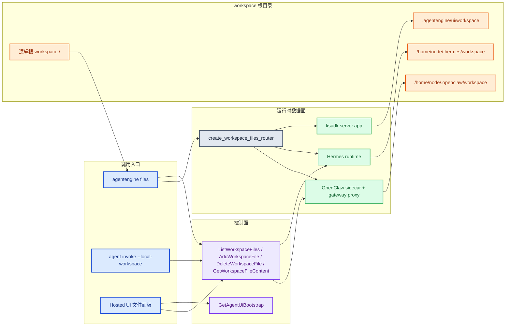
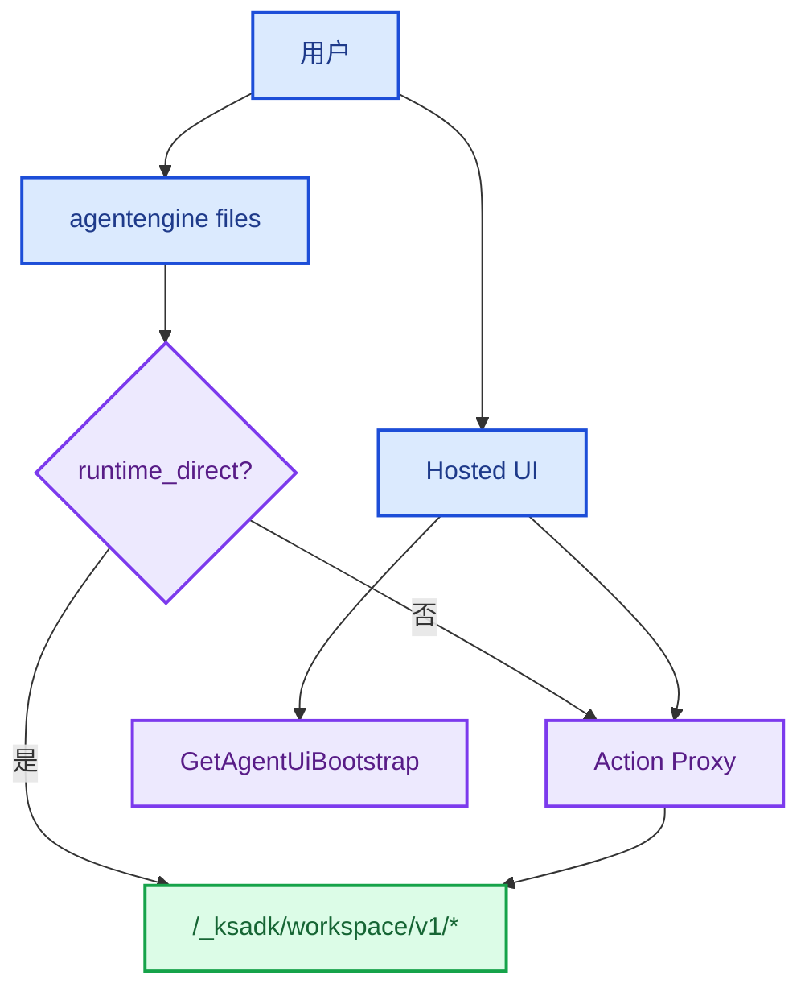
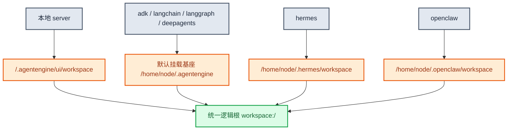
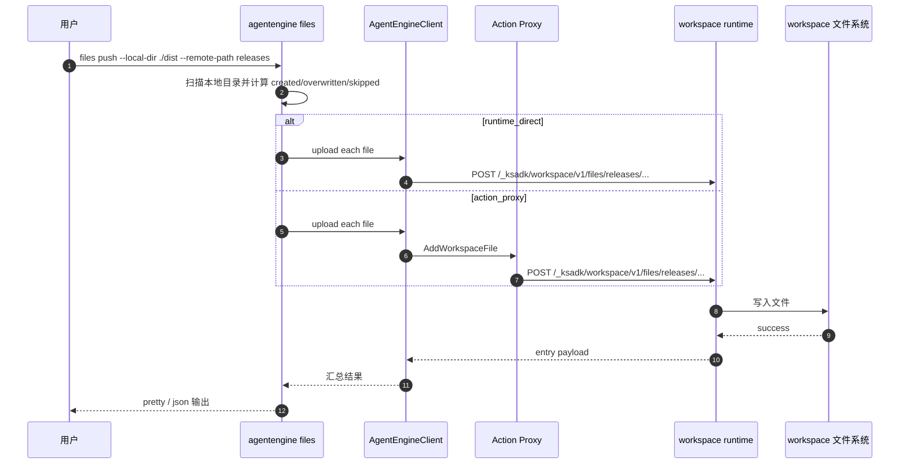
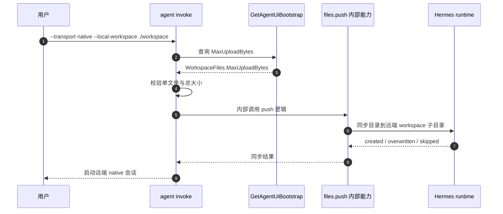
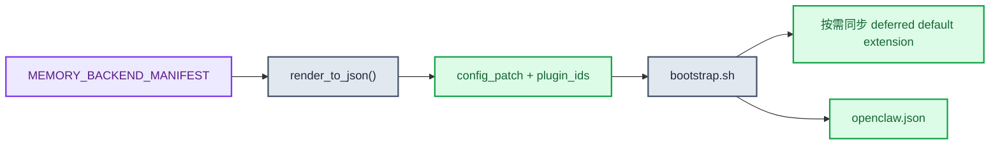

# 工作区文件技术设计

本文档是当前 `Workspace Files` 能力的唯一正式专题文档。它同时覆盖本地 runtime、Hermes、OpenClaw、CLI 以及 Hosted Action 的工作区文件链路。

事实来源：

- `ksadk_runtime_common/workspace_files/*`
- `ksadk/cli/cmd_files.py`
- `ksadk/api/client.py`
- `ksadk/server/app.py`
- `deploy/hermes/runtime/app.py`
- `deploy/openclaw/workspace_files_app.py`
- `deploy/openclaw/bootstrap.sh`
- `agentengine-server/app/api/v1/actions/chat_actions.py`
- `agentengine-server/app/api/v1/actions/upload_actions.py`
- 相关测试：`tests/test_client_workspace_files.py`、`tests/test_server_session_app.py`

## 1. 设计目标

- 用一份协议覆盖本地 runtime、Hermes、OpenClaw 和 Hosted 场景
- 对外统一成 `workspace:/` 语义，不暴露 framework 分叉
- 让 CLI 既能走 runtime 数据面，也能走控制面代理
- 保持路径安全、大小限制和 Hosted UI 字段稳定

## 2. 协议总览

### 2.1 runtime 路由

统一前缀：

```text
/_ksadk/workspace/v1
```

当前子接口：

- `GET /healthz`
- `GET /entries`
- `HEAD /files/{file_path}`
- `GET /files/{file_path}`
- `POST /files/{file_path}`
- `DELETE /files/{file_path}`

### 2.2 Hosted Action 常量

统一常量来自 `ksadk_runtime_common.workspace_files.constants`：

- `ListWorkspaceFiles`
- `AddWorkspaceFile`
- `DeleteWorkspaceFile`
- `/agentengine/api/v1/GetWorkspaceFileContent`
- 最大上传：`100MB`

## 3. 总体架构



## 4. Hosted / CLI / runtime 文件链路



当前实现中，CLI 选择方式由 `AgentEngineClient` 决定：

- 普通 agent 有运行时直连条件时，走 `runtime_direct`
- OpenClaw 当前优先 `action_proxy`
- Hosted UI 只走控制面 Action

## 5. framework 到 workspace 根目录映射



说明：

- `workspace:/` 是对外 contract，不随 framework 改变。
- 运行时如果返回 `workspace_real_root`，CLI 会把逻辑根对应到真实绝对路径。
- Hermes 和 OpenClaw 的真实根路径在代码中有明确常量。

## 6. 当前控制面暴露边界

Hosted UI 是否展示文件面板，取决于 `GetAgentUiBootstrap`。

当前代码中，`WorkspaceFiles.Enabled` 只对这些 framework 返回 `true`：

- `adk`
- `langchain`
- `langgraph`
- `deepagents`
- `hermes`

对 `openclaw`：

- runtime 镜像已带共享实现
- bootstrap 已能启动 sidecar 和 gateway proxy
- 但当前 `GetAgentUiBootstrap` 仍不会把 OpenClaw 声明为 Hosted 文件面板可用框架

这意味着：

- CLI / runtime 链路已经有共享实现
- Hosted UI 是否出现 OpenClaw 文件入口，当前仍受控制面 capability 开关约束

## 7. Push / Pull 时序



`pull` 与之对称，只是文件流方向从远端回到本地目录。

## 8. 路径与安全模型

路径安全统一由 `path_utils.py` 处理。

### 8.1 统一规则

- 拒绝空文件路径
- 拒绝绝对路径逃逸
- 拒绝 `..` 越界
- `resolve(strict=False)` 后必须仍位于 workspace root 内

固定错误明细：

```text
workspace path escapes the workspace root
```

这个 detail 已经被常量化，前后端可以据此稳定识别。

### 8.2 上传限制

- 最大上传：`100MB`
- 超限时返回 `413`
- 临时文件会在失败路径中被清理

## 9. 输出模型与展示语义

CLI 在 `pretty` 与 `json` 模式下都会先把 runtime payload 规范化。

典型字段：

| 字段 | 含义 |
| --- | --- |
| `workspace_root` | 逻辑根标签，默认 `workspace` |
| `workspace_display_path` | 逻辑展示路径，如 `workspace:/docs` |
| `workspace_real_root` | 运行时真实根目录 |
| `workspace_real_path` | 当前目录对应的真实绝对路径 |
| `size_bytes` / `size_human` | 文件大小 |
| `transport_mode` | `runtime_direct` 或 `action_proxy` |

## 10. `agent invoke --local-workspace` 与 files contract 的关系



这里并没有另一套“invoke 专用上传协议”，而是复用同一份 workspace 数据面 contract。

## 11. OpenClaw `MEMORY_BACKEND_MANIFEST` 到 patch 渲染链路

Workspace Files 与 memory backend 虽然是两块能力，但在当前实现里共享 `ksadk_runtime_common` 与 OpenClaw bootstrap。



当前 mem0 的关键点：

- 镜像默认内置 `openclaw-mem0` 资产
- 但它属于延迟同步插件，不会无条件落到实例状态目录
- 只有 manifest 渲染结果要求该插件时，bootstrap 才会把它同步到实例

## 12. 运行时与 Hosted Action 的职责分界

| 能力 | runtime data plane | Hosted Action |
| --- | --- | --- |
| 列目录 | 负责真实文件操作 | 负责转发和统一鉴权 |
| 上传文件 | 负责落盘与大小校验 | 负责接入控制面 |
| 下载文件 | 负责返回文件流 | 负责代理文件流 |
| 删除文件 | 负责删除 | 负责代理 |
| capability 暴露 | 不负责 | `GetAgentUiBootstrap` 负责 |

## 13. 测试锚点

重点测试包括：

- `tests/test_server_session_app.py`
  - 本地 runtime 路由与 action contract 对齐
  - 路径逃逸拦截
- `tests/test_client_workspace_files.py`
  - `runtime_direct`
  - OpenClaw `action_proxy`
  - 文件流上传、下载、删除
- `tests/test_openclaw_workspace_files_gating.py`
  - OpenClaw bootstrap 的显式开关

## 14. 相关文档

- [ksadk使用文档](./ksadk使用文档.md)
- [ksadk技术设计](./ksadk技术设计.md)
- [OpenClaw一键部署指南](./openclaw一键部署指南.md)
