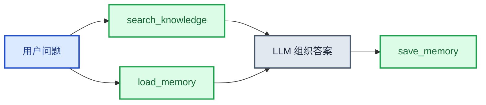

# 知识库与记忆示例

本文档给出当前仓库可直接复用的知识库（KB）与长期记忆（LTM）组合示例，口径以现有示例目录、工具函数和测试为准。

## 1. 能力矩阵

| 能力 | 入口 | 典型用途 |
| --- | --- | --- |
| 知识库检索 | `search_knowledge` / `search_knowledge_base` | RAG、文档检索 |
| 平台长期记忆 | `load_memory` / `save_memory` | 用户偏好、跨会话结论 |
| ADK 长期记忆 | `LongTermMemory.from_env()` | ADK 场景下的自动检索与持久化 |

## 2. 最小准备项

### 2.1 KB

- `KSADK_KB_DATASET_ID`
- `KSADK_KB_ACCESS_KEY`
- `KSADK_KB_SECRET_KEY`

可选：

- `KSADK_KB_REGION`
- `KSADK_KB_ENDPOINT`
- `KSADK_KB_SCHEME`
- `KSADK_KB_TOP_K`

### 2.2 LTM

- `KSADK_LTM_BACKEND`

后端相关：

- `http`：`KSADK_LTM_HTTP_URL`、`KSADK_LTM_HTTP_TOKEN`
- `sdk`：`KSADK_LTM_ACCESS_KEY`、`KSADK_LTM_SECRET_KEY` 等

## 3. ADK 示例

参考目录：`examples/knowledge_base_adk/`

```python
from google.adk.agents import Agent
from ksadk.knowledge_base.adk_tool import search_knowledge_base

root_agent = Agent(
    name="knowledge_base_assistant",
    tools=[search_knowledge_base],
)
```

运行：

```bash
cd examples/knowledge_base_adk
agentengine run .
```

## 4. 跨框架记忆工具示例

```python
from ksadk.memory.tool import load_memory, save_memory

memory_text = load_memory("这个用户对输出风格有什么偏好")
save_memory("用户偏好：回答先给结论，再给分步说明")
```

## 5. KB + LTM 组合模式

推荐顺序：

1. 先用 KB 回答客观事实
2. 再用 LTM 补用户偏好与历史决策
3. 回复结束后保存本轮结论



## 6. OpenClaw 场景

OpenClaw deploy 当前支持：

```bash
agentengine openclaw deploy --memory-system openclaw_default
agentengine openclaw deploy --memory-system mem0 --mem0-instance-id <uuid>
```

说明：

- `openclaw_default` 不需要 mem0 实例参数
- `mem0` 由 server 注入环境变量并下发 manifest
- runtime 只负责渲染 patch 和按需同步插件

## 7. 建议验证入口

- `tests/test_platform_memory_tools.py`
- `tests/unit/memory/test_adk_memory_comprehensive.py`
- `tests/test_runtime_common_memory_backend.py`
- `tests/unit/knowledge_base/test_client_env.py`

## 8. 相关文档

- [记忆使用指南](./记忆使用指南.md)
- [ksadk使用文档](./ksadk使用文档.md)
- [OpenClaw一键部署指南](./openclaw一键部署指南.md)
