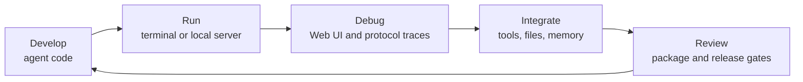
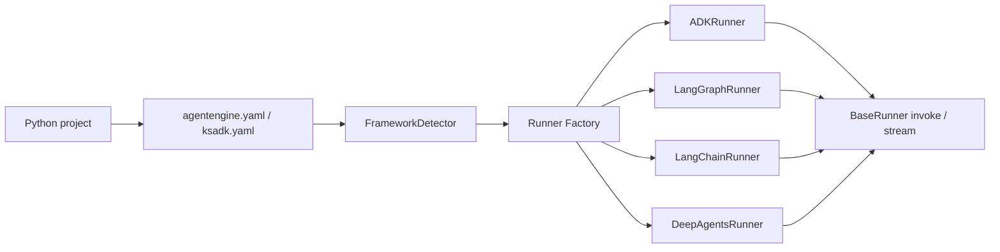
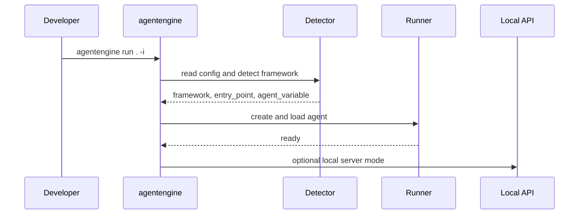

# Concepts

KsADK has four public building blocks: a project template, a framework adapter,
a local runtime, and a local debugging UI.

## KsADK And The Agent Lifecycle

KsADK focuses on the local development loop for agent projects: create or import
an agent, configure a model provider, run it locally, inspect the execution path,
then package reviewed artifacts when a deployment path is approved.

The public SDK intentionally keeps this loop local-first. Hosted AgentEngine
deployment and cloud packaging are optional capabilities, not prerequisites for
learning the open-source runtime.

## Project

A KsADK project is a normal Python project with an agent entry point and optional
configuration files. The default convention is:

- `agent.py` or a package-level agent module exports `root_agent`.
- `agentengine.yaml`, `ksadk.yaml`, or `ksadk.yml` describes the framework and entry point.
- `.env` stores local credentials and model settings.

The detector can also infer a project from common files such as `agent.py`,
`main.py`, `app.py`, package directories, and `langgraph.json`.

## Framework Adapter

KsADK does not replace framework APIs. It wraps common framework outputs so they
can be invoked through a consistent runtime. The first public release focuses on
these framework families:

| Framework | Typical exported object |
| --- | --- |
| Google ADK | `root_agent = Agent(...)` |
| LangGraph | `root_agent = graph.compile()` |
| LangChain | runnable chain or agent assigned to `root_agent` |
| DeepAgents | `root_agent = create_deep_agent(...)` |

The runner contract is the key public abstraction: framework-specific details
stay inside adapters, while the server and conversation runtime only depend on
`invoke`, `stream`, model overrides, sessions, and context.

## Local Runtime

`agentengine run` loads the project, detects the framework, and starts a local
runtime. In interactive mode it can run directly in the terminal. In server mode
it exposes HTTP endpoints that the Web UI and API clients can call.

The local runtime is the safest default for public examples because it does not
require private Kingsoft Cloud infrastructure.

## Local Web UI

`agentengine web` starts the browser debugging experience for local projects.
Users install the Python package and do not need Node.js for the bundled UI.

The editable UI source is planned as a separate public repository:

- Python SDK repository: `kingsoftcloud/ksadk-python`
- Web UI repository: `kingsoftcloud/ksadk-web`

The Python package embeds generated static assets. Future UI source changes
should be made in `ksadk-web`, then consumed by the Python SDK and hosted UI.

## Public Versus Hosted Capabilities

Some CLI commands support cloud packaging or hosted AgentEngine operations. Those
commands may require Kingsoft Cloud credentials and should be treated as optional
in public documentation.

Local-first docs should prefer:

- OpenAI-compatible provider settings.
- fake or user-owned API keys.
- local files, SQLite, or in-memory stores.
- `--dry-run` when explaining deployment-shaped commands.

Public examples must not require internal kubeconfig files, private registries,
private gateways, private object storage, or customer data.

## Documentation Layers

Use the docs layers consistently:

| Layer | Purpose |
| --- | --- |
| Getting Started | explain concepts and first local run |
| Tutorials | provide complete runnable files |
| Guides | explain task workflows and tradeoffs |
| Reference | define command, config, and API contracts |
| Contributing | explain release and governance gates |

This keeps public docs maintainable. A tutorial can say "copy this file"; a
reference page should say what fields mean and which values are accepted.

## Repository Boundaries

The Python repository owns Python SDK behavior. The planned `ksadk-web` repository owns editable UI behavior. The
Python package should consume a reviewed UI build artifact or pinned source ref,
not carry a divergent editable UI implementation forever.
