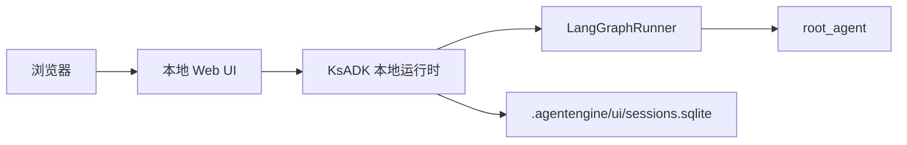

# 快速开始

本页会创建一个本地 LangGraph Agent，配置 OpenAI 兼容模型 provider，在终端运行它，
并打开本地 Web UI。

整个流程以本地开发为中心，不需要内部 Kingsoft Cloud 账号、私有网关、内部对象存储
或私有 Kubernetes 集群。

## 准备条件

- Python 3.10 或更新版本。
- 可使用 `python` 和 `pip` 的 shell。
- 一个你自己控制的 OpenAI 兼容聊天模型 endpoint 和 API Key。

可选框架依赖按需安装。本快速开始使用 LangGraph。

## 创建干净工作区

```bash
mkdir ksadk-quickstart
cd ksadk-quickstart
```

学习阶段建议把虚拟环境放在工作区内。生产项目可以使用团队已有的 Python 环境管理方式。

## 安装

```bash
python -m venv .venv
source .venv/bin/activate
pip install ksadk
```

安装 LangGraph extra：

```bash
pip install "ksadk[langgraph]"
```

确认 CLI 可用：

```bash
agentengine --help
agentengine --version
```

## 创建项目

```bash
agentengine init my-agent -f langgraph
cd my-agent
```

生成项目会包含 Agent 入口文件和项目配置文件。更多细节见
[项目结构](project-structure.zh.md)。

预期文件：

```text
my-agent/
  agent.py
  agentengine.yaml
```

## 配置模型

使用非交互命令可以让设置可复现：

```bash
agentengine config set \
  OPENAI_API_KEY=sk-test \
  OPENAI_BASE_URL=https://api.example.com/v1 \
  OPENAI_MODEL_NAME=my-model
```

真实 provider 值只放在本地 `.env`。不要提交 `.env`。

检查生效配置：

```bash
agentengine config show
```

也可以使用交互式向导：

```bash
agentengine config
```

## 检查 Agent

打开 `agent.py`，确认配置的 Agent 变量存在。默认 LangGraph 项目应导出：

```python
root_agent = graph.compile()
```

打开 `agentengine.yaml`，确认：

```yaml
framework: langgraph
entry_point: agent.py
agent_variable: root_agent
```

## 终端运行

```bash
agentengine run . -i
```

常用参数：

| 参数 | 作用 |
| --- | --- |
| `--model <name>` | 为本次运行覆盖配置模型 |
| `--show-thinking` | provider 返回 reasoning 时展示推理输出 |
| `--no-stream` | 等完整响应后再渲染 |
| `--no-trace` | 禁用 tracing |

发送一个基础 prompt：

```text
What can this agent do?
```

如果模型 provider 可访问，CLI 会流式输出或打印响应。失败时看
[故障排查](../reference/troubleshooting.zh.md)。

## 启动本地 Web UI

```bash
agentengine web . --no-open
```

命令会打印一个本地 URL。用浏览器打开后发送测试消息。`agentengine web` 使用
Python 包内置的静态资源，终端用户不需要 Node.js。

本地 UI 默认把调试状态写入 `.agentengine/`。不要提交这个目录。



## 启动本地 API Server

```bash
agentengine run . --port 8080
```

调用 Chat Completions endpoint：

```bash
curl http://127.0.0.1:8080/v1/chat/completions \
  -H 'Content-Type: application/json' \
  -d '{
    "model": "my-agent",
    "messages": [
      {"role": "user", "content": "Say hello from KsADK"}
    ],
    "stream": false
}'
```

调用 Responses endpoint：

```bash
curl http://127.0.0.1:8080/v1/responses \
  -H 'Content-Type: application/json' \
  -d '{
    "model": "my-agent",
    "input": "Return a one sentence status.",
    "stream": false
  }'
```

只有当客户端能消费 server-sent events 时，才使用 `stream: true`。

## 停止本地进程

终端交互或本地 server 可以用 `Ctrl-C` 停止。重置本地 UI 状态时删除：

```bash
rm -rf .agentengine/
```

## 下一步

- 阅读 [配置项](configuration.zh.md)，理解 `.env`、YAML 和 CLI 覆盖顺序。
- 阅读 [运行时架构](../guides/runtime-architecture.zh.md)，理解请求如何进入 Runner。
- 阅读 [OpenAI 兼容 API](../reference/openai-compatible-api.zh.md)，把本地 Agent 接到客户端。
- 阅读 [本地 Web UI](../guides/local-web-ui.zh.md)，了解会话、上传和工作区预览。
