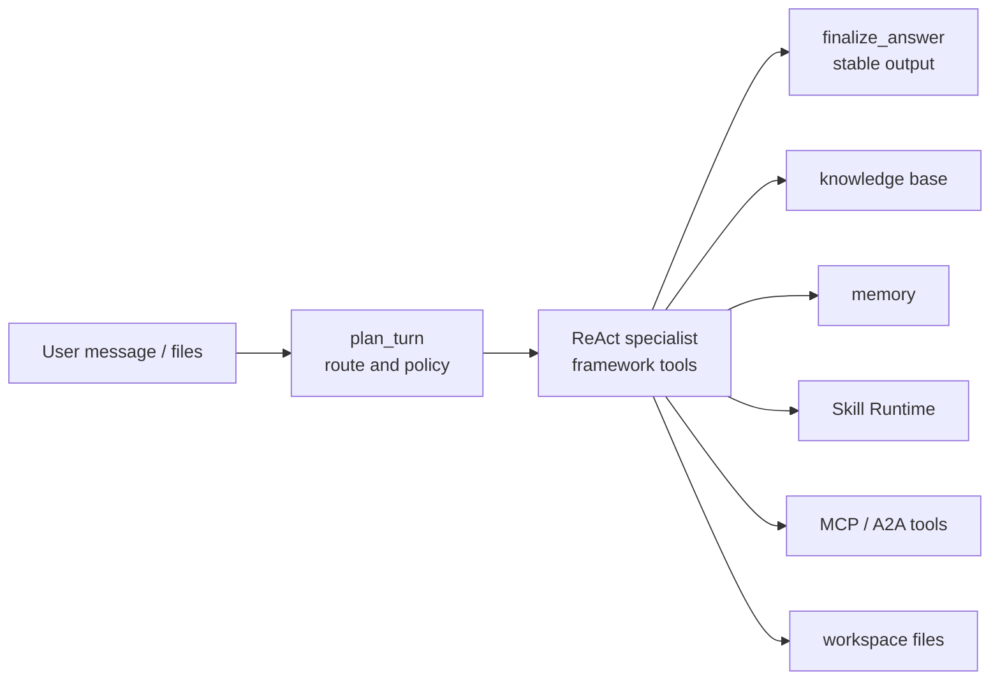

# Agent Best Practices

This guide shows a production-oriented agent shape for KsADK projects. It is
based on common LangGraph demo patterns, and all values and identifiers below
are public-safe placeholders.

## Recommended Shape

Use a small outer graph for routing and a focused tool-using specialist for
business work. This keeps planning, tool execution, and final answer formatting
separate.



This pattern works well for LangGraph because the outer `StateGraph` owns state
transitions, while the specialist can stay close to the framework-native
`create_react_agent()` API.

The local demo uses the same pattern for a "product launch war room" agent:

| Layer | Responsibility | Typical tools |
| --- | --- | --- |
| `plan_turn` | deterministic routing and policy hints | no external calls |
| `run_specialist` | framework-native ReAct execution | knowledge, memory, Skill Runtime, workspace |
| `finalize_answer` | final text and UI-safe streaming | no new side effects |
| status tools | explain which platform components are bound | `component_status`, `graph_status` |

Keep the planner deterministic. It should decide whether the turn is about
knowledge, memory, skills, workspace files, MCP, or general chat; it should not
call private services or mutate state.

## LangGraph Skeleton

```python
import os
from typing import Annotated, Any, TypedDict

from langchain_core.messages import AIMessage, BaseMessage, HumanMessage, SystemMessage
from langchain_openai import ChatOpenAI
from langgraph.graph import END, START, StateGraph
from langgraph.graph.message import add_messages
from langgraph.prebuilt import create_react_agent

from my_agent.tools import PLATFORM_TOOLS, SKILL_TOOLS, WORKSPACE_TOOLS


class AgentState(TypedDict):
    messages: Annotated[list[BaseMessage], add_messages]
    plan: dict[str, Any]
    specialist_messages: list[BaseMessage]
    final_text: str


llm = ChatOpenAI(
    model=os.environ.get("OPENAI_MODEL_NAME", "my-model"),
    base_url=os.environ.get("OPENAI_BASE_URL"),
    api_key=os.environ.get("OPENAI_API_KEY", "not-set"),
    streaming=True,
)

specialist = create_react_agent(
    llm,
    [*PLATFORM_TOOLS, *SKILL_TOOLS, *WORKSPACE_TOOLS],
    prompt="Use tools only when they improve the answer. State boundaries clearly.",
    version="v2",
)


def plan_turn(state: AgentState) -> dict[str, Any]:
    user_text = next(
        (m.content for m in reversed(state["messages"]) if isinstance(m, HumanMessage)),
        "",
    )
    route = "knowledge" if "docs" in str(user_text).lower() else "general"
    return {"plan": {"route": route}}


def run_specialist(state: AgentState) -> dict[str, Any]:
    plan = state.get("plan") or {}
    result = specialist.invoke(
        {
            "messages": [
                SystemMessage(content=f"Route: {plan.get('route', 'general')}"),
                *state["messages"],
            ]
        }
    )
    return {"specialist_messages": result.get("messages", [])}


def finalize_answer(state: AgentState) -> dict[str, Any]:
    text = ""
    for message in reversed(state.get("specialist_messages") or []):
        if isinstance(message, AIMessage) and message.content:
            text = str(message.content)
            break
    return {"final_text": text, "messages": [AIMessage(content=text)]}


workflow = StateGraph(AgentState)
workflow.add_node("plan_turn", plan_turn)
workflow.add_node("run_specialist", run_specialist)
workflow.add_node("finalize_answer", finalize_answer)
workflow.add_edge(START, "plan_turn")
workflow.add_edge("plan_turn", "run_specialist")
workflow.add_edge("run_specialist", "finalize_answer")
workflow.add_edge("finalize_answer", END)

root_agent = workflow.compile(name="production_agent")
```

## Markdown Output Repair

KsADK preserves raw model output by default. The runtime does not normalize
Markdown on the backend, so streaming, tracing, session replay, and audit logs
all see the same raw LLM output.

If your application exports answers as reports, message cards, knowledge-base
documents, or workspace Markdown files, enable the lightweight repair helper in
your own business code:

```python
from ksadk.markdown import repair_markdown


def finalize_answer(state: AgentState) -> dict[str, Any]:
    text = ""
    for message in reversed(state.get("specialist_messages") or []):
        if isinstance(message, AIMessage) and message.content:
            text = str(message.content)
            break

    # App-side opt-in. KsADK runtime does not rewrite raw model output by default.
    text = repair_markdown(text, enabled=True)
    return {"final_text": text, "messages": [AIMessage(content=text)]}
```

`repair_markdown()` only performs conservative shape repairs:

- closes unclosed fenced code blocks.
- inserts missing blank lines around code blocks, lists, and tables.
- normalizes newlines and remains idempotent.

It does not rewrite semantics, validate facts, or guarantee strict CommonMark.
For strict output contracts, use JSON schema, Pydantic validation, retries, or
application-level linting before export.

`agentengine.yaml` stays explicit:

```yaml
name: production-agent
framework: langgraph
entry_point: my_agent/agent.py
agent_variable: root_agent
```

## LangGraph Tool Registry

Define platform tools in small modules instead of putting all tool code inside
`agent.py`. This keeps the graph readable and makes optional integrations easy
to test.

```python
from langchain_core.tools import tool


@tool
def search_knowledge_base(query: str) -> str:
    """Search the configured KsADK knowledge base."""
    from ksadk.knowledge_base.tool import search_knowledge

    return search_knowledge(query)


@tool
def load_user_memory(query: str) -> str:
    """Load current-user long-term memory."""
    from ksadk.memory.tool import load_memory

    return load_memory(query)


@tool
def save_user_memory(content: str) -> str:
    """Save a short current-user memory."""
    from ksadk.memory.tool import save_memory

    return save_memory(content)


PLATFORM_TOOLS = [search_knowledge_base, load_user_memory, save_user_memory]
```

The memory tools require an invocation context, so they should be called from a
KsADK runner request. When used outside the runner, return the diagnostic to the
user instead of pretending that memory was saved.

## Planner Policy

A deterministic planner gives the specialist a narrow operating mode:

```python
def plan_turn(state: AgentState) -> dict[str, Any]:
    text = ""
    for message in reversed(state["messages"]):
        if isinstance(message, HumanMessage):
            text = str(message.content or "")
            break

    if any(word in text for word in ("docs", "manual", "knowledge")):
        route = "knowledge"
        suggested_tools = ["search_knowledge_base"]
    elif any(word in text for word in ("remember", "preference", "memory")):
        route = "memory"
        suggested_tools = ["load_user_memory", "save_user_memory"]
    elif any(word in text for word in ("skill", "workflow")):
        route = "skills"
        suggested_tools = ["list_skills", "load_skill"]
    else:
        route = "general"
        suggested_tools = []

    return {
        "plan": {
            "route": route,
            "suggested_tools": suggested_tools,
            "response_guidance": "Use optional tools only when they improve the answer.",
        }
    }
```

This is intentionally simple. The planner should guide the specialist; the
specialist still decides whether a tool call is useful for the concrete turn.

## ADK Agent Pattern

For ADK, keep the public shape native to Google ADK and let KsADK inject
optional platform tools when configured.

```python
from google.adk.agents import Agent
from ksadk.knowledge_base.tool import search_knowledge
from ksadk.memory.tool import load_memory, save_memory


def release_checklist(topic: str) -> dict:
    return {"topic": topic, "items": ["scope", "risk", "verification"]}


root_agent = Agent(
    name="release_assistant",
    instruction=(
        "Answer directly. Use search_knowledge for stable docs, "
        "load_memory/save_memory for user preferences, and release_checklist "
        "for release planning."
    ),
    tools=[search_knowledge, load_memory, save_memory, release_checklist],
)
```

Keep the minimum ADK sample runnable without hosted services. Add knowledge,
memory, Skill Runtime, or MCP only after the base model call works.

For an ADK application that wants explicit tools, keep the first version small:

```python
from google.adk.agents import Agent


def component_status() -> dict:
    return {
        "knowledge_base_bound": bool(os.environ.get("KSADK_KB_DATASET_ID")),
        "long_term_memory_bound": bool(os.environ.get("KSADK_LTM_NAMESPACE")),
        "skill_space_bound": bool(os.environ.get("KSADK_SKILL_SPACE_IDS")),
        "mcp_bound": bool(os.environ.get("KSADK_MCP_SERVERS")),
    }


root_agent = Agent(
    name="platform_ready_agent",
    instruction=(
        "Answer directly. Use component_status when the user asks what platform "
        "capabilities are configured. Do not claim optional integrations are "
        "available when the status tool says they are missing."
    ),
    tools=[component_status],
)
```

After this runs locally, add optional KsADK tools or MCP toolsets. ADK projects
should keep tool injection auditable at agent load time, not change the tool set
mid-turn.

## Knowledge Base

Use knowledge search for stable product docs, policies, or manuals. Do not use
it for real-time internet search.

```python
from langchain_core.tools import tool


@tool
def search_knowledge_base(query: str) -> str:
    """Search the configured KsADK knowledge dataset."""
    from ksadk.knowledge_base.tool import search_knowledge

    return search_knowledge(query)
```

Recommended behavior:

| Situation | Behavior |
| --- | --- |
| User asks for docs, product facts, or internal manuals | call knowledge search first |
| Knowledge is unconfigured | say it is not configured and continue with available context |
| Result is weak | state uncertainty instead of fabricating a source |

## Memory

Use memory for user facts and preferences, not for large files or raw
attachments.

```python
from langchain_core.tools import tool


@tool
def load_user_memory(query: str) -> str:
    from ksadk.memory.tool import load_memory

    return load_memory(query)


@tool
def save_user_memory(content: str) -> str:
    from ksadk.memory.tool import save_memory

    return save_memory(content)
```

Good memory values are short and explicit:

- "Release notes should start with conclusion, then risk, then validation."
- "Use Simplified Chinese for product-review drafts."

Do not store credentials, complete customer data, or binary attachments.

## Session Management

Treat session state as a runtime boundary:

| Concern | Best practice |
| --- | --- |
| `session_id` | pass it through APIs or UI routes; do not invent a new one per turn |
| local development | use SQLite under `.agentengine/ui/sessions.sqlite` |
| server or shared backend | use `KSADK_SESSION_BACKEND=postgres` with `KSADK_SESSION_DSN` |
| LangGraph state | keep business state in graph state; keep protocol history in KsADK sessions |
| files | write generated artifacts to workspace, not arbitrary host paths |

For OpenAI-compatible clients, prefer `previous_response_id` or the returned
conversation/session handle when continuing a conversation.

## Skill Runtime

Separate instruction-first skills from isolated execution:

```python
@tool
def list_skills() -> dict:
    from ksadk.skills.service_client import SkillServiceClient

    client = SkillServiceClient.from_env()
    return {"skills": [skill.name for skill in client.list_skills_by_space_id("space-id").active_skills()]}
```

Recommended policy:

1. list available skills.
2. load `SKILL.md` and follow the instructions in the outer agent when the
   skill is instruction-first.
3. call isolated `execute_skills` only when the user requests workflow/script
   execution and `KSADK_SKILL_RUNTIME_BACKEND` is configured.
4. surface disabled sandbox/runtime as a diagnostic, not as a silent success.

The public shape for Skill Runtime should distinguish three states:

| State | Meaning | Agent behavior |
| --- | --- | --- |
| Skill Space unconfigured | no remote skill discovery | answer without skills and say what is missing |
| instruction-first skill loaded | `SKILL.md` is available | follow instructions in the outer agent |
| isolated execution enabled | `local_process` or sandbox backend exists | call `execute_skills` for workflow/script tasks |

For local examples, use `KSADK_SKILL_RUNTIME_BACKEND=local_process`. For
sandbox examples, document only variable names and limits; keep provider
tokens, private images, and internal endpoints out of the repository.

## MCP And A2A

Use MCP for tool servers that have their own lifecycle or protocol boundary.
Use ordinary framework tools for simple local functions.

```bash
export KSADK_ENABLE_MCP_TOOLS=1
export KSADK_MCP_SERVERS='[
  {"name": "docs", "url": "http://127.0.0.1:9000/mcp"}
]'
```

Keep MCP config public-safe:

- no private URLs in committed examples.
- no bearer tokens in `agentengine.yaml`.
- use placeholders and CI secrets for credentials.
- define tool filters when exposing broad MCP servers.

ADK projects can consume MCP through KsADK's ADK loader when
`KSADK_MCP_SERVERS` is set. LangGraph projects should usually expose MCP tools
through the LangChain/LangGraph MCP adapter they already use, while keeping the
same public configuration shape:

```json
[
  {
    "name": "docs",
    "url": "http://127.0.0.1:9000/mcp",
    "tool_filter": ["search_docs"],
    "tool_name_prefix": "docs"
  }
]
```

The URL must be an absolute `http(s)` endpoint whose path ends with `/mcp`.
If a token is required, pass it through `api_key` from a local secret source and
do not commit the literal value.

## Workspace Artifacts

Generated HTML, Markdown, JSON, CSV, or code should go through workspace tools
so local and hosted UI can preview or download the same logical files.

```python
@tool
def write_report(path: str, content: str) -> dict:
    from ksadk.sessions.local_service import resolve_local_session_dir

    root = resolve_local_session_dir() / "workspace"
    target = (root / path).resolve()
    if root.resolve() not in target.parents and target != root.resolve():
        raise ValueError("workspace path escapes workspace root")
    target.parent.mkdir(parents=True, exist_ok=True)
    target.write_text(content, encoding="utf-8")
    return {"path": target.relative_to(root).as_posix()}
```

## Checklist

- Keep `agentengine.yaml` explicit.
- Make the first run work without knowledge, memory, Skill Runtime, or MCP.
- Add optional platform tools one at a time.
- Fail clearly when an optional integration is not configured.
- Store generated files in workspace.
- Keep secrets in `.env` or CI secrets, never in Git.
- Pin `ksadk-web` by tag or commit when building static UI artifacts.
