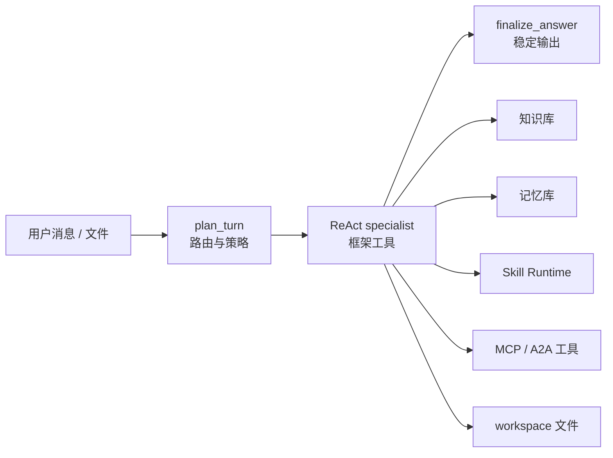

# Agent 最佳实践

这页给出 KsADK 项目的生产型 Agent 写法。模式参考常见 LangGraph demo 结构，
下面所有值都是可公开的占位示例。

## 推荐结构

用一个外层图负责路由和策略，再把业务工作交给一个可调用工具的 specialist。
这样规划、工具执行和最终回答收口互不混在一起。



LangGraph 很适合这个结构：外层 `StateGraph` 管状态流转，内层
`create_react_agent()` 保持框架原生工具调用体验。

本地 demo 也是这个模式，场景是“产品发布作战室”：

| 层次 | 职责 | 常见工具 |
| --- | --- | --- |
| `plan_turn` | 确定性路由和策略提示 | 不调用外部服务 |
| `run_specialist` | 框架原生 ReAct 执行 | 知识库、记忆库、Skill Runtime、workspace |
| `finalize_answer` | 最终回答和 UI 友好流式输出 | 不产生新副作用 |
| 状态工具 | 解释平台组件绑定情况 | `component_status`、`graph_status` |

planner 要保持确定性。它只判断本轮是知识库、记忆库、Skill、workspace 文件、
MCP 还是普通问答；不调用私有服务，也不修改状态。

## LangGraph 骨架

```python
import os
from typing import Annotated, Any, TypedDict

from langchain_core.messages import AIMessage, BaseMessage, HumanMessage, SystemMessage
from langchain_openai import ChatOpenAI
from langgraph.graph import END, START, StateGraph
from langgraph.graph.message import add_messages
from langgraph.prebuilt import create_react_agent

from my_agent.tools import PLATFORM_TOOLS, SKILL_TOOLS, WORKSPACE_TOOLS


class AgentState(TypedDict):
    messages: Annotated[list[BaseMessage], add_messages]
    plan: dict[str, Any]
    specialist_messages: list[BaseMessage]
    final_text: str


llm = ChatOpenAI(
    model=os.environ.get("OPENAI_MODEL_NAME", "my-model"),
    base_url=os.environ.get("OPENAI_BASE_URL"),
    api_key=os.environ.get("OPENAI_API_KEY", "not-set"),
    streaming=True,
)

specialist = create_react_agent(
    llm,
    [*PLATFORM_TOOLS, *SKILL_TOOLS, *WORKSPACE_TOOLS],
    prompt="只在能提升答案质量时调用工具，并明确说明能力边界。",
    version="v2",
)


def plan_turn(state: AgentState) -> dict[str, Any]:
    user_text = next(
        (m.content for m in reversed(state["messages"]) if isinstance(m, HumanMessage)),
        "",
    )
    route = "knowledge" if "文档" in str(user_text) else "general"
    return {"plan": {"route": route}}


def run_specialist(state: AgentState) -> dict[str, Any]:
    plan = state.get("plan") or {}
    result = specialist.invoke(
        {
            "messages": [
                SystemMessage(content=f"Route: {plan.get('route', 'general')}"),
                *state["messages"],
            ]
        }
    )
    return {"specialist_messages": result.get("messages", [])}


def finalize_answer(state: AgentState) -> dict[str, Any]:
    text = ""
    for message in reversed(state.get("specialist_messages") or []):
        if isinstance(message, AIMessage) and message.content:
            text = str(message.content)
            break
    return {"final_text": text, "messages": [AIMessage(content=text)]}


workflow = StateGraph(AgentState)
workflow.add_node("plan_turn", plan_turn)
workflow.add_node("run_specialist", run_specialist)
workflow.add_node("finalize_answer", finalize_answer)
workflow.add_edge(START, "plan_turn")
workflow.add_edge("plan_turn", "run_specialist")
workflow.add_edge("run_specialist", "finalize_answer")
workflow.add_edge("finalize_answer", END)

root_agent = workflow.compile(name="production_agent")
```

`agentengine.yaml` 建议显式声明：

```yaml
name: production-agent
framework: langgraph
entry_point: my_agent/agent.py
agent_variable: root_agent
```

## LangGraph 工具注册

平台工具建议拆到独立模块，不要全部塞进 `agent.py`。这样 graph 更清楚，
可选集成也更容易测试。

```python
from langchain_core.tools import tool


@tool
def search_knowledge_base(query: str) -> str:
    """搜索已配置的 KsADK 知识库。"""
    from ksadk.knowledge_base.tool import search_knowledge

    return search_knowledge(query)


@tool
def load_user_memory(query: str) -> str:
    """读取当前用户长期记忆。"""
    from ksadk.memory.tool import load_memory

    return load_memory(query)


@tool
def save_user_memory(content: str) -> str:
    """保存一条短记忆。"""
    from ksadk.memory.tool import save_memory

    return save_memory(content)


PLATFORM_TOOLS = [search_knowledge_base, load_user_memory, save_user_memory]
```

记忆工具依赖 KsADK runner 的 invocation context。脱离 runner 调用时，应把诊断
返回给用户，不要假装记忆已经保存成功。

## Planner 策略

确定性 planner 给 specialist 一个收窄后的工作模式：

```python
def plan_turn(state: AgentState) -> dict[str, Any]:
    text = ""
    for message in reversed(state["messages"]):
        if isinstance(message, HumanMessage):
            text = str(message.content or "")
            break

    if any(word in text for word in ("文档", "资料", "知识库")):
        route = "knowledge"
        suggested_tools = ["search_knowledge_base"]
    elif any(word in text for word in ("记住", "偏好", "记忆")):
        route = "memory"
        suggested_tools = ["load_user_memory", "save_user_memory"]
    elif any(word in text for word in ("Skill", "skill", "技能", "workflow")):
        route = "skills"
        suggested_tools = ["list_skills", "load_skill"]
    else:
        route = "general"
        suggested_tools = []

    return {
        "plan": {
            "route": route,
            "suggested_tools": suggested_tools,
            "response_guidance": "只在能提升答案质量时调用可选工具。",
        }
    }
```

这个 planner 故意保持简单。planner 负责提示 specialist；具体是否调用工具，
仍由 specialist 根据当前用户问题决定。

## ADK Agent 写法

ADK 项目保持 Google ADK 原生模型；KsADK 负责在配置存在时注入可选平台能力。

```python
from google.adk.agents import Agent
from ksadk.knowledge_base.tool import search_knowledge
from ksadk.memory.tool import load_memory, save_memory


def release_checklist(topic: str) -> dict:
    return {"topic": topic, "items": ["scope", "risk", "verification"]}


root_agent = Agent(
    name="release_assistant",
    instruction=(
        "回答要直接。稳定文档先用 search_knowledge，"
        "用户偏好用 load_memory/save_memory，发布规划用 release_checklist。"
    ),
    tools=[search_knowledge, load_memory, save_memory, release_checklist],
)
```

最小 ADK 示例应先保证无需 hosted 服务也能跑通；知识库、记忆库、
Skill Runtime、MCP 都是后续可选能力。

如果 ADK 应用需要显式平台状态工具，第一版也建议保持很小：

```python
import os

from google.adk.agents import Agent


def component_status() -> dict:
    return {
        "knowledge_base_bound": bool(os.environ.get("KSADK_KB_DATASET_ID")),
        "long_term_memory_bound": bool(os.environ.get("KSADK_LTM_NAMESPACE")),
        "skill_space_bound": bool(os.environ.get("KSADK_SKILL_SPACE_IDS")),
        "mcp_bound": bool(os.environ.get("KSADK_MCP_SERVERS")),
    }


root_agent = Agent(
    name="platform_ready_agent",
    instruction=(
        "回答要直接。用户问平台能力配置时调用 component_status。"
        "状态工具显示缺失的可选能力，不要宣称已经可用。"
    ),
    tools=[component_status],
)
```

本地跑通后，再加入可选 KsADK 工具或 MCP toolset。ADK 项目应在 agent 加载期
完成可审计的工具注入，不要在单轮请求中途改变工具集合。

## 知识库

知识库适合查稳定产品文档、说明书和政策，不替代实时互联网搜索。

```python
from langchain_core.tools import tool


@tool
def search_knowledge_base(query: str) -> str:
    """搜索已配置的 KsADK 知识库。"""
    from ksadk.knowledge_base.tool import search_knowledge

    return search_knowledge(query)
```

| 场景 | 建议行为 |
| --- | --- |
| 用户问文档、产品事实、稳定资料 | 先调用知识库检索 |
| 未配置知识库 | 明确说明未配置，然后用已有上下文继续 |
| 结果不充分 | 说明不确定性，不伪造来源 |

## 记忆库

记忆库保存用户事实和偏好，不保存大文件、二进制附件或敏感凭证。

```python
from langchain_core.tools import tool


@tool
def load_user_memory(query: str) -> str:
    from ksadk.memory.tool import load_memory

    return load_memory(query)


@tool
def save_user_memory(content: str) -> str:
    from ksadk.memory.tool import save_memory

    return save_memory(content)
```

适合保存的记忆：

- “发布说明先给结论，再给风险和验证方式。”
- “产品评审草稿默认使用简体中文。”

不要保存 API Key、完整客户数据或附件原文。

## 会话管理

把 session 当成运行时边界：

| 关注点 | 最佳实践 |
| --- | --- |
| `session_id` | API 和 UI 复用同一个 id，不要每轮新建 |
| 本地开发 | 默认 SQLite：`.agentengine/ui/sessions.sqlite` |
| 共享后端 | 使用 `KSADK_SESSION_BACKEND=postgres` 和 `KSADK_SESSION_DSN` |
| LangGraph 状态 | 业务状态放 graph state；协议历史交给 KsADK session |
| 文件 | 生成产物写入 workspace，不写任意宿主机路径 |

OpenAI 兼容客户端续聊时，优先使用返回的 conversation/session handle 或
`previous_response_id`。

## Skill Runtime

区分 instruction-first skill 和隔离执行：

1. 先列出可用 skill。
2. 读取 `SKILL.md`，instruction-first skill 可以由外层 agent 直接按说明完成。
3. 只有用户明确要求 workflow/script 执行，并且 `KSADK_SKILL_RUNTIME_BACKEND`
   已配置时，才调用隔离执行。
4. sandbox/runtime 未启用时返回诊断，不要伪造执行结果。

公开文档里的 Skill Runtime 要区分三种状态：

| 状态 | 含义 | Agent 行为 |
| --- | --- | --- |
| 未配置 Skill Space | 不能发现远程技能 | 不使用技能，并说明缺少配置 |
| 已加载 instruction-first skill | 已拿到 `SKILL.md` | 外层 Agent 按说明完成任务 |
| 已启用隔离执行 | 存在 `local_process` 或 sandbox backend | workflow/script 类任务调用 `execute_skills` |

本地示例优先用 `KSADK_SKILL_RUNTIME_BACKEND=local_process`。sandbox 示例只写
变量名和限制；provider token、私有镜像和内部 endpoint 不进入公开仓库。

## MCP 与 A2A

MCP 适合有独立生命周期或协议边界的工具服务；普通本地函数优先用框架原生 tool。

```bash
export KSADK_ENABLE_MCP_TOOLS=1
export KSADK_MCP_SERVERS='[
  {"name": "docs", "url": "http://127.0.0.1:9000/mcp"}
]'
```

公开配置要保持干净：

- 不提交私有 URL。
- 不把 bearer token 写入 `agentengine.yaml`。
- 凭证使用本地 `.env` 或 CI secrets。
- 暴露能力较宽的 MCP server 要配置 tool filter。

ADK 项目可以在配置 `KSADK_MCP_SERVERS` 后由 KsADK ADK loader 注入 MCP。
LangGraph 项目通常通过已有的 LangChain/LangGraph MCP adapter 暴露工具，但
保持同一套公开配置形态：

```json
[
  {
    "name": "docs",
    "url": "http://127.0.0.1:9000/mcp",
    "tool_filter": ["search_docs"],
    "tool_name_prefix": "docs"
  }
]
```

URL 必须是绝对 `http(s)` 地址，path 以 `/mcp` 结尾。需要 token 时，从本地
secret source 写入 `api_key`，不要提交真实值。

## Workspace 产物

HTML、Markdown、JSON、CSV 或代码文件应写入 workspace，让本地和 hosted UI
用同一个逻辑目录预览和下载。

```python
@tool
def write_report(path: str, content: str) -> dict:
    from ksadk.sessions.local_service import resolve_local_session_dir

    root = resolve_local_session_dir() / "workspace"
    target = (root / path).resolve()
    if root.resolve() not in target.parents and target != root.resolve():
        raise ValueError("workspace path escapes workspace root")
    target.parent.mkdir(parents=True, exist_ok=True)
    target.write_text(content, encoding="utf-8")
    return {"path": target.relative_to(root).as_posix()}
```

## 检查清单

- `agentengine.yaml` 使用显式配置。
- 首次运行不依赖知识库、记忆库、Skill Runtime 或 MCP。
- 平台工具按需逐个加入。
- 可选集成未配置时给出明确诊断。
- 生成文件写入 workspace。
- secret 只放 `.env` 或 CI secrets。
- 构建静态 UI 时固定 `ksadk-web` tag 或 commit。
