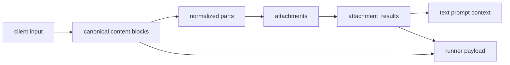
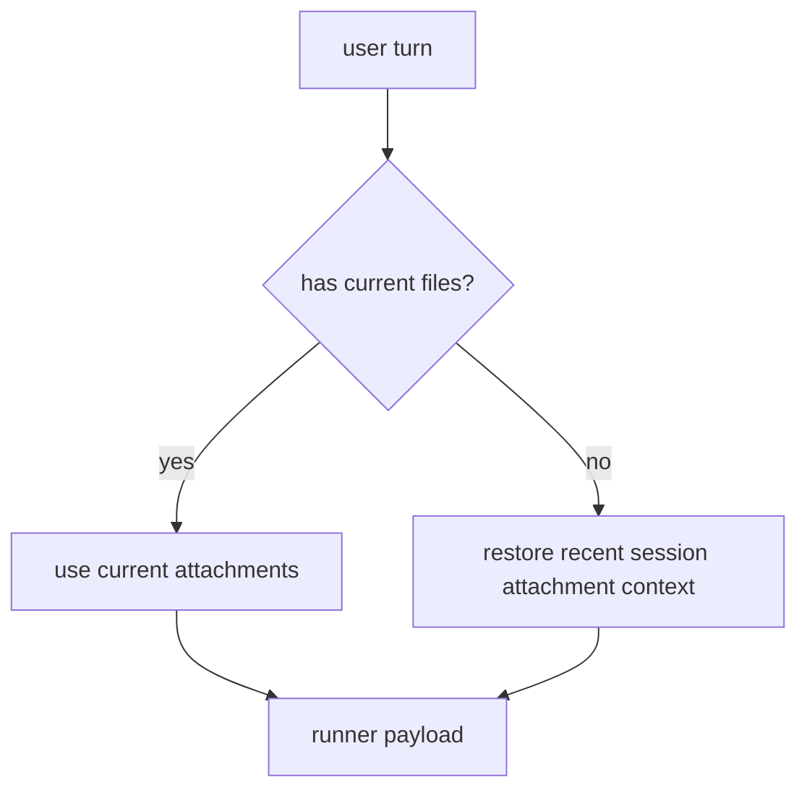

# Attachments And Multimodal Input

KsADK normalizes text, image, file, and uploaded attachment inputs before they
reach a framework runner. This lets local UI, Responses API, Chat Completions,
and ADK-style parts share one execution path.

## Input Shapes

| Shape | Public protocol | Runtime behavior |
| --- | --- | --- |
| `input_text` | Responses | text content block |
| `input_image` | Responses | image URL or data URL |
| `input_file` | Responses | file data, file URL, file URI, or file ID |
| `text` | legacy/ADK-style part | text part |
| `inlineData` | legacy/ADK-style part | base64 attachment |
| `fileData` | legacy/ADK-style part | uploaded or referenced file |
| `image_url` | Chat Completions content block | image URL content |

Public examples should prefer Responses item names for `/v1/responses` and Chat
Completions content blocks for `/v1/chat/completions`.

## Normalization Flow



The runner receives both canonical content (`input_content`, `input_messages`)
and structured attachment results (`attachment_results`,
`current_attachment_results`).

## Protocol Mapping

KsADK accepts several client representations, then maps them into the same
internal attachment path:

| Client surface | Example field | Canonical meaning |
| --- | --- | --- |
| Responses | `input[].content[].type=input_image` | image input block |
| Responses | `input[].content[].type=input_file` | file input block |
| Chat Completions | `messages[].content[].type=image_url` | image input block |
| ADK-style part | `inlineData` | inline bytes with MIME type |
| ADK-style part | `fileData` | uploaded or referenced file |
| Local Web UI | `ksadk-upload://...` | runtime-local upload reference |

Application code should use the normalized runner payload, not branch on which
public protocol the client used.

## Responses Examples

Text plus image:

```json
{
  "model": "my-agent",
  "input": [
    {
      "role": "user",
      "content": [
        {"type": "input_text", "text": "Describe this image."},
        {
          "type": "input_image",
          "image_url": "data:image/png;base64,..."
        }
      ]
    }
  ],
  "stream": false
}
```

Text plus file:

```json
{
  "model": "my-agent",
  "input": [
    {
      "role": "user",
      "content": [
        {"type": "input_text", "text": "Summarize this note."},
        {
          "type": "input_file",
          "filename": "note.txt",
          "file_data": "data:text/plain;base64,..."
        }
      ]
    }
  ]
}
```

## Upload Then Reference

The local Web UI can upload a file and receive a URI:

```json
{
  "FileData": {
    "fileUri": "ksadk-upload://abc123",
    "displayName": "contract.pdf",
    "mimeType": "application/pdf",
    "sizeBytes": 102400
  }
}
```

A later request can reference it:

```json
{
  "type": "input_file",
  "filename": "contract.pdf",
  "file_url": "ksadk-upload://abc123"
}
```

## Attachment Results

Each extracted attachment result can include:

| Field | Meaning |
| --- | --- |
| `display_name` | file name shown to users |
| `mime_type` | detected or provided MIME type |
| `transport` | `inline` or `reference` |
| `file_uri` | reference URI when available |
| `size_bytes` | file size |
| `kind` | `text`, `document`, `image`, `archive`, or `binary` |
| `status` | `ok`, `partial`, or `failed` |
| `warnings` | extraction warnings |
| `extraction_method` | parser or OCR path used |
| `text` | extracted text, when available |
| `text_excerpt` | short display/search excerpt |

Text and document content may be truncated. Business code should handle missing
or partial extraction results.

## Inline Data Versus References

KsADK supports two attachment transport styles:

| Transport | Example | Use when |
| --- | --- | --- |
| inline | `file_data: "data:text/plain;base64,..."` | small local examples, tests, direct API calls |
| reference | `file_url: "ksadk-upload://..."` | Web UI upload flows and larger local files |

Inline data is self-contained but increases request size. References keep the
request small, but they are only meaningful to the runtime that created the
upload reference. Public docs should not present `ksadk-upload://...` as a
durable URL.

## Display Content Versus Runner Content

The runtime keeps separate views of an uploaded file:

| View | Purpose |
| --- | --- |
| `display_content` | short user-visible message text and attachment names |
| prompt attachment text | extracted or summarized text added to the runner prompt |
| `attachment_results` | structured metadata, extraction status, warnings, and text excerpts |
| `current_attachment_results` | structured results only for files in the current user turn |

This separation avoids flooding the UI transcript with extracted document text
while still giving the runner enough context to answer file-related questions.
If your agent needs exact structured file metadata, read
`attachment_results` instead of parsing the display text.

## Supported Extraction Paths

| Attachment | Typical handling |
| --- | --- |
| text files | decode text using common encodings |
| PDF | native text extraction, with OCR fallback when available |
| DOCX/PPTX/XLSX/HTML | document-specific text extraction |
| images | OCR when OCR dependencies are available |
| ZIP | safe enumeration with path and size restrictions |
| binary files | metadata and warnings only |

ZIP handling is intentionally conservative: path traversal, nested archives,
executable entries, large entries, and excessive total extracted size are
blocked.

## ZIP And Archive Boundaries

Archive handling is optimized for safe inspection, not arbitrary extraction.
The runtime may list or extract text-like entries, but it can reject:

- path traversal entries.
- nested archives.
- executable files.
- very large entries.
- archives whose total expanded size exceeds local limits.

Treat archive results as partial unless `status` is `ok` and no warnings are
present. Agents should ask the user for a narrower file or a direct text export
when archive extraction is incomplete.

## Runner Payload Fields

Framework adapters receive these file-related fields:

| Field | Use when |
| --- | --- |
| `input_content` | preserving Responses-style multimodal blocks |
| `input_messages` | passing message-native state into LangGraph or a model client |
| `attachments` | using the effective file context for this turn |
| `attachment_results` | reading extracted text, OCR, or document metadata |
| `current_attachments` | checking files uploaded in the current user turn only |
| `current_attachment_results` | processing only newly uploaded files |
| `has_current_files` | deciding whether this turn should override prior file context |

For follow-up questions, `attachment_results` can include the most recent
session attachment context even when the current turn has no new file. Use
`current_attachment_results` when the workflow must react only to newly uploaded
files.

## Framework Adapter Notes

Framework adapters receive the same normalized attachment payload, but they may
feed it to the framework differently:

| Adapter | Typical behavior |
| --- | --- |
| ADK | converts text and supported inline bytes into ADK `Content` / `Part` values |
| LangGraph | includes normalized messages, attachment context, and optional image blocks in state |
| LangChain | includes attachment context in prepared input or the replay prompt |
| custom hooks | receive structured payload fields and can choose the exact state shape |

If an application uses a custom hook, include the attachment fields you actually
need:

```python
def ksadk_prepare_state(payload: dict, session_context: dict) -> dict:
    return {
        "messages": payload.get("input_messages", []),
        "files": payload.get("current_attachment_results", []),
        "file_context": payload.get("attachment_results", []),
    }
```

Prefer `current_attachment_results` for workflows such as "process the file I
just uploaded". Prefer `attachment_results` for follow-up questions such as
"now summarize the second section".

## Session Carryover

If the current user turn includes attachments, those attachments become the
effective context. If a later turn has no new attachment, the runtime can restore
the most recent attachment context from the same session.



Use `current_attachment_results` when the user just uploaded a file. Use
`attachment_results` when follow-up questions should keep working with the prior
file.

## Safety Rules

- Validate file type and size before business processing.
- Treat uploaded file content as untrusted user input.
- Do not publish uploaded customer files, OCR text, or local file paths.
- Prefer placeholder data in docs and tests.
- Keep large binary fixtures out of the public repository unless reviewed.
- Prefer `file_data` or `ksadk-upload://` references for local processing; do
  not assume the runtime will fetch arbitrary remote `file_url` values.
- Avoid logging extracted attachment text in CI or public issue templates.
