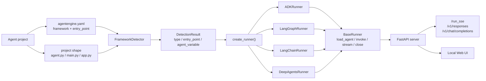
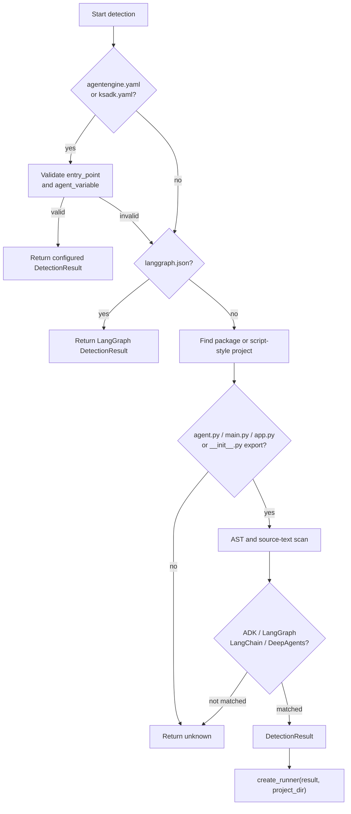

# Frameworks

KsADK supports common Python agent framework families through runtime adapters.
The public contract is simple: expose an agent object, declare the framework, and
run the project through `agentengine`.

## Supported Families

| Framework | Install extra | Typical export |
| --- | --- | --- |
| Google ADK | `ksadk[adk]` | `root_agent = Agent(...)` |
| LangGraph | `ksadk[langgraph]` | `root_agent = graph.compile()` |
| LangChain | `ksadk[langchain]` or framework dependencies | `root_agent = prompt | llm | parser` |
| DeepAgents | `ksadk[deepagents]` | `root_agent = create_deep_agent(...)` |

## Framework Runtime Architecture

KsADK treats every framework adapter as a small boundary around the user's
native agent object. The local server, Web UI, session store, and
OpenAI-compatible endpoints do not call framework-specific APIs directly. They
call the runner contract, and the runner owns the framework details.



The important design point is that framework detection is static while runner
loading is executable. Detection reads config files and source text; loading
imports the configured module and validates the exported object. That keeps
diagnostics clear: a project that cannot be detected has a packaging/config
problem, while a project that detects correctly but fails to load has an import,
dependency, or exported-object problem.

| Layer | Stable responsibility | Typical failure to check |
| --- | --- | --- |
| detection | find framework, entry point, package path, and exported variable | missing or inconsistent `agentengine.yaml` |
| factory | map `DetectionResult.type` to a concrete runner | unsupported framework value |
| runner loading | import the module and validate the exported agent object | dependency import error or wrong `agent_variable` |
| conversation runtime | normalize input, history, attachments, and platform context | malformed payload or session conflict |
| protocol surface | serialize the result as Web UI, SSE, Responses, or Chat Completions | API format mismatch |

## Google ADK

KsADK keeps the ADK programming model intact. The application still exports a
Google ADK `Agent`; KsADK detects the project, imports the configured object,
wraps it in the local runner, and exposes the same local CLI, Web UI, and HTTP
protocols used by other framework families.

```python
from google.adk.agents import Agent

def hello(name: str) -> dict:
    return {"message": f"Hello, {name}!"}

root_agent = Agent(
    name="hello_agent",
    description="Minimal ADK example",
    instruction="You are a helpful assistant.",
    tools=[hello],
)
```

Project config:

```yaml
name: hello-agent
framework: adk
entry_point: agent.py
agent_variable: root_agent
```

Recommended setup:

```bash
python -m venv .venv
source .venv/bin/activate
pip install -U "ksadk[adk]"
agentengine run . -i
agentengine web . --no-open
```

For ADK projects, optional KsADK integrations such as knowledge search,
long-term memory tools, MCP toolsets, and Skill Runtime tools are injected
during ADK runner loading when their environment variables are configured. A
minimal ADK tutorial should leave those variables unset so the first run only
depends on the ADK agent object and model configuration.

Common ADK loading failures:

| Error pattern | Check |
| --- | --- |
| project detected as `unknown` | `agentengine.yaml` exists and sets `framework: adk` |
| configured object is missing | `agent_variable` matches the exported Python variable |
| model calls fail | provider env vars are visible inside the project virtualenv |
| optional tools are missing | the matching KsADK feature flags and dependencies are installed |

## LangGraph

```python
from typing import Annotated, TypedDict
import operator
from langchain_openai import ChatOpenAI
from langgraph.graph import END, StateGraph

class State(TypedDict):
    messages: Annotated[list, operator.add]

llm = ChatOpenAI(model="my-model", base_url="https://api.example.com/v1", api_key="sk-test")

def chat(state: State):
    return {"messages": [llm.invoke(state["messages"])]}

graph = StateGraph(State)
graph.add_node("chat", chat)
graph.set_entry_point("chat")
graph.add_edge("chat", END)

root_agent = graph.compile()
```

Project config:

```yaml
name: langgraph-agent
framework: langgraph
entry_point: agent.py
agent_variable: root_agent
```

## LangChain

```python
from langchain_core.output_parsers import StrOutputParser
from langchain_core.prompts import ChatPromptTemplate
from langchain_openai import ChatOpenAI

llm = ChatOpenAI(model="my-model", base_url="https://api.example.com/v1", api_key="sk-test")
prompt = ChatPromptTemplate.from_messages([
    ("system", "You are a helpful assistant."),
    ("human", "{input}"),
])

root_agent = prompt | llm | StrOutputParser()
```

Project config:

```yaml
name: langchain-agent
framework: langchain
entry_point: agent.py
agent_variable: root_agent
```

## DeepAgents

```python
from deepagents import create_deep_agent
from langchain_openai import ChatOpenAI

llm = ChatOpenAI(model="my-model", base_url="https://api.example.com/v1", api_key="sk-test")
root_agent = create_deep_agent(model=llm)
```

Project config:

```yaml
name: deep-agent
framework: deepagents
entry_point: agent.py
agent_variable: root_agent
```

## Detection Order

KsADK first checks explicit project configuration. If no config file exists, it
tries common project shapes:

- `langgraph.json`
- a package with `agent.py`, `main.py`, or `app.py`
- a package `__init__.py` that exports common agent variables
- a script-style project with `agent.py`, `main.py`, or `app.py`

Explicit YAML is recommended for public examples because it is easier to review
and less dependent on heuristics.

## Detection Details

Detection is a static step. It reads configuration files and source text, but it
does not execute the user agent module. That keeps framework detection separate
from framework loading.

The detection result carries these values into the runner factory:

| Field | Why it matters |
| --- | --- |
| `type` | selects the runner adapter |
| `name` | used for display and runtime metadata |
| `entry_point` | Python file to import during runner loading |
| `package_path` | package or directory that contains the entry point |
| `agent_variable` | exported object to load from the entry point |
| `confidence` | diagnostic signal for convention-based detection |

If a configured entry file exists but does not export the configured variable,
fix the export or the `agent_variable` setting. Do not work around this by
adding import side effects that create global state indirectly.

## Detection To Runner Pipeline

Explicit configuration is the recommended path for public examples, but the
detector also supports convention-based projects. The pipeline below is useful
when reviewing examples or debugging why a project was loaded as the wrong
framework.



The runner factory applies a small LangChain compatibility patch, then creates
one of the concrete runners. This is intentionally a narrow switch instead of a
plugin registry: the public contract is easier to audit, and new framework
families can be reviewed as explicit additions.

## Runner Loading Behavior

Each runner keeps the framework's native execution model:

| Runner | Loading path | Native execution |
| --- | --- | --- |
| ADK | imports the configured ADK `Agent` and wraps it in a Google ADK runner | ADK `Runner.run_async()` |
| LangGraph | imports the configured graph object | graph `invoke` / `ainvoke` / event stream |
| LangChain | imports the configured runnable, chain, or callable | runnable/callable invoke and stream |
| DeepAgents | reuses the LangGraph runner path | compiled graph execution |

The adapters normalize the result into `{"output": ...}` for non-streaming calls
and semantic chunks for streaming calls. They do not rewrite the user's agent
into a different framework.

## Runner Responsibilities

All framework adapters implement the same public responsibilities:

| Responsibility | Meaning |
| --- | --- |
| load | import the configured module and validate the exported object |
| prepare | apply per-request model overrides where supported |
| invoke | run one non-streaming turn |
| stream | run one streaming turn |
| close | release framework or runtime resources on shutdown |

This keeps the HTTP server and Web UI independent from framework-specific
objects. Framework-specific behavior belongs in the adapter or in the
application's own hook functions.

## Custom Input Hooks

LangGraph and LangChain applications often use custom state shapes. Add a hook
in the configured entry module when the default mapping is not enough:

```python
def ksadk_prepare_state(payload: dict, session_context: dict) -> dict:
    return {
        "messages": payload.get("input_messages", []),
        "question": payload.get("input", ""),
        "knowledge": session_context.get("kb_context"),
        "memory": session_context.get("memory_context"),
    }
```

```python
def ksadk_prepare_input(payload: dict, session_context: dict) -> dict:
    return {
        "question": payload.get("input", ""),
        "history": session_context.get("history", []),
        "attachments": payload.get("attachment_results", []),
    }
```

Hooks make examples easier to test because business code receives a stable,
explicit dictionary instead of reading local UI events or session internals.

## Model Overrides

Requests can provide a model override through the CLI or HTTP payload. KsADK
normalizes the requested model and calls the runner before execution. The effect
depends on the framework:

| Framework family | Typical behavior |
| --- | --- |
| ADK | applies the requested model to the loaded agent tree when possible |
| LangGraph | synchronizes model environment variables and reloads the module when needed |
| LangChain | synchronizes model environment variables and reloads the module when needed |
| Remote runner | forwards the model in the outgoing OpenAI-compatible payload |

For deterministic examples, set a default model in `.env` or your provider
configuration, then use request-level overrides only when you need to test model
selection.

## Session Continuity

Frameworks differ in how much native session state they expose. KsADK describes
that capability through runner session adapters:

| Continuity path | Meaning |
| --- | --- |
| transcript replay | KsADK projects prior session events back into model history |
| standard hook | user hook receives structured history and session context |
| framework checkpoint | framework runtime keeps recoverable state |
| native session | framework has its own session service or equivalent state |

Transcript replay is the portable baseline. Native checkpoint or session paths
are useful when the framework supports them, but examples should still behave
reasonably when only transcript replay is available.

## Local Invocation

All framework examples should support the same local commands:

```bash
agentengine run . -i
agentengine web . --no-open
```

Hosted deployment examples are optional and must provide a local fallback.
