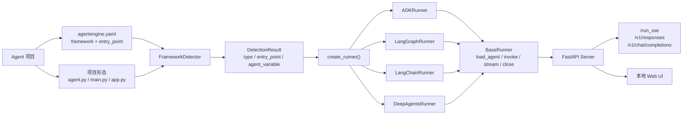
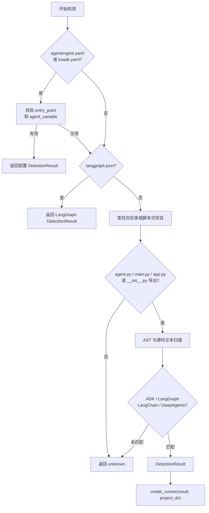

# 框架接入

KsADK 通过运行时适配器接入常见 Python Agent 框架。公开契约很简单：
暴露一个 Agent 对象，声明框架类型，然后用 `agentengine` 运行项目。

## 支持的框架族

| 框架 | 安装 extra | 常见导出对象 |
| --- | --- | --- |
| Google ADK | `ksadk[adk]` | `root_agent = Agent(...)` |
| LangGraph | `ksadk[langgraph]` | `root_agent = graph.compile()` |
| LangChain | `ksadk[langchain]` 或框架依赖 | `root_agent = prompt | llm | parser` |
| DeepAgents | `ksadk[deepagents]` | `root_agent = create_deep_agent(...)` |

## 框架运行时架构

KsADK 把每个框架适配器当作围绕用户原生 Agent 对象的一层边界。本地
Server、Web UI、会话存储和 OpenAI 兼容接口不会直接调用框架私有 API，
而是统一调用 runner 契约；具体框架行为由 runner 负责。



关键点是：框架检测是静态步骤，runner 加载是可执行步骤。检测阶段读取
配置文件和源码文本；加载阶段才导入配置模块并验证导出对象。这样排错
边界更清晰：不能检测通常是配置或项目结构问题；检测成功但加载失败，
通常是依赖、导入路径或 `agent_variable` 问题。

| 层级 | 稳定职责 | 常见排查点 |
| --- | --- | --- |
| detection | 找到框架、入口文件、包路径和导出变量 | `agentengine.yaml` 缺失或不一致 |
| factory | 将 `DetectionResult.type` 映射成具体 runner | framework 值不受支持 |
| runner loading | 导入模块并验证导出的 Agent 对象 | 依赖导入错误或 `agent_variable` 不匹配 |
| conversation runtime | 归一化输入、历史、附件和平台上下文 | payload 形态错误或会话冲突 |
| protocol surface | 序列化为 Web UI、SSE、Responses 或 Chat Completions | API 格式不匹配 |

## Google ADK

KsADK 保留 ADK 的编程模型。应用仍然导出 Google ADK `Agent`；KsADK 检测
项目、导入配置对象、用本地 runner 包装它，并暴露与其他框架一致的 CLI、
Web UI 和 HTTP 协议。

```python
from google.adk.agents import Agent

def hello(name: str) -> dict:
    return {"message": f"Hello, {name}!"}

root_agent = Agent(
    name="hello_agent",
    description="Minimal ADK example",
    instruction="You are a helpful assistant.",
    tools=[hello],
)
```

项目配置：

```yaml
name: hello-agent
framework: adk
entry_point: agent.py
agent_variable: root_agent
```

本地运行：

```bash
python -m venv .venv
source .venv/bin/activate
pip install -U "ksadk[adk]"
agentengine run . -i
agentengine web . --no-open
```

对于 ADK 项目，知识库、长期记忆、MCP toolset 和 Skill Runtime 工具都在
ADK runner 加载阶段按环境变量注入。最小示例应先不启用这些可选变量，
确保第一轮运行只依赖 Agent 对象和模型配置。

## LangGraph

```python
from typing import Annotated, TypedDict
import operator
from langchain_openai import ChatOpenAI
from langgraph.graph import END, StateGraph

class State(TypedDict):
    messages: Annotated[list, operator.add]

llm = ChatOpenAI(model="my-model", base_url="https://api.example.com/v1", api_key="sk-test")

def chat(state: State):
    return {"messages": [llm.invoke(state["messages"])]}

graph = StateGraph(State)
graph.add_node("chat", chat)
graph.set_entry_point("chat")
graph.add_edge("chat", END)

root_agent = graph.compile()
```

```yaml
name: langgraph-agent
framework: langgraph
entry_point: agent.py
agent_variable: root_agent
```

## LangChain

```python
from langchain_core.output_parsers import StrOutputParser
from langchain_core.prompts import ChatPromptTemplate
from langchain_openai import ChatOpenAI

llm = ChatOpenAI(model="my-model", base_url="https://api.example.com/v1", api_key="sk-test")
prompt = ChatPromptTemplate.from_messages([
    ("system", "You are a helpful assistant."),
    ("human", "{input}"),
])

root_agent = prompt | llm | StrOutputParser()
```

```yaml
name: langchain-agent
framework: langchain
entry_point: agent.py
agent_variable: root_agent
```

## DeepAgents

```python
from deepagents import create_deep_agent
from langchain_openai import ChatOpenAI

llm = ChatOpenAI(model="my-model", base_url="https://api.example.com/v1", api_key="sk-test")
root_agent = create_deep_agent(model=llm)
```

```yaml
name: deep-agent
framework: deepagents
entry_point: agent.py
agent_variable: root_agent
```

## 检测顺序

KsADK 优先读取显式项目配置。如果没有配置文件，再尝试常见项目形态：

- `langgraph.json`
- 包目录内的 `agent.py`、`main.py` 或 `app.py`
- 包目录 `__init__.py` 导出的常见 Agent 变量
- 当前目录直接包含 `agent.py`、`main.py` 或 `app.py` 的脚本式项目

公开示例建议使用显式 YAML，因为它更容易审查，也不依赖启发式规则。



## Runner 加载行为

每个 runner 都保留框架的原生执行模型：

| Runner | 加载路径 | 原生执行 |
| --- | --- | --- |
| ADK | 导入配置的 ADK `Agent` 并用 Google ADK runner 包装 | ADK `Runner.run_async()` |
| LangGraph | 导入配置的 graph 对象 | graph `invoke` / `ainvoke` / 事件流 |
| LangChain | 导入配置的 runnable、chain 或 callable | runnable/callable invoke 与 stream |
| DeepAgents | 复用 LangGraph runner 路径 | 编译 graph 执行 |

适配器会把非流式结果归一成 `{"output": ...}`，把流式结果归一成语义
chunk。它们不会把用户 Agent 改写成另一种框架。

## Runner 责任边界

所有框架适配器都实现同一组公开责任：

| 职责 | 含义 |
| --- | --- |
| load | 导入配置模块并校验导出对象 |
| prepare | 在支持的框架里应用请求级模型覆盖 |
| invoke | 执行一轮非流式调用 |
| stream | 执行一轮流式调用 |
| close | 关闭 runner 持有的运行时资源 |

HTTP Server 和 Web UI 因此不依赖具体框架对象。框架相关行为应放在 adapter
或应用自己的 hook 函数中。

## 自定义输入 Hook

LangGraph 和 LangChain 应用常见自定义 state。默认映射不够时，可以在入口
模块里增加 hook：

```python
def ksadk_prepare_state(payload: dict, session_context: dict) -> dict:
    return {
        "messages": payload.get("input_messages", []),
        "question": payload.get("input", ""),
        "knowledge": session_context.get("kb_context"),
        "memory": session_context.get("memory_context"),
    }
```

```python
def ksadk_prepare_input(payload: dict, session_context: dict) -> dict:
    return {
        "question": payload.get("input", ""),
        "history": session_context.get("history", []),
        "attachments": payload.get("attachment_results", []),
    }
```

hook 能让业务代码拿到稳定、显式的字典，而不是读取本地 UI 事件或会话内部
结构。

## 模型覆盖

请求可以通过 CLI 或 HTTP payload 提供模型覆盖。KsADK 会先归一化请求模型，
再通知 runner 准备执行。不同框架的效果不同：

| 框架族 | 常见行为 |
| --- | --- |
| ADK | 在可能时把请求模型应用到已加载的 agent tree |
| LangGraph | 同步模型环境变量，必要时重载模块 |
| LangChain | 同步模型环境变量，必要时重载模块 |
| Remote runner | 在 OpenAI 兼容 payload 中转发模型 |

可复现示例建议在 `.env` 或 provider 配置中设置默认模型；请求级覆盖只用于
测试模型选择。

## 会话连续性

不同框架暴露的原生会话能力不同。KsADK 用 runner session adapter 描述这种
能力：

| 连续性路径 | 含义 |
| --- | --- |
| transcript replay | KsADK 把之前的会话事件投影回模型历史 |
| standard hook | 用户 hook 接收结构化历史和会话上下文 |
| framework checkpoint | 框架运行时保留可恢复状态 |
| native session | 框架拥有自己的 session service 或等价状态 |

transcript replay 是可移植基线。框架 checkpoint 或 native session 在框架
支持时很有用，但示例仍应在只有 transcript replay 时正常工作。

## 本地调用

所有框架示例都应支持同一组本地命令：

```bash
agentengine run . -i
agentengine web . --no-open
```

托管部署示例可以作为进阶内容，但必须提供本地 fallback。
