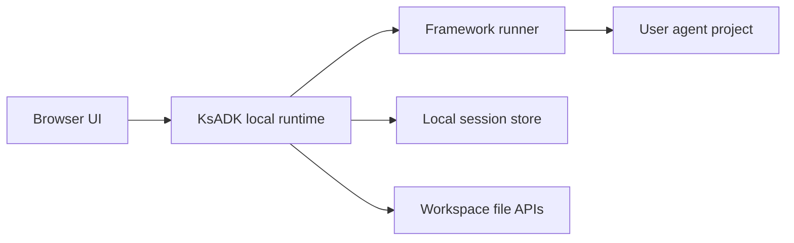

# Local Web UI

`agentengine web` starts a local browser UI for invoking and debugging an agent
project. It is the local development UI, not the hosted AgentEngine dashboard.

## Start The UI

From a project directory:

```bash
agentengine web .
```

Run without opening a browser automatically:

```bash
agentengine web . --no-open
```

Use a specific port:

```bash
agentengine web . --port 7860
```

Override the configured model for one debugging session:

```bash
agentengine web . --model my-model
```

## What The UI Is For

Use the local Web UI to:

- send messages to the selected agent.
- test streaming and non-streaming behavior.
- inspect file and image input flows when supported by the runner.
- keep a browser-based debug loop while editing the project.
- verify how the local runtime serializes requests into OpenAI-compatible shapes.
- inspect sessions, run events, feedback state, and workspace file previews when
  those local runtime features are enabled.

## Runtime Relationship

The UI talks to the local KsADK runtime. For normal SDK users, the static UI
assets are already bundled in the wheel. Node.js is only needed when developing
the UI source itself.



The UI should not call a model provider directly. It calls the local runtime,
and the runtime invokes the configured framework runner.

## Local State

The local UI may create state under the project directory:

```text
.agentengine/
  ui/
    sessions.sqlite
```

This state is useful for development and should not be committed. Delete
`.agentengine/` if you want to reset local UI sessions.

## Independent UI Repository

The editable Web UI source is planned as a separate repository:

- `kingsoftcloud/ksadk-web`

This repository is the shared Web UI repository for both:

- the local static UI consumed by `ksadk-python`.
- the hosted UI build consumed by internal hosted deployments.

The Python SDK should embed generated static assets and record the source
version it consumed. Hosted-only deployment files, private routing, Helm values,
and generated hosted bundles must not be published as part of the SDK wheel.

See [Web UI Repository](web-ui-source.md) for the repository split and
release contract.

## Development Mode

End users do not need Node.js, but UI contributors do. The source repository
should provide:

```bash
npm ci
npm test
npm run build:ksadk
npm run build:hosted
```

`build:ksadk` creates the relative-path static bundle consumed by the Python
SDK. `build:hosted` creates the hosted bundle with hosted routing assumptions.

## Common Failures

| Symptom | Check |
| --- | --- |
| Browser does not open | run with `--no-open` and open the printed URL manually. |
| Port already in use | pass `--port <free-port>`. |
| Agent cannot load | run `agentengine run . -i` first to isolate project detection and model config. |
| Model calls fail | verify `.env`, `OPENAI_BASE_URL`, `OPENAI_MODEL_NAME`, and provider compatibility. |
| old session data appears | remove `.agentengine/ui/` for a clean local state. |
