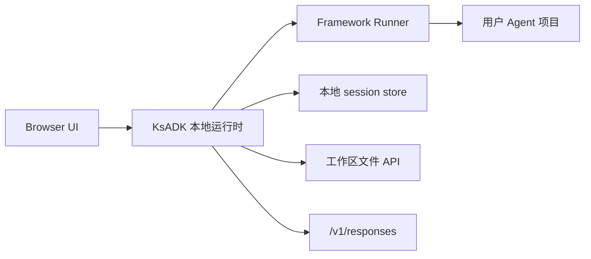

# 本地 Web UI

`agentengine web` 会为 Agent 项目启动本地浏览器 UI，用于调用和调试。它是本地
开发 UI，不是 hosted AgentEngine dashboard。

## 启动 UI

在项目目录中运行：

```bash
agentengine web .
```

不自动打开浏览器：

```bash
agentengine web . --no-open
```

指定端口：

```bash
agentengine web . --port 7860
```

为一次调试覆盖模型：

```bash
agentengine web . --model my-model
```

## UI 用来做什么

本地 Web UI 适合：

- 给当前 Agent 发送消息。
- 测试 streaming 和 non-streaming 行为。
- 在 Runner 支持时检查文件和图片输入流程。
- 编辑项目时保持浏览器调试循环。
- 验证本地运行时如何把请求序列化为 OpenAI 兼容形态。
- 在启用相关本地能力时检查 sessions、run events、feedback 状态和工作区文件预览。

## 与运行时的关系

UI 调用本地 KsADK 运行时。普通 SDK 用户安装 wheel 后已经拿到静态 UI 资源。
只有开发 UI 源码时才需要 Node.js。



UI 不直接调用模型 provider。它调用本地运行时，再由运行时调用配置好的框架 Runner。

## 本地状态

本地 UI 可能在项目目录下创建状态：

```text
.agentengine/
  ui/
    sessions.sqlite
```

这些状态对开发有用，但不是源代码。想重置本地 UI sessions 时删除 `.agentengine/`。

## 独立 UI 仓库

可编辑 Web UI 源码计划放在独立仓库：

- `kingsoftcloud/ksadk-web`

这个仓库同时服务：

- `ksadk-python` 消费的本地静态 UI。
- 内部 hosted deployment 消费的 hosted UI build。

Python SDK 应内置生成后的静态资源，并记录消费的 source version。Hosted-only
部署文件、私有路由、Helm values 和生成后的 hosted bundle 不应进入 SDK wheel。

见 [Web UI 仓库](web-ui-source.md) 了解仓库拆分和发布契约。

## 开发模式

终端用户不需要 Node.js，但 UI contributor 需要。源码仓库应提供：

```bash
npm ci
npm test
npm run build:ksadk
npm run build:hosted
```

`build:ksadk` 生成 Python SDK 消费的相对路径静态 bundle。`build:hosted` 生成带
hosted 路由假设的 bundle。

## 常见失败

| 现象 | 检查项 |
| --- | --- |
| 浏览器没有打开 | 用 `--no-open` 运行，并手动打开打印的 URL。 |
| 端口占用 | 传入 `--port <free-port>`。 |
| Agent 加载失败 | 先运行 `agentengine run . -i`，隔离项目检测和模型配置问题。 |
| 模型调用失败 | 检查 `.env`、`OPENAI_BASE_URL`、`OPENAI_MODEL_NAME` 和 provider 兼容性。 |
| 出现旧 session 数据 | 删除 `.agentengine/ui/`，获得干净本地状态。 |
