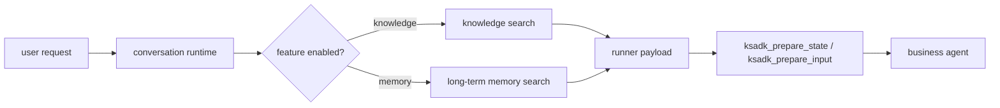
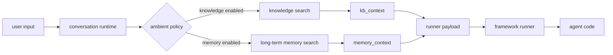

# Memory And Knowledge

KsADK includes memory and knowledge integration points for agent applications.
The public documentation treats these as optional capabilities layered on top of
the local runtime.

## Capability Model

Memory and knowledge are related, but they solve different problems:

| Capability | Purpose | Typical scope | Public-docs rule |
| --- | --- | --- | --- |
| Session history | Keep the current conversation coherent | one local session | enabled by the runtime |
| Long-term memory | Store user facts, preferences, or prior decisions across sessions | user and application | optional; use fake data in docs |
| Knowledge base | Retrieve external documents relevant to the current request | dataset or corpus | optional; avoid private datasets |
| Framework tools | Let the agent explicitly call memory or search tools | agent implementation | document the hook surface |
| Ambient context | Add retrieved memory or knowledge text before the runner call | runtime payload | mark as KsADK runtime behavior |

Session history is always part of the local conversation runtime. Long-term
memory and knowledge base retrieval are opt-in integrations. Public quickstarts
should run without any hosted memory or private knowledge service.

## Runtime Boundary

KsADK separates memory and knowledge into three layers:

1. framework tools, where the agent explicitly calls `load_memory`,
   `save_memory`, or a knowledge search tool.
2. ambient context, where the runtime retrieves short formatted context before
   calling the runner.
3. backend services, where application-specific storage or retrieval happens.



The public contract is the payload and hook shape. A concrete hosted memory or
knowledge backend is an optional deployment choice.

## What To Use Locally

For open-source examples, prefer storage that a developer can run without a
private account:

- in-memory state for quick tests.
- local files for deterministic examples.
- SQLite for small persistent demos.
- a local Redis instance only when the guide explicitly needs Redis behavior.

Use hosted memory or hosted knowledge base examples only after the credential
model and dataset boundary are public. Until then, document those features as
optional extension points.

## Long-Term Memory

Long-term memory is accessed through a small backend contract:

| Operation | Meaning |
| --- | --- |
| `save_memory(user_id, event_strings, **kwargs)` | persist one or more user-scoped facts or events |
| `search_memory(user_id, query, top_k, **kwargs)` | retrieve relevant memories for a query |

The runtime service chooses a backend from environment configuration, formats
results into prompt text, and exposes framework tools such as `load_memory` and
`save_memory`. If no long-term memory backend is configured, the public runtime
should continue to work normally.

Backend options can include local test stores, HTTP services, or cloud SDK
integrations. For open-source examples, document the interface first and make
hosted backends optional.

Example local shape:

```python
def save_preference(memory_store: dict[str, list[str]], user_id: str, value: str) -> None:
    memory_store.setdefault(user_id, []).append(value)


def search_preferences(memory_store: dict[str, list[str]], user_id: str, query: str) -> list[str]:
    return [item for item in memory_store.get(user_id, []) if query.lower() in item.lower()]
```

This intentionally uses an in-process dictionary. It is enough for a tutorial,
but production applications should choose a durable backend and define retention
and privacy policies.

## Knowledge Retrieval

Knowledge retrieval is for external facts, manuals, or product data. The public
SDK should not assume a private hosted dataset. A public example can use a small
local file corpus:

```python
DOCUMENTS = [
    {"title": "refund-policy.md", "text": "Refunds are reviewed within 5 business days."},
    {"title": "shipping.md", "text": "Standard shipping takes 3 to 7 business days."},
]


def search_documents(query: str, top_k: int = 3) -> list[dict[str, str]]:
    query_lower = query.lower()
    matches = [doc for doc in DOCUMENTS if query_lower in doc["text"].lower()]
    return matches[:top_k]
```

Hosted knowledge integrations can follow the same visible shape: a query enters
the retriever, the retriever returns scored snippets, and the runner receives a
short formatted context block. Keep raw private document IDs, account IDs, and
dataset names out of public examples.

## ADK Versus Other Frameworks

ADK projects can receive memory and knowledge through ADK-compatible tools and,
when configured, an ADK memory service. LangGraph, LangChain, and DeepAgents
projects should usually receive context through the runner payload or explicit
hook functions.

| Framework path | Recommended public pattern |
| --- | --- |
| ADK | expose optional ADK tools; keep the minimal sample credential-free |
| LangGraph | map `kb_context` and `memory_context` inside `ksadk_prepare_state` |
| LangChain | compose context into the chain input with `ksadk_prepare_input` |
| DeepAgents | pass context through model/tool configuration used by the app |

This distinction matters because ADK has native tool and memory concepts, while
message/state frameworks often need application-specific state mapping.

## Runtime Context Flow

When configured, KsADK can build memory and knowledge context before calling the
framework runner:



`kb_context` and `memory_context` are KsADK runtime extensions. They should be
described as local runner context, not as official OpenAI protocol fields.

## Framework Integration

Memory and knowledge features should be exposed through normal framework hooks:

- ADK tools or callbacks.
- LangChain tools.
- LangGraph state and checkpointers.
- DeepAgents model/tool configuration.

The exact implementation should be selected by the application. KsADK should
provide runtime compatibility and examples, not force one hosted backend in the
public quickstart.

### LangGraph

For LangGraph projects with custom state, expose a top-level
`ksadk_prepare_state(payload, session_context)` function. Use the payload for
the current input and the session context for runtime-provided context:

```python
def ksadk_prepare_state(payload: dict, session_context: dict) -> dict:
    return {
        "messages": payload.get("input_messages", []),
        "question": payload.get("input", ""),
        "knowledge": session_context.get("kb_context"),
        "memory": session_context.get("memory_context"),
    }
```

For messages-native graphs, the default runner can often build the state
without a custom hook. Add a hook when your graph uses fields beyond `messages`.

### LangChain

For LangChain projects, expose `ksadk_prepare_input(payload, session_context)`
when the application needs direct access to memory or knowledge context:

```python
def ksadk_prepare_input(payload: dict, session_context: dict) -> str:
    sections = []
    if session_context.get("kb_context"):
        sections.append("Knowledge context:\n" + session_context["kb_context"]["formatted_text"])
    if session_context.get("memory_context"):
        sections.append("Memory context:\n" + session_context["memory_context"]["formatted_text"])
    sections.append("User request:\n" + payload.get("input", ""))
    return "\n\n".join(sections)
```

### ADK

ADK projects should prefer ADK-native tools and services. KsADK can expose
memory and knowledge tools in ADK-compatible form when those optional
integrations are configured. Public samples should still run with local or fake
data unless hosted credentials are intentionally part of the sample.

## Environment Variables

Use placeholders in public docs. The exact backend configuration may vary by
deployment, but these names define the public-facing configuration family:

| Variable | Purpose |
| --- | --- |
| `KSADK_LTM_BACKEND` | enable a long-term memory backend |
| `KSADK_LTM_INDEX` | isolate an application or collection |
| `KSADK_LTM_TOP_K` | default number of memories to retrieve |
| `KSADK_KB_DATASET_ID` | enable a knowledge dataset integration |
| `KSADK_KB_TOP_K` | default number of document snippets to retrieve |
| `KSADK_KB_SEARCH_METHOD` | retrieval method when supported by the backend |
| `KSADK_KB_SCORE_THRESHOLD` | optional relevance threshold |

Do not commit real values for dataset IDs, tokens, access keys, or customer
collection names. Put private values in local `.env` files or CI secrets.

## Failure Behavior

Memory and knowledge integrations should be best-effort in local development:

- missing optional configuration should not stop a normal quickstart.
- retrieval errors should be surfaced as diagnostics, not hidden as successful
  empty context.
- agent code should handle `None`, empty context, and partial results.
- tests should cover behavior with integrations disabled.

## Hosted Integrations

Hosted memory, knowledge base, and Skill Service integrations can be documented
as optional capabilities after their public credential model is approved.

Public docs must not require:

- internal service tokens.
- customer datasets.
- private traces or logs.
- internal object storage.
- private support URLs.

## Recommended Public Example Pattern

When adding a memory or knowledge example to the public repository:

1. make the first run work with no hosted credentials.
2. use a tiny local corpus or in-memory store.
3. show where to swap in a real backend.
4. keep user data, extracted document text, and traces out of the repository.
5. document whether the example uses session history, long-term memory, or
   knowledge retrieval.

## Example Data Rule

Examples should use fake data or public sample data. Treat logs, traces, memory
snapshots, uploaded files, and knowledge base records as potentially sensitive
until reviewed.
