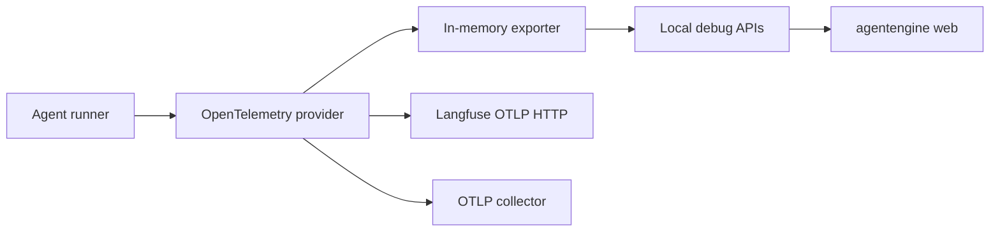

# Observability And Tracing

KsADK includes a local-first tracing layer for debugging agent runs, inspecting
runtime behavior, and exporting spans to external observability systems. The
public SDK treats tracing as an optional diagnostic layer around the runner and
server lifecycle. It does not replace framework-specific logging, hosted control
plane telemetry, or application-level metrics.

## What Is Traced

Tracing is centered on OpenTelemetry. When tracing is enabled, KsADK creates or
uses an OpenTelemetry `TracerProvider` and attaches span processors for the
enabled exporters.

| Export path | Default | Purpose |
| --- | --- | --- |
| In-memory spans | enabled for local runner paths | drive local debug APIs and Web UI trace views |
| Langfuse OTLP HTTP | enabled when Langfuse credentials are present | export spans to a Langfuse deployment |
| Generic OTLP gRPC | explicit opt-in | send spans to an external OTLP collector |
| OpenInference instrumentation | best effort | add framework-level spans for supported ADK or LangChain paths |

The local in-memory exporter is the safest public default because it works
without an external service. Remote exporters are configured through environment
variables and should be treated as optional integrations.

## Local Trace Flow



The local flow is intentionally short: a runner produces spans, OpenTelemetry
exports them to memory, and the local API/UI reads recent spans for debugging.
External exporters are parallel sinks. If an external exporter fails or is not
configured, local runs should still be able to proceed.

## Langfuse Direct OTLP

Set Langfuse credentials in the environment before starting the local runtime:

```bash
export LANGFUSE_PUBLIC_KEY="pk-example"
export LANGFUSE_SECRET_KEY="secret-example"
export LANGFUSE_BASE_URL="https://langfuse.example.com"

agentengine run .
```

When both keys are available, KsADK can build a Langfuse OTLP HTTP exporter and
send spans to the Langfuse ingestion endpoint under the configured base URL.
Use a user-owned Langfuse instance in public examples. Do not publish real
project credentials, private endpoints, or screenshots that expose trace data.

## Callback-Only Mode

Some LangChain or LangGraph projects may prefer the Langfuse callback handler
instead of direct OTLP export. Enable callback-only mode explicitly:

```bash
export LANGFUSE_PUBLIC_KEY="pk-example"
export LANGFUSE_SECRET_KEY="secret-example"
export LANGFUSE_BASE_URL="https://langfuse.example.com"
export LANGFUSE_USE_CALLBACK="true"

agentengine run .
```

Callback-only mode is useful when the framework's native callback path already
creates the desired trace shape. Avoid enabling both direct OTLP and callback
export for the same run unless you have verified that duplicate traces are
acceptable.

## Generic OTLP

Generic OTLP export is intended for teams that already operate an OTLP collector.
It should be enabled by code or configuration that names the collector endpoint.
Keep the collector URL outside committed files when it identifies a private
network.

For public docs and samples, prefer showing the local in-memory path or a
placeholder endpoint. Operational collector details belong in private deployment
runbooks, not in the public SDK repository.

## Metadata

Trace metadata may include:

- agent name and runtime name.
- user and session identifiers.
- environment, version, and tags.
- framework information.
- model information when available.

Use stable, non-sensitive identifiers. Do not put raw prompts, credentials,
private URLs, customer names, or uploaded file contents into tags or metadata.
If a trace backend stores payload content, treat it as application data and
apply the same retention and access-control policy you use for logs.

## Troubleshooting

| Symptom | Likely cause | Check |
| --- | --- | --- |
| Local trace view is empty | no run has produced spans, or tracing was disabled | run one request and confirm the local server is using tracing |
| Langfuse receives no spans | missing key, wrong base URL, or callback-only mode | check Langfuse environment variables and `LANGFUSE_USE_CALLBACK` |
| Duplicate Langfuse traces | direct OTLP and callback export both enabled | choose one export path for the project |
| Framework spans are sparse | optional instrumentation is not installed or not active | install tracing extras and check framework-specific instrumentation |
| OTLP collector rejects data | endpoint, TLS, auth, or collector policy mismatch | verify collector configuration outside the public repo |

## Public Documentation Rules

Tracing examples in this site must be safe to copy:

- use placeholder keys and user-owned endpoints.
- never include real trace IDs from private deployments.
- never commit `.env` files containing tracing credentials.
- keep private collector URLs and tenant identifiers out of examples.
- document optional integrations separately from the local quickstart.

