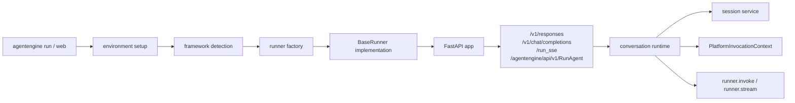
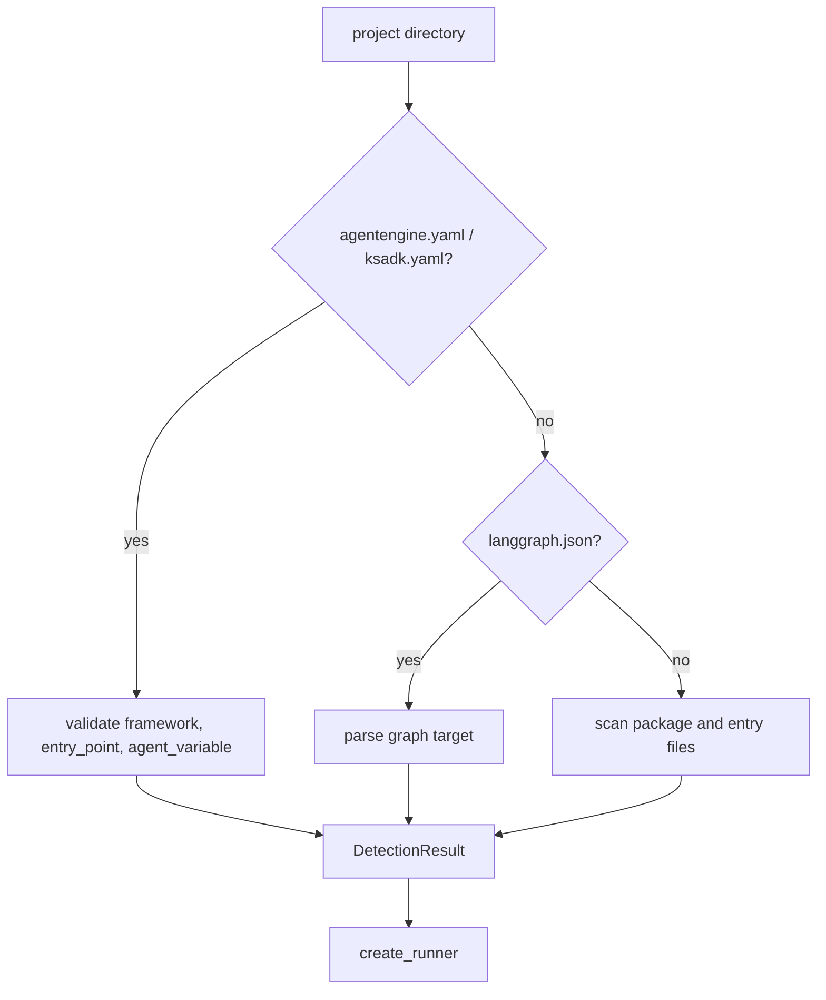
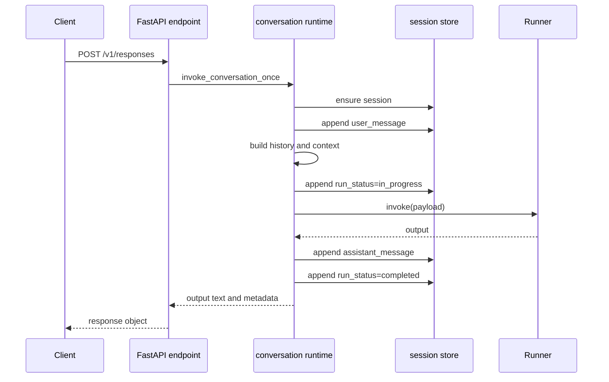

# Runtime Architecture

KsADK local runtime has one central job: load a user agent project, adapt the
selected framework to a common runner interface, and expose predictable local
protocols for terminal, browser, and API clients.

## Layer Model



The important boundary is that the HTTP server and conversation runtime do not
need to know whether the user project is ADK, LangGraph, LangChain, or
DeepAgents. They call `BaseRunner.invoke()` or `BaseRunner.stream()`.

## Core Packages

| Package | Responsibility |
| --- | --- |
| `ksadk.cli` | command entry points, local process setup, user-facing errors |
| `ksadk.detection` | project config, entry file, framework, and agent variable detection |
| `ksadk.runners` | common runner contract and framework adapters |
| `ksadk.server` | FastAPI app, local Web UI APIs, OpenAI-compatible endpoints |
| `ksadk.conversations` | message normalization, session turn orchestration, protocol payloads |
| `ksadk.sessions` | local and pluggable session storage |
| `ksadk_runtime_common.workspace_files` | reusable workspace file routes and preview security |

## Startup Lifecycle

`agentengine run` and `agentengine web` follow the same broad path:

1. resolve the project directory.
2. re-execute inside the project virtual environment when needed.
3. load environment and project settings.
4. detect the framework and entry point.
5. create the matching runner.
6. load the user agent.
7. run terminal mode or start the local HTTP server.

If framework detection returns `unknown`, the CLI stops before importing the
user project as a runner.

## Startup Boundaries

The local runtime has a strict startup boundary:

1. CLI code resolves paths, configuration, environment variables, and the
   project virtual environment.
2. detection code decides which framework adapter should be used.
3. the runner factory creates a framework-specific runner.
4. the runner loads user code.
5. the server layer exposes HTTP protocols and delegates execution to the
   runner.

Detection happens before user code is imported. That distinction is important
for safety and debuggability: a broken module import should be reported as an
agent loading problem, while a missing `agentengine.yaml`, invalid entry point,
or unsupported framework should be reported as a project detection problem.

For public examples, keep project setup explicit:

```yaml
name: support-agent
framework: langgraph
entry_point: agent.py
agent_variable: root_agent
```

Explicit configuration reduces ambiguity in CI and makes the same project work
the same way under `agentengine run`, `agentengine web`, local API tests, and
packaging checks.

## Framework Detection

Detection uses explicit configuration first, then convention:



Public samples should include `agentengine.yaml` because explicit config is
easier to review and less dependent on source-code heuristics.

The convention-based fallback is still useful for quick experiments. It checks
common project layouts such as:

- a root `agent.py`, `main.py`, or `app.py`.
- a package directory with `agent.py`, `main.py`, `app.py`, or `__init__.py`.
- a `src/<package>` layout.
- `langgraph.json` graph targets.

When convention detection is used, the runtime still needs two concrete facts:
which file should be imported and which variable inside that file is the agent
object. If either value is ambiguous, add `agentengine.yaml` instead of relying
on heuristics.

## Runner Contract

Every runner implements the same conceptual contract:

| Method | Meaning |
| --- | --- |
| `load_agent()` | import and prepare the user agent object |
| `invoke(input_data)` | execute one non-streaming turn |
| `stream(input_data)` | execute one streaming turn |
| `prepare_for_request(model)` | apply per-request model override where supported |
| `close()` | release resources when the server shuts down |

This contract is intentionally narrow. Framework-specific behavior belongs in
the adapter, not in the FastAPI endpoint.

The narrow contract also defines where custom behavior should live:

| Need | Preferred location |
| --- | --- |
| custom state mapping for LangGraph | `ksadk_prepare_state` in the user module |
| custom input mapping for LangChain | `ksadk_prepare_input` in the user module |
| model override handling | runner `prepare_for_request()` |
| framework-native session continuity | runner session adapter |
| protocol-specific JSON/SSE formatting | server and conversation runtime |

If you are adding a new framework adapter, start with `BaseRunner` and implement
`load_agent()`, `invoke()`, and `stream()` first. Add session continuity,
dynamic model overrides, or protocol-specific event mapping only after the
basic invoke and stream paths are stable.

## Request Lifecycle

A normal non-streaming `/v1/responses` request follows this path:



Streaming uses the same preparation path, then serializes internal semantic
events into server-sent events. Text deltas, reasoning, tool calls, tool results,
approval interrupts, final output, and errors are represented as runtime events
before they become protocol-specific SSE payloads.

## Streaming Event Model

Streaming output is normalized before it is serialized. Framework adapters may
emit very different native events, but the conversation runtime expects a small
set of semantic chunk types:

| Chunk type | Meaning | Typical source |
| --- | --- | --- |
| `text` | assistant text delta | model token stream |
| `thinking` | reasoning or thought delta when available | provider or ADK event |
| `tool_call` | tool call started or arguments updated | LangGraph, ADK, MCP, or custom tool event |
| `tool_result` | tool output became available | framework tool result event |
| `interrupt` | run paused for approval or external input | graph interrupt or approval flow |
| `final` | final authoritative output | framework final state |
| `error` | execution failed | runner or protocol exception |

The protocol layer then maps those semantic events to `/v1/responses`,
`/v1/chat/completions`, `/run_sse`, or the local Web UI action format. This is
why application code should not depend on a specific SSE event name unless it is
writing a client for that exact public protocol.

## Session And Context Boundary

Every turn builds a `PlatformInvocationContext` before calling the runner. It
contains the stable identifiers and runtime facts a framework adapter may need:

- `agent_id`, `user_id`, `session_id`, and invocation metadata.
- normalized input content and message history.
- effective attachments and current-turn attachments.
- model, model metadata, and model options.
- knowledge and memory context when those integrations are enabled.

The runner receives this context as part of the prepared input. Business logic
should prefer the documented runner payload fields and framework hooks over
reading private server globals. That keeps local terminal runs, Web UI runs, and
OpenAI-compatible API calls aligned.

## Local Protocol Entrypoints

| Endpoint | Purpose |
| --- | --- |
| `POST /v1/responses` | preferred OpenAI-compatible local protocol |
| `POST /v1/chat/completions` | compatibility with Chat Completions clients |
| `POST /agentengine/api/v1/RunAgent` | local Web UI action-style protocol |
| `POST /run_sse` | ADK Web compatible local execution path |
| `POST /agentengine/api/v1/UploadFile` | local file upload for UI flows |
| `/_ksadk/workspace/v1/*` | workspace file list/read/write/delete routes |

External clients should prefer `/v1/responses` unless they are integrating with
the local Web UI itself.

## Public Documentation Boundary

This page describes the public local runtime architecture. It intentionally does
not publish private gateway behavior, internal cluster deployment details,
internal kubeconfig paths, private registry names, or customer-specific runbooks.
