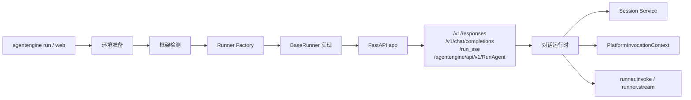
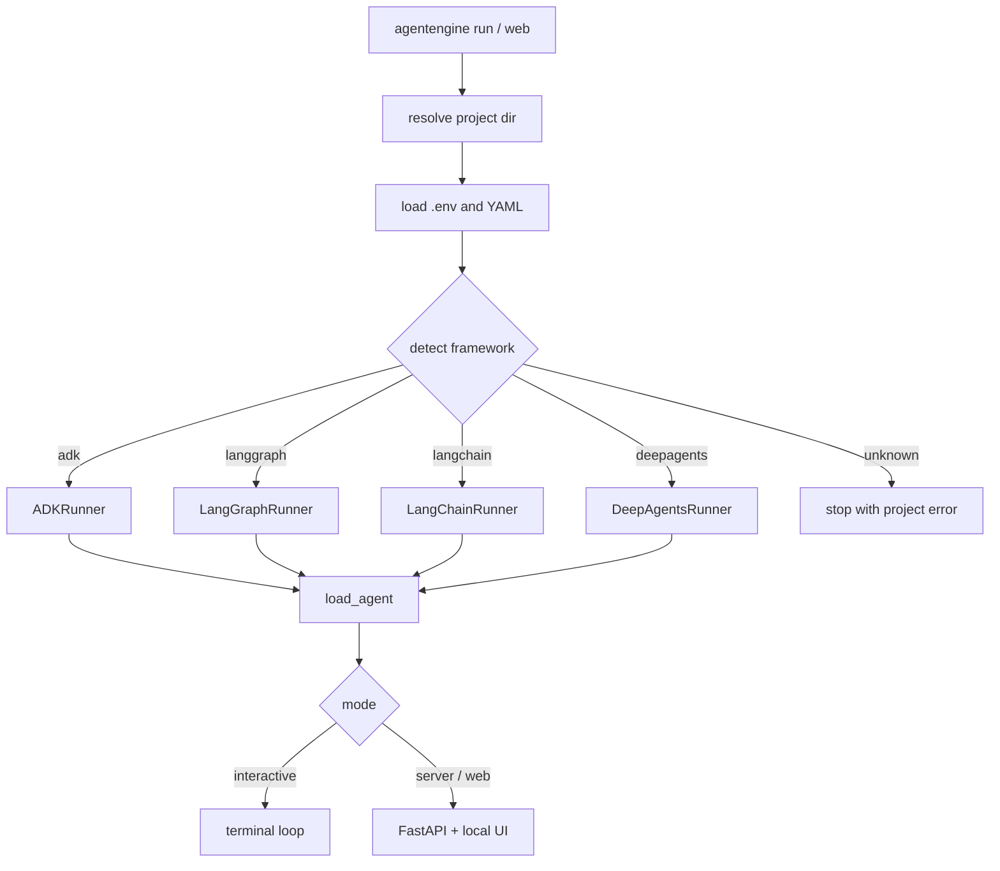
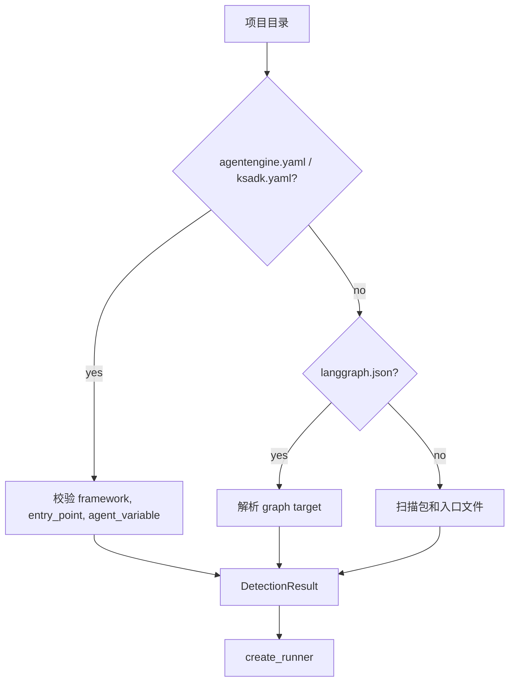
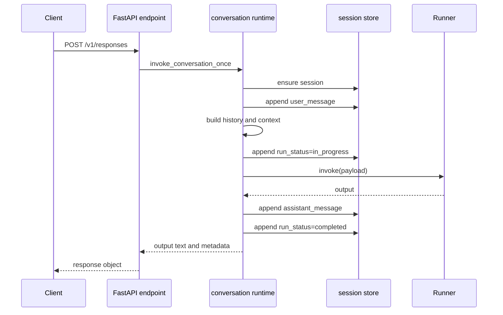

# 运行时架构

KsADK 本地运行时的核心职责是：加载用户 Agent 项目，把所选框架适配到统一 Runner
接口，并为终端、浏览器和 API 客户端暴露可预测的本地协议。

## 分层模型



关键边界是：HTTP server 和对话运行时不需要知道用户项目是 ADK、LangGraph、
LangChain 还是 DeepAgents。它们调用 `BaseRunner.invoke()` 或
`BaseRunner.stream()`。

## 核心包

| Package | 职责 |
| --- | --- |
| `ksadk.cli` | 命令入口、本地进程准备、用户可读错误 |
| `ksadk.detection` | 项目配置、入口文件、框架和 Agent 变量检测 |
| `ksadk.runners` | 统一 Runner 契约和框架适配器 |
| `ksadk.server` | FastAPI app、本地 Web UI API、OpenAI 兼容 endpoint |
| `ksadk.conversations` | 消息规范化、session turn 编排、协议 payload |
| `ksadk.sessions` | 本地和可插拔 session 存储 |
| `ksadk_runtime_common.workspace_files` | 可复用工作区文件路由和预览安全 |

## 启动生命周期

`agentengine run` 和 `agentengine web` 大体路径一致：

1. 解析项目目录。
2. 必要时重新进入项目虚拟环境执行。
3. 加载环境变量和项目设置。
4. 检测框架和入口点。
5. 创建匹配的 Runner。
6. 加载用户 Agent。
7. 进入终端模式或启动本地 HTTP server。

如果框架检测结果是 `unknown`，CLI 会在导入用户代码作为 Runner 之前停止。



## 启动边界

本地运行时有严格启动边界：

1. CLI 代码解析路径、配置、环境变量和项目虚拟环境。
2. detection 代码决定使用哪个框架适配器。
3. runner factory 创建框架特定 Runner。
4. runner 加载用户代码。
5. server 层暴露 HTTP 协议并委托给 runner。

检测发生在导入用户代码之前。这个区别对安全和调试很重要：模块导入失败应报告为
Agent 加载问题；缺少 `agentengine.yaml`、入口点无效或框架不受支持，应报告为项目
检测问题。

公开示例应保持项目配置明确：

```yaml
name: support-agent
framework: langgraph
entry_point: agent.py
agent_variable: root_agent
```

## 框架检测

检测优先使用显式配置，再使用约定：



公开 sample 推荐包含 `agentengine.yaml`，因为显式配置更容易审核，也较少依赖源码
启发式。

约定检测仍适合快速实验。它会检查：

- 根目录 `agent.py`、`main.py` 或 `app.py`。
- 包目录中的 `agent.py`、`main.py`、`app.py` 或 `__init__.py`。
- `src/<package>` 布局。
- `langgraph.json` graph target。

当使用约定检测时，运行时仍然需要两个事实：导入哪个文件，以及该文件里的哪个变量是
Agent 对象。如果任一值不明确，就添加 `agentengine.yaml`。

## Runner 契约

每个 Runner 都实现同一组概念契约：

| 方法 | 含义 |
| --- | --- |
| `load_agent()` | 导入并准备用户 Agent 对象 |
| `invoke(input_data)` | 执行一次非流式 turn |
| `stream(input_data)` | 执行一次流式 turn |
| `prepare_for_request(model)` | 在支持时应用单请求模型覆盖 |
| `close()` | server shutdown 时释放资源 |

这个契约刻意保持窄。框架特定行为留在 adapter 中，而不是塞进 FastAPI endpoint。

| 需求 | 推荐位置 |
| --- | --- |
| LangGraph 自定义 state mapping | 用户模块中的 `ksadk_prepare_state` |
| LangChain 自定义 input mapping | 用户模块中的 `ksadk_prepare_input` |
| 模型覆盖处理 | Runner 的 `prepare_for_request()` |
| 框架原生 session continuity | Runner session adapter |
| 协议 JSON/SSE 格式化 | server 和对话运行时 |

新增框架 adapter 时，先从 `BaseRunner` 开始实现 `load_agent()`、`invoke()` 和
`stream()`。session continuity、动态模型覆盖或协议事件映射应在基础路径稳定后再加。

## 请求生命周期

普通非流式 `/v1/responses` 请求路径：



Streaming 使用同样的准备路径，再把内部语义事件序列化为 server-sent events。文本
delta、reasoning、tool call、tool result、approval interrupt、final output 和
error 会先成为运行时事件，再成为协议特定 SSE payload。

## Streaming 事件模型

框架 adapter 可能发出很不同的原生事件，但对话运行时期待一小组语义 chunk：

| Chunk type | 含义 | 常见来源 |
| --- | --- | --- |
| `text` | assistant 文本 delta | 模型 token stream |
| `thinking` | provider 或 ADK 可用时的 reasoning delta | provider 或 ADK event |
| `tool_call` | tool call 开始或参数更新 | LangGraph、ADK、MCP 或自定义 tool event |
| `tool_result` | tool 输出可用 | 框架 tool result event |
| `interrupt` | 运行暂停，等待审批或外部输入 | graph interrupt 或 approval flow |
| `final` | 最终权威输出 | 框架最终状态 |
| `error` | 执行失败 | Runner 或协议异常 |

协议层随后把这些语义事件映射到 `/v1/responses`、`/v1/chat/completions`、
`/run_sse` 或本地 Web UI action 格式。

## Session 与上下文边界

每个 turn 在调用 Runner 前都会构造 `PlatformInvocationContext`。它包含框架 adapter
可能需要的稳定标识和运行时事实：

- `agent_id`、`user_id`、`session_id` 和 invocation metadata。
- 规范化输入内容和消息历史。
- 当前 turn 附件和最近有效附件。
- model、model metadata 和 model options。
- 启用时的知识库和记忆上下文。

Runner 会把这个 context 作为准备后输入的一部分收到。业务逻辑应优先读取公开文档中的
runner payload 字段和框架 hook，而不是读取私有 server globals。

## 本地协议入口

| Endpoint | 目的 |
| --- | --- |
| `POST /v1/responses` | 首选 OpenAI 兼容本地协议 |
| `POST /v1/chat/completions` | 兼容 Chat Completions 客户端 |
| `POST /agentengine/api/v1/RunAgent` | 本地 Web UI action 风格协议 |
| `POST /run_sse` | ADK Web 兼容本地执行路径 |
| `POST /agentengine/api/v1/UploadFile` | UI 流程的本地文件上传 |
| `/_ksadk/workspace/v1/*` | 工作区文件 list/read/write/delete 路由 |

外部客户端应优先使用 `/v1/responses`，除非它正在集成本地 Web UI 本身。

## 公开文档边界

本页描述公开本地运行时架构。它不会发布私有网关行为、内部集群部署细节、内部
kubeconfig 路径、私有 registry 名称或客户特定 runbook。
