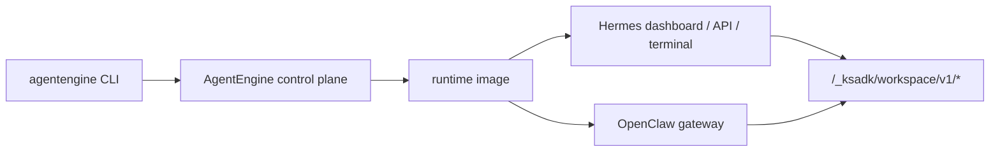

# Runtime Products: Hermes And OpenClaw

KsADK supports two image-based runtime products in addition to code-framework
agents:

- **Hermes**: a hosted coding-agent runtime with dashboard, API proxy, terminal
  WebSocket, and workspace files.
- **OpenClaw**: a hosted OpenClaw gateway runtime where KsADK adds deployment,
  workspace files, memory backend wiring, and CLI lifecycle management.

These are runtime products, not ordinary local framework projects. A LangGraph
or ADK project packages user code. Hermes and OpenClaw deploy a maintained
runtime image plus public configuration.



## When To Use Which Runtime

| Need | Recommended path |
| --- | --- |
| Python agent code with LangGraph, ADK, LangChain, or DeepAgents | normal code framework project |
| Hosted coding assistant with terminal and workspace | Hermes |
| OpenClaw gateway, channels, or OpenClaw-native UI | OpenClaw |
| Public quickstart that must run without cloud credentials | normal local framework project |

Do not present Hermes or OpenClaw as just another `StateGraph` or `Agent`
wrapper. They have separate lifecycle commands and deployment contracts.

## Hermes Lifecycle

Use the Hermes command group for hosted Hermes resources:

```bash
agentengine hermes --help
agentengine hermes deploy --help
agentengine hermes list --help
agentengine hermes open --help
agentengine hermes connect --help
```

Typical flow:

1. configure model placeholders in local `.env` or shell.
2. review the dry run where supported.
3. deploy the Hermes runtime.
4. open the dashboard or connect the terminal.
5. use workspace files for generated artifacts.

Public examples should use placeholder model values:

```bash
OPENAI_API_KEY=sk-test
OPENAI_BASE_URL=https://api.example.com/v1
OPENAI_MODEL_NAME=my-model
```

Hermes terminal access uses a WebSocket subprotocol:

```text
Sec-WebSocket-Protocol: ks-terminal.v1
```

The CLI handles this for normal users. API clients should treat it as part of
the remote runtime contract.

## OpenClaw Lifecycle

Use the OpenClaw command group for hosted OpenClaw resources:

```bash
agentengine openclaw --help
agentengine openclaw deploy --help
agentengine openclaw list --help
agentengine openclaw status --help
agentengine openclaw tui --help
agentengine openclaw gateway --help
agentengine openclaw channel --help
agentengine openclaw repair --help
```

Typical flow:

1. create or enter an OpenClaw project.
2. configure model placeholders and optional runtime policy.
3. deploy through `agentengine openclaw deploy`.
4. use `status`, `tui`, `gateway open`, or channel commands for operations.
5. keep workspace artifacts inside the runtime workspace.

For public examples, document policy knobs without internal values:

```bash
agentengine openclaw deploy \
  --model-base-url https://api.example.com/v1 \
  --model-api-key sk-test \
  --default-model my-model
```

## Workspace And Files

Hermes and OpenClaw both expose KsADK workspace files through the
`/_ksadk/workspace/v1/*` family. Generated files should stay inside the runtime
workspace so the hosted UI and CLI file commands see the same artifacts.

Do not document arbitrary host-path access. The public model is:

- list workspace files.
- read or download a workspace file.
- add or update a workspace file.
- delete a workspace file when permitted.
- export a workspace archive when the hosted surface supports it.

## Memory And Tooling Boundaries

Hermes and OpenClaw may read model, memory, channel, or tool configuration from
environment variables. Public docs should keep these variables as names and
placeholders, not real values.

| Category | Public-safe examples |
| --- | --- |
| model | `OPENAI_API_KEY`, `OPENAI_BASE_URL`, `OPENAI_MODEL_NAME` |
| memory | `KSADK_LTM_BACKEND`, `KSADK_LTM_NAMESPACE`, `KSADK_LTM_SCENE_ID` |
| workspace | `KSADK_WORKSPACE_FILES_ENABLED`, runtime workspace path labels |
| OpenClaw policy | strict mode, workspace-only filesystem policy, approval mode |
| secrets | variable names only; never commit literal tokens |

## What Stays Internal

Do not publish:

- private runtime image names or registries.
- private-environment endpoints.
- kubeconfig files or cluster names.
- real channel tokens, model keys, or kdocs tokens.
- customer workspace paths or object storage buckets.
- incident runbooks tied to internal platforms.

The public docs should explain the contract and lifecycle. Operational details
for a specific private environment belong in internal documentation.
