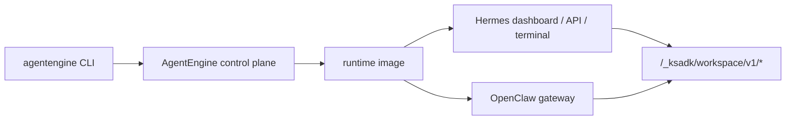

# 运行时产品：Hermes 与 OpenClaw

除了代码框架型 Agent，KsADK 还支持两类镜像型运行时产品：

- **Hermes**：托管 coding-agent runtime，包含 dashboard、API proxy、终端
  WebSocket 和 workspace files。
- **OpenClaw**：托管 OpenClaw gateway runtime，KsADK 负责部署、workspace
  files、memory backend wiring 和 CLI 生命周期管理。

它们是运行时产品，不是普通本地框架项目。LangGraph 或 ADK 项目打包的是用户
代码；Hermes 和 OpenClaw 部署的是平台维护的 runtime image 加公开配置。



## 什么时候用哪种运行时

| 需求 | 推荐路径 |
| --- | --- |
| LangGraph、ADK、LangChain、DeepAgents Python 代码 | 普通代码框架项目 |
| 带终端和 workspace 的 hosted coding assistant | Hermes |
| OpenClaw gateway、channels 或 OpenClaw 原生 UI | OpenClaw |
| 必须无云凭证运行的公开 quickstart | 普通本地框架项目 |

不要把 Hermes 或 OpenClaw 写成另一个 `StateGraph` 或 `Agent` wrapper。它们有
独立生命周期命令和部署 contract。

## Hermes 生命周期

Hermes 资源使用专用命令组：

```bash
agentengine hermes --help
agentengine hermes deploy --help
agentengine hermes list --help
agentengine hermes open --help
agentengine hermes connect --help
```

典型流程：

1. 在本地 `.env` 或 shell 中配置模型占位值。
2. 支持时先审查 dry run。
3. 部署 Hermes runtime。
4. 打开 dashboard 或连接终端。
5. 用 workspace files 管理生成产物。

公开示例只使用占位模型配置：

```bash
OPENAI_API_KEY=sk-test
OPENAI_BASE_URL=https://api.example.com/v1
OPENAI_MODEL_NAME=my-model
```

Hermes 终端访问使用 WebSocket 子协议：

```text
Sec-WebSocket-Protocol: ks-terminal.v1
```

普通用户由 CLI 处理；API 客户端需要把它视为远程运行时 contract 的一部分。

## OpenClaw 生命周期

OpenClaw 资源使用专用命令组：

```bash
agentengine openclaw --help
agentengine openclaw deploy --help
agentengine openclaw list --help
agentengine openclaw status --help
agentengine openclaw tui --help
agentengine openclaw gateway --help
agentengine openclaw channel --help
agentengine openclaw repair --help
```

典型流程：

1. 创建或进入 OpenClaw 项目。
2. 配置模型占位值和可选运行时策略。
3. 通过 `agentengine openclaw deploy` 部署。
4. 使用 `status`、`tui`、`gateway open` 或 channel 命令运维。
5. 生成产物保持在运行时 workspace 内。

公开示例只展示参数形态，不写内部值：

```bash
agentengine openclaw deploy \
  --model-base-url https://api.example.com/v1 \
  --model-api-key sk-test \
  --default-model my-model
```

## Workspace 与文件

Hermes 和 OpenClaw 都通过 `/_ksadk/workspace/v1/*` 暴露 KsADK workspace files。
生成文件应留在运行时 workspace 内，让 hosted UI 和 CLI 文件命令看到同一批产物。

公开文档不要描述任意宿主机路径访问。公开模型是：

- 列出 workspace 文件。
- 读取或下载 workspace 文件。
- 新增或更新 workspace 文件。
- 在允许时删除 workspace 文件。
- hosted surface 支持时导出 workspace 压缩包。

## 记忆与工具边界

Hermes 和 OpenClaw 可能从环境变量读取模型、记忆、channel 或工具配置。公开文档
只保留变量名和占位值，不保留真实值。

| 类别 | 公开安全示例 |
| --- | --- |
| 模型 | `OPENAI_API_KEY`、`OPENAI_BASE_URL`、`OPENAI_MODEL_NAME` |
| 记忆 | `KSADK_LTM_BACKEND`、`KSADK_LTM_NAMESPACE`、`KSADK_LTM_SCENE_ID` |
| workspace | `KSADK_WORKSPACE_FILES_ENABLED`、运行时 workspace 路径标签 |
| OpenClaw 策略 | strict mode、workspace-only 文件策略、approval mode |
| secrets | 只写变量名，不提交 token 明文 |

## 仍然留在内部文档的内容

不要发布：

- 私有 runtime 镜像名或 registry。
- 内部预发 endpoint。
- kubeconfig 文件或集群名称。
- 真实 channel token、模型 key 或 kdocs token。
- 客户 workspace 路径或对象存储 bucket。
- 绑定内部平台的事故 runbook。

公开文档解释 contract 和生命周期。具体私有环境的运维细节留在内部文档。

