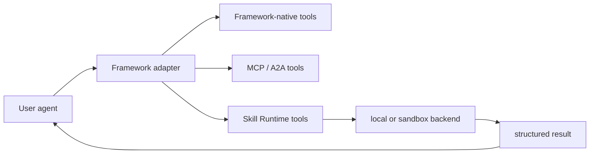

# Tools And Skill Runtime

KsADK can expose tools to an agent through framework-native tools, MCP/A2A
integrations, and the optional Skill Runtime. The public rule is simple: tools
should be declared explicitly, validated at runtime, and isolated from secrets
or local files the agent does not need.

## Tool Layers



The framework adapter normalizes tool definitions before an agent run. The
agent should receive a stable tool description, a narrow input schema, and a
structured result that can be rendered in the local Web UI or projected back
into session history.

## When To Use Each Tool Path

| Need | Recommended path |
| --- | --- |
| Simple Python helper inside the agent project | framework-native function tool |
| External tool server with its own lifecycle | MCP toolset |
| Agent-to-agent protocol integration | A2A client or adapter |
| Reusable executable skill with optional sandboxing | Skill Runtime |
| Local development only | local backend with explicit paths and test data |
| Untrusted or expensive execution | reviewed sandbox backend and limits |
| Common AgentEngine built-ins | the `ksadk.toolsets` focused profile |
| Infrequent or higher-risk built-ins | `agentengine_tool_dispatcher` list/describe/call |

Use the simplest path that gives the agent enough capability. Do not route a
plain deterministic helper through a remote runtime just to make it look like a
tool.

## AgentEngine Built-In Tools

`ksadk.toolsets` provides SDK built-in tool entry points. Calling
`get_agentengine_tools()` with no arguments still returns the full built-in
tool list for compatibility. New projects should choose an explicit set:

```python
from ksadk.toolsets import describe_agentengine_tools, get_agentengine_tools

tools = get_agentengine_tools(include=["focused", "agentengine_tool_dispatcher"])
tool_descriptions = describe_agentengine_tools(include=["focused", "agentengine_tool_dispatcher"])
```

`include` can mix groups, profiles, and concrete tool names:

| include | Meaning |
| --- | --- |
| `skill` / `workspace` / `platform` / `sandbox` | bind a built-in tool group |
| `focused` / `core` | bind the common low-risk tool set |
| concrete names such as `run_code` | explicitly add one tool |

`focused/core` directly exposes:

- `list_skills`, `search_skills`, `load_skill`
- `workspace_status`, `search_workspace_files`
- `edit_workspace_file`, `lint_workspace_file`
- `component_status`, `sandbox_status`

`execute_skills`, `run_command`, `run_code`, `delete_workspace_file`, and
whole-file write tools are not part of the focused profile by default. Bind
them explicitly or call them through the dispatcher when needed.

## Dispatcher And Progressive Disclosure

`agentengine_tool_dispatcher(action, tool_name=None, arguments=None, include=None)`
is a low-risk index tool that keeps the model context smaller.

| action | Behavior |
| --- | --- |
| `list` | list dispatchable tools, excluding the dispatcher itself |
| `describe` | return one tool description, risk level, approval requirement, and boundary |
| `call` | call a KsADK local built-in tool by name |

The dispatcher only schedules KsADK local built-in tools. It does not connect to
a console Tool Space database or perform remote dynamic tool binding. It calls
the real tool object, so it does not bypass Tool Gateway approval policies. For
example, in strict mode `run_command`, `run_code`, `execute_skills`, and
workspace write/delete calls still return an `approval_required` envelope.

## Tool Gateway And Human Approval

Tool Gateway owns tool risk, approval, and execution boundaries. It does not
perform context compression. Enable strict approval with:

```bash
export KSADK_TOOL_APPROVAL_MODE=strict
```

In strict mode, medium / high / critical risk tools return a structured
`approval_required` result before execution. A UI or outer runtime can show the
approval request, then pass the approval result back into the tool call after
the user confirms.

| Tool type | Default risk | Behavior |
| --- | --- | --- |
| workspace read/search/status | low | execute directly |
| `edit_workspace_file` / write file | medium | approval required in strict mode |
| `delete_workspace_file` | high | approval required in strict mode |
| `execute_skills` | high | approval required in strict mode |
| `run_command` / `run_code` | high | approval required in strict mode, sandbox backend only |

`edit_workspace_file` performs exact snippet replacement. It returns
`snippet_not_found` when `old_text` is absent, and `ambiguous_edit` when the
match count does not equal `expected_replacements`. `lint_workspace_file` is a
lightweight built-in check for Python AST parsing, JSON parsing, and generic
text issues; it is not a project formatter or a full lint pipeline.

## Public Skill Runtime Contract

A public Skill Runtime integration should document:

- the skill name and purpose.
- input schema and required fields.
- output schema and error shape.
- required optional dependencies or extras.
- whether the skill runs locally or through a sandbox backend.
- which environment variables are needed.
- file, network, and execution limits.

The tool description should be precise enough for an LLM to decide when not to
call it. Avoid descriptions that imply broad filesystem, shell, network, or
credential access.

## Environment Configuration

Keep secrets out of source control. Store local development values in `.env` or
your shell environment, and publish only placeholder names in examples.

Common public examples:

```bash
export KSADK_SKILL_RUNTIME_BACKEND=local
export KSADK_SKILL_RUNTIME_TIMEOUT_SECONDS=30
```

If a backend requires credentials, document the variable names and setup steps
without publishing actual values:

```bash
export EXAMPLE_SANDBOX_API_KEY=...
```

Do not commit `.env`, `.pypirc`, PyPI tokens, kubeconfig files, private registry
credentials, cloud access keys, or generated runtime state.

## Local Backend

The local backend is useful for development, tests, and examples that operate on
known input. It should be treated as trusted local execution:

- use temporary directories in tests.
- pass explicit input files instead of scanning the whole repository.
- keep timeouts short.
- return structured failures rather than raw tracebacks when possible.
- avoid examples that execute arbitrary user-provided shell.

Local backend examples are acceptable in public docs when they are deterministic
and do not require internal infrastructure.

## Sandbox Backend

A sandbox backend is appropriate when the skill needs stronger isolation,
network policy, or dependency control. Public docs should describe the contract,
not private provider wiring:

| Topic | Public documentation should say |
| --- | --- |
| authentication | required variable names, not token values |
| limits | timeout, memory, file size, and network policy |
| files | allowed upload/download paths and retention behavior |
| errors | stable error codes or categories |
| cleanup | whether the sandbox is disposable per run |

Internal account IDs, private images, registry hosts, hosted control-plane URLs,
and provider-specific support runbooks should stay out of the public repository.

## Runner Payload

Framework adapters should pass tool and skill results as structured data. A
typical result includes:

| Field | Meaning |
| --- | --- |
| `name` | tool or skill name |
| `status` | `ok`, `failed`, `timeout`, or `cancelled` |
| `content` | user-visible result text or content blocks |
| `metadata` | execution metadata safe for logs and UI |
| `artifacts` | file references created by the tool, when supported |
| `error` | stable error summary for failed runs |

Business code should read structured fields instead of parsing local UI text.

## ADK Integration

For Google ADK projects, Skill Runtime tools can be injected during runner
loading when optional dependencies and configuration are available. Keep a
minimal ADK example free of optional runtime variables first, then add tools in
a separate example:

```python
from google.adk.agents import Agent

root_agent = Agent(
    name="tool_ready_agent",
    instruction="Use tools only when they are relevant to the user request.",
)
```

Then document the runtime setup beside the example:

```bash
pip install -U "ksadk[adk,skills]"
agentengine web . --no-open
```

If the tool is not available, the agent project should still fail with a clear
setup error instead of silently running with a different capability set.

## Testing Tool Integrations

Public tests should cover the boundary, not a private service account:

- tool schema conversion.
- successful local execution with deterministic input.
- timeout and failure handling.
- runner payload fields.
- Web UI request shape when the tool result is displayed.
- audit checks that no credentials or private endpoints appear in fixtures.

Prefer fake clients, temporary files, and local HTTP servers for public tests.
Only run provider-backed tests behind explicit environment gates.

## Security Checklist

Before publishing a tool or skill example:

- verify the example runs without internal accounts.
- remove private endpoints and customer data.
- check that generated files are ignored.
- document required optional extras.
- cap execution time and file sizes.
- avoid broad shell, network, or filesystem access.
- run the open-source audit before committing.

```bash
make open-source-audit
```

## Relationship To Other Guides

Read this page with:

- [Frameworks](frameworks.en.md) for runner loading behavior.
- [Agent Context](agent-context.en.md) for the structured invocation context.
- [Attachments And Multimodal Input](attachments-multimodal.en.md) for file input
  normalization.
- [Runtime Sessions And Files](../reference/runtime-sessions-files.en.md) for how
  tool events and file references are stored in local sessions.
