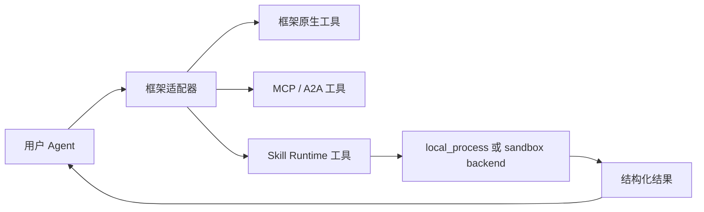
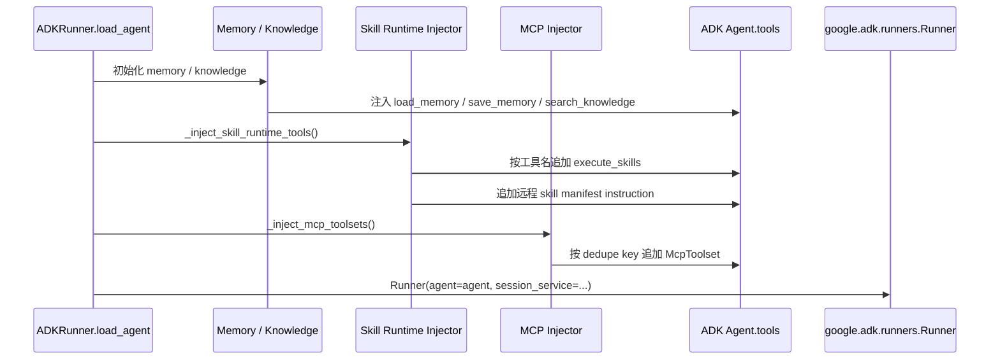
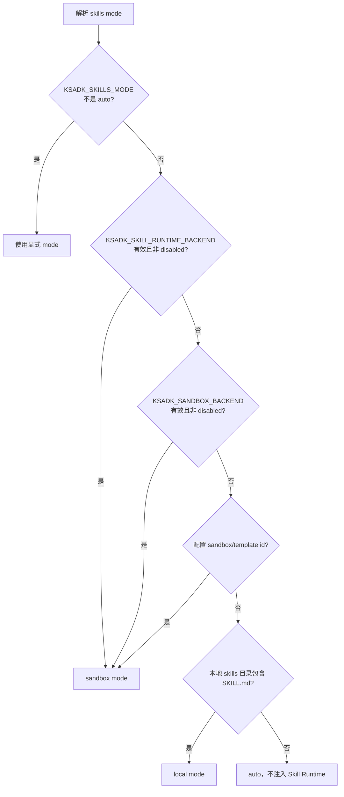

# 工具与 Skill Runtime

KsADK 可以通过框架原生工具、MCP/A2A 集成和可选的 Skill Runtime 向 Agent
暴露工具。公开规则是：工具必须显式声明，在运行时可验证，并且和 Agent 不
需要的密钥或本地文件隔离。

## 工具层次



框架适配器会在 Agent 执行前归一化工具定义。Agent 应拿到稳定的工具描述、
收窄的输入 schema，以及可以在本地 Web UI 渲染或写回会话历史的结构化
结果。

## 什么时候使用哪条路径

| 需求 | 推荐路径 |
| --- | --- |
| Agent 项目内的简单 Python helper | 框架原生 function tool |
| 自带生命周期的外部工具服务 | MCP toolset |
| Agent-to-Agent 协议集成 | A2A client 或 adapter |
| 可复用、可沙箱执行的技能 | Skill Runtime |
| 仅本地开发 | local backend，使用显式路径和测试数据 |
| 不可信或成本较高的执行 | 受审查的 sandbox backend 和限制 |
| AgentEngine 常用内置能力 | `ksadk.toolsets` 的 focused profile |
| 低频或高风险内置能力 | `agentengine_tool_dispatcher` 按需列出、描述和调用 |

优先使用能满足需求的最简单路径。不要把一个确定性的本地 helper 包成远端
runtime，只为了让它看起来像工具。

## AgentEngine 内置工具

`ksadk.toolsets` 提供 SDK 内置工具入口。`get_agentengine_tools()` 无参时仍返回
全量内置工具，保持历史兼容；新项目推荐显式选择工具集合：

```python
from ksadk.toolsets import describe_agentengine_tools, get_agentengine_tools

tools = get_agentengine_tools(include=["focused", "agentengine_tool_dispatcher"])
tool_descriptions = describe_agentengine_tools(include=["focused", "agentengine_tool_dispatcher"])
```

`include` 可以混用工具组、profile 和具体工具名：

| include | 含义 |
| --- | --- |
| `skill` / `workspace` / `platform` / `sandbox` | 绑定对应内置工具组 |
| `focused` / `core` | 绑定常用低风险工具集合 |
| `run_code` 等具体工具名 | 显式扩展单个工具 |

`focused/core` 默认直接暴露：

- `list_skills`、`search_skills`、`load_skill`
- `workspace_status`、`search_workspace_files`
- `edit_workspace_file`、`lint_workspace_file`
- `component_status`、`sandbox_status`

`execute_skills`、`run_command`、`run_code`、`delete_workspace_file` 和整文件写入类
工具不会默认进入 focused profile。需要这些能力时，可以显式绑定工具名，或通过
dispatcher 渐进式披露。

## Dispatcher 与渐进式披露

`agentengine_tool_dispatcher(action, tool_name=None, arguments=None, include=None)`
是一个低风险索引工具，用于减少模型上下文里的工具数量。

| action | 行为 |
| --- | --- |
| `list` | 列出可调度工具，不包含 dispatcher 自身 |
| `describe` | 返回单个工具的描述、风险等级、审批需求和边界 |
| `call` | 按名称调用 KsADK 本地内置工具 |

dispatcher 只调度 KsADK 本地内置工具，不连接控制台 Tool Space 数据库，也不做
远端动态工具绑定。它调用真实工具对象，因此不会绕过 Tool Gateway 审批策略；
例如 strict 模式下调用 `run_command`、`run_code`、`execute_skills` 或 workspace
写入/删除工具时，仍会返回 `approval_required` envelope。

## Tool Gateway 与人工确认

Tool Gateway 负责工具风险、审批和执行边界，不负责上下文压缩。公开 SDK 支持
用环境变量启用严格审批：

```bash
export KSADK_TOOL_APPROVAL_MODE=strict
```

strict 模式下，medium / high / critical 风险工具会先返回结构化
`approval_required`，而不是直接执行。UI 或外层 runtime 可以展示审批请求，并在
用户确认后把 approval 结果传回工具调用。

| 工具类型 | 默认风险 | 行为 |
| --- | --- | --- |
| workspace read/search/status | low | 直接执行 |
| `edit_workspace_file` / 写文件 | medium | strict 模式需要审批 |
| `delete_workspace_file` | high | strict 模式需要审批 |
| `execute_skills` | high | strict 模式需要审批 |
| `run_command` / `run_code` | high | strict 模式需要审批，且只进 sandbox backend |

`edit_workspace_file` 是 exact snippet replacement：`old_text` 未命中时返回
`snippet_not_found`，匹配次数与 `expected_replacements` 不一致时返回
`ambiguous_edit`。`lint_workspace_file` 是 SDK 内置轻量检查，支持 Python AST、
JSON parse 和通用文本检查；它不是项目级 formatter 或完整 lint 工具链。

## ADK 装载期注入顺序

在 ADK 项目中，知识库、记忆工具、Skill Runtime 和 MCP toolset 都在 Agent
加载期注入，而不是在每次请求执行时动态挂载。这让工具集合更容易审计，
也避免一次会话中途能力突然变化。



这个顺序也说明了边界：Skill Runtime 与 MCP 是 ADK Agent 装载期扩展；A2A
是 runner 外层协议适配。通过 A2A 暴露的 runner 可以间接使用已注入的工具，
但 A2A Server 自身不负责解析 MCP，也不负责执行沙箱。

## 公开 Skill Runtime 契约

一个公开的 Skill Runtime 集成应记录：

- skill 名称和用途。
- 输入 schema 和必填字段。
- 输出 schema 和错误形态。
- 必需的 optional dependencies 或 extras。
- skill 在本地执行还是在 sandbox backend 中执行。
- 需要的环境变量名称。
- 文件、网络和执行时间限制。

工具描述应足够精确，让 LLM 知道什么时候不该调用它。避免暗示工具拥有宽泛
的文件系统、shell、网络或凭证访问能力。

## Skills Mode 判定

ADK runner 会先解析 skills mode。显式设置 `KSADK_SKILLS_MODE` 时直接生效；
`auto` 模式下按环境与本地目录推断。



## Skill Runtime Backend

Skill Runtime Backend 是一个协议接口。核心方法 `run_workflow()` 接收
workflow prompt、技能空间、session id、可选技能名、环境变量、输入文件和
timeout，返回 `SkillRuntimeResult`。

| 字段 | 含义 |
| --- | --- |
| `runtime_id` | 后端运行实例标识 |
| `exit_code` | 子进程或 sandbox 命令退出码 |
| `stdout` / `stderr` | 公开安全的输出摘要 |
| `duration_ms` | 执行耗时 |
| `timed_out` | 是否超时 |
| `error_type` / `error_message` | 稳定错误分类和摘要 |
| `output_files` | 工具生成的输出文件引用 |

`ok` 只在 `exit_code == 0`、没有 `error_type` 且未超时时为真。业务代码应读
结构化字段，不要解析本地 UI 文本。

## Backend 选择

| Backend | 选择条件 | 执行位置 | Prompt 传递方式 |
| --- | --- | --- | --- |
| `disabled` | 默认无 sandbox 配置或显式 disabled | 不执行 | 调用即抛出 setup 错误 |
| `local_process` | `KSADK_SKILL_RUNTIME_BACKEND=local_process` | 本地 Python 子进程 | 写入临时 prompt 文件 |
| `e2b` | 显式 e2b、sandbox backend 或 template id | E2B 沙箱 | 写入 sandbox 内 prompt 文件 |

公开文档可以描述这些 backend 的契约，但不应发布私有镜像、私有 registry、
内部控制面地址或团队运行手册。

## 远程技能 manifest

当配置了 `KSADK_SKILL_SERVICE_URL` 且存在 skill space id 时，KsADK 会加载
远程技能 manifest。只保留 active skills，并按技能名去重；如果某个公共技能
空间配置了 allowlist，则只暴露 allowlist 内的技能。

manifest instruction 会提醒模型：

- 只有任务匹配时才调用 `execute_skills`。
- 调用时使用原始 `workflow_prompt`。
- `skill_names` 必须使用精确技能名。
- 不要假设完整技能说明已经加载；`execute_skills` 会按需加载。

## MCP 配置边界

MCP Runtime 以 `KSADK_MCP_SERVERS` 为入口，默认启用。只有
`KSADK_ENABLE_MCP_TOOLS` 为 `0`、`false`、`no` 或 `off` 时禁用。

| 配置项 | 作用 | 校验或默认行为 |
| --- | --- | --- |
| `KSADK_ENABLE_MCP_TOOLS` | MCP 工具注入开关 | 默认启用 |
| `KSADK_MCP_SERVERS` | JSON 数组形式的 MCP Server 配置 | 必须是 JSON array |
| `name` | MCP Server 名称 | 必须是非空字符串 |
| `url` | Streamable HTTP MCP Endpoint | 必须是绝对 `http(s)` URL 且 path 以 `/mcp` 结尾 |
| `api_key` | Bearer Token | 可选字符串，生成 Authorization header |
| `tool_filter` | 限制暴露工具名 | 可选非空字符串列表 |
| `tool_name_prefix` | 工具名前缀与去重键组成部分 | 可选字符串 |

示例可以展示变量名，但不能包含真实 token、私有 endpoint 或内部服务地址。

## 环境配置

密钥不要进源码。把本地开发值放在 `.env` 或 shell 环境中，公开文档只展示
占位变量名。

```bash
export KSADK_SKILL_RUNTIME_BACKEND=local_process
export KSADK_SKILL_RUNTIME_TIMEOUT=30
```

如果后端需要凭证，文档只写变量名和配置步骤：

```bash
export EXAMPLE_SANDBOX_API_KEY=...
```

不要提交 `.env`、`.pypirc`、PyPI token、kubeconfig、私有 registry 凭证、
云访问密钥或生成的运行状态文件。

## 本地 Backend

local backend 适合开发、测试和只操作已知输入的示例。应按可信本地执行处理：

- 测试里使用临时目录。
- 传入显式输入文件，不扫描整个仓库。
- 使用较短 timeout。
- 尽量返回结构化失败，而不是原始 traceback。
- 避免执行任意用户提供 shell 的示例。

公开文档中的 local backend 示例应可复现，不依赖内部基础设施。

## Sandbox Backend

sandbox backend 适合需要更强隔离、网络策略或依赖控制的场景。公开文档应描述
契约，而不是私有 provider wiring：

| 主题 | 公开文档应说明 |
| --- | --- |
| authentication | 需要的变量名，不写 token 值 |
| limits | timeout、内存、文件大小和网络策略 |
| files | 允许上传/下载路径和保留行为 |
| errors | 稳定错误码或错误类别 |
| cleanup | sandbox 是否每次调用后销毁 |

内部账号 ID、私有镜像、registry host、托管控制面 URL 和支持 runbook 都应留在
内部文档中。

## 测试工具集成

公开测试应覆盖边界，而不是私有服务账号：

- 工具 schema 转换。
- 使用确定性输入的本地成功执行。
- timeout 和失败处理。
- runner payload 字段。
- Web UI 展示工具结果时的请求形态。
- audit 检查 fixture 中没有凭证或私有 endpoint。

优先使用 fake client、临时文件和本地 HTTP server。provider-backed 测试必须放在
显式环境变量开关之后。

## 发布前安全检查

发布工具或 skill 示例前，至少检查：

- 示例不依赖内部账号。
- 私有 endpoint 和客户数据已移除。
- 生成文件已加入 ignore 或不在仓库内。
- 必需 optional extras 已记录。
- 执行时间和文件大小有限制。
- 没有宽泛 shell、网络或文件系统访问。
- 已运行开源审计。

```bash
make open-source-audit
```

## 相关指南

建议结合这些页面阅读：

- [框架接入](frameworks.md)：runner 加载和多框架适配。
- [智能体上下文](agent-context.md)：结构化调用上下文。
- [附件与多模态输入](attachments-multimodal.md)：文件输入归一化。
- [会话与文件](../reference/runtime-sessions-files.md)：工具事件和文件引用如何进入本地会话。
