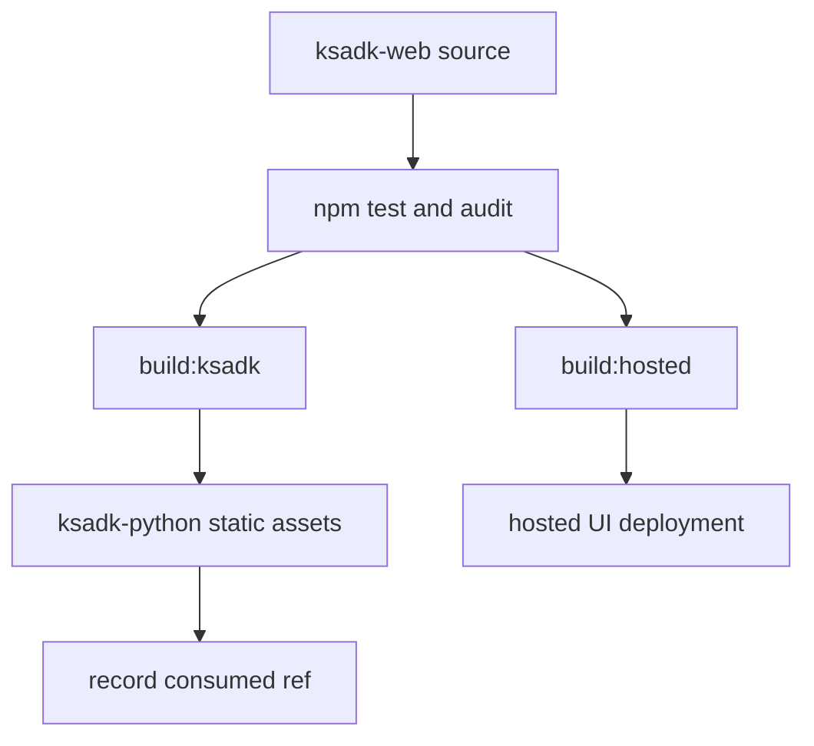

# Web UI Repository

KsADK has two UI consumers:

- the local static UI bundled into the Python package.
- the hosted AgentEngine UI used by managed deployments.

The editable UI source should live in one independent public repository:

- `https://github.com/kingsoftcloud/ksadk-web`

This mirrors the separation used by Google ADK, where the ADK Web UI exists as a
dedicated `adk-web` project instead of being treated as only generated SDK
assets.

## Repository Roles

| Repository | Role | Should contain |
| --- | --- | --- |
| `ksadk-web` | Web UI repository | React source, shared tests, public CI, Apache-2.0 license |
| `ksadk-python` | Python SDK consumer | generated static UI assets, manifest of consumed UI ref |
| hosted UI deployment repo | hosted consumer | Docker, nginx, Helm, environment injection, hosted release automation |

The same UI source should build two outputs:

```bash
npm run build:ksadk
npm run build:hosted
```

## Build Targets

`build:ksadk` should produce a bundle that works under the Python package's
local static-file server:

```text
dist-ksadk/
  index.html
  assets/
```

`build:hosted` should produce a hosted bundle with hosted route assumptions:

```text
dist-hosted/
  index.html
  assets/
```

The Python wheel should include only the reviewed static output needed by
`agentengine web`. It should not include editable UI source, `node_modules`,
hosted deployment files, or generated hosted bundles.

## Consumption Manifest

Each Python SDK update that refreshes the embedded UI should record:

```json
{
  "ksadkWebRepository": "https://github.com/kingsoftcloud/ksadk-web",
  "ksadkWebRef": "v0.1.0",
  "ksadkWebCommit": "<sha>",
  "buildTarget": "ksadk",
  "basePath": "./",
  "buildCommand": "npm run build:ksadk",
  "outputDirectory": "dist-ksadk",
  "consumerPath": "ksadk/server/static"
}
```

The manifest lets maintainers answer which UI source generated a given Python
release.

## Public Export Rules

The first `ksadk-web` source import should include:

- `src/`
- `public/`
- Vite, TypeScript, Tailwind, ESLint, and test config.
- shared UI tests.
- `README.md`, `LICENSE`, `SECURITY.md`, `CONTRIBUTING.md`.
- GitHub Actions for test/build and Pages demo.

It must exclude:

- hosted Dockerfiles.
- nginx config.
- Helm charts and values.
- internal registry names.
- generated `dist/`, `dist-hosted/`, or `node_modules/`.
- consumer-specific sync scripts unless destination paths are parameterized.
- screenshots or assets without public publication rights.

## Release Flow



No source import, Pages enablement, release, or PyPI publication should happen
before maintainer review approves the candidate.
