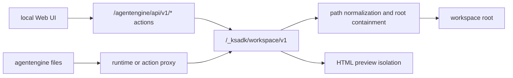

# Workspace Files

Workspace files are runtime-managed files that the local Web UI and CLI can list,
upload, download, delete, and preview. They are different from one-turn
attachments: workspace files persist as files in a workspace root, while
attachments are message inputs.

## When To Use Workspace Files

Use workspace files when the agent or user needs a persistent project artifact:

- generated reports.
- intermediate data files.
- HTML previews.
- exported work products.
- files edited across multiple turns.

Use attachments when the user is sending evidence for one conversation turn,
such as a PDF to summarize or an image to inspect.

## Local Boundary

The local runtime exposes workspace file routes under:

```text
/_ksadk/workspace/v1
```

The local Web UI uses action-style APIs that proxy into the same workspace file
router. This keeps path validation and preview behavior centralized.



## Capabilities

| Operation | Runtime route | Typical use |
| --- | --- | --- |
| health | `GET /healthz` | check whether workspace files are enabled |
| list | `GET /entries` | browse files and directories |
| metadata | `HEAD /files/{path}` | check file size/type |
| download | `GET /files/{path}` | read a file or preview HTML |
| upload | `POST /files/{path}` | write a file |
| delete | `DELETE /files/{path}` | delete a file or empty directory |

Remote `agentengine files` commands can use action-proxy or runtime-direct
transport depending on the target runtime. Public local examples should focus on
the local runtime unless hosted access is explicitly documented.

## Local Examples

List the workspace root:

```bash
curl http://127.0.0.1:8080/_ksadk/workspace/v1/entries?path=.
```

Upload a file:

```bash
curl -X POST http://127.0.0.1:8080/_ksadk/workspace/v1/files/reports/summary.txt \
  -H 'Content-Type: text/plain' \
  --data-binary 'hello from KsADK'
```

Download the file:

```bash
curl http://127.0.0.1:8080/_ksadk/workspace/v1/files/reports/summary.txt
```

Delete it:

```bash
curl -X DELETE http://127.0.0.1:8080/_ksadk/workspace/v1/files/reports/summary.txt
```

The local Web UI uses higher-level action APIs, but those action APIs should
still reach the same workspace router so path checks remain centralized.

## Path Rules

Workspace paths are relative paths inside the workspace root.

Allowed:

```text
.
reports
reports/index.html
data/input.csv
```

Rejected:

```text
/absolute/path
../secret
reports/../../secret
```

List operations may use `.` for the root. File operations need a concrete file
path.

Path validation happens in two steps:

1. normalize the user path, reject absolute paths, and reject `..`.
2. resolve the target path and confirm it is still inside the workspace root.

This protects both direct paths and paths that become unsafe after filesystem
resolution.

## Environment Variables

| Variable | Default | Meaning |
| --- | --- | --- |
| `KSADK_WORKSPACE_FILES_ENABLED` | enabled | enable or disable workspace routes |
| `KSADK_WORKSPACE_ROOT_LABEL` | `workspace` | display label for the workspace root |
| `KSADK_WORKSPACE_MAX_UPLOAD_BYTES` | `104857600` | single upload size limit |

Use these for local or test configuration. Do not hard-code private host paths
in public docs.

## HTML Preview Security

HTML preview is useful for generated reports and local demos, but it is higher
risk than downloading a text file. KsADK preview responses apply several browser
constraints:

- relative assets are resolved through the workspace file route.
- `Content-Security-Policy` is set on preview responses.
- `connect-src` is disabled by default.
- form submission is disabled.
- preview pages are sandboxed.

The goal is to let developers inspect generated HTML without giving that HTML a
general-purpose network or filesystem capability.

| Boundary | Behavior |
| --- | --- |
| base path | relative links stay under the workspace files route |
| sandbox | preview is isolated from the parent application |
| `default-src` | unspecified resource types are blocked |
| `connect-src` | fetch/WebSocket-style calls are blocked |
| `form-action` | form submission is blocked |

Do not use workspace HTML preview as a security boundary for untrusted public
hosting. It is a local development feature.

## Exporting Workspace Content

Workspace export should re-check every file before adding it to an archive:

- skip empty paths.
- skip absolute paths.
- skip paths containing `..`.
- skip symlinks.
- confirm resolved paths remain under the workspace root.

These checks protect archive generation from path and symlink escape behavior.

## Hosted Runtime Boundary

Hosted deployments can expose workspace files through a gateway, sidecar, or
action proxy. The public rule is the same: keep the file service scoped to a
workspace root and route browser/UI access through the reviewed workspace file
contract.

Do not document private cluster hosts, kubeconfig paths, internal registry names,
or customer workspace paths in public examples. Hosted runtime URLs should be
introduced only after the public access model has been approved.

## Workspace Files Versus Attachments

| Area | Workspace files | Attachments |
| --- | --- | --- |
| Lifetime | persisted in workspace root | attached to a conversation turn/session |
| Access | file list/read/write/delete APIs | message input normalization |
| Typical UI | file panel or preview | chat input upload |
| Runtime field | workspace file APIs | `attachments`, `attachment_results` |
| Security focus | path containment and preview isolation | file extraction, OCR, and prompt context |

Use workspace files when the agent needs to produce or manage project artifacts.
Use attachments when the user is sending evidence or documents for one
conversation flow.

## Developer Checklist

When changing workspace file behavior:

- use the shared workspace router for list, read, write, delete, and preview.
- keep path normalization and root containment in one place.
- decide explicitly whether an operation can target `.`.
- enforce upload size limits before accepting large files.
- preserve HTML preview CSP and sandbox behavior.
- re-check paths when exporting archives.
- add tests for absolute paths, `..`, symlinks, non-empty directories, and HTML
  preview headers.
