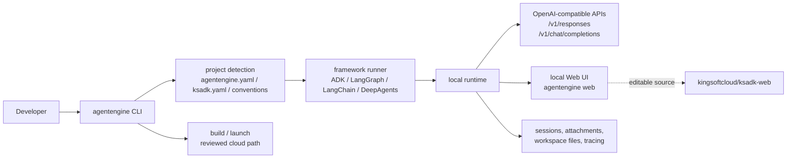
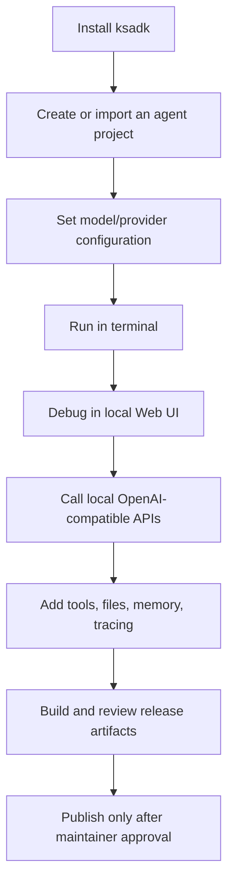

# KsADK

Kingsoft Cloud Agent Development Kit for building, running, debugging, and
packaging Python agent applications. KsADK gives developers one local CLI,
runtime surface, OpenAI-compatible protocol layer, and browser UI across Google
ADK, LangGraph, LangChain, and DeepAgents projects.

=== "Python"

    ```bash
    pip install -U ksadk
    pip install -U "ksadk[langgraph]"
    ```

=== "Create"

    ```bash
    agentengine init my-agent -f langgraph
    cd my-agent
    agentengine config set OPENAI_API_KEY=sk-test OPENAI_BASE_URL=https://api.example.com/v1 OPENAI_MODEL_NAME=my-model
    ```

=== "Run"

    ```bash
    agentengine run . -i
    agentengine web . --no-open
    ```

This site is the curated public documentation for the open-source SDK. It is
separate from generated `.zread/` code-reading output, internal deployment
notes, and private AgentEngine operating procedures.

## System At A Glance



The important design choice is that the SDK does not replace the framework
where the agent is written. It detects and loads the project, adapts it through
a runner, then exposes the same local development experience to terminal users,
browser users, and API clients.

## Documentation Style

KsADK follows the public-docs pattern used by mature agent SDK projects:

- a short overview for positioning.
- a quickstart that reaches a running local agent.
- tutorials with complete files.
- guides for common tasks and operational decisions.
- references for command, config, and API contracts.
- contribution, release, security, and publication gates.

Generated code-reading output can help maintainers understand the repository,
but it is not the public documentation source. Public docs must be reviewed,
stable, linkable, and safe to publish on GitHub Pages.

## Developer Journey



## What KsADK Provides

| Area | What you get |
| --- | --- |
| Project bootstrap | `agentengine init` templates for supported framework families. |
| Local runtime | `agentengine run` starts a local API server for an agent project. |
| Local Web UI | `agentengine web` opens a browser-based invoke/debug interface. |
| Configuration | `agentengine config` manages project `.env` and YAML settings. |
| Packaging | `agentengine build` prepares deployment artifacts when cloud credentials are configured. |
| Protocols | Local OpenAI-compatible `/v1/responses` and `/v1/chat/completions` endpoints. |
| Extensibility | Framework adapters, memory hooks, MCP/A2A integration points, and release tooling. |

## Typical Use Cases

Use KsADK when you need to:

- run the same local command against ADK, LangGraph, LangChain, or DeepAgents
  projects.
- expose a local OpenAI-compatible endpoint for an agent project.
- debug an agent in a browser without setting up hosted infrastructure.
- prepare an agent package for a reviewed cloud deployment path.
- keep Python SDK docs, Web UI docs, and release checks aligned before a public
  GitHub import.

## Open-Source Boundary

The public repository contains the SDK, CLI, runtime adapters, local development
experience, curated documentation, and release checks.

It does not publish the full AgentEngine control plane, internal Kubernetes
deployment automation, internal kubeconfig material, private registries, customer
data, or private support runbooks. Cloud deployment commands are documented as
SDK entry points, but public examples must be runnable locally without internal
accounts.

## First Workflow

```bash
python -m venv .venv
source .venv/bin/activate
pip install -U ksadk

agentengine init my-agent -f langgraph
cd my-agent
agentengine config set OPENAI_API_KEY=sk-test OPENAI_BASE_URL=https://api.example.com/v1 OPENAI_MODEL_NAME=my-model
agentengine run -i
```

Then open the local Web UI:

```bash
agentengine web . --no-open
```

If you already have an agent file, use:

```bash
agentengine init my-agent --from-agent ./agent.py
cd my-agent
agentengine run . -i
```

## Documentation Map

- [Concepts](getting-started/concepts.en.md): how the SDK, project config, runtime, and Web UI fit together.
- [Quickstart](getting-started/quickstart.en.md): create, configure, run, and debug a local agent.
- [Configuration](getting-started/configuration.en.md): environment variables and project YAML.
- [Project Structure](getting-started/project-structure.en.md): files created by templates and files to avoid committing.
- [Build A LangGraph Agent](tutorials/langgraph-agent.en.md): complete local project with source code.
- [Bring An Existing Agent](tutorials/existing-agent.en.md): wrap an existing file or package.
- [Local Web UI](guides/local-web-ui.en.md): local browser debugging and the independent `ksadk-web` repository plan.
- [Web UI Repository](guides/web-ui-source.en.md): how `ksadk-web`, hosted UI, and the Python wheel relate.
- [Runtime Products](guides/runtime-products.en.md): Hermes and OpenClaw lifecycle, runtime surfaces, and public-safe boundaries.
- [Frameworks](guides/frameworks.en.md): ADK, LangGraph, LangChain, and DeepAgents conventions.
- [Agent Best Practices](guides/agent-best-practices.en.md): LangGraph/ADK patterns with knowledge, memory, sessions, Skill Runtime, MCP, and workspace files.
- [Tools And Skill Runtime](guides/tools-and-skill-runtime.en.md): framework-native tools, MCP/A2A, and optional Skill Runtime boundaries.
- [Observability And Tracing](guides/observability-tracing.en.md): local spans, Langfuse, OTLP, and trace metadata rules.
- [Build And Package](guides/build-and-package.en.md): local builds, review gates, and public artifact rules.
- [CLI Reference](reference/cli.en.md): public command surface and common options.
- [OpenAI-Compatible API](reference/openai-compatible-api.en.md): local protocol shape and KsADK extensions.
- [Project Configuration](reference/project-config.en.md): YAML and environment field reference.
- [Remote Runtime API](reference/remote-runtime-api.en.md): PublicEndpoint, authentication, OpenAI-compatible routes, workspace files, Hermes, and OpenClaw.
- [Environment Variables](reference/environment-variables.en.md): model, session, memory, knowledge, Skill Runtime, MCP, build, and tracing variables.
- [Runtime Sessions And Files](reference/runtime-sessions-files.en.md): session IDs, uploads, workspace previews, and local state.
- [Security Boundaries](reference/security-boundaries.en.md): public repository, workspace, preview, package, and history boundaries.
- [Troubleshooting](reference/troubleshooting.en.md): common setup, runtime, and packaging failures.

## Publication State

The planned public locations are:

- Python SDK repository: `https://github.com/kingsoftcloud/ksadk-python`
- Python SDK docs: `https://kingsoftcloud.github.io/ksadk-python/`
- Web UI repository: `https://github.com/kingsoftcloud/ksadk-web`
- Web UI docs or demo: `https://kingsoftcloud.github.io/ksadk-web/`

The first real source import must be reviewed internally before GitHub source,
GitHub Pages, GitHub releases, or PyPI publication are enabled.
