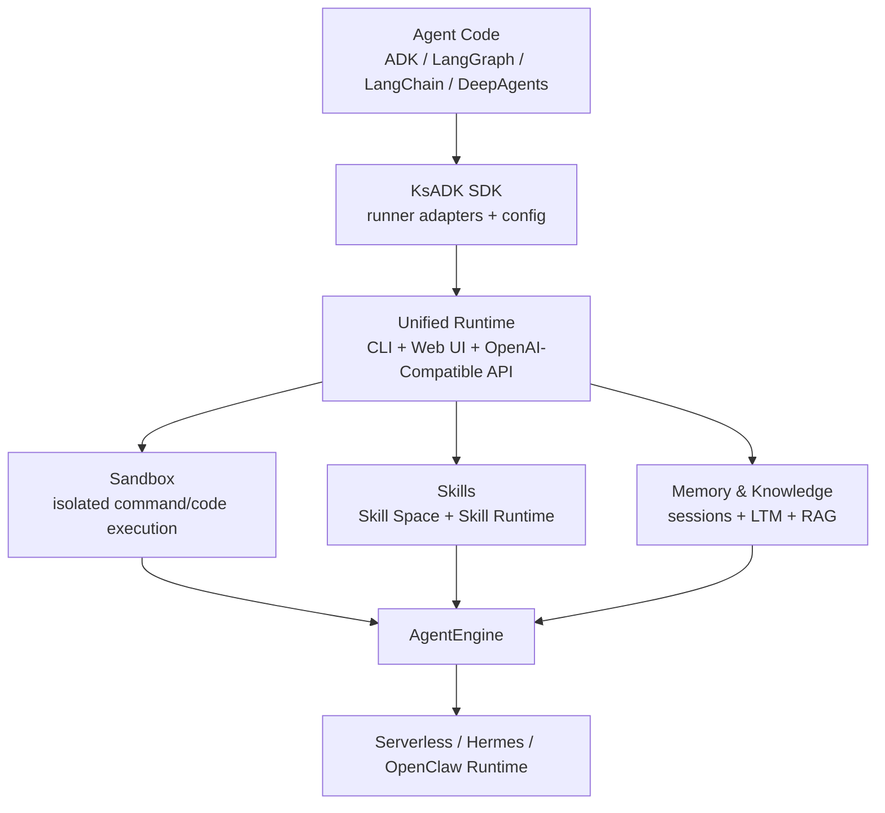

# KsADK

Build agents once. Run them anywhere.

KsADK is the Agent Runtime Platform for AI agents.

你可以继续使用 Google ADK、LangGraph、LangChain 或 DeepAgents 编写业务 Agent，再用 KsADK 获得统一的本地运行、浏览器调试、OpenAI-Compatible API、沙箱执行、部署和可观测体验。

=== "安装"

    ```bash
    pip install -U "ksadk[all]"
    ```

=== "创建"

    ```bash
    agentengine init demo-agent -f langgraph
    cd demo-agent
    agentengine config set OPENAI_API_KEY=your-api-key OPENAI_MODEL_NAME=gpt-4o-mini
    ```

=== "运行"

    ```bash
    agentengine run -i
    agentengine web . --no-open
    ```

## Why KsADK

Most agent frameworks solve agent development.

KsADK solves agent runtime.

KsADK 不替换你已经选择的 Agent 框架。它在框架之上提供统一平台层，把开发、调试、运行、沙箱、部署和可观测连接起来：

- Development：统一项目创建、配置和本地运行。
- Debugging：浏览器调试 UI、会话、附件、workspace 文件和 streaming。
- Runtime：统一 Runner、OpenAI-Compatible API 和多框架入口。
- Sandbox：Skill Runtime、Workspace 和 sandbox backend 的隔离执行边界。
- Deployment：Serverless、Hermes、OpenClaw 和远端 AgentEngine 入口。
- Observability：OpenTelemetry-first tracing，可接入多种观测后端。

## 30 秒快速体验

```bash
python -m venv .venv
source .venv/bin/activate
pip install -U "ksadk[all]"

agentengine init demo-agent -f langgraph
cd demo-agent
agentengine config set OPENAI_API_KEY=your-api-key OPENAI_MODEL_NAME=gpt-4o-mini
agentengine run -i
```

启动本地 Web UI：

```bash
agentengine web . --no-open
```

如果使用非默认 OpenAI endpoint，再额外设置：

```bash
agentengine config set OPENAI_BASE_URL=https://api.example.com/v1
```

## Architecture



## Supported Frameworks

| Framework | KsADK 负责什么 |
| --- | --- |
| Google ADK | 项目模板、Runner 适配、本地运行、Web UI 调试和部署入口。 |
| LangGraph | 图状态入口、工具调用、streaming、Skill Runtime 和 workspace toolsets。 |
| LangChain | Runnable/chain 适配、本地 OpenAI-Compatible API 和 tracing。 |
| DeepAgents | 项目入口、运行时包装、浏览器调试和部署制品。 |

## Comparison

| Capability | ADK | LangGraph | OpenAI Agents SDK | KsADK |
| --- | --- | --- | --- | --- |
| Agent Development | Yes | Yes | Yes | Yes |
| Browser Debugging UI | No | No | No | Yes |
| Unified CLI | No | No | No | Yes |
| OpenAI Compatible API | No | No | Partial | Yes |
| Sandbox Runtime | No | No | No | Yes |
| Deployment Workflow | No | No | No | Yes |
| Multi Runtime Backend | No | No | No | Yes |

这张表只比较项目自带的统一运行时平台能力。KsADK 的设计目标不是替代这些框架，而是把它们放进同一套运行、调试、部署和观测体验里。

## Core Capabilities

| 能力 | 最常用入口 |
| --- | --- |
| Local Development | `agentengine init`、`agentengine config`、`agentengine run` |
| Browser Debugging UI | `agentengine web` |
| OpenAI-Compatible API | `/v1/responses`、`/v1/chat/completions` |
| Unified Runtime | ADK / LangGraph / LangChain / DeepAgents Runner |
| Sandbox Execution | Skill Runtime、Workspace tools、Sandbox tools |
| Serverless Deployment | `agentengine build`、`agentengine launch` |
| Hermes & OpenClaw Runtime | `agentengine hermes ...`、`agentengine openclaw ...` |

## Examples

公开样例仓库按场景组织，而不是只按技术框架分类：

- [KSADK Samples](https://github.com/kingsoftcloud/ksadk-samples)
- Knowledge Assistant：知识库问答和 RAG。
- Workflow Agent：LangGraph + AgentEngine toolsets。
- Tool-Using Agent：自定义工具调用。
- Memory-aware Agent：短期记忆和长期记忆接入。

## Deployment

KsADK 支持本地优先开发，也提供经过审核后可使用的部署入口：

```bash
agentengine build .
agentengine launch . --target serverless
agentengine dashboard open
```

Hermes 和 OpenClaw 更新已有实例时默认保留服务端已有 env、storage、network、memory 配置，只在显式传入对应 CLI 参数时覆盖，避免升级镜像时误改用户配置。

## Observability

KsADK is OpenTelemetry-native.

```bash
OTEL_EXPORTER_OTLP_ENDPOINT=https://otel.example.com
OTEL_EXPORTER_OTLP_HEADERS=Authorization=Bearer%20token
```

Compatible with:

- Langfuse
- Arize
- Datadog
- Grafana
- Phoenix

Export once. Observe anywhere.

## Documentation

- [Getting Started 入门](getting-started/quickstart.md)
- [Build 构建](tutorials/langgraph-agent.md)
- [Run 运行](guides/local-web-ui.md)
- [Deploy 部署](guides/build-and-package.md)
- [Observe 观测](guides/observability-tracing.md)
- [Extend 扩展](guides/tools-and-skill-runtime.md)
- [Reference 参考](reference/cli.md)

## Community

- 仓库：<https://github.com/kingsoftcloud/ksadk-python>
- Wiki：<https://zread.ai/kingsoftcloud/ksadk-python>
- 示例仓库：<https://github.com/kingsoftcloud/ksadk-samples>
- Web UI 仓库：<https://github.com/kingsoftcloud/ksadk-web>
- PyPI：<https://pypi.org/project/ksadk/>
- 开源协议：Apache-2.0
