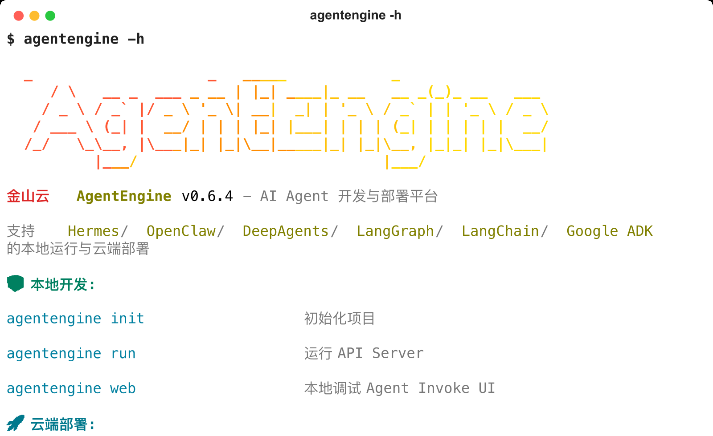
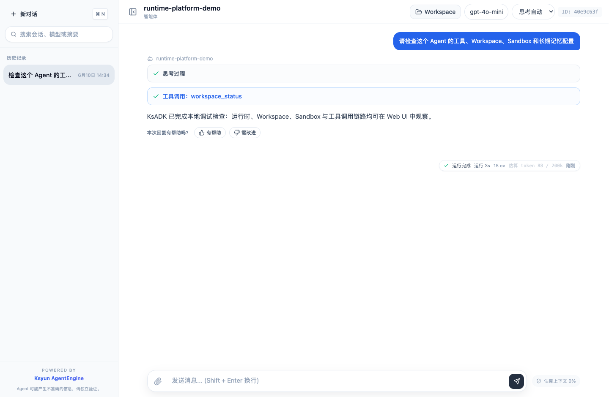
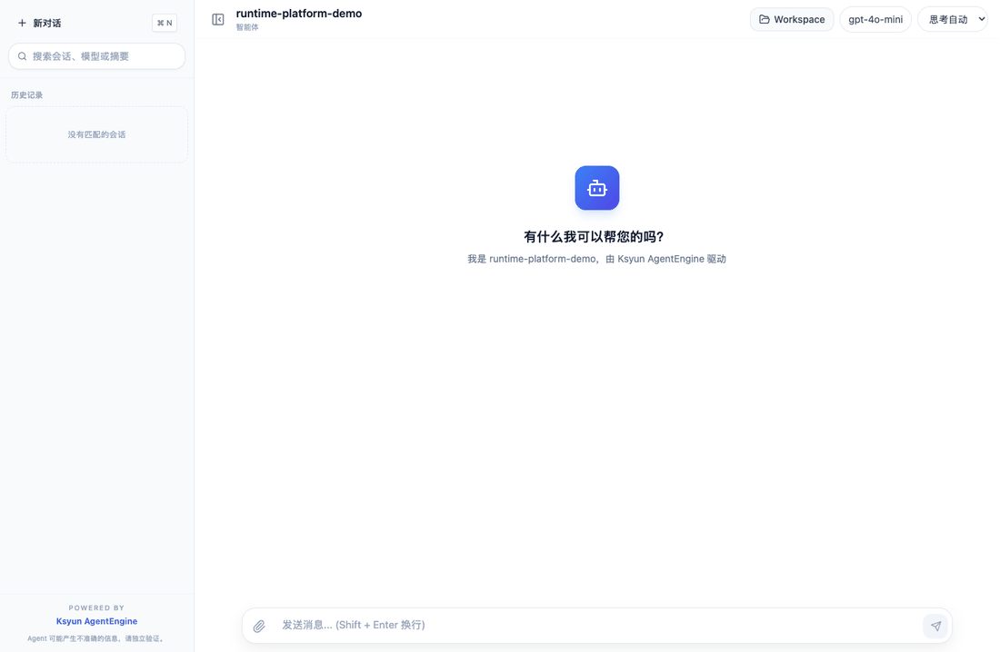
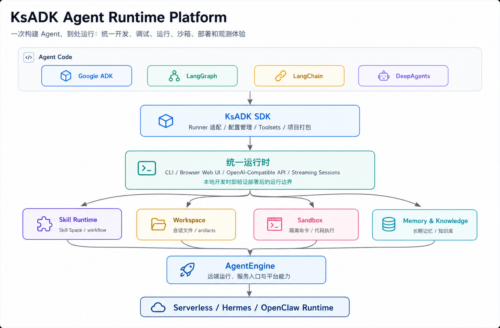

# KsADK

一次构建 Agent，到处运行。

KsADK 是面向 AI Agent 的运行时平台（Agent Runtime Platform）。

你可以继续使用 Google ADK、LangGraph、LangChain 或 DeepAgents 编写业务 Agent，再用 KsADK 获得统一的本地运行、浏览器调试、OpenAI-Compatible API、沙箱执行、部署和可观测体验。

{ width="920" }

=== "安装"

    ```bash
    pip install -U "ksadk[all]"
    ```

=== "创建"

    ```bash
    agentengine init demo-agent -f langgraph
    cd demo-agent
    agentengine config set OPENAI_API_KEY=your-api-key OPENAI_MODEL_NAME=gpt-4o-mini
    ```

=== "运行"

    ```bash
    agentengine run -i
    agentengine web . --no-open
    ```

## 为什么需要 KsADK

大多数 Agent 框架主要解决“如何开发 Agent”。

KsADK 解决“如何运行、调试、部署和观测 Agent”。

KsADK 不替换你已经选择的 Agent 框架。它在框架之上提供统一平台层，把开发、调试、运行、沙箱、部署和可观测连接起来：

- 开发：统一项目创建、配置和本地运行。
- 调试：浏览器调试 UI、会话、附件、workspace 文件和 streaming。
- 运行：统一 Runner、OpenAI-Compatible API 和多框架入口。
- Sandbox：Skill Runtime、Workspace 和 sandbox backend 的隔离执行边界。
- 部署：Serverless、Hermes、OpenClaw 和远端 AgentEngine 入口。
- 可观测：OpenTelemetry-first tracing，可接入多种观测后端。

## 30 秒快速体验

```bash
python -m venv .venv
source .venv/bin/activate
pip install -U "ksadk[all]"

agentengine init demo-agent -f langgraph
cd demo-agent
agentengine config set OPENAI_API_KEY=your-api-key OPENAI_MODEL_NAME=gpt-4o-mini
agentengine run -i
```

启动本地 Web UI：

```bash
agentengine web . --no-open
```

下面是脚本生成的真实本地 Web UI 演示：使用 deterministic LangGraph Runner，不连接外部模型或云环境，但完整走本地 FastAPI、Responses streaming、工具调用、思考过程和会话状态链路。

{ width="920" }

{ width="920" }

如果使用非默认 OpenAI endpoint，再额外设置：

```bash
agentengine config set OPENAI_BASE_URL=https://api.example.com/v1
```

如果需要调用金山云 AgentEngine、Skill Service、知识库或长期记忆等线上能力，建议显式设置线上默认地域：

```bash
agentengine config set KSYUN_REGION=cn-beijing-6
```

## 架构

{ width="920" }

这张图展示的是公开运行时边界：业务 Agent 仍然由 ADK、LangGraph、LangChain 或 DeepAgents 编写；KsADK 在上层补齐统一 CLI、Web UI、OpenAI-Compatible API、Skill Runtime、Workspace、Sandbox、记忆、知识库和部署后端。

## 支持的框架

| 框架 | KsADK 负责什么 |
| --- | --- |
| Google ADK | 项目模板、Runner 适配、本地运行、Web UI 调试和部署入口。 |
| LangGraph | 图状态入口、工具调用、streaming、Skill Runtime 和 workspace toolsets。 |
| LangChain | Runnable/chain 适配、本地 OpenAI-Compatible API 和 tracing。 |
| DeepAgents | 项目入口、运行时包装、浏览器调试和部署制品。 |

## 生态定位

KsADK 不和 ADK、LangGraph、OpenAI Agents SDK、VEADK 或 AgentRun 做简单功能打分。
这些项目各有成熟能力，KsADK 更关注互补的运行时平台层：

- 已有 Agent 框架继续负责业务编排、状态和模型交互。
- KsADK 负责统一 CLI、Web UI、本地 OpenAI-Compatible API、工具、沙箱、部署和可观测。
- 金山云 AgentEngine、Skill、Workspace、Sandbox、Hermes/OpenClaw 通过同一套入口接入。

完整说明见 [生态定位对比](getting-started/comparison.md)。

## 核心能力

| 能力 | 最常用入口 |
| --- | --- |
| Local Development | `agentengine init`、`agentengine config`、`agentengine run` |
| Browser Debugging UI | `agentengine web` |
| OpenAI-Compatible API | `/v1/responses`、`/v1/chat/completions` |
| Unified Runtime | ADK / LangGraph / LangChain / DeepAgents Runner |
| Sandbox Execution | Skill Runtime、Workspace tools、Sandbox tools |
| Serverless Deployment | `agentengine build`、`agentengine launch` |
| Hermes & OpenClaw Runtime | `agentengine hermes ...`、`agentengine openclaw ...` |

## 样例

公开样例仓库按场景组织，而不是只按技术框架分类：

- [KSADK Samples](https://github.com/kingsoftcloud/ksadk-samples)
- 知识助手（Knowledge Assistant）：知识库问答和 RAG。
- 工作流 Agent（Workflow Agent）：LangGraph + AgentEngine toolsets。
- 工具调用 Agent（Tool-Using Agent）：自定义工具调用。
- 记忆增强 Agent（Memory-aware Agent）：短期记忆和长期记忆接入。

## 部署

KsADK 支持本地优先开发，也提供经过审核后可使用的部署入口：

```bash
agentengine build .
agentengine launch . --target serverless
agentengine dashboard open
```

Hermes 和 OpenClaw 更新已有实例时默认保留服务端已有 env、storage、network、memory 配置，只在显式传入对应 CLI 参数时覆盖，避免升级镜像时误改用户配置。

## 可观测

KsADK 原生面向 OpenTelemetry 设计。

```bash
OTEL_EXPORTER_OTLP_ENDPOINT=https://otel.example.com
OTEL_EXPORTER_OTLP_HEADERS=Authorization=Bearer%20token
```

可对接：

- Langfuse
- Arize
- Datadog
- Grafana
- Phoenix

配置一次，到处观测。

## 文档

- [Getting Started 入门](getting-started/quickstart.md)
- [Build 构建](tutorials/langgraph-agent.md)
- [Run 运行](guides/local-web-ui.md)
- [Deploy 部署](guides/build-and-package.md)
- [Observe 观测](guides/observability-tracing.md)
- [Extend 扩展](guides/tools-and-skill-runtime.md)
- [Reference 参考](reference/cli.md)

## 社区

- 仓库：<https://github.com/kingsoftcloud/ksadk-python>
- Wiki：<https://zread.ai/kingsoftcloud/ksadk-python>
- 示例仓库：<https://github.com/kingsoftcloud/ksadk-samples>
- Web UI 仓库：<https://github.com/kingsoftcloud/ksadk-web>
- PyPI：<https://pypi.org/project/ksadk/>
- 开源协议：Apache-2.0
