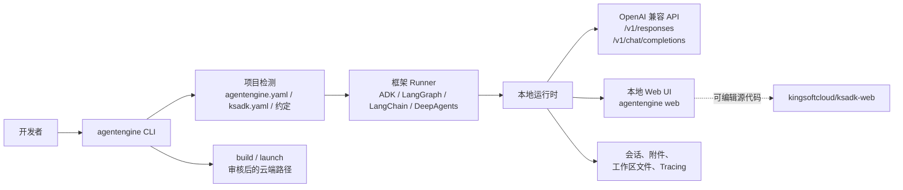
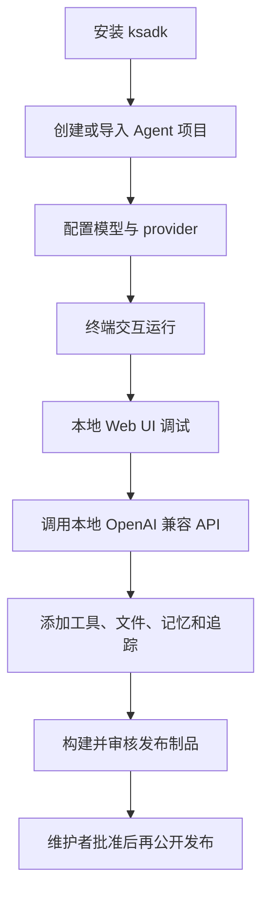

# KsADK

金山云智能体开发套件，用于创建、运行、调试和打包 Python Agent 应用。
KsADK 在 Google ADK、LangGraph、LangChain 和 DeepAgents 项目之上提供
统一的本地 CLI、运行时、OpenAI 兼容协议层和浏览器调试界面。

=== "Python"

    ```bash
    pip install -U ksadk
    pip install -U "ksadk[langgraph]"
    ```

=== "创建项目"

    ```bash
    agentengine init my-agent -f langgraph
    cd my-agent
    agentengine config set OPENAI_API_KEY=sk-test OPENAI_BASE_URL=https://api.example.com/v1 OPENAI_MODEL_NAME=my-model
    ```

=== "本地运行"

    ```bash
    agentengine run . -i
    agentengine web . --no-open
    ```

本站是开源 SDK 的人工整理公开文档。它不发布 `.zread/` 代码阅读结果、
内部部署说明或私有 AgentEngine 运维流程。

## 架构一览



这个设计的核心是：KsADK 不替换你写 Agent 时使用的框架。它负责发现项目、
加载入口、适配 Runner，并把同一套本地开发体验提供给终端、浏览器和 API
客户端。

## 文档定位

KsADK 参考成熟 Agent SDK 项目的公开文档组织方式：

- 概览页说明定位和主要入口。
- 快速开始把用户带到一个可以运行的本地 Agent。
- 教程给出完整文件。
- 指南解释常见任务和取舍。
- 参考页定义命令、配置和 API 契约。
- 贡献、发布、安全和公开审计规则作为治理文档。

zread 生成的代码阅读结果可以帮助维护者理解仓库，但不是公开文档源。公开文档
必须经过人工整理、可链接、可审核，并且可以安全发布到 GitHub Pages。

## 开发路径



## KsADK 提供什么

| 能力区域 | 你会得到什么 |
| --- | --- |
| 项目脚手架 | 面向不同框架族的 `agentengine init` 模板。 |
| 本地运行时 | `agentengine run` 为 Agent 项目启动本地 API 服务。 |
| 本地 Web UI | `agentengine web` 打开浏览器调用和调试界面。 |
| 配置管理 | `agentengine config` 管理项目 `.env` 与 YAML 设置。 |
| 打包 | 在配置云凭证后，`agentengine build` 准备部署制品。 |
| 协议 | 本地 OpenAI 兼容 `/v1/responses` 与 `/v1/chat/completions`。 |
| 扩展能力 | 框架适配、记忆 hook、MCP/A2A 接入点和发布工具链。 |

## 典型场景

适合使用 KsADK 的情况：

- 希望用同一组本地命令运行 ADK、LangGraph、LangChain 或 DeepAgents 项目。
- 希望为 Agent 项目暴露本地 OpenAI 兼容 endpoint。
- 希望不搭建 hosted 基础设施就能在浏览器里调试 Agent。
- 希望为经过审核的云端部署路径准备 Agent 包。
- 希望 Python SDK 文档、Web UI 文档和发布检查在公开 GitHub 导入前保持一致。

## 开源边界

公开仓库包含 SDK、CLI、运行时适配、本地开发体验、人工整理文档和发布检查。

公开仓库不发布完整 AgentEngine 控制面、内部 Kubernetes 部署自动化、内部
kubeconfig、私有 registry、客户数据或内部支持 runbook。云端部署命令会作为 SDK
入口记录，但公开示例必须能在没有内部账号的情况下本地运行。

## 第一个工作流

```bash
python -m venv .venv
source .venv/bin/activate
pip install -U ksadk

agentengine init my-agent -f langgraph
cd my-agent
agentengine config set OPENAI_API_KEY=sk-test OPENAI_BASE_URL=https://api.example.com/v1 OPENAI_MODEL_NAME=my-model
agentengine run -i
```

然后启动本地 Web UI：

```bash
agentengine web . --no-open
```

如果已经有一个 Agent 文件，可以导入：

```bash
agentengine init my-agent --from-agent ./agent.py
cd my-agent
agentengine run . -i
```

## 文档地图

- [初识 KsADK](getting-started/concepts.md)：SDK、项目配置、运行时和 Web UI 如何协作。
- [快速开始](getting-started/quickstart.md)：创建、配置、运行和调试本地 Agent。
- [配置项](getting-started/configuration.md)：环境变量和项目 YAML。
- [项目结构](getting-started/project-structure.md)：模板创建的文件以及不应提交的文件。
- [构建 LangGraph 智能体](tutorials/langgraph-agent.md)：包含完整源码的本地项目。
- [接入已有智能体](tutorials/existing-agent.md)：包装已有文件或包。
- [本地 Web UI](guides/local-web-ui.md)：本地浏览器调试和独立 `ksadk-web` 仓库计划。
- [Web UI 仓库](guides/web-ui-source.md)：`ksadk-web`、hosted UI 和 Python wheel 的关系。
- [运行时产品](guides/runtime-products.md)：Hermes 和 OpenClaw 的生命周期、runtime surface 和公开安全边界。
- [框架接入](guides/frameworks.md)：ADK、LangGraph、LangChain 和 DeepAgents 约定。
- [Agent 最佳实践](guides/agent-best-practices.md)：LangGraph/ADK 模式，以及知识库、记忆库、会话、Skill Runtime、MCP 和 workspace 文件。
- [工具与 Skill Runtime](guides/tools-and-skill-runtime.md)：内置 toolsets、focused/dispatcher 渐进式披露、Tool Gateway、MCP/A2A 和 Skill Runtime 边界。
- [可观测与链路追踪](guides/observability-tracing.md)：本地 spans、Langfuse、OTLP 和 trace metadata 规则。
- [构建与打包](guides/build-and-package.md)：本地构建、审核 gate 和公开 artifact 规则。
- [命令行参考](reference/cli.md)：公开命令面和常见选项。
- [OpenAI 兼容 API](reference/openai-compatible-api.md)：本地协议形态和 KsADK 扩展。
- [项目配置](reference/project-config.md)：YAML 和环境字段参考。
- [远程运行时 API](reference/remote-runtime-api.md)：PublicEndpoint、鉴权、OpenAI 兼容路由、workspace files、Hermes 和 OpenClaw。
- [环境变量](reference/environment-variables.md)：模型、会话、记忆、知识库、Skill Runtime、MCP、构建和 tracing 变量。
- [会话与文件](reference/runtime-sessions-files.md)：session id、上传、工作区预览和本地状态。
- [安全边界](reference/security-boundaries.md)：公开仓库、工作区、预览、包和历史记录边界。
- [故障排查](reference/troubleshooting.md)：常见安装、运行时和打包问题。

## 发布状态

计划公开位置：

- Python SDK 仓库：`https://github.com/kingsoftcloud/ksadk-python`
- Python SDK 文档：`https://kingsoftcloud.github.io/ksadk-python/`
- Web UI 仓库：`https://github.com/kingsoftcloud/ksadk-web`
- Web UI 文档或演示：`https://kingsoftcloud.github.io/ksadk-web/`

第一次真实源码导入必须先完成内部审核，然后才能启用 GitHub source、
GitHub Pages、GitHub Releases 或 PyPI 发布。
