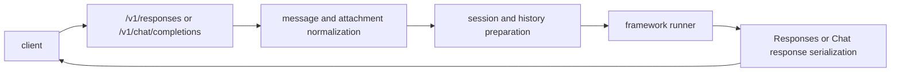

# OpenAI-Compatible API

The local KsADK runtime exposes OpenAI-compatible endpoints for development and
debugging. Use the term OpenAI-compatible only for public protocol shapes. Mark
SDK-specific fields as KsADK extensions.

Start a local server before calling these endpoints:

```bash
agentengine run . --port 8080
```

## Endpoint Summary

| Endpoint | Status | Primary use |
| --- | --- | --- |
| `POST /v1/responses` | preferred | Responses-style local agent calls |
| `POST /v1/chat/completions` | compatibility | Chat Completions clients |
| `POST /agentengine/api/v1/RunAgent` | UI/runtime action | local Web UI and AgentEngine-style callers |
| `POST /run_sse` | ADK Web compatibility | ADK-style local UI flows |

The first two endpoints are the public protocol surface for local development.
Action-style endpoints exist so the bundled UI can call the local runtime.

## Responses API

`POST /v1/responses` is the preferred local runtime protocol.

Minimal request:

```json
{
  "model": "my-agent",
  "input": "Explain what this agent can do.",
  "stream": false
}
```

Typical response shape:

```json
{
  "id": "resp_...",
  "object": "response",
  "model": "my-agent",
  "output": [
    {
      "type": "message",
      "role": "assistant",
      "content": [
        {
          "type": "output_text",
          "text": "..."
        }
      ]
    }
  ]
}
```

Use streaming when the client supports server-sent events:

```json
{
  "model": "my-agent",
  "input": "Stream a short answer.",
  "stream": true
}
```

### Request Fields

| Field | Status | Meaning |
| --- | --- | --- |
| `model` | compatible | model or agent name override for this request |
| `input` | compatible | string, message object, or list of input items |
| `instructions` | compatible | additional system-level instruction text |
| `metadata` | compatible | caller metadata preserved by the runtime |
| `conversation` | compatible | conversation identifier or object with `id` |
| `previous_response_id` | compatible | previous response reference when not using `conversation` |
| `stream` | compatible | return server-sent events |
| `model_metadata` | KsADK extension | model capability hints for local runtime/UI behavior |
| `model_options` | KsADK extension | provider-specific options passed through supported runners |
| `session_id` | legacy KsADK extension | older local session identifier; prefer `conversation` |

`conversation` and `session_id` must not disagree. `conversation` and
`previous_response_id` are mutually exclusive in the local runtime.

### Conversation IDs

Prefer the Responses-style `conversation` field:

```json
{
  "model": "my-agent",
  "conversation": {"id": "local-demo-session"},
  "input": "Continue from the previous answer.",
  "stream": false
}
```

Older local clients can still send `session_id`:

```json
{
  "model": "my-agent",
  "session_id": "local-demo-session",
  "input": "Continue from the previous answer."
}
```

Use one style consistently. If both are sent and refer to different sessions,
the local runtime rejects the request.

### Input Items

Responses input can be a string, a message object, or an array of input items.
Use OpenAI-compatible content block names in public examples:

```json
{
  "model": "my-agent",
  "input": [
    {
      "role": "user",
      "content": [
        {"type": "input_text", "text": "Describe this image."},
        {"type": "input_image", "image_url": "data:image/png;base64,..."}
      ]
    }
  ]
}
```

For files:

```json
{
  "model": "my-agent",
  "input": [
    {
      "role": "user",
      "content": [
        {"type": "input_text", "text": "Summarize this file."},
        {
          "type": "input_file",
          "filename": "notes.txt",
          "file_data": "data:text/plain;base64,..."
        }
      ]
    }
  ]
}
```

Remote `file_url` values are preserved as references. KsADK does not document a
public guarantee that the local runtime will fetch arbitrary remote files for
extraction. Use `file_data` or a local upload reference when you need local
attachment processing.

### Resume And Approval Inputs

The runtime recognizes common resume payloads in `input`, including:

```json
{
  "type": "function_call_output",
  "call_id": "call_123",
  "output": "approved result"
}
```

and:

```json
{
  "type": "mcp_approval_response",
  "approval_request_id": "approval_123",
  "approve": true,
  "reason": "Approved by local user"
}
```

These payloads are passed to framework adapters as resume input. Application
code should still own business-specific approval semantics.

### Non-Streaming Response

The runtime returns a response object with OpenAI-compatible top-level fields
plus a small number of local extensions:

| Field | Status | Meaning |
| --- | --- | --- |
| `id` | compatible | response identifier generated by the runtime |
| `object` | compatible | `response` |
| `created_at` | compatible | creation timestamp |
| `status` | compatible | `completed`, `failed`, or `incomplete` |
| `model` | compatible | model or agent used for the request |
| `output` | compatible | output items, usually an assistant message |
| `metadata` | compatible | caller metadata |
| `usage` | compatible-shaped | usage information when available |
| `output_text` | KsADK extension | convenient concatenated text |
| `session_id` | KsADK extension | local session identifier |

Consumers that aim for broad compatibility should read `output` first and treat
`output_text` as a convenience field.

## Chat Completions API

`POST /v1/chat/completions` is the compatibility protocol for clients that use
Chat Completions.

```json
{
  "model": "my-agent",
  "messages": [
    {
      "role": "user",
      "content": "Say hello from KsADK."
    }
  ],
  "stream": false
}
```

The runtime converts supported Chat Completions requests into the canonical
runner input used by KsADK.

Multimodal Chat Completions examples should use Chat-style content blocks:

```json
{
  "model": "my-agent",
  "messages": [
    {
      "role": "user",
      "content": [
        {"type": "text", "text": "What is in this image?"},
        {"type": "image_url", "image_url": {"url": "data:image/png;base64,..."}}
      ]
    }
  ]
}
```

### Request Fields

| Field | Status | Meaning |
| --- | --- | --- |
| `model` | compatible | model or agent name override |
| `messages` | compatible | chat message list |
| `stream` | compatible | return server-sent events |
| `user` | compatible | caller/user identifier |
| `temperature` | compatible | provider option when supported |
| `max_tokens` | compatible | provider option when supported |
| `session_id` | KsADK extension | local session identifier |
| `model_metadata` | KsADK extension | model capability hints |
| `model_options` | KsADK extension | provider-specific runtime options |

## KsADK Extensions

Fields such as `attachments`, `current_attachments`, and `has_current_files` are
KsADK runner extensions. Do not describe them as official OpenAI fields.

Legacy `inlineData` and `fileData` shapes may still be accepted for compatibility
in some local UI flows, but new public docs should prefer Responses-style input
items.

Internally, framework runners may receive fields such as:

| Field | Meaning |
| --- | --- |
| `input_content` | canonical current-turn content blocks |
| `input_messages` | canonical message/input item list |
| `input_parts` | legacy normalized parts |
| `current_attachments` | files/images from the current user turn |
| `current_attachment_results` | extraction results from the current user turn |
| `attachments` | current or recent effective attachment context |
| `attachment_results` | current or recent effective extraction context |
| `kb_context` | optional knowledge retrieval context |
| `memory_context` | optional long-term memory context |

These fields are runner payload fields, not wire-protocol fields.

## Streaming

Streaming responses use `text/event-stream`.

```bash
curl http://127.0.0.1:8080/v1/responses \
  -H 'Content-Type: application/json' \
  -d '{"model":"my-agent","input":"count to three","stream":true}'
```

Clients should handle:

- incremental text events.
- output item events.
- final completion events.
- error events.
- reconnect or cancellation behavior owned by the client.

Common Responses streaming event names include:

| Event | Meaning |
| --- | --- |
| `response.created` | response object allocated |
| `response.in_progress` | model or agent execution started |
| `response.output_item.added` | output item started |
| `response.content_part.added` | message content part started |
| `response.output_text.delta` | text delta |
| `response.output_text.done` | text content completed |
| `response.reasoning.delta` | reasoning delta when provided by the runner |
| `response.function_call_arguments.delta` | function-call arguments delta |
| `response.function_call_arguments.done` | function-call arguments completed |
| `response.ksadk.tool_result` | KsADK extension for tool results |
| `response.incomplete` | interrupted or waiting for approval/resume |
| `response.completed` | final successful response |
| `response.failed` | terminal error |

Clients should ignore unknown events they do not support. This keeps them
forward-compatible with new runner event types.

## Local Endpoint Examples

Responses:

```bash
curl http://127.0.0.1:8080/v1/responses \
  -H 'Content-Type: application/json' \
  -d '{"model":"my-agent","input":"hello","stream":false}'
```

Chat Completions:

```bash
curl http://127.0.0.1:8080/v1/chat/completions \
  -H 'Content-Type: application/json' \
  -d '{
    "model": "my-agent",
    "messages": [{"role": "user", "content": "hello"}],
    "stream": false
  }'
```

## Compatibility Notes

- Provider-specific model names belong in local configuration.
- The local runtime may support SDK-specific fields for debugging.
- Public docs should separate OpenAI-compatible protocol fields from KsADK
  extensions.
- Hosted runtime behavior should be documented only after public infrastructure
  and credentials are approved.
- For framework-specific tool, memory, or file behavior, document the framework
  adapter and runtime extension explicitly instead of implying a hidden OpenAI
  standard field.

## Implementation Boundary

At runtime, protocol handlers normalize incoming requests into a common runner
payload, then call the active framework runner through a narrow interface:



The public contract is the endpoint behavior. Internal event names, session
storage details, and runner payload extensions may evolve across releases.
