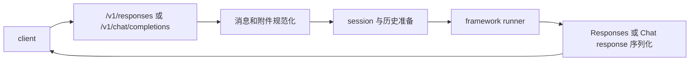

# OpenAI 兼容 API

KsADK 本地运行时为开发和调试暴露 OpenAI 兼容 endpoint。公开文档中只有协议形态
可以称为 OpenAI 兼容；SDK 特定字段要标记为 KsADK 扩展。

调用前先启动本地 server：

```bash
agentengine run . --port 8080
```

## Endpoint 摘要

| Endpoint | 状态 | 主要用途 |
| --- | --- | --- |
| `POST /v1/responses` | 首选 | Responses 风格本地 Agent 调用 |
| `POST /v1/chat/completions` | 兼容 | Chat Completions 客户端 |
| `POST /agentengine/api/v1/RunAgent` | UI/runtime action | 本地 Web UI 和 AgentEngine 风格调用方 |
| `POST /run_sse` | ADK Web 兼容 | ADK 风格本地 UI 流程 |

前两个 endpoint 是本地开发的公开协议 surface。Action 风格 endpoint 是给内置 UI
调用本地运行时使用的。

## Responses API

`POST /v1/responses` 是推荐的本地运行时协议。

最小请求：

```json
{
  "model": "my-agent",
  "input": "Explain what this agent can do.",
  "stream": false
}
```

典型响应形态：

```json
{
  "id": "resp_...",
  "object": "response",
  "model": "my-agent",
  "output": [
    {
      "type": "message",
      "role": "assistant",
      "content": [
        {
          "type": "output_text",
          "text": "..."
        }
      ]
    }
  ]
}
```

客户端支持 server-sent events 时可以启用 streaming：

```json
{
  "model": "my-agent",
  "input": "Stream a short answer.",
  "stream": true
}
```

### 请求字段

| 字段 | 状态 | 含义 |
| --- | --- | --- |
| `model` | compatible | 本次请求的模型或 Agent 名称覆盖 |
| `input` | compatible | 字符串、message object 或 input item list |
| `instructions` | compatible | 附加系统级 instruction |
| `metadata` | compatible | 调用方 metadata，运行时会保留 |
| `conversation` | compatible | conversation id 或带 `id` 的对象 |
| `previous_response_id` | compatible | 不使用 `conversation` 时的上一响应引用 |
| `stream` | compatible | 返回 server-sent events |
| `model_metadata` | KsADK 扩展 | 本地运行时/UI 的模型能力提示 |
| `model_options` | KsADK 扩展 | 传给支持 Runner 的 provider 特定选项 |
| `session_id` | legacy KsADK 扩展 | 旧本地 session id；优先使用 `conversation` |

`conversation` 和 `session_id` 不能冲突。`conversation` 和
`previous_response_id` 在本地运行时中互斥。

### Conversation ID

优先使用 Responses 风格的 `conversation` 字段：

```json
{
  "model": "my-agent",
  "conversation": {"id": "local-demo-session"},
  "input": "Continue from the previous answer.",
  "stream": false
}
```

旧本地客户端仍可发送 `session_id`：

```json
{
  "model": "my-agent",
  "session_id": "local-demo-session",
  "input": "Continue from the previous answer."
}
```

同一客户端应始终使用一种风格。如果两者同时出现且指向不同 session，本地运行时会拒绝。

### Input Items

Responses input 可以是字符串、message object 或 input item 数组。公开示例应使用
OpenAI 兼容 content block 名称：

```json
{
  "model": "my-agent",
  "input": [
    {
      "role": "user",
      "content": [
        {"type": "input_text", "text": "Describe this image."},
        {"type": "input_image", "image_url": "data:image/png;base64,..."}
      ]
    }
  ]
}
```

文件示例：

```json
{
  "model": "my-agent",
  "input": [
    {
      "role": "user",
      "content": [
        {"type": "input_text", "text": "Summarize this file."},
        {
          "type": "input_file",
          "filename": "notes.txt",
          "file_data": "data:text/plain;base64,..."
        }
      ]
    }
  ]
}
```

远程 `file_url` 会保留为引用。KsADK 不在公开文档中承诺本地运行时会为附件处理任意
抓取远程文件。需要本地附件处理时使用 `file_data` 或本地 upload reference。

### Resume 和审批输入

运行时识别 `input` 中常见 resume payload，包括：

```json
{
  "type": "function_call_output",
  "call_id": "call_123",
  "output": "approved result"
}
```

以及：

```json
{
  "type": "mcp_approval_response",
  "approval_request_id": "approval_123",
  "approve": true,
  "reason": "Approved by local user"
}
```

这些 payload 会作为 resume input 传给框架 adapter。业务特定审批语义仍由应用代码负责。

### 非流式响应

运行时返回 OpenAI 兼容顶层字段，加少量本地扩展：

| 字段 | 状态 | 含义 |
| --- | --- | --- |
| `id` | compatible | 运行时生成的 response id |
| `object` | compatible | `response` |
| `created_at` | compatible | 创建时间 |
| `status` | compatible | `completed`、`failed` 或 `incomplete` |
| `model` | compatible | 本次请求使用的模型或 Agent |
| `output` | compatible | 输出 item，通常是 assistant message |
| `metadata` | compatible | 调用方 metadata |
| `usage` | compatible-shaped | 可用时的 usage 信息 |
| `output_text` | KsADK 扩展 | 拼接后的便捷文本 |
| `session_id` | KsADK 扩展 | 本地 session id |

追求广泛兼容的消费者应优先读取 `output`，把 `output_text` 视为便捷字段。

## Chat Completions API

`POST /v1/chat/completions` 兼容使用 Chat Completions 的客户端。

```json
{
  "model": "my-agent",
  "messages": [
    {
      "role": "user",
      "content": "Say hello from KsADK."
    }
  ],
  "stream": false
}
```

运行时会把支持的 Chat Completions 请求转换为 KsADK canonical runner input。

多模态 Chat Completions 示例使用 Chat 风格 content block：

```json
{
  "model": "my-agent",
  "messages": [
    {
      "role": "user",
      "content": [
        {"type": "text", "text": "What is in this image?"},
        {"type": "image_url", "image_url": {"url": "data:image/png;base64,..."}}
      ]
    }
  ]
}
```

## KsADK 扩展

`attachments`、`current_attachments`、`has_current_files` 等字段是 KsADK runner
扩展，不应描述成 OpenAI 官方字段。

旧的 `inlineData` 和 `fileData` 形态仍可能在某些本地 UI 流程中被兼容，但新的公开
文档应优先使用 Responses 风格 input item。

Runner 内部可能收到这些字段：

| 字段 | 含义 |
| --- | --- |
| `input_content` | 当前 turn 的 canonical content block |
| `input_messages` | canonical message/input item list |
| `input_parts` | 旧规范化 parts |
| `current_attachments` | 当前用户 turn 的文件/图片 |
| `current_attachment_results` | 当前用户 turn 的抽取结果 |
| `attachments` | 当前或最近有效附件上下文 |
| `attachment_results` | 当前或最近有效抽取上下文 |
| `kb_context` | 可选知识检索上下文 |
| `memory_context` | 可选长期记忆上下文 |

这些是 runner payload 字段，不是 wire protocol 字段。

## Streaming

Streaming response 使用 `text/event-stream`：

```bash
curl http://127.0.0.1:8080/v1/responses \
  -H 'Content-Type: application/json' \
  -d '{"model":"my-agent","input":"count to three","stream":true}'
```

客户端应处理：

- 增量文本事件。
- output item 事件。
- 最终完成事件。
- error 事件。
- 客户端自己负责的重连或取消行为。

常见 Responses streaming event：

| Event | 含义 |
| --- | --- |
| `response.created` | response object 已分配 |
| `response.in_progress` | 模型或 Agent 执行开始 |
| `response.output_item.added` | output item 开始 |
| `response.content_part.added` | message content part 开始 |
| `response.output_text.delta` | 文本 delta |
| `response.output_text.done` | 文本内容完成 |
| `response.reasoning.delta` | Runner 提供时的 reasoning delta |
| `response.function_call_arguments.delta` | function-call 参数 delta |
| `response.function_call_arguments.done` | function-call 参数完成 |
| `response.ksadk.tool_result` | KsADK tool result 扩展 |
| `response.incomplete` | 中断或等待审批/resume |
| `response.completed` | 最终成功响应 |
| `response.failed` | 终态错误 |

客户端应忽略自己不支持的未知事件，以便兼容未来 Runner 事件类型。

## 实现边界

运行时会把协议处理器收到的请求规范化为统一 runner payload，再通过窄接口调用当前
框架 Runner：



公开契约是 endpoint 行为。内部事件名、session 存储细节和 runner payload 扩展可能在
不同 release 中演进。
