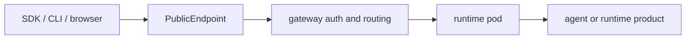

# Remote Runtime API

This reference describes the public-safe runtime API shape after an agent or
runtime product is deployed. The externally visible base URL is the hosted
`PublicEndpoint` returned by the control plane.

Use placeholders in public examples:

```text
https://<public-endpoint>
```

## Entry Model



The runtime pod may implement local routes, but public callers should treat the
gateway-facing `PublicEndpoint` routes as the contract.

## Authentication

| Client | Recommended authentication |
| --- | --- |
| SDK, CLI, automation | `Authorization: Bearer <api_key>` |
| Hosted browser session | `ae_ui_session` cookie created by the hosted link flow |
| Hermes terminal WebSocket | bearer auth plus `Sec-WebSocket-Protocol: ks-terminal.v1` |

External callers should not manufacture internal gateway headers such as
`X-Auth-Agent-Id`, `X-Auth-Account-Id`, or runtime-specific forwarded headers.

## Common Headers

| Header | Use |
| --- | --- |
| `Authorization: Bearer <api_key>` | API calls through the public endpoint |
| `Content-Type: application/json` | JSON requests |
| `Accept: application/json` | non-streaming responses |
| `Accept: text/event-stream` | streaming responses |

For multipart upload routes, let the HTTP client generate the
`multipart/form-data` boundary.

## Runtime Types

| Runtime | Main public surface |
| --- | --- |
| Code-framework agent | `/v1/responses`, `/v1/chat/completions`, workspace files, hosted UI actions |
| Hermes | dashboard, `/v1/*` proxy, terminal WebSocket, workspace files |
| OpenClaw | OpenClaw gateway plus KsADK workspace files |

## OpenAI-Compatible Routes

### `POST /v1/responses`

Use this for Responses-compatible clients.

| Field | Meaning |
| --- | --- |
| `input` | user input string or message/content array |
| `model` | optional model override |
| `instructions` | request-level system/developer instruction |
| `conversation` | stable conversation id or `{ "id": "..." }` |
| `previous_response_id` | continuation handle for compatible clients |
| `safety_identifier` | stable end-user id, preferably hashed |
| `stream` | `true` for SSE |
| `metadata` | request metadata retained by the runtime |

```bash
curl -sS https://<public-endpoint>/v1/responses \
  -H "Authorization: Bearer <api_key>" \
  -H "Content-Type: application/json" \
  -d '{"input":"hello","stream":false}'
```

### `POST /v1/chat/completions`

Use this for Chat Completions-compatible clients.

```bash
curl -sS https://<public-endpoint>/v1/chat/completions \
  -H "Authorization: Bearer <api_key>" \
  -H "Content-Type: application/json" \
  -d '{"model":"my-model","messages":[{"role":"user","content":"hello"}]}'
```

Responses and Chat Completions keep their protocol semantics at the public
boundary. KsADK normalizes both into runner input before calling framework code.

## Hosted UI Actions

The hosted UI uses action-style routes for sessions, events, uploads, workspace
files, cancellation, and model listing. Public API clients should prefer the
OpenAI-compatible `/v1/*` routes unless they are specifically integrating the
hosted UI surface.

| Category | Purpose |
| --- | --- |
| session | create, get, list, delete sessions |
| events | list or subscribe to run events |
| run | invoke or cancel an agent run |
| files | upload files and manage workspace files |
| bootstrap | fetch UI bootstrap metadata |

## Workspace Files

Workspace routes are available to code-framework runtimes and runtime products
that enable the KsADK workspace surface.

- list files.
- get file content or metadata.
- add or update a file.
- delete a file when allowed.
- export a workspace archive when supported.

Keep all paths relative to the workspace root. Do not expose host filesystem
paths in public examples.

## Hermes Specifics

Hermes wraps its own dashboard and API server. Publicly documented Hermes
surfaces are:

| Surface | Purpose |
| --- | --- |
| `/` | Hermes dashboard |
| `/v1/*` | Hermes API proxy surface |
| `/_ksadk/workspace/v1/*` | KsADK workspace files |
| `/_ksadk/terminal/ws` | terminal WebSocket |

Terminal clients must use:

```text
Sec-WebSocket-Protocol: ks-terminal.v1
```

## OpenClaw Specifics

OpenClaw's upstream gateway owns its native routes. KsADK publicly documents
only the platform-added contract:

| Surface | Purpose |
| --- | --- |
| OpenClaw gateway root | OpenClaw-native UI and API |
| `/_ksadk/workspace/v1/*` | KsADK workspace files |
| health route | gateway liveness, as exposed by the runtime product |

Do not describe every upstream OpenClaw native endpoint as a KsADK contract
unless it is implemented or stabilized by KsADK.

## Streaming

For streaming calls, use SSE:

```text
Accept: text/event-stream
```

Clients should handle text deltas, tool events, errors, and completion events.
LangGraph and ADK may emit different internal events, but the public client
should consume the normalized runtime stream.

## Public Documentation Rules

Public examples must not include private endpoint hostnames, real API keys,
gateway tokens, cookies, kdocs tokens, internal forwarded headers, kubeconfig
paths, cluster names, private image registries, customer data, session ids, or
workspace paths.

