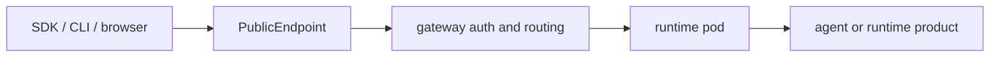

# 远程运行时 API

这页说明 Agent 或运行时产品部署后的公开安全 API 形态。外部可见 base URL 是控制面
返回的 hosted `PublicEndpoint`。

公开示例使用占位值：

```text
https://<public-endpoint>
```

## 入口模型



runtime pod 可能实现本地路由，但外部调用方应以 gateway 暴露的
`PublicEndpoint` 路由作为 contract。

## 鉴权

| 客户端 | 推荐鉴权 |
| --- | --- |
| SDK、CLI、自动化 | `Authorization: Bearer <api_key>` |
| Hosted 浏览器会话 | hosted link flow 创建的 `ae_ui_session` cookie |
| Hermes 终端 WebSocket | bearer auth 加 `Sec-WebSocket-Protocol: ks-terminal.v1` |

外部调用方不要手工构造 `X-Auth-Agent-Id`、`X-Auth-Account-Id` 或运行时专用
forwarded header。

## 常见 Header

| Header | 用途 |
| --- | --- |
| `Authorization: Bearer <api_key>` | 通过 public endpoint 调用 API |
| `Content-Type: application/json` | JSON 请求 |
| `Accept: application/json` | 非流式响应 |
| `Accept: text/event-stream` | 流式响应 |

multipart 上传路由的 `multipart/form-data` boundary 应由 HTTP client 自动生成。

## 运行时类型

| 运行时 | 主要公开 surface |
| --- | --- |
| 代码框架 Agent | `/v1/responses`、`/v1/chat/completions`、workspace files、hosted UI actions |
| Hermes | dashboard、`/v1/*` proxy、终端 WebSocket、workspace files |
| OpenClaw | OpenClaw gateway 加 KsADK workspace files |

## OpenAI 兼容路由

### `POST /v1/responses`

Responses 兼容客户端使用这个入口。

| 字段 | 含义 |
| --- | --- |
| `input` | 用户输入字符串或 message/content 数组 |
| `model` | 可选模型覆盖 |
| `instructions` | 请求级系统/开发者指令 |
| `conversation` | 稳定 conversation id 或 `{ "id": "..." }` |
| `previous_response_id` | 兼容客户端续聊 handle |
| `safety_identifier` | 稳定最终用户 id，建议 hash 后传入 |
| `stream` | `true` 时返回 SSE |
| `metadata` | runtime 保留的请求 metadata |

```bash
curl -sS https://<public-endpoint>/v1/responses \
  -H "Authorization: Bearer <api_key>" \
  -H "Content-Type: application/json" \
  -d '{"input":"hello","stream":false}'
```

### `POST /v1/chat/completions`

Chat Completions 兼容客户端使用这个入口。

```bash
curl -sS https://<public-endpoint>/v1/chat/completions \
  -H "Authorization: Bearer <api_key>" \
  -H "Content-Type: application/json" \
  -d '{"model":"my-model","messages":[{"role":"user","content":"hello"}]}'
```

Responses 和 Chat Completions 在公开边界保持各自协议语义。KsADK 会在调用框架
代码前把两类入口归一化为 runner input。

## Hosted UI Actions

Hosted UI 使用 action 风格路由管理 session、event、upload、workspace file、
cancel 和 model listing。公开 API 客户端优先使用 OpenAI 兼容的 `/v1/*` 路由；
只有明确集成 hosted UI surface 时才直接对接 action 路由。

| 类别 | 用途 |
| --- | --- |
| session | 创建、获取、列出、删除会话 |
| events | 列出或订阅 run events |
| run | 调用或取消 Agent run |
| files | 上传文件和管理 workspace 文件 |
| bootstrap | 获取 UI bootstrap metadata |

## Workspace Files

代码框架运行时，以及启用 KsADK workspace surface 的运行时产品，都可以使用
workspace routes。

- 列出文件。
- 获取文件内容或 metadata。
- 新增或更新文件。
- 允许时删除文件。
- 支持时导出 workspace archive。

所有路径都应是 workspace root 下的相对路径。公开示例不要暴露宿主机绝对路径。

## Hermes 特有边界

Hermes 包装了自己的 dashboard 和 API server。公开文档只描述这些 surface：

| Surface | 用途 |
| --- | --- |
| `/` | Hermes dashboard |
| `/v1/*` | Hermes API proxy surface |
| `/_ksadk/workspace/v1/*` | KsADK workspace files |
| `/_ksadk/terminal/ws` | terminal WebSocket |

终端客户端必须使用：

```text
Sec-WebSocket-Protocol: ks-terminal.v1
```

## OpenClaw 特有边界

OpenClaw 上游 gateway 拥有其原生路由。KsADK 公开文档只承诺平台补充 contract：

| Surface | 用途 |
| --- | --- |
| OpenClaw gateway root | OpenClaw 原生 UI 和 API |
| `/_ksadk/workspace/v1/*` | KsADK workspace files |
| health route | 运行时产品暴露的 gateway liveness |

不要把每个上游 OpenClaw 原生 endpoint 都写成 KsADK contract，除非它由 KsADK
实现或稳定化。

## 流式输出

流式调用使用 SSE：

```text
Accept: text/event-stream
```

客户端应处理文本 delta、工具事件、错误和完成事件。LangGraph 与 ADK 内部事件
可能不同，但公开客户端应消费 runtime 归一化后的 stream。

## 公开文档规则

公开示例不得包含私有 endpoint hostname、真实 API key、gateway token、cookie、
kdocs token、内部 forwarded header、kubeconfig 路径、集群名称、私有镜像
registry、客户数据、session id 或 workspace 路径。

