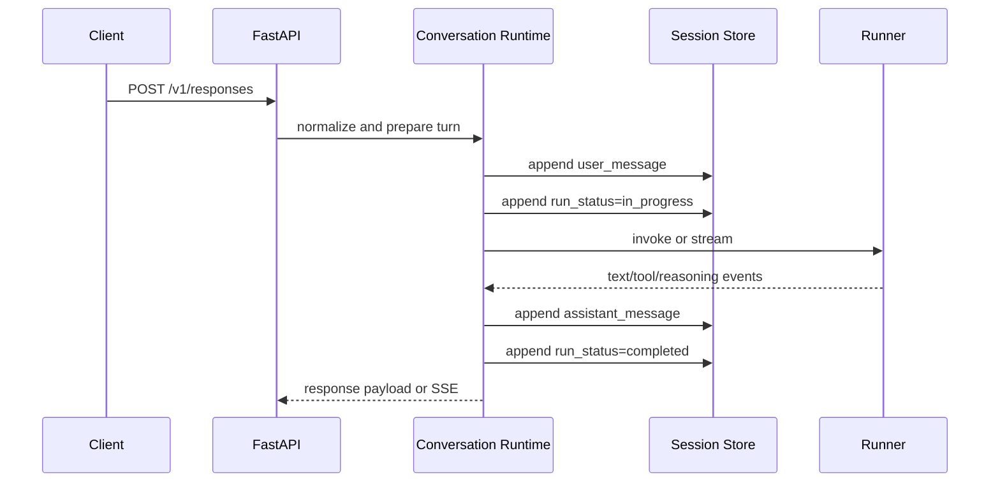
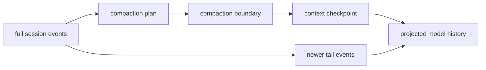
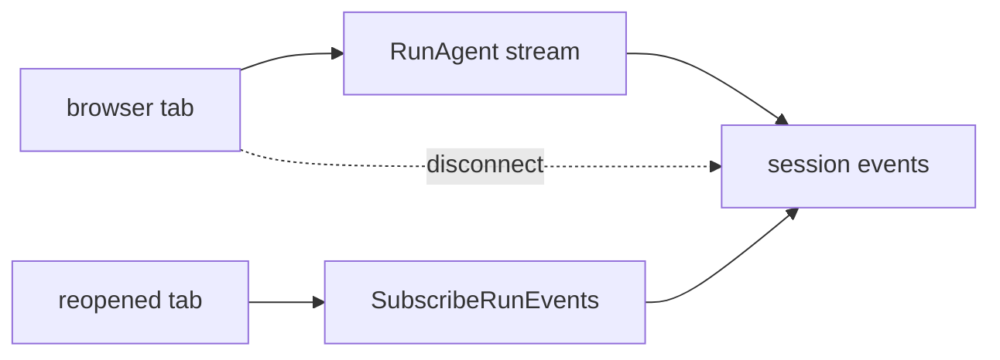

# Runtime Sessions And Files

The local KsADK runtime provides more than request forwarding. It also manages
session IDs, run events, feedback records, uploads, and workspace file previews
for the local Web UI.

## Runtime Surfaces

| Surface | Audience | Examples |
| --- | --- | --- |
| OpenAI-compatible API | external clients | `/v1/responses`, `/v1/chat/completions` |
| Local Web UI API | bundled browser UI | `/agentengine/api/v1/RunAgent`, session and file actions |
| ADK Web compatibility | legacy local UI flows | `/run_sse`, `/list-apps` |

Public clients should prefer the OpenAI-compatible API unless they are
integrating directly with the KsADK local UI.

## Request Lifecycle

For local Responses calls, the runtime follows a stable sequence:

1. normalize the input into messages, content blocks, and attachments.
2. create or load the session.
3. append the user message and `run_status=in_progress`.
4. build `PlatformInvocationContext`.
5. call the framework runner.
6. append assistant, tool, reasoning, approval, or error events.
7. append a terminal `run_status`.



The same conversation runtime is shared by `/v1/responses`,
`/v1/chat/completions`, and the local Web UI run action. Protocol endpoints
mainly decide input and output shape; they do not define separate business
execution models.

## Sessions

Responses calls can use `conversation`:

```json
{
  "model": "my-agent",
  "conversation": {"id": "local-session-1"},
  "input": "Continue this conversation",
  "stream": false
}
```

Older local clients may use `session_id`:

```json
{
  "model": "my-agent",
  "session_id": "local-session-1",
  "input": "Continue this conversation",
  "stream": false
}
```

Use one style consistently. If both are present and disagree, the local runtime
rejects the request.

## Web UI Sessions

`agentengine web` sets local UI state under the project directory unless another
session backend is configured:

```text
.agentengine/ui/sessions.sqlite
```

That file is local runtime state, not source. Delete it to reset local browser
sessions.

## Run Events

The session store records run facts as events. Typical event types include:

| Event type | Meaning |
| --- | --- |
| `user_message` | normalized user input was accepted |
| `run_status` | lifecycle marker such as `in_progress`, `completed`, `failed`, or `interrupted` |
| `assistant_message` | final assistant output for the turn |
| `tool_call` | tool call emitted by the runner |
| `tool_result` | result returned from a tool |
| `reasoning` | provider or runner reasoning signal when available |
| `approval_request` | run paused for user approval |

Clients should treat terminal `run_status` events as the end of a turn. Text
output alone does not prove the run is complete.

## Event Projection

The runtime does not send every stored event back to the model verbatim. It uses
the event log as the source of truth, then projects a model-facing history from
transcript events:

| Stored event | Enters model history | Projection |
| --- | --- | --- |
| `user_message` | yes | user message text |
| `assistant_message` | yes | assistant/model message text |
| `tool_call` | yes | model-side tool call summary |
| `tool_result` | yes | user-side tool result summary |
| `approval_request` | yes | model-side approval request summary |
| `approval_response` | yes | user-side approval result summary |
| `attachment_ref` | yes | user-side attachment reference |
| `run_status` | no | lifecycle marker only |
| `reasoning` | no | UI/debug signal only |
| `context_checkpoint` | yes | compacted summary checkpoint |

This split is deliberate. The event log remains auditable and replayable, while
the runner sees a compact model history that excludes control events such as
`run_status`.

## Context Compaction

Long conversations can be compacted without overwriting the event log. The
runtime appends a compaction boundary and a context checkpoint that records the
summary and the event sequence range it covers. Later history projection keeps
the checkpoint summary and the uncompressed tail events.



This means deleting local UI state is the right way to reset a development
session, but compaction itself should not be treated as data deletion.

## Session Backends

The session backend is configurable. The public local defaults are designed for
development, while shared hosted deployments should use an explicitly reviewed
shared backend.

| Backend | Typical use | Notes |
| --- | --- | --- |
| `memory` | tests and temporary runs | process-local and lost on exit |
| `local` | local Web UI and CLI development | SQLite file under the project UI directory by default |
| `postgres` | shared or multi-replica deployments | requires DSN and deployment review |

Useful environment variables:

| Variable | Purpose |
| --- | --- |
| `KSADK_SESSION_BACKEND` | selects `memory`, `local`, or `postgres` |
| `AGENTENGINE_SESSION_BACKEND` | compatibility alias for backend selection |
| `KSADK_SESSION_DSN` | shared backend DSN, for example PostgreSQL |
| `KSADK_STM_PATH` | local session database path |
| `KSADK_STM_DB_PATH` | compatibility alias for local session database path |

Do not commit local session databases. They can contain prompts, extracted
attachment text, local paths, tool events, and user feedback.

## File And Image Inputs

The Web UI can upload files and images into the local runtime. Public protocol
examples should prefer Responses-style item names:

```json
{
  "type": "input_image",
  "image_url": "data:image/png;base64,..."
}
```

```json
{
  "type": "input_file",
  "filename": "notes.txt",
  "file_data": "data:text/plain;base64,..."
}
```

Framework adapters receive normalized runner input. Applications should still
validate file type, size, and trust boundaries before processing content.

## Workspace Files

The local UI can expose workspace file operations for preview and debugging.
Treat workspace content as local developer data:

- do not include customer data in public docs.
- do not publish uploaded files from local runs.
- avoid screenshots that reveal private paths, tokens, or code.
- keep generated archives out of Git unless explicitly reviewed.

## Streaming, Disconnects, And Reconnects

The local Web UI run action has a reconnect-oriented design. In Responses stream
mode, the server can continue consuming the runner stream after the browser
disconnects, then persist the final run events to the session store. A client
that reconnects should use the session id, invocation id, and last consumed
sequence id to subscribe to later run events.



Public API clients using `/v1/responses` should still implement normal SSE
error handling and retry behavior. The Web UI reconnect path is a KsADK local UI
capability, not a promise that every HTTP client can resume an original TCP
connection.

## SubscribeRunEvents

The local UI reconnect flow is based on persisted events, not on resuming the
same HTTP stream. A client should keep:

- `SessionId`
- `InvocationId`
- the last consumed event `seq_id`

Then it can subscribe for later events from the same invocation. The stream ends
when a terminal `run_status` event is observed, such as `completed`, `failed`,
`cancelled`, or `interrupted`.

The important implementation detail for client authors is that token-level SSE
chunks and stored run events are different layers. If you need robust recovery,
recover from stored events.

## Upload References

When the local UI uploads a file, the server returns a `ksadk-upload://...`
reference. That reference is accepted only by the local runtime that created it.
Do not store those URIs in source files or public examples as durable external
URLs.

## Feedback

The local runtime includes feedback endpoints for UI interactions. Feedback
records are useful for debugging and evaluation flows, but public examples should
use fake response IDs and comments.

## Cancellation And Reconnects

Streaming runs may continue after a browser refresh or SSE disconnect. Clients
that implement streaming should support:

- cancellation.
- reconnecting to known invocation/session state.
- displaying partial output safely.
- handling final error events.

## Security Boundary

The local runtime is for development. Do not expose it directly to the public
internet without authentication, request limits, file validation, and review of
the hosted runtime boundary.
