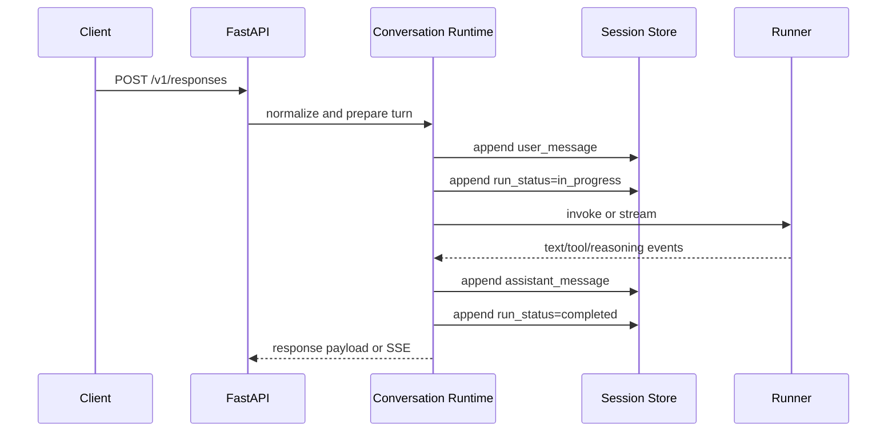
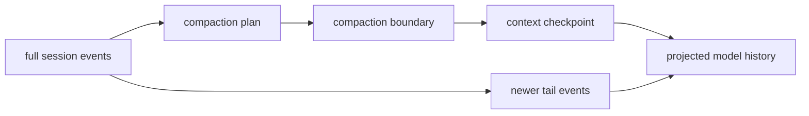
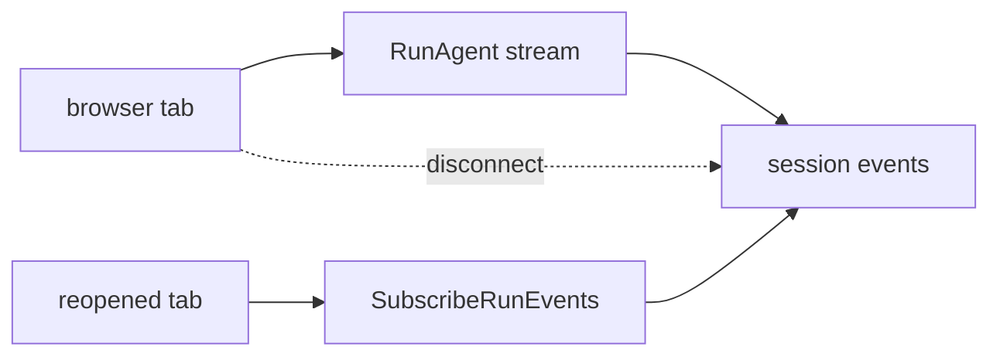

# Runtime Sessions And Files

The local KsADK runtime provides more than request forwarding. It also manages
session IDs, run events, feedback records, uploads, and workspace file previews
for the local Web UI.

## Runtime Surfaces

| Surface | Audience | Examples |
| --- | --- | --- |
| OpenAI-compatible API | external clients | `/v1/responses`, `/v1/chat/completions` |
| Local Web UI API | bundled browser UI | `/agentengine/api/v1/RunAgent`, session and file actions |
| ADK Web compatibility | legacy local UI flows | `/run_sse`, `/list-apps` |

Public clients should prefer the OpenAI-compatible API unless they are
integrating directly with the KsADK local UI.

## Request Lifecycle

For local Responses calls, the runtime follows a stable sequence:

1. normalize the input into messages, content blocks, and attachments.
2. create or load the session.
3. append the user message and `run_status=in_progress`.
4. build `PlatformInvocationContext`.
5. call the framework runner.
6. append assistant, tool, reasoning, approval, or error events.
7. append a terminal `run_status`.


```mermaid
sequenceDiagram
  participant Client
  participant API as FastAPI
  participant Runtime as Conversation Runtime
  participant Store as Session Store
  participant Runner

  Client->>API: POST /v1/responses
  API->>Runtime: normalize and prepare turn
  Runtime->>Store: append user_message
  Runtime->>Store: append run_status=in_progress
  Runtime->>Runner: invoke or stream
  Runner-->>Runtime: text/tool/reasoning events
  Runtime->>Store: append assistant_message
  Runtime->>Store: append run_status=completed
  Runtime-->>API: response payload or SSE
```

The same conversation runtime is shared by `/v1/responses`,
`/v1/chat/completions`, and the local Web UI run action. Protocol endpoints
mainly decide input and output shape; they do not define separate business
execution models.

## Sessions

Responses calls can use `conversation`:

```json
{
  "model": "my-agent",
  "conversation": {"id": "local-session-1"},
  "input": "Continue this conversation",
  "stream": false
}
```

Older local clients may use `session_id`:

```json
{
  "model": "my-agent",
  "session_id": "local-session-1",
  "input": "Continue this conversation",
  "stream": false
}
```

Use one style consistently. If both are present and disagree, the local runtime
rejects the request.

### Account Boundary

Hosted deployments pass `account_id` through the request chain. It is injected by
the gateway, not manufactured by the business agent. Sessions, attachments, and
workspace files are isolated per `account_id`; the local runtime isolates per
owner and never shares session, attachment, or workspace state across
`account_id` boundaries.

## Web UI Sessions

`agentengine web` sets local UI state under the project directory unless another
session backend is configured:

```text
.agentengine/ui/sessions.sqlite
```

That file is local runtime state, not source. Delete it to reset local browser
sessions.

## Run Events

The session store records run facts as events. Typical event types include:

| Event type | Meaning |
| --- | --- |
| `user_message` | normalized user input was accepted |
| `run_status` | lifecycle marker such as `in_progress`, `completed`, `failed`, or `interrupted` |
| `assistant_message` | final assistant output for the turn |
| `tool_call` | tool call emitted by the runner |
| `tool_result` | result returned from a tool |
| `reasoning` | provider or runner reasoning signal when available |
| `approval_request` | run paused for user approval |

Clients should treat terminal `run_status` events as the end of a turn. Text
output alone does not prove the run is complete.

## Session And Event Pagination

!!! new "Added in 0.6.7"
    The hosted UI list actions expose explicit pagination fields.

### ListSessions

Request fields:

| Field | Default | Constraint | Meaning |
| --- | --- | --- | --- |
| `AgentId` | — | required | target agent id |
| `UserId` | `user` | optional | user-scoped isolation |
| `Page` | `1` | `>=1` | page number, 1-based |
| `PageSize` | `20` | `1..200` | page size, capped at 200 |

Response `Data` fields:

| Field | Meaning |
| --- | --- |
| `Sessions` | session list on the current page |
| `Total` | total number of matching sessions |
| `Page` | current page number |
| `PageSize` | current page size |

```bash
curl -sS -X POST https://<public-endpoint>/agentengine/api/v1/ListSessions \
  -H "Authorization: Bearer <api_key>" \
  -H "Content-Type: application/json" \
  -d '{"AgentId":"my-agent","UserId":"user","Page":1,"PageSize":20}'
```

### ListSessionEvents

Request fields:

| Field | Default | Constraint | Meaning |
| --- | --- | --- | --- |
| `SessionId` | — | required | target session id |
| `Offset` | `0` | `>=0` | event offset |
| `Limit` | unset | `>=1` | max number of events returned; when unset, all events are returned |

Response `Data` fields:

| Field | Meaning |
| --- | --- |
| `Events` | event list on the current page |
| `Total` | total number of events in the session |
| `Offset` | current offset |
| `Limit` | the limit value in effect |

```bash
curl -sS -X POST https://<public-endpoint>/agentengine/api/v1/ListSessionEvents \
  -H "Authorization: Bearer <api_key>" \
  -H "Content-Type: application/json" \
  -d '{"SessionId":"<sid>","Offset":0,"Limit":50}'
```

Public API clients should still prefer the OpenAI-compatible `/v1/*` routes unless
they integrate the hosted UI list surface directly.

## Event Projection

The runtime does not send every stored event back to the model verbatim. It uses
the event log as the source of truth, then projects a model-facing history from
transcript events:

| Stored event | Enters model history | Projection |
| --- | --- | --- |
| `user_message` | yes | user message text |
| `assistant_message` | yes | assistant/model message text |
| `tool_call` | yes | model-side tool call summary |
| `tool_result` | yes | user-side tool result summary |
| `approval_request` | yes | model-side approval request summary |
| `approval_response` | yes | user-side approval result summary |
| `attachment_ref` | yes | user-side attachment reference |
| `run_status` | no | lifecycle marker only |
| `reasoning` | no | UI/debug signal only |
| `context_checkpoint` | yes | compacted summary checkpoint |

This split is deliberate. The event log remains auditable and replayable, while
the runner sees a compact model history that excludes control events such as
`run_status`.

## Context Compaction

Long conversations can be compacted without overwriting the event log. The
runtime appends a compaction boundary and a context checkpoint that records the
summary and the event sequence range it covers. Later history projection keeps
the checkpoint summary and the uncompressed tail events.


```mermaid
flowchart LR
  Events["full session events"] --> Plan["compaction plan"]
  Plan --> Boundary["compaction boundary"]
  Boundary --> Checkpoint["context checkpoint"]
  Checkpoint --> History["projected model history"]
  Events --> Tail["newer tail events"]
  Tail --> History
```

This means deleting local UI state is the right way to reset a development
session, but compaction itself should not be treated as data deletion.

## Session Backends

The session backend is configurable. The public local defaults are designed for
development, while shared hosted deployments should use an explicitly reviewed
shared backend.

| Backend | Typical use | Notes |
| --- | --- | --- |
| `memory` | tests and temporary runs | process-local and lost on exit |
| `local` | local Web UI and CLI development | SQLite file under the project UI directory by default |
| `postgres` | shared or multi-replica deployments | requires DSN and deployment review |

Useful environment variables:

| Variable | Purpose |
| --- | --- |
| `KSADK_SESSION_BACKEND` | selects `memory`, `local`, or `postgres` |
| `AGENTENGINE_SESSION_BACKEND` | compatibility alias for backend selection |
| `KSADK_SESSION_DSN` | shared backend DSN, for example PostgreSQL |
| `KSADK_STM_PATH` | local session database path |
| `KSADK_STM_DB_PATH` | compatibility alias for local session database path |

Do not commit local session databases. They can contain prompts, extracted
attachment text, local paths, tool events, and user feedback.

## File And Image Inputs

The Web UI can upload files and images into the local runtime. Public protocol
examples should prefer Responses-style item names:

```json
{
  "type": "input_image",
  "image_url": "data:image/png;base64,..."
}
```

```json
{
  "type": "input_file",
  "filename": "notes.txt",
  "file_data": "data:text/plain;base64,..."
}
```

Framework adapters receive normalized runner input. Applications should still
validate file type, size, and trust boundaries before processing content.

## Workspace Files

The local UI can expose workspace file operations for preview and debugging.
Treat workspace content as local developer data:

- do not include customer data in public docs.
- do not publish uploaded files from local runs.
- avoid screenshots that reveal private paths, tokens, or code.
- keep generated archives out of Git unless explicitly reviewed.

## Streaming, Disconnects, And Reconnects

The local Web UI run action has a reconnect-oriented design. In Responses stream
mode, the server can continue consuming the runner stream after the browser
disconnects, then persist the final run events to the session store. A client
that reconnects should use the session id, invocation id, and last consumed
sequence id to subscribe to later run events.


```mermaid
flowchart LR
  Stream["RunAgent stream"] --> Store["session events"]
  Browser["browser tab"] --> Stream
  Browser -. "disconnect" .-> Store
  Browser2["reopened tab"] --> Subscribe["SubscribeRunEvents"]
  Subscribe --> Store
```

Public API clients using `/v1/responses` should still implement normal SSE
error handling and retry behavior. The Web UI reconnect path is a KsADK local UI
capability, not a promise that every HTTP client can resume an original TCP
connection.

## SubscribeRunEvents

The local UI reconnect flow is based on persisted events, not on resuming the
same HTTP stream. A client should keep:

- `SessionId`
- `InvocationId`
- the last consumed event `seq_id`

Then it can subscribe for later events from the same invocation via
`GET /agentengine/api/v1/SubscribeRunEvents`:

```bash
curl -sS -N "https://<public-endpoint>/agentengine/api/v1/SubscribeRunEvents?SessionId=<sid>&InvocationId=<iid>&AfterSeqId=42" \
  -H "Authorization: Bearer <api_key>" \
  -H "Accept: text/event-stream"
```

| Field | Meaning |
| --- | --- |
| `SessionId` | target session id |
| `InvocationId` | target invocation id |
| `AfterSeqId` | subscription starting `seq_id`; the stream returns events with `seq_id > AfterSeqId`. Defaults to `0`, which subscribes from the beginning |

The stream ends when a terminal `run_status` event is observed, such as `completed`,
`failed`, `cancelled`, or `interrupted`.

!!! warning "5-minute server-side guard timeout"
    `SubscribeRunEvents` has a **5-minute** (`5 * 60` seconds) server-side guard
    timeout. When the timeout elapses the server closes the SSE stream on its own.
    The client must re-issue the subscription using the last consumed `seq_id` as
    the new `AfterSeqId`, and keep doing so until a terminal `run_status` is observed.

The important implementation detail for client authors is that token-level SSE
chunks and stored run events are different layers. If you need robust recovery,
recover from stored events.

### ResumeMode And RunLifecycle Gating

!!! new "Added in 0.6.7"
    Framework-level checkpoint/resume is described through bootstrap capabilities.

`GetAgentUiBootstrap` returns `RuntimeCapabilities.ResumeRun.ResumeMode`, which
describes the framework-level resume capability:

| ResumeMode | Meaning |
| --- | --- |
| `time_travel` | can rewind to a historical checkpoint (LangGraph runner) |
| `forward_only` | can only continue forward along invocation continuity, cannot rewind (ADK runner) |
| `none` | the framework has no framework-level resume capability |

The frontend resume entry point must not look at `ResumeMode` alone. It must
also check the two `RunLifecycle` flags returned by bootstrap:

- `RunLifecycle.Checkpoints = true`: the session has usable checkpoints.
- `RunLifecycle.CheckpointResume = true`: the runtime supports resuming from a checkpoint.

If either is `false`, treat resume as unsupported and do not surface the
`ResumeRun` entry point. `RunLifecycle.CheckpointResumePreview` indicates
whether `GetCheckpointResumePreview` is available.

The four checkpoint/resume action routes are listed in
[Remote Runtime API](remote-runtime-api.en.md):

| Action | Path | Purpose |
| --- | --- | --- |
| `ListSessionCheckpoints` | `POST /agentengine/api/v1/ListSessionCheckpoints` | list checkpoints under a session for resume selection |
| `GetCheckpointResumePreview` | `POST /agentengine/api/v1/GetCheckpointResumePreview` | preview the content and impact of resuming from a checkpoint |
| `ResumeRun` | `POST /agentengine/api/v1/ResumeRun` | resume run execution from a checkpoint |
| `CancelRun` | `POST /agentengine/api/v1/CancelRun` | cancel an in-progress run |

## Upload References

When the local UI uploads a file, the server returns a `ksadk-upload://...`
reference. That reference is accepted only by the local runtime that created it.
Do not store those URIs in source files or public examples as durable external
URLs.

### Upload URI Scheme

!!! new "Added in 0.6.7"
    Local and hosted uploads are unified under attachment URI schemes, resolved
    by a single read entry point.

Both schemes are read through the same route:

```bash
curl -sS "https://<public-endpoint>/agentengine/api/v1/AttachmentContent?FileUri=ae-upload://<file_id>" \
  -H "Authorization: Bearer <api_key>"
```

| Scheme | Source | Meaning |
| --- | --- | --- |
| `ksadk-upload://{file_id}` | local `agentengine web` upload | written by the local `AttachmentStorageService`, bound to the running server |
| `ae-upload://{file_id}` | hosted-link upload | hosted-platform attachment reference that the server resolves on read |

When resolving an `ae-upload://` URI, the server locates the hosted upload content
by the `{file_id}` and returns its byte stream, while also writing the content
back to a local cache (`local_path`) so that subsequent reads hit the cache.
Paths without the `ae-upload://` prefix are treated as workspace-relative paths.

`AttachmentContent` returns an attachment represented internally as
`AttachmentBytes`:

| Field | Type | Meaning |
| --- | --- | --- |
| `data` | bytes | raw attachment bytes |
| `display_name` | str | sanitized display filename |
| `mime_type` | str | MIME type; inferred from the filename when missing |
| `local_path` | Path or `None` | absolute local cache path; populated after a hosted attachment is first read and cached |

## Feedback

The local runtime includes feedback endpoints for UI interactions. Feedback
records are useful for debugging and evaluation flows, but public examples should
use fake response IDs and comments.

## Cancellation And Reconnects

Streaming runs may continue after a browser refresh or SSE disconnect. Clients
that implement streaming should support:

- cancellation.
- reconnecting to known invocation/session state.
- displaying partial output safely.
- handling final error events.

## Security Boundary

The local runtime is for development. Do not expose it directly to the public
internet without authentication, request limits, file validation, and review of
the hosted runtime boundary.
