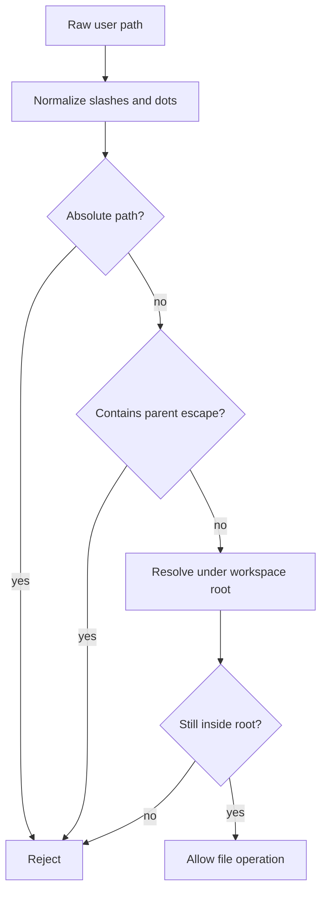

# Security Boundaries

This page defines the public security boundaries that matter when using or
contributing to KsADK. It focuses on local SDK behavior, package artifacts,
documentation, and public repository hygiene. Internal control-plane services
and private deployment infrastructure are outside the public repository scope.

## Public Surface

The public repository is expected to contain:

- Python SDK and CLI source.
- local runtime adapters.
- generated static assets required by `agentengine web`.
- curated public docs under `public-docs/`.
- public CI, release checks, and contribution policy.

It must not contain:

- kubeconfig files or cluster names.
- private registry, gateway, object-storage, or database endpoints.
- `.pypirc`, PyPI tokens, GitHub tokens, model provider keys, or cloud keys.
- customer data, private traces, uploaded files, or local session state.
- generated `.zread/`, `site/`, `dist/`, `build/`, or `ksadk.egg-info/`
  output.

## Workspace File Boundary

Workspace file operations are scoped to a configured workspace root. Public
clients should think in relative workspace paths, not host machine paths.

The runtime rejects paths that try to escape the workspace root:

- absolute paths.
- `..` parent traversal.
- resolved symlink or archive targets outside the workspace root.
- empty file paths for operations that require a concrete file.



The same principle applies to list, upload, download, preview, delete, and zip
export operations. If you add a new file operation, route it through the shared
workspace path resolver instead of accepting a filesystem path directly.

## Upload Boundary

Workspace uploads are bounded by a maximum byte limit. The default public
expectation is that oversized uploads fail cleanly and partial files are removed
when the upload is rejected.

Applications should validate large files before upload when possible, but the
server-side limit remains the security boundary. Do not rely on the browser UI
as the only enforcement point.

## HTML Preview Boundary

HTML previews are higher risk than plain file downloads because browsers may
execute scripts, resolve relative assets, and attempt network connections.
KsADK handles HTML preview as a sandboxed document:

- relative resources are resolved through the workspace file route.
- Content Security Policy disables default external access.
- `connect-src` is kept closed for preview documents.
- form submission is disabled.
- download support is explicit.

This allows users to inspect generated HTML while reducing the chance that a
preview document can exfiltrate local data or call private services.

## Static UI Boundary

`ksadk-python` should include the static UI bundle required by `agentengine web`.
Editable UI source belongs in the independent `ksadk-web` repository once the
public import is approved.

The Python wheel should not include:

- `node_modules/`.
- hosted deployment bundles.
- Docker, nginx, Helm, or private deployment scripts.
- consumer-specific sync scripts unless their destination is public and
  parameterized.

Each embedded UI refresh should record which `ksadk-web` ref produced the static
assets. See [Web UI Repository](../guides/web-ui-source.md).

## Package Artifact Boundary

Before release, audit both source and built artifacts:

```bash
uv build
uv run --extra dev python -m twine check dist/*
make open-source-audit-dist
make open-source-smoke-install
```

The artifact audit must inspect both file names and extracted artifact content.
This catches cases where a safe-looking file name contains a private endpoint,
token-like value, or internal path in its content.

## History Boundary

A clean working tree is not enough to prove that publishing full Git history is
safe. Historical commits may contain paths or content that are no longer present
in the current tree.

Before a public source import, maintainers must choose one reviewed publication
strategy:

- clean export from the reviewed candidate.
- rewritten history with reviewed filters.
- full history only if history scan and security review approve it.

Do not import real source into GitHub until the selected strategy is recorded in
the approval packet.

## Contributor Checklist

Before opening a public PR, check:

- no secrets or private endpoints are added.
- docs examples use placeholder credentials.
- generated artifacts are excluded unless explicitly part of the release.
- workspace file changes preserve root containment.
- HTML preview changes preserve CSP and sandbox behavior.
- package metadata points to public GitHub and GitHub Pages locations.
- release actions wait for maintainer approval.
