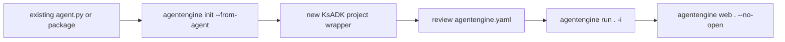

# Bring An Existing Agent

The recommended path is `agentengine init --from-agent`. Use it when you
already have a Python file or directory and want to run it through the KsADK
CLI. Let the importer create the wrapper first, then review the generated
`agentengine.yaml`.



Manual `agentengine.yaml` authoring is the fallback for unusual projects, not
the first step.

## Supported Inputs

The importer is designed for common local project shapes:

| Input | Example | Expected result |
| --- | --- | --- |
| single file | `./agent.py` | creates a project wrapper around the file |
| directory | `./my_agent` | detects entry files and package layout |
| configured project | directory with `agentengine.yaml` | keeps explicit config where valid |

Entry file candidates include `agent.py`, `main.py`, `app.py`,
`agentengine_adapter.py`, `ksadk_agentengine_adapter.py`, and package
`__init__.py` files that expose an agent variable.

## Import A Single File

```bash
agentengine init wrapped-agent --from-agent ./agent.py
cd wrapped-agent
```

Review the generated files:

```bash
ls
cat agentengine.yaml
```

Confirm that:

- `framework` matches the source project.
- `entry_point` points to the copied or wrapped source file.
- `agent_variable` names the object the runtime should load.

If the importer cannot infer the framework, edit the generated YAML rather than
starting over:

```yaml
name: wrapped-agent
framework: langgraph
entry_point: agent.py
agent_variable: root_agent
```

## Import A Directory

```bash
agentengine init wrapped-agent --from-agent ./existing_agent_dir
cd wrapped-agent
```

If the existing directory already has `agentengine.yaml`, KsADK uses it as the
first source of truth. Otherwise, it attempts to infer the framework and entry
point from source files.

## Framework Detection Rules

Explicit config wins:

```yaml
name: wrapped-agent
framework: langgraph
entry_point: agent.py
agent_variable: root_agent
```

Without config, KsADK checks:

- `langgraph.json`
- package directories matching the project name.
- package directories with `__init__.py`.
- script-style files in the project root.
- common agent variables such as `root_agent`.

Explicit config is recommended for open-source examples because it is easier to
review and less sensitive to detection heuristics.

## When Manual Configuration Is Needed

Only write or rewrite `agentengine.yaml` by hand when:

- the importer reports `framework: unknown`.
- the agent object is created dynamically and the exported variable name is not
  obvious.
- the package requires a custom entry module.
- the source project already has conflicting configuration.

Even then, keep the generated project wrapper and make the smallest possible
YAML change.

## Make The Agent Portable

Before publishing an imported example:

- move real credentials into `.env`.
- replace internal URLs with placeholders.
- remove customer data and private traces.
- pin optional dependencies in your project requirements.
- keep hosted deployment settings optional.
- verify the project runs with `agentengine run . -i`.

## Run Locally

```bash
agentengine config set \
  OPENAI_API_KEY=sk-test \
  OPENAI_BASE_URL=https://api.example.com/v1 \
  OPENAI_MODEL_NAME=my-model

agentengine run . -i
```

Open the browser UI:

```bash
agentengine web . --no-open
```

## Common Import Problems

| Problem | Fix |
| --- | --- |
| framework is `unknown` | add explicit `framework` to `agentengine.yaml` |
| agent variable not found | export `root_agent` or set `agent_variable` |
| module import fails | install the original project's dependencies |
| config points to missing file | update `entry_point` after moving files |
| secrets appear in source | move them to `.env` and rotate exposed credentials |

## Review Checklist

Before using an imported project as a public sample:

- `agentengine run . -i` works.
- `agentengine web . --no-open` starts.
- `.env` is ignored by Git.
- `agentengine.yaml` is explicit.
- README explains model setup with placeholders.
- tests do not call private endpoints.
- no PyPI, registry, kubeconfig, or cloud credentials are present.
