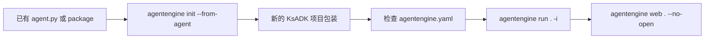

# 接入已有智能体

已有 Agent 项目的推荐路径是 `agentengine init --from-agent`。先让 importer
生成 KsADK 项目包装，再检查生成的 `agentengine.yaml`。手写 YAML 是少数异常
项目的兜底，不是第一步。



## 支持的输入

| 输入 | 示例 | 预期结果 |
| --- | --- | --- |
| 单文件 | `./agent.py` | 围绕该文件创建项目包装 |
| 目录 | `./my_agent` | 检测入口文件和 package layout |
| 已配置项目 | 包含 `agentengine.yaml` 的目录 | 优先保留有效显式配置 |

常见入口候选包括 `agent.py`、`main.py`、`app.py`、`agentengine_adapter.py`、
`ksadk_agentengine_adapter.py`，以及导出 Agent 变量的 package `__init__.py`。

## 导入单文件

```bash
agentengine init wrapped-agent --from-agent ./agent.py
cd wrapped-agent
```

检查生成文件：

```bash
ls
cat agentengine.yaml
```

确认：

- `framework` 与源项目匹配。
- `entry_point` 指向复制或包装后的源文件。
- `agent_variable` 是运行时要加载的对象名。

如果 importer 没能推断框架，再微调生成的 YAML：

```yaml
name: wrapped-agent
framework: langgraph
entry_point: agent.py
agent_variable: root_agent
```

## 导入目录

```bash
agentengine init wrapped-agent --from-agent ./existing_agent_dir
cd wrapped-agent
```

如果目录里已有 `agentengine.yaml`，KsADK 会先使用它。否则会从源码文件推断
framework 和 entry point。

## 检测规则

显式配置优先：

```yaml
name: wrapped-agent
framework: langgraph
entry_point: agent.py
agent_variable: root_agent
```

没有显式配置时，KsADK 会检查：

- `langgraph.json`
- 与项目名匹配的 package 目录。
- 包含 `__init__.py` 的 package 目录。
- 项目根目录中的常见脚本文件。
- `root_agent` 等常见 Agent 变量。

公开示例建议保留显式 YAML，因为 reviewer 更容易判断入口和框架。

## 什么时候手工配置

只有这些情况才需要手写或重写 `agentengine.yaml`：

- importer 显示 `framework: unknown`。
- Agent 对象动态创建，导出变量名不明显。
- package 需要自定义入口模块。
- 源项目已有冲突配置。

即便如此，也建议保留生成的项目包装，只做最小 YAML 修改。

## 本地运行

```bash
agentengine config set \
  OPENAI_API_KEY=sk-test \
  OPENAI_BASE_URL=https://api.example.com/v1 \
  OPENAI_MODEL_NAME=my-model

agentengine run . -i
agentengine web . --no-open
```

## 发布前整理

把已有项目作为公开示例前：

- 真实凭证移入本地 `.env`。
- 内部 URL 替换成占位值。
- 移除客户数据和私有 trace。
- optional dependencies 写入项目 requirements。
- hosted deployment 设置保持可选。
- 用 `agentengine run . -i` 验证可以本地运行。

## 常见问题

| 问题 | 处理方式 |
| --- | --- |
| framework 是 `unknown` | 在生成的 `agentengine.yaml` 中补显式 `framework` |
| 找不到 Agent 变量 | 导出 `root_agent` 或设置 `agent_variable` |
| 模块导入失败 | 安装原项目依赖，并检查 Python path |
| 配置指向不存在文件 | 移动文件后更新 `entry_point` |
| 源码中出现 secret | 移到 `.env`，并轮换已泄露凭证 |

## 检查清单

- `agentengine run . -i` 可运行。
- `agentengine web . --no-open` 可启动。
- `.env` 已被 Git 忽略。
- `agentengine.yaml` 显式声明框架、入口和变量。
- README 使用占位模型配置。
- 测试不调用私有 endpoint。
- 没有 PyPI、registry、kubeconfig 或云凭证。
